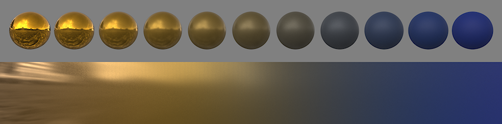
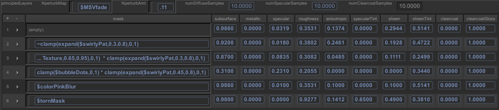

### 5.7 Слои против смешивания параметров

Как только мы определились с нашей новой моделью, нам нужно было решить, как интегрировать ее в наши шейдеры. Первый вопрос заключался в том, какие параметры должны быть пространственно изменяемыми, и ответ был: все они; если художник просто хочет поместить два разных материала на поверхность и маску между ними, то ему нужно будет интерполировать между всеми параметрами. Кроме того, маска будет отфильтрована, и на размытом краю маски реакция материала должна оставаться правдоподобной.

Одним из преимуществ наших принципов проектирования, заключающихся в том, что все параметры нормализованы и, по крайней мере, воспринимаемо линейны, является то, что материалы, как правило, интерполируются очень интуитивно понятным образом. Пример этого показан на рисунке 19.

Как только мы поняли, что можем надежно интерполировать, мы задались вопросом, можем ли мы достичь всех пространственных изменений с помощью масок. Идея заключается в том, что художник выберет список предустановок материалов, а затем просто смешает их с помощью текстурных масок. Это оказалось феноменально успешным, значительно упростив рабочий процесс, улучшив согласованность материалов и сделав оценку шейдера чрезвычайно эффективной. Наш пользовательский интерфейс шейдера показан на рисунке 20.

Рисунок 19: Интерполяция между двумя очень разными материалами, блестящим металлическим золотом и синей резиной, с использованием нашей модели.

Рисунок 20: Скриншот нашего редактора шейдеров, показывающий слои материалов. Переменные в выражениях маски относятся к пространственно изменяющимся модулям шейдера, обычно к текстурным картам.