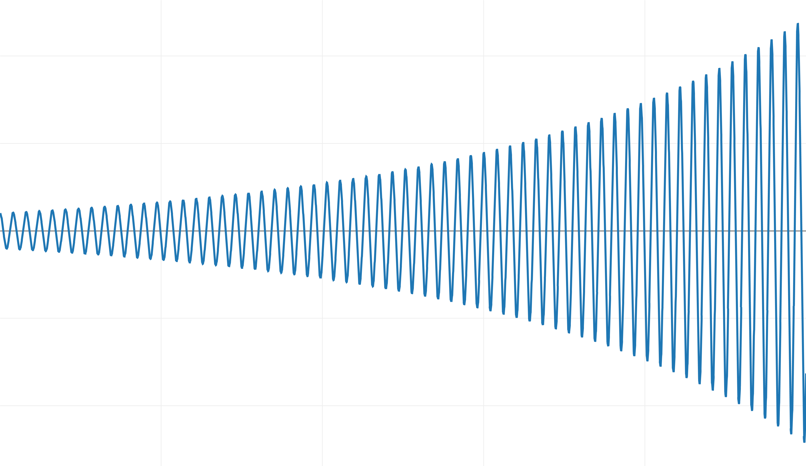
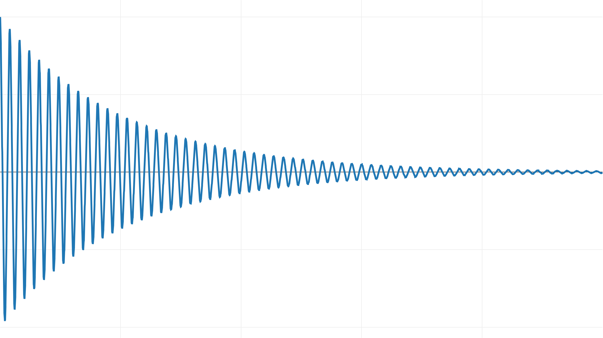
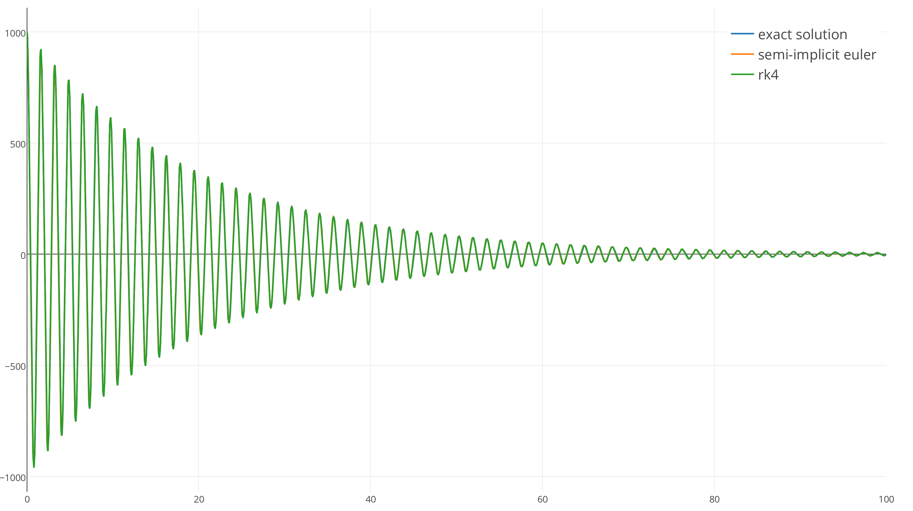
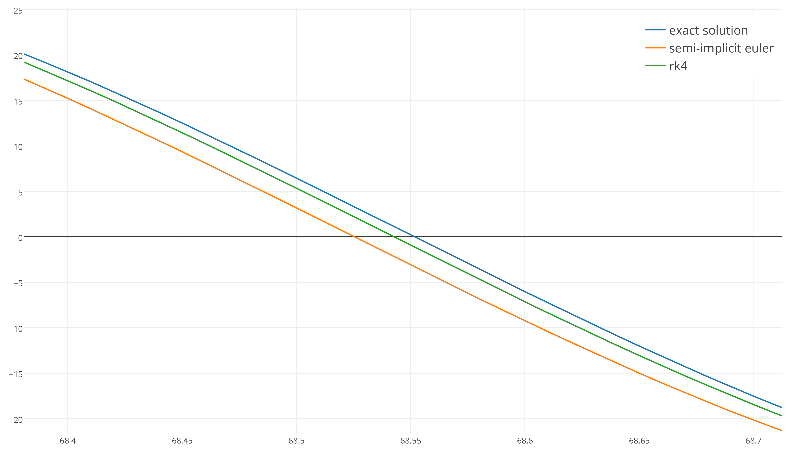
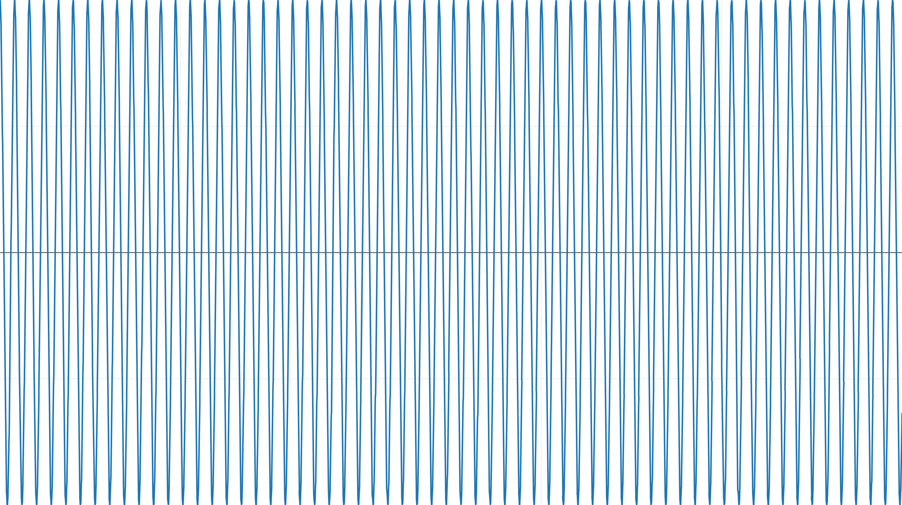
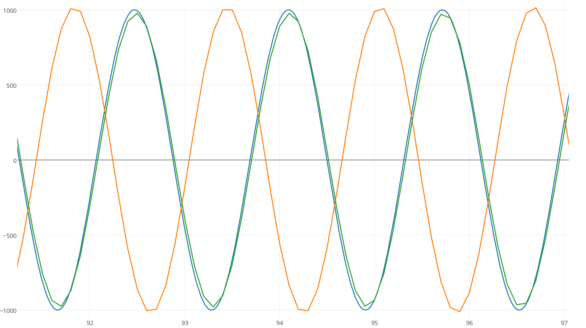
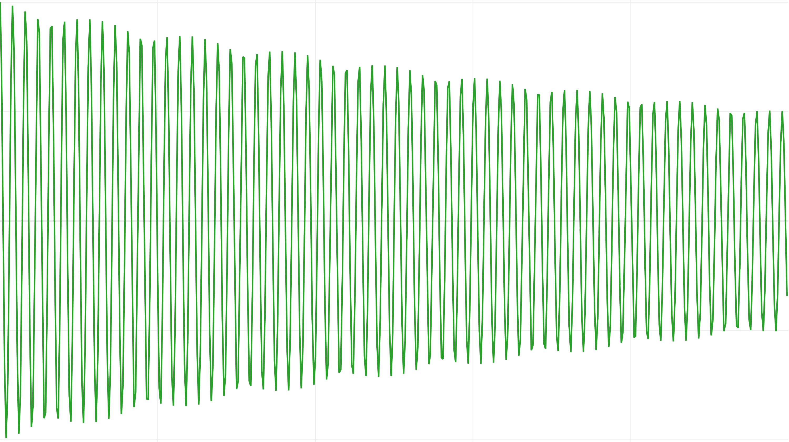
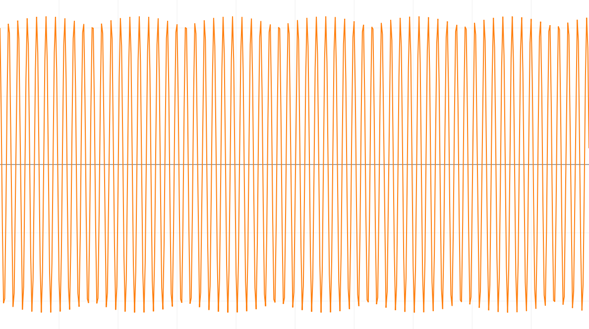

[**Game Physics**](GamePhysics_ru.md)

Основы интеграции
==================

1 июля, 2004 - 13 мин чтения 

* * *

Здравствуйте, читатели! Я больше не публикую новый контент на gafferongames.com

Пожалуйста, посетите мой новый блог [mas-bandwidth.com](https://mas-bandwidth.com/xdp-for-game-programmers)!

* * *

Введение
------------

Привет, меня зовут [Гленн Фидлер](https://gafferongames.com), и добро пожаловать в **Game Physics**.

Если вы когда-нибудь задумывались, как работает симуляция физики в компьютерной игре, то эта серия статей объяснит вам это. Я предполагаю, что вы свободно владеете C++ и имеете базовые знания физики и математики. Больше ничего не потребуется, если вы внимательно изучите исходный код примера.

Физическое моделирование основано на множестве небольших прогнозов, основанных на законах физики. Эти прогнозы на самом деле довольно просты и, по сути, сводятся к чему-то вроде: «Объект находится здесь и движется с такой-то скоростью в таком-то направлении, поэтому через короткий промежуток времени он должен оказаться там-то». Мы выполняем эти прогнозы, используя математический метод, называемый интегрированием.

Как именно реализовать эту интеграцию, и является темой данной статьи.

Интегрирование уравнений движения
-----------------------------------

Возможно, вы помните из курса физики в средней школе или университете, что сила равна массе, умноженной на ускорение.

        F = ma
    

Можно перевернуть это так, чтобы увидеть, что ускорение — это сила, делённая на массу. Это интуитивно понятно, поскольку более тяжёлые предметы сложнее бросать.

        a = F/m
    

Ускорение — это скорость изменения скорости с течением времени:


        dv/dt = a = F/m
    

Аналогично, скорость — это скорость изменения положения с течением времени:


        dx/dt = v
    

Это означает, что если мы знаем текущее положение и скорость объекта, а также силы, которые будут к нему приложены, мы можем выполнить интеграцию, чтобы найти его положение и скорость в определенный момент в будущем.

Численное интегрирование
-----------------------------

Те, кто не изучал дифференциальные уравнения в университете, не унывайте: вы почти в таком же положении, как и те, кто изучал. Дело в том, что мы не будем решать дифференциальные уравнения аналитически, как на первом курсе математики. Вместо этого мы будем **численно интегрировать их** для нахождения решения.

Вот как работает численное интегрирование. Сначала начнём с начального положения и скорости, затем сделаем небольшой шаг вперёд, чтобы найти скорость и положение в будущем. Затем повторите этот процесс, двигаясь вперёд небольшими шагами, используя результат предыдущего вычисления в качестве отправной точки для следующего.

Но как нам найти изменение скорости и положения на каждом шаге?

Ответ кроется в **уравнениях движения**.

Назовем наше текущее время **t** , а шаг времени **dt** или «дельта-время».

Теперь мы можем представить уравнения движения в форме, понятной каждому:

        acceleration = force / mass
        change in position = velocity * dt
        change in velocity = acceleration * dt
    

Это интуитивно понятно: если вы едете в машине со скоростью 60 километров в час, через час вы проедете на 60 километров дальше. Аналогично, автомобиль, разгоняющийся на 10 километров в час в секунду, через 10 секунд будет двигаться на 100 километров в час быстрее.

Конечно, эта логика справедлива только при условии, что ускорение и скорость постоянны. Но даже если это не так, это всё равно довольно неплохое приближение для начала.

Давайте запишем это в код. Начнем с неподвижного объекта в начале координат весом в один килограмм, приложим постоянную силу в 10 ньютонов и будем двигаться вперёд с шагом в одну секунду:

```cpp
double t = 0.0;
float dt = 1.0f;

float velocity = 0.0f;
float position = 0.0f;
float force = 10.0f;
float mass = 1.0f;

while ( t <= 10.0 )
{
        position = position + velocity * dt;
        velocity = velocity + ( force / mass ) * dt;
        t += dt;
}
```    

Вот результат:

```log
t=0:    position = 0      velocity = 0
t=1:    position = 0      velocity = 10
t=2:    position = 10     velocity = 20
t=3:    position = 30     velocity = 30
t=4:    position = 60     velocity = 40
t=5:    position = 100    velocity = 50
t=6:    position = 150    velocity = 60
t=7:    position = 210    velocity = 70
t=8:    position = 280    velocity = 80
t=9:    position = 360    velocity = 90
t=10:   position = 450    velocity = 100
```    

Как видите, на каждом шаге мы знаем и положение, и скорость объекта. Это численное интегрирование.

Явный Эйлер
-----------

То, что мы только что сделали, — это тип интегрирования, называемый **явным Эйлером**.

Чтобы избавить вас от будущих неловких ситуаций, я должен сразу отметить, что Эйлер произносится как «Ойлер», а не «ю-лер», поскольку это фамилия швейцарского математика [Леонарда Эйлера](https://en.wikipedia.org/wiki/Leonhard_Euler), который первым открыл этот метод. (*Однака на Русском языке говорят Эйлер. прим перев.*)

Интегрирование Эйлера — это самый простой метод численного интегрирования. Он обеспечивает 100% точность только в том случае, если скорость изменения постоянна на протяжении временного шага.

Поскольку в приведенном выше примере ускорение постоянно, интегрирование скорости происходит без ошибок. Однако мы также интегрируем скорость для определения местоположения, а скорость увеличивается из-за ускорения. Это означает, что интегрированное местоположение содержит ошибку.

Насколько велика эта ошибка? Давайте выясним!

Существует замкнутое решение для движения объекта с постоянным ускорением. Мы можем использовать его для сравнения нашего численно проинтегрированного положения с точным результатом:

```cpp
s = ut + 0.5at^2
s = 0.0*t + 0.5at^2
s = 0.5(10)(10^2)
s = 0.5(10)(100)
s = 500 meters
```

Через 10 секунд объект должен был переместиться на 500 метров, но явный метод Эйлера даёт результат 450 метров. Это на 50 метров меньше, чем через 10 секунд!

Звучит очень, очень плохо, но в играх физика редко развивается с такими большими временными шагами. На самом деле, физика обычно развивается примерно с частотой кадров экрана.

Шаг вперед с **dt** = 1/100 дает гораздо лучший результат:

```log
t=9.90:     position = 489.552155     velocity = 98.999062
t=9.91:     position = 490.542145     velocity = 99.099060
t=9.92:     position = 491.533142     velocity = 99.199059
t=9.93:     position = 492.525146     velocity = 99.299057
t=9.94:     position = 493.518127     velocity = 99.399055
t=9.95:     position = 494.512115     velocity = 99.499054
t=9.96:     position = 495.507111     velocity = 99.599052
t=9.97:     position = 496.503113     velocity = 99.699051
t=9.98:     position = 497.500092     velocity = 99.799049
t=9.99:     position = 498.498077     velocity = 99.899048
t=10.00:    position = 499.497070     velocity = 99.999046
```

Как видите, это довольно хороший результат. Для игры он точно достаточен.

Почему явный метод Эйлера не (всегда) так хорош
-----------------------------------------------

При достаточно малом временном шаге явный метод Эйлера дает приличные результаты для постоянного ускорения, но как быть в случае, когда ускорение не постоянно?

Хорошим примером непостоянного ускорения является [система пружинного амортизатора](https://ccrma.stanford.edu/CCRMA/Courses/152/vibrating_systems.html).

В этой системе масса прикреплена к пружине, и её движение демпфируется трением. Существует сила, пропорциональная расстоянию до объекта, которая тянет его к началу координат, и сила, пропорциональная скорости объекта, но направленная в противоположном направлении, которая замедляет его.

Теперь ускорение определенно не является постоянным на протяжении всего временного шага, а представляет собой непрерывно изменяющуюся функцию, которая является комбинацией положения и скорости, которые, в свою очередь, непрерывно изменяются на протяжении временного шага.

Это пример [затухающего гармонического осциллятора](https://en.wikipedia.org/wiki/Harmonic_oscillator#Damped_harmonic_oscillator). Это хорошо изученная задача, и существует решение в замкнутой форме, которое можно использовать для проверки результата численного интегрирования.

Начнем с недостаточно затухающей системы, в которой масса колеблется относительно начала координат, замедляясь.

Входные параметры системы «масса-пружина»:

*   Масса: 1 килограмм
*   Исходное положение: 1000 метров от исходной точки
*   Коэффициент упругости по закону Гука: k = 15
*   Коэффициент затухания по закону Гука: b = 0,1

А вот график точного решения:


Применяя явный метод Эйлера для интегрирования этой системы, мы получаем следующий результат, который был уменьшен по вертикали для соответствия:



Вместо того чтобы затухать и сходиться в начале координат, он со временем набирает энергию!

Эта система неустойчива при интегрировании с явным Эйлером и **dt** =1/100.

К сожалению, поскольку мы уже интегрируем с малым шагом, у нас не так много практических вариантов повышения точности. Даже при уменьшении шага всегда существует жёсткость пружины k, выше которой мы увидим такое поведение.

Полунеявный Эйлер
-----------------

Другим интегратором, который следует рассмотреть, является [полунеявный эйлер](https://en.wikipedia.org/wiki/Semi-implicit_Euler_method).

Большинство коммерческих игровых физических движков используют этот интегратор.

Переключиться с явного на полунеявный метод Эйлера так же просто, как изменить:

        position += velocity * dt;
        velocity += acceleration * dt;
    

к:

        velocity += acceleration * dt;
        position += velocity * dt;
    

Применение полунеявного интегратора Эйлера с **dt** = 1/100 к системе пружинного амортизатора дает устойчивый результат, очень близкий к точному решению:



Несмотря на то, что полунеявный метод Эйлера имеет тот же порядок точности, что и явный метод Эйлера (порядок 1), мы получаем гораздо лучший результат при интегрировании уравнений движения, поскольку он является [симплектическим](https://en.wikipedia.org/wiki/Symplectic_integrator).

Существует множество различных методов интеграции
-------------------------------------------------

[Неявный метод Эйлера](http://web.mit.edu/10.001/Web/Course_Notes/Differential_Equations_Notes/node3.html) — это метод интегрирования, хорошо подходящий для моделирования жёстких уравнений, которые теряют устойчивость при использовании других методов. Недостаток метода заключается в необходимости решения системы уравнений на каждом шаге времени.

[Интегрирование по Верле](https://en.wikipedia.org/wiki/Verlet_integration) обеспечивает большую точность, чем неявное интегрирование по Эйлеру, и меньший расход памяти при моделировании большого числа частиц. Это интегратор второго порядка, который также является симплектическим.

Существует целое семейство интеграторов, называемых **методами Рунге-Кутты**. Явный метод Эйлера входит в это семейство, но оно также включает интеграторы более высокого порядка, наиболее классическим из которых является метод Рунге-Кутты 4-го порядка, или просто **RK4**.

Семейство интеграторов Рунге-Кутты названо в честь немецких физиков, их открывших: [Карла Рунге](https://en.wikipedia.org/wiki/Carl_David_Tolm%C3%A9_Runge) и [Мартина Кутты](https://en.wikipedia.org/wiki/Martin_Wilhelm_Kutta) . Это означает, что звук «г» твёрдый, а «у» — короткий. Извините, но это означает, что речь идёт о методах *«рун-ге ку-та»* , а не о *«резаке Рунге»* , что бы это ни значило :)

RK4 — интегратор четвёртого порядка, то есть его накопленная ошибка порядка четвёртой производной. Это делает его очень точным. Гораздо точнее явного и неявного интеграторов Эйлера, которые имеют только первый порядок.

Но хотя он и точнее, это не значит, что RK4 автоматически «лучший» интегратор или что он лучше полунеявного метода Эйлера. Он гораздо сложнее.

Несмотря на это, это интересный интегратор и его стоит изучить.

Реализация RK4
--------------

Существует множество отличных объяснений математической основы RK4. Например, [здесь](https://en.wikipedia.org/wiki/Runge%E2%80%93Kutta_methods), [здесь](http://web.mit.edu/10.001/Web/Course_Notes/Differential_Equations_Notes/node5.html) и [здесь](https://www.researchgate.net/publication/49587610_A_Simplified_Derivation_and_Analysis_of_Fourth_Order_Runge_Kutta_Method). Я настоятельно рекомендую вам проследить за выводом и понять, как и почему это работает на математическом уровне. Но, поскольку целевая аудитория этой статьи — программисты, а не математики, нас интересует именно реализация, так что давайте начнём.

Давайте определим состояние объекта как структуру в C++, чтобы удобно хранить и положение, и скорость в одном месте:

```cpp
        struct State
        {
            float x;      // position
            float v;      // velocity
        };
```

Нам также нужна структура для хранения производных значений состояния:

```cpp
        struct Derivative
        {
            float dx;      // dx/dt = velocity
            float dv;      // dv/dt = acceleration
        };
```    

Далее нам нужна функция для продвижения вперед физического состояния от t до t+dt с использованием одного набора производных, а после этого пересчитать производные в этом новом состоянии:

```cpp
        Derivative evaluate( const State & initial, 
                             double t, 
                             float dt, 
                             const Derivative & d )
        {
            State state;
            state.x = initial.x + d.dx*dt;
            state.v = initial.v + d.dv*dt;
    
            Derivative output;
            output.dx = state.v;
            output.dv = acceleration( state, t+dt );
            return output;
        }
```    

Функция ускорения — это то, что управляет всей симуляцией. Давайте применим её к системе пружинного амортизатора и вернём ускорение, предполагая единичную массу:

```cpp
        float acceleration( const State & state, double t )
        {
            const float k = 15.0f;
            const float b = 0.1f;
            return -k * state.x - b * state.v;
        }
```    

Теперь перейдем к самой процедуре интеграции RK4:

```cpp
        void integrate( State & state, 
                        double t, 
                        float dt )
        {
            Derivative a,b,c,d;
    
            a = evaluate( state, t, 0.0f, Derivative() );
            b = evaluate( state, t, dt*0.5f, a );
            c = evaluate( state, t, dt*0.5f, b );
            d = evaluate( state, t, dt, c );
    
            float dxdt = 1.0f / 6.0f * 
                ( a.dx + 2.0f * ( b.dx + c.dx ) + d.dx );
            
            float dvdt = 1.0f / 6.0f * 
                ( a.dv + 2.0f * ( b.dv + c.dv ) + d.dv );
    
            state.x = state.x + dxdt * dt;
            state.v = state.v + dvdt * dt;
        }
```    

Интегратор RK4 производит выборку производной в четырёх точках для определения кривизны. Обратите внимание, что производная a используется при вычислении b, b — при вычислении c, а c — при вычислении d. Эта обратная связь текущей производной с вычислением следующей и обеспечивает точность интегратора RK4.

Важно отметить, что каждая из этих производных a, b, c и d будет _отличаться_, когда скорость изменения этих величин является функцией времени или функцией самого состояния. Например, в нашей системе с пружинным амортизатором ускорение является функцией текущего положения и скорости, которые изменяются в течение временного шага.

После оценки четырёх производных наилучшая общая производная вычисляется как взвешенная сумма, полученная из разложения [в ряд Тейлора](https://en.wikipedia.org/wiki/Taylor_series). Эта объединённая производная используется для продвижения вперёд координат и скорости, как это было сделано с явным интегратором Эйлера.

Полунеявный Эйлер против RK4
----------------------------

Теперь давайте проверим интегратор RK4.

Поскольку это интегратор более высокого порядка (4-го порядка по сравнению с 1-м), он будет заметно точнее, чем полунеявный эйлер, верно?



**Неверно**. Оба интегратора настолько близки к точному результату, что в таком масштабе невозможно заметить разницу. Оба интегратора стабильны и очень хорошо отслеживают точное решение с **dt** = 1/100.



Увеличение масштаба подтверждает, что RK4 *точнее* полунеявного метода Эйлера, но действительно ли он оправдывает сложность и дополнительные затраты времени выполнения RK4? Сложно сказать.

Давайте немного постараемся и посмотрим, сможем ли мы найти существенную разницу между двумя интеграторами. К сожалению, мы не можем наблюдать за этой системой в течение длительного времени, поскольку её колебания быстро затухают до нуля, поэтому перейдём к [простому гармоническому осциллятору](https://en.wikipedia.org/wiki/Harmonic_oscillator#Simple_harmonic_oscillator), который колеблется бесконечно без какого-либо затухания.

Вот точный результат, к которому мы стремимся:



Чтобы усложнить задачу интеграторам, давайте увеличим дельта-время до 0,1 секунды.

Затем даем интеграторам поработать 90 секунд и увеличиваем масштаб:



Через 90 секунд полунеявное решение Эйлера (оранжевый) сместилось по фазе с точным решением, поскольку оно имеет немного другую частоту, в то время как зеленая линия RK4 совпадает с частотой, но теряет энергию!

Мы можем увидеть это более наглядно, увеличив шаг времени до 0,25 секунды.

RK4 поддерживает правильную частоту, но теряет энергию:



В то время как полунеявный метод Эйлера в среднем лучше справляется с сохранением энергии:



Но смещается в противофазе. Какой интересный результат! Как видите, дело не только в том, что у RK4 более высокая точность и он «лучше». Всё гораздо, гораздо сложнее.

Заключение
----------

Какой интегратор следует использовать в вашей игре?

Я рекомендую **полунеявный метод Эйлера**. Он недорогой и простой в реализации, гораздо более устойчив, чем явный метод Эйлера, и, как правило, сохраняет энергию в среднем даже при приближении к пределу.

Если вам действительно нужна более высокая точность, чем у полунеявного метода Эйлера, рекомендую обратить внимание на [симплектические интеграторы](https://en.wikipedia.org/wiki/Symplectic_integrator) более высокого порядка, разработанные для [гамильтоновых систем](https://en.wikipedia.org/wiki/Hamiltonian_system). Таким образом, вы откроете для себя более современные методы интегрирования более высокого порядка, которые лучше подходят для вашего моделирования, чем RK4.

И наконец, если вы все еще делаете это в своей игре:

        position += velocity * dt;
        velocity += acceleration * dt;
    

Пожалуйста, уделите немного времени и измените его на следующее:

        velocity += acceleration * dt;
        position += velocity * dt;
    

Вы будете рады, что сделали это :)

**СЛЕДУЮЩАЯ СТАТЬЯ**: [Fix Your Timestep!](fix_your_timestep_ru.md)

* * *

Здравствуйте, читатели! Я больше не публикую новый контент на gafferongames.com.

**Пожалуйста, посетите мой новый блог** [mas-bandwidth.com](https://mas-bandwidth.com/xdp-for-game-programmers)!

* * *

Copyright © Glenn Fiedler, 2004 - 2024