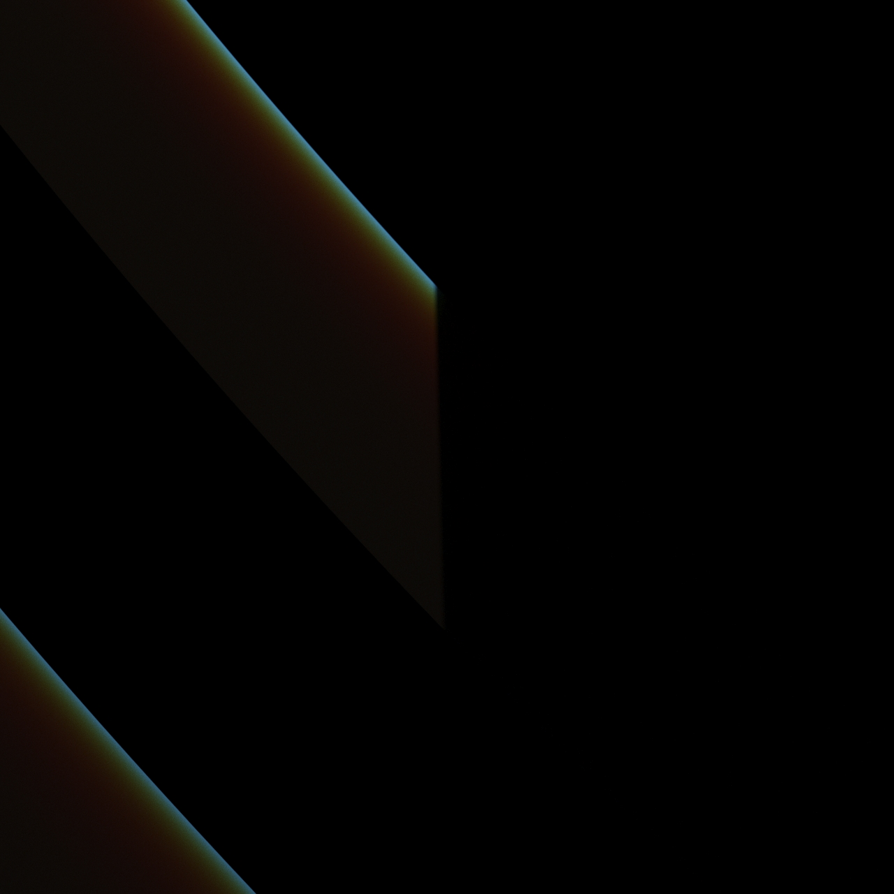
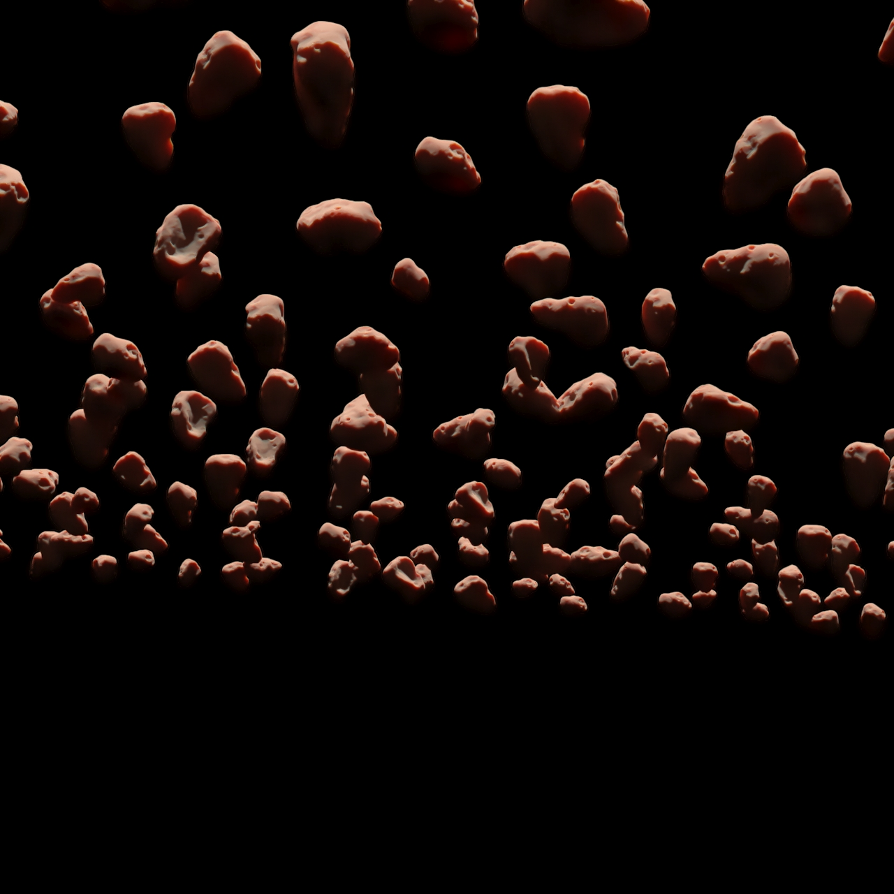

12 июля 2023 г. 

# Global. Наработки для колец и камней в v-ray (SSS)

😐[Изучать SSS материалы (для материала льда на камнях, для просвечивающихся колец)](https://app.asana.com/0/1200236593655828/1200236671966337) относится к этой косвенно.

К следующим прямо:

😐[- нужно будет сделать рендеры в максе виреем, чтобы определить свойства рассеивания света вперед, назад, во все стороны](https://app.asana.com/0/1200236593655828/1200236671966222) 

😐[Исследовать затенение микрочастиц](https://app.asana.com/0/1200236593655828/1200236671966224)

😐[Ввести использование depth тайлам камней](https://app.asana.com/0/1200236593655828/1200236671966229)

😐[Определить линейный профиль прозрачности](https://app.asana.com/0/1200236593655828/1200236671966231)

😐[Private link](https://app.asana.com/0/1200236593655828/1200236671966233/f)

😐- [текстура должна содержать кроме канал прозрачности канал пропускания света translucent](https://app.asana.com/0/1200236593655828/1200236671966235)

😐[Info: - скорее всего текстура должна быть использована в шейдере слоями, чтобы обеспечить любую плотность пропускания света частиц от 0 до 1](https://app.asana.com/0/1200236593655828/1200236671966237)

Начал строить модель колец в максе с vray render. Пытаюсь решить для себя вопросы как будет распространяться свет в кольцах. Довольно занятно. 

🤨[Рисовать отражение света от колец на планету и наоборот](https://app.asana.com/0/1200236593655828/1200236671966215)

Сперва осветил планету и посмотрел как кольца участвуют в освещении. Получается, что из-за наличия колец планета освещается солнцем полностью. 

  

Это как наша луна отражает. По той же причине кольца так же полностью освещены. Однако крайне мало, но все же.  **Сделал** [PreviewModel.hdr](/blog/additional/12Jul2023_PreviewModel.hdr) это текстура, которую следует использовать для эмбиентного освещения кольца.

После нее будут 3 картинки. Показывают распределение света внутри объема кольца, без оболочки. *Пока это тесты без масштаба*. 

  
 
На последней это участок границы затенения планетой. Свет немного проходит внутрь тени. Но эффект незначительный у этой модели. Не стоит реализации. Далее тут можно найти рендеры в hdr тестов с разным направлением света и взгляда. `!asteroids\Art\Renders` Пока это тестовые рендеры.

  

[Вот](./additional/12Jul2023_rocks%200.1%20dens%20angle%2010%20deg%20WhiteMtl.hdr) из папки `back light\rocks 0.1 dens angle 10 deg WhiteMtl.hdr` и [вот](./additional/12Jul2023_white%20mat%20perpendicular%20view.hdr) из папки `side light\white mat perpendicular view.hdr`

**Нужно** Далее проводить конкретные исследования нужных видов и направлений света. Будет таблица. А пока тут дам еще три картинки камней.
