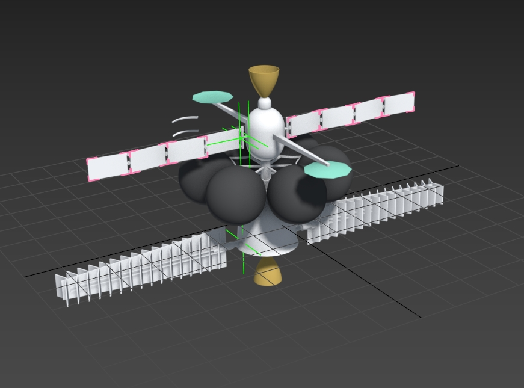
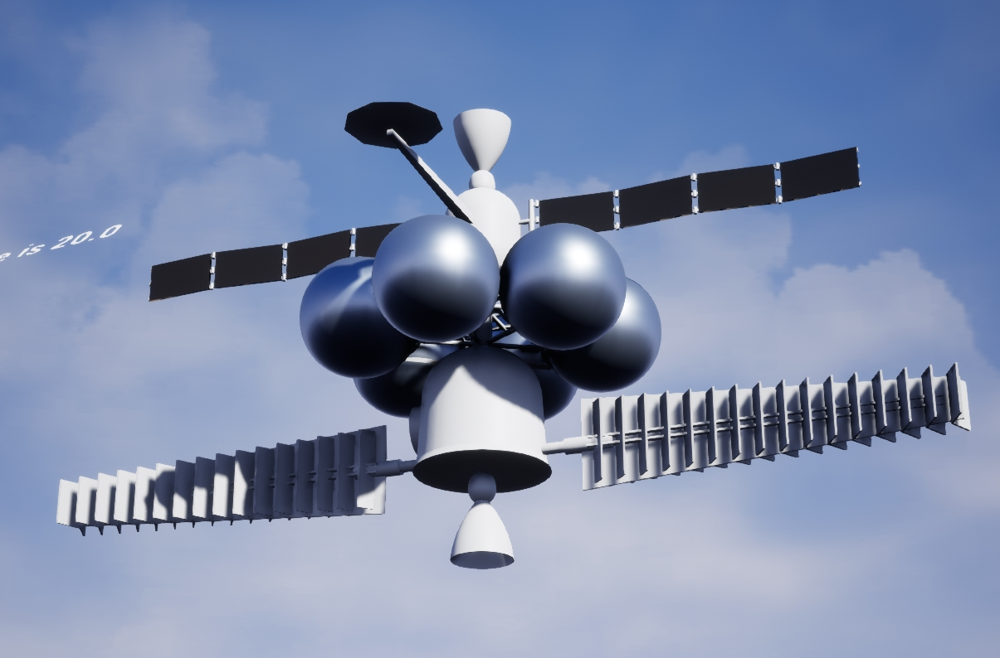

16 июля 2024 г. 

# Сегодня загружаю первую орбитальную станцию. Модель

Загружая в движок лучше драфт загружать как левел командой `import into level`. В папке `building models` лежат левелы с драфтовыми модельками. удобно просматривать и понимать как они выглядят в движке. 

Далее из этого левела легко сделать блюпринт модели, а левел удалить.

Если отдельные модули есть у станции я решил загружать их в левел но сразу как блюпринт. Так у меня получается модуль который потом могу копировать и расставлять. 

Теперь хочу сопоставить размер этой станции с другими объектами в мире. Для этого есть левел `ShipRoverPlanets` Так я тоже быстро пойму насколько ошибся с размером и  в случае чего смогу это поправить в максе. 

Станцию пришлось заскейлить на 20. `ShipRoverPlanets` абсолютно не логичное название надо бы его переименовать например в `BaseMetrics`

Экспорт такой занимает много времени. Это скорее похоже на пайплайн финальной сборки. Либо сборки того, что замоделено драфтово. Чтоб подставить в прототип. 

<table><tbody>
  <tr>
    <td></td>
    <td></td>
  </tr>
  <tr>
    <td></td>
    <td></td>
  </tr>
</tbody></table>
