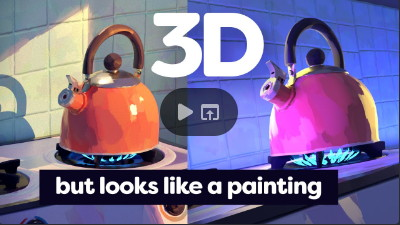
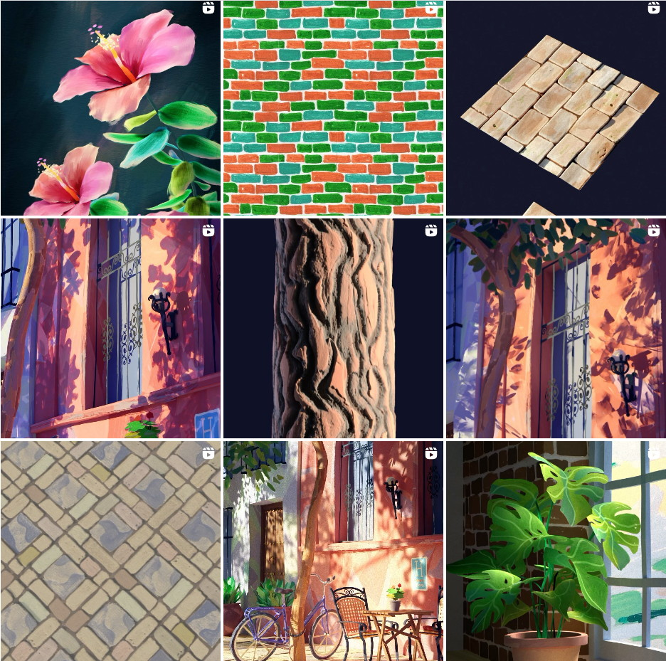

20 октября 2023 г. 

# Визуальный Стиль. Ощущение

Есть ощущение, что визуальный стиль надо делать так:
https://youtu.be/s8N00rjil_4?si=GG8NzS2_CLYIV2J7

(автор **Youtube** [Cody Gindy](https://www.youtube.com/channel/UClB2t8sIPbneCMz-iHpc-dw) **Instagram** [instagram.com/codygindy](instagram.com/codygindy)
**TikTok** [tiktok.com/@codygindy](tiktok.com/@codygindy))

- А еще эту картинку делает нарисованная проекционная тень и нарисованные vfx
- А еще красота мазков будет зависеть от того кто их делает:)
- А еще эта техника будет хуже работать в игровой камере с fov90
- А еще когдато давно я видел мультик сделанный на подобной технологии. На такой которой этот же мужик показывал в другом своем ролике. Там еще мазки выходят за край силуэта. Потому что они как патчи в воздухе висят. Очень круто.

Короче это все очень красиво!

