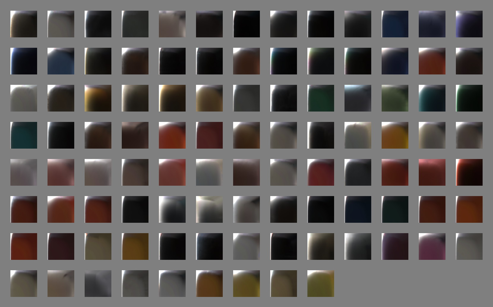
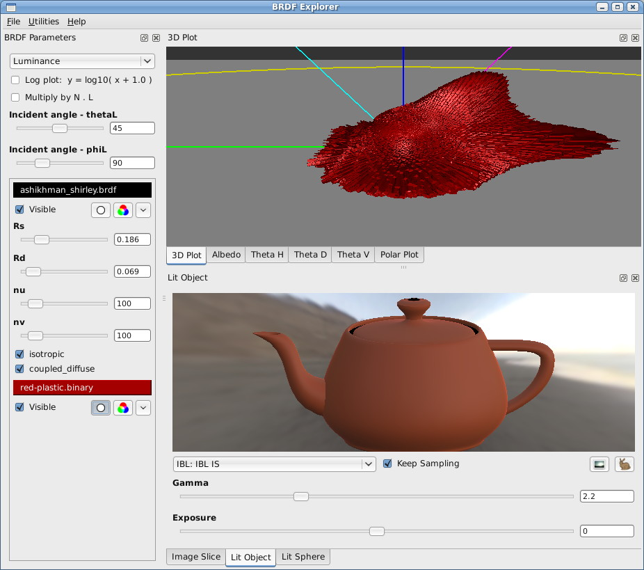
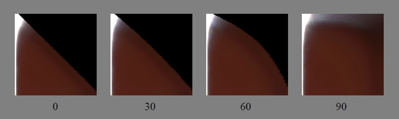
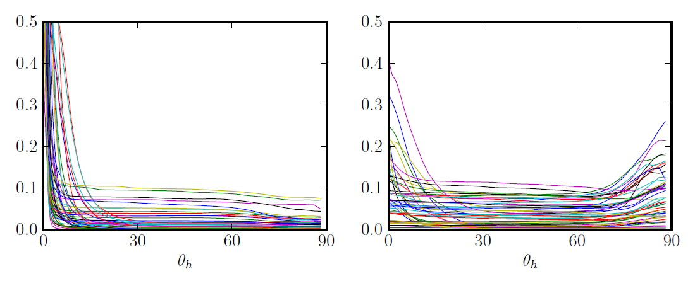
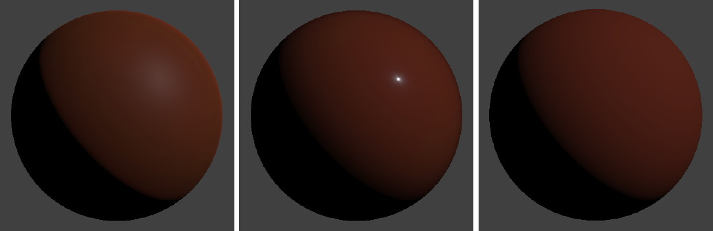
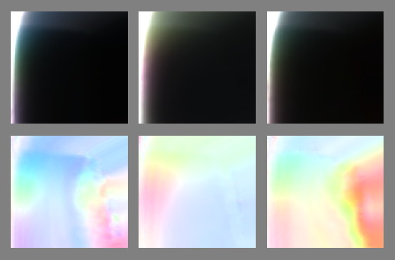
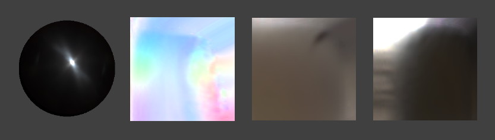
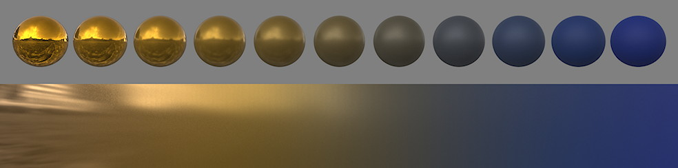

Рисунок 1: Срезы изображений MERL 100 BRDFs.  

Рисунок 2: Диснеевский BRDF проводник

Рисунок 3: Срезы изображений BRDF для *красного-пластика* и *зеркального-красного-пластика*, показанные вместе со схематическим видом «пространства среза».

Рисунок 4: Срезы *зеркально-красного-пластика* для различных значений $\phi_d$, азимутального вращения $\mathbf{l}$ вокруг половинного вектора. Черная область в правом верхнем углу представляет собой часть области BRDF, где вектор $\mathbf{l}$ или $\mathbf{v}$ находится ниже горизонта.

Рисунок 5: Материалы, демонстрирующие диффузное изменение цвета. Верхний ряд: отклики точечного света на визуализированных сферах; нижний ряд: срезы изображений BRDF.

Рисунок 6: Ретрорефлетивные отражения 100 MERL материалов. Слева: 50 гладких материалов $(f(0) > 0,5)$; справа: 50 шероховатых материалов $(f(0) < 0,5)$. Пик около $θ_h = 0$ является зеркальным пиком, а пик (или спад) около $θ_h = 90$ представляет собой скользящую ретрорефлексию.

Рисунок 7: Реакция точечного света на _красный-пластик_, _зеркальный-красный-пластик_ и диффузный Ламберт.

Рисунок 8: Срезы BRDF и отклики на точечный свет диффузных моделей Ламберта(Lambert), Орена-Наяра(Oren-Nayar) и Ханрахара-Крюгера(Hanrahan-Krueger).

Рисунок 9: Несколько зеркальных распределений, соответствующих хрому MERL. Слева: логарифмические графики зеркального пика в зависимости от $θ_h$ (градусы); черный = хром, красный = GGX ($α$ = 0,006), зеленый = Бекманн ($m$ = 0,013), синий = Блинн-Фонг ($n$ = 12000). Справа: (обрезанные) точечные световые отклики от хрома, GGX и Бекманна.

Рисунок 10: Нормализованные отклики Френеля 100 MERL материалов, построенные в зависимости от $θ_d$. Отклики были усреднены по $θ_h$ от 1 до 4 градусов, отклик падения был вычтен, а кривые затем были нормализованы по $θ_d$ от 45 до 80 градусов для сравнения формы. Пунктирная линия представляет теоретический отклик Френеля.

Рисунок 11: Графики альбедо материалов MERL 100. Слева: 50 гладких материалов; справа: 50 шероховатых материалов.

Рисунок 12: Графики альбедо, сравнивающие несколько зеркальных моделей $G$. Все графики используют одни и те же факторы $D$ (GGX/TR) и $F$. Слева: гладкая поверхность ($α = 0.02$); справа: шероховатая поверхность ($α = 0.5$). Модель «без $G$» исключает факторы $G$ и $\frac{1}{\cosθ_l \cos θ_v}.$

Рисунок 13: Срезы изображений BRDF различных образцов тканей.

Рисунок 14: Срезы изображений BRDF _рисунок-цветового-изменения-1, 2_ и _3_. Верхний ряд: исходные данные; нижний ряд: соответствующие изображения цветности, созданные путем масштабирования на $1 / \max(r, g, b)$ на пиксель.

Рисунок 15: Аномалии в данных MERL. Слева направо: реакция _стали_ на точечный свет демонстрирует асимметричный блик, график _рисунка-цветового-измененеия-1_, показывает экстраполированные данные о скольжении (видимые во всех материалах), _белая-ткань_ демонстрирует затенение вблизи скольжения, указывающее на морщину, а _древесина-фруктов-241_ (показанная как сохраненная, в искривленном пространстве $θ_h$) демонстрирует зеркальные вариации, указывающие на древесные волокна.

Рисунок 16: Примеры влияния наших параметров BRDF. Каждый параметр изменяется по строке от нуля до единицы, при этом другие параметры остаются постоянными.

Рисунок 17: Срезы изображения BRDF нашей модели для различных значений шероховатости.

Рисунок 18: Кривые распределения GTR в зависимости от $θ_h$ для различных значений $γ$:

Рисунок 19: Интерполяция между двумя очень разными материалами, блестящим металлическим золотом и синей резиной, с использованием нашей модели.

Рисунок 20: Скриншот нашего редактора шейдеров, показывающий слои материалов. Переменные в выражениях маски относятся к пространственно изменяющимся модулям шейдера, обычно к текстурным картам.

Рисунок 21: Кадр производства Wreck-It Ralph.
