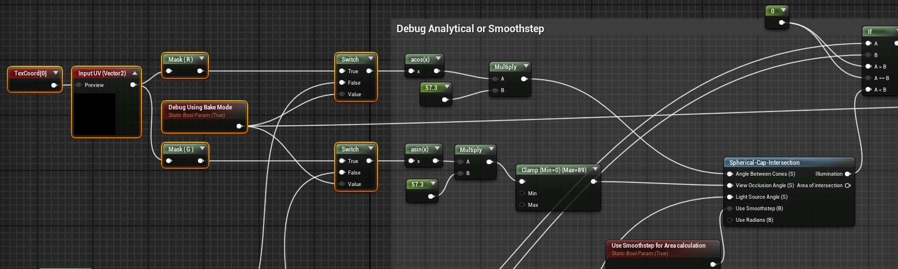

17 июля 2024 г. 

# Освещение и затенение планет. Часть 2

Ну а теперь вещи поинтереснее. Тени. Тени от планет на планету. О, это реализовано просто гениально! Я нашел функцию материала Sphere-Cone-Shadow-textures (так и называется в движке). Она прекрасна. Пришлось понять как это работает. 

*Здесь и далее я не буду приводить графы, исходный код того, что и так есть в Unreal Engine 5. Ссылаюсь по именам, чтобы найти.*

Очень просто. Создается координатное пространство из двух параметров. Расстояние до затеняющей сферы и размер этой сферы. По этому пространству накладывается текстура вот и все. Но что за текстура? Вот эта! Рис. 1. Насколько она прекрасна! И да ее можно положить прямо цветную. И будет вот такое: рис. 2. Это просто супер! Это будто атмосфера планеты кидает такую цветную тень! 

<table><tbody>
  <tr>
    <td><p>Рис. 1</p></td>
    <td><p>Рис. 2</p></td>
    <td><p>Рис. 3</p></td>
</tr>
</tbody></table>

На самом деле есть еще один параметр и он есть угловой размер Источника Света (ИС). Он нужен для того, чтобы рассчитать эту полутень (penumbra). В этом вся фишка. Эта штука умеет считать мягкую тень от затеняющей сферы в зависимости от того как она далеко от поверхности! А в каналах RGBA сохранены профили для 4-х разных угловых размеров ИС. Текстура называется T_SphereShadow_RGBA_5-15-30-60deg.

Далее по оси U этой текстуры - проекция вектора света на вектор направления на затеняющую сферу. **Комментарий входа Angle Between Cones:** *This is the angle between the vector to the occluder center and the light vector. In Degrees.*

Вторая ось текстуры V - это отношение радиуса затеняющей сферы к расстоянию до этой сферы. **Комментарий входа View Occlusion Angle:** *This is the angle of occlusion from the occluder. As the occluder gets closer to the camera, occlusion reaches 1. As the occluder gets infinitely far from the camera, the occlusion approaches 0. In Degrees.*

Плюс третий параметр, что отражает перечень фиксированных угловых размеров Источника Света (ИС). Что логично. **Комментарий входа Light Source Angle:** *If you only care about the spherecap intersection area, it does not matter if you consider this a light vector or just one of the two cone angles. When using the illumination output, this cone determines the illumination fraction. A larger source angle causes a blurrier penumbra. Specified in Degrees.*

И вот все это мне пришлось понять потому, что из коробки для меня это не подходило. У меня условия космического пространства в котором звезда очень мала в своем угловом размере, но все же хотелось видеть правдоподобные полутени, если захочется догнать тень планеты на космическом корабле.

Итак, веселая цветная текстура - это набор данных принявший такой красивый вид. Мне нужно больше в реальность и мои данные приняли менее красивый вид. Рис. 3. Просто линия. Плюс еще странное растяжение в правом верхнем углу. Но обо всем по порядку.

Как я ее получил? В функции есть галка переключающая, ВНИМАНИЕ, в аналитический режим. Ну а как иначе они получили эту загадочную текстуру на рис. 1? Есть еще одна функция, описание входов которой на самом деле я приводил выше. Функция Spherical Cap Intersection. Она включается в работу когда вы включаете аналитический режим - галку Debug Using Analytical Calculation. Теперь он рисует не из текстуры, а считает много тригонометрии на каждый пиксель, чтобы нарисовать это. Теперь тень изображается как мне надо. И я могу поставить очень маленький угловой размер ИС. Есть еще одно дополнение. В аналитическом режиме система рендеринга не справляется с крайне малыми углами. Это они пишут в комментариях. Результат крайне не стабильный. Но они сделали еще один режим: Use Smoothstep for Area calculation. При помощи функции SmoothStep получаются супер гладкие края. Ура!

Не рекомендуется оставлять аналитический режим работать в риал-тайме. Они предупреждают плохую производительность. Рекомендуют это все запечь в текстуру. А как запечь? Нужно вместо рассчитанных отношений углов и расстояний подать на эти входы пространство UV. Это я и делаю на рис. 4. 

  

Рис. 4

У меня получается такая текстура. Рис. 5. Это очень маленький угол. Где полутень? «Нету». В разрешении текстуры она не помещается. Угловой размер 0.12 градусов. Сравниваю с угловым размером в 12 градусов. Рис. 5 и 6.

<table><tbody>
  <tr>
    <td><p>Рис. 5</p></td>
    <td><p>Рис. 6</p></td>
</tr>
</tbody></table>

Обрати внимание как быстро исчезает «темнота» в правом верхнем углу. Рис. 6. Где-то на <sup>1</sup>/<sub>6-ой</sub> остаются только белые пиксели - свет. Большие угловые размеры ИС провоцируют быстрое «растворение» тени на расстоянии. Маленький размер - тени «растворяются» при  удалении на бесконечность. Рис. 5. Гружу школьной программой физики света и элементарным свойством теней. 

Итак, очень маленький размер планеты, очень большое расстояние до поверхности, на которой отображается тень. И в этом случае имеется отношение близкое к нолю. Рисую точку прямо там где тень и векторы на ИС и на сферу совпадают, dot product дает очень близкое к единице. UV(1.0, 0.0). Правый верхний угол. А что там? АЛИАСИНГ! СТУПЕНЬКИ! Как результат получаются артефакты. Попиксельное переключение, когда тень исчезает из виду. Артефакты злющие. Увидеть их можно только в движении. В виде фикса этой проблемы я решаю растянуть пространство вокруг правого верхнего угла. 
Пишу следующий простой код:

```hlsl
float2 wrappedUV;
wrappedUV.x = 1 - (power( (1 - InUV.x), 4.0) );
wrappedUV.y = power(InUV.y, 2.0);
```

Взяв простую текстуру с попиксельным шумом продемонстрирую искажение координат. Рис. 7.

<table><tbody>
  <tr>
    <td><p>Рис. 7</p></td>
    <td><p>Рис. 8</p></td>
</tr>
</tbody></table>

Теперь могу объяснить искажение на рис. 3. Теперь растворяющаяся пенумбра (полутень) растворяется очень плавно. Теперь текстуры того же разрешения хватает. Далее, чтоб все это корректно воспроизвести нужно входные данные на искривленную текстуру подать искривленные в обратную сторону. Делаем.

```hlsl
float2 unwrappedUV;
unwrappedUV.x = 1 - (power( (1 - wrappedUV.x), 0.25) );
unwrappedUV.y = power(wrappedUV.y, 0.5);
```

Теперь видно, что профиль станет снова похож на профиль с рис. 5. Но в правом верхнем углу уже не видно ступенек. Рис. 8.

Текстурное сглаживание уберет их. Можно призумить этот угол и он будет чистый! Сейчас  при растворении полутени от удаляющейся сферы тень будет исчезать плавно. Да здравствует герр Доктор Альберт Эйнштейн! Он рассказывал об эффектах искривления пространства.

## Возможные проблемы и предложения

В нижнем левом углу есть теперь ступеньки, хотя влияние их не было замечено, следует подумать что это за ситуация. UV(0,1) вектор на свет и на сферу образуют прямой угол, раз там 0. Радиус / Расстояние даст один, если только планета приблизится вплотную к поверхности. 

Итого. Ситуация, когда рисуется пиксель прямо на краю сферы, которая на половину утонула в поверхности - это ситуация крайне редкая. Даже невозможная для проекта. На практике речь идет о планете, лежащей на поверхности другой планеты. Тем не менее можно порекомендовать отрендерить в разрешении порядка 4K и уменьшить до 512. Обязательно использовать фильтр Bilinear, чтобы не испортить данные. Но делать я этого не буду.
