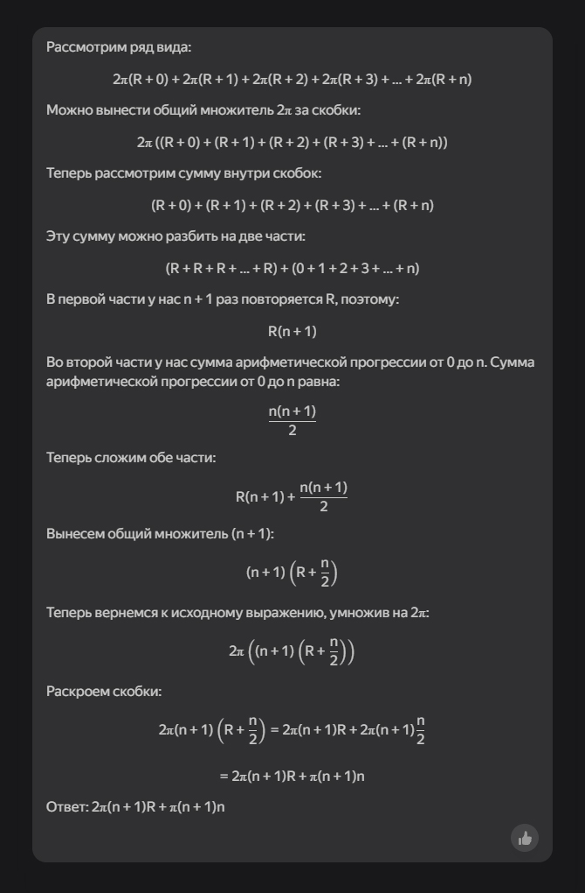
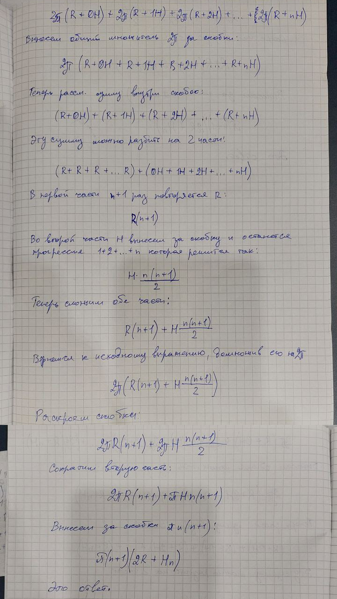

14 апреля 2025 г.

#  Решение ряда А

Рассмотрим ряд вида:

$$2π(R+0)+2π(R+1)+2π(R+2)+2π(R+3)+…+2π(R+n)$$

Можно вынести общий множитель $2π$ за скобки:

$$2π((R+0)+(R+1)+(R+2)+(R+3)+…+(R+n))$$

Теперь рассмотрим сумму внутри скобок:

$$(R+0)+(R+1)+(R+2)+(R+3)+…+(R+n)$$

Эту сумму можно разбить на две части:

$$(R+R+R+…+R)+(0+1+2+3+…+n)$$

В первой части у нас $n+1$ раз повторяется $R$, поэтому:

$$R(n+1)$$

Во второй части у нас сумма арифметической прогрессии от 0 до n. Сумма арифметической прогрессии от 0 до n равна:

$$\frac{n(n+1)}{2}$$

Теперь сложим обе части: 

$$R(n+1)+\frac{n(n+1)}{2}$$ 

Вынесем общий множитель $(n+1)$:

$$(n+1)(R+\frac{n}{2})$$

Теперь вернемся к исходному выражению, умножив на $2π$:

$$2π((n+1)(R+\frac{n}{2}))$$

Раскроем скобки:

$$2π(n+1)(R+\frac{n}{2})=2π(n+1)R+2π(n+1)\frac{n}{2}​$$ 

$$=2π(n+1)R+π(n+1)n$$

Ответ: $2π(n+1)R+π(n+1)n$

#  Решение ряда В

Рассмотрим ряд вида:

$$2π(R+0H)+2π(R+1H)+2π(R+2H)+…+2π(R+nH)$$

Можно вынести общий множитель $2π$ за скобки:

$$2π((R+0H)+(R+1H)+(R+2H)+…+(R+nH))$$

Теперь рассмотрим сумму внутри скобок:

$$(R+0H)+(R+1H)+(R+2H)+…+(R+nH)$$

Эту сумму можно разбить на две части:

$$(R+R+R+…+R)+(0H+1H+2H+…+nH)$$

В первой части у нас $n+1$ раз повторяется $R$, поэтому:

$$R(n+1)$$

Во второй части $H$ вынесем за скобки и останется у нас сумма арифметической прогрессии от 0 до n. Сумма арифметической прогрессии от 0 до n вместе с множителем $H$ равна:

$$H\frac{n(n+1)}{2}$$

Теперь сложим обе части:

$$R(n+1)+H\frac{n(n+1)}{2}$$

Теперь вернемся к исходному выражению, умножив на $2π$:

$$2π(R(n+1)+H\frac{n(n+1)}{2})$$

Раскроем скобки:

$$2\pi R(n+1)+2\pi H\frac{n(n+1)}{2}$$

Сократим вторую часть:

$$2\pi R(n+1)+\pi Hn(n+1)$$

Вынесем за скобки $\pi(n+1)$:

$$\pi(n+1)(2R+Hn)$$

Ответ: $\pi(n+1)(2R+Hn)$

