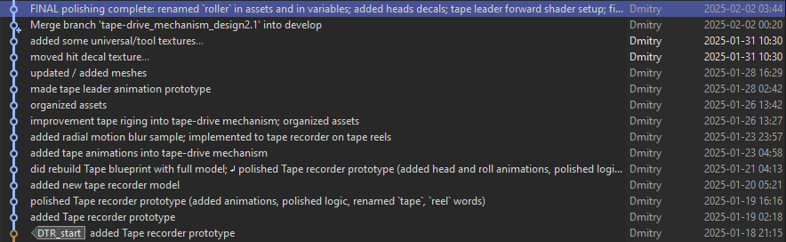

22 июня 2025 г.

### Видосы по мини-проекту Digital Tape Recorder

### TEAC DTR Type 4. Unreal Engine, Blueprints. 
# Часть 1А/6. Процедурная анимация катушек с лентой 

Я выпустил только половинку первой части. 1.0, 1.1, 1.2. Идет очень туго😂, а тянуть не хочу. 

**Снято with english subtitles** 

<!-- https://youtu.be/MaK8Z5M4OE4 -->

- 1.3 уже смонтирована, на подходе. 
- 1.4, 1.5, 1.6 еще нужно переделать сценарий,  перезаписать звук, перемонтировать.

Поразительная вещь. Делал проект на протяжении 16 дней. На то он и мини-проект. (лог в картинке)

Видео о нем делаю уже на протяжении 4 месяцев. С перебоями, с потугами.😄 И сделал еще только 1.5 из 6 частей😭 

Дело это для меня новое не исследованное. Пришлось разобраться в методике съемки туторов, видеоблогов. Переснять два раза. Три раза перезаписать звук. Купить новый микрофон. Разобраться в новом софте. Вероятно, все как у всех, но я этого не ожидал, признаться. Думал будет проще. 😄 Намерен закончить начатое. Надеюсь дальше будет быстрее. 🥹 

Как раз хотел поделиться не только прогрессом, скилом, но и своими эмоциями на этом пути. Так что я буду попутно тут писать такое.

