26 января 2026 г.

# Pool system. Скриншоты Blueprints

**Привет!**

**Посмотрел и вот такие выводы сделал:**

1. **Не увидел на скриншоте пулинга ни в каком виде. Если подразумевается, что `BP_Cluster` - это единица пулинга, то это очень большой объект, ты не сможешь его быстро инициализировать и весь смысл пула пропадает.**

	**Если процесс инициализации занимает в профайлере много времени (создает спайк), то тут нужно в коде писать асинхронную логику, которая будет вычислять все позиции в другом потоке и результат уже возвращать.**

У меня довольно странная логика пула, как мне кажется. Напишу описание работы системы со скриншотами блюпринтов. Про асинхронность, да мы часто поднимаем этот вопрос) Для блюпринтов видел плагин асинхронных вычислений. Но наверное лучше возьмусь за GPU PCG и Niagara Particles. 

2. **У тебя на лету создаются и добавляются HISM компоненты, вот их как раз можно пулить. Создать сразу пачку заранее и потом просто доставать по надобности.**

Думаю тут случилось недопонимание. Кластер в действительности пулится. Ниже по тексту описание. 

3. **Ты пишешь, что после создания продолжает тормозить, значит проблема не в создании, а в том что происходит потом пассивно.** 

	**Проверь какое у тебя узкое место (CPU или GPU, у кого время кадра выше). Если GPU - нужно выключать все что можно от дистанции, проверь лоды и т.д.**

	**Если CPU - посмотри на тики. Если кольца постоянно вращаются, убедись, что на компонентах выключена генерация оверлап ивентов. Иначе при каждом движении (каждый тик или даже чаще) он будет проверять каждое тело на оверлапы со всем остальным.**

	**Попробуй отключить все движение для колец и все тики, посмотри станет ли лучше. Если стало - начинай включать по немногу обратно, найди что именно это вызывает.**

	**Ну и CPU нужно через профайлер оптимизировать, это самый простой и быстрый вариант, чтобы вслепую не тыкаться.**

на `stat unit graph` CPU / GPU синхронно начинают проседать до 100 и более ms. Понял, что есть проблемы с отрисовкой. Это в процессе. 

Движения колец у меня еще нет. Выключить оверлапы я догадался. Интересно то, что тиков у колец нет. Есть довольно старая/плохая логика обнаружения видимости, но она таких просадок не давала.  

Профайлер **Unreal Insight** пока не помог мне ничем, т.к. по иронии движок вылетает именно на моменте, когда должны начать делаться семплы кластеров. Тут я в процессе. 


# Начало

`BP_GameInstance` создает `UObject` `BP_ActorManager`. Далее создается сцена. Методом спавна разных Blueprint Actors. На ряду с ними создается какое-то количество `BP_Ring`.

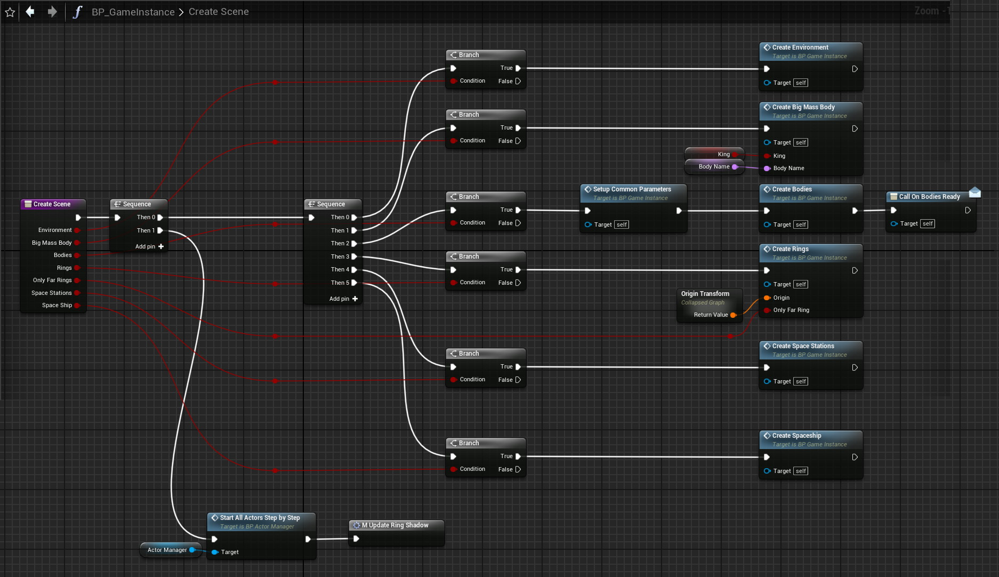
`BP_GameInstance > CreateScene`

В каждом созданном кольце запускается `SetupRing`. Там нас интересует создание семплов кластеров и настройка пула кольца. `CreateClusterSamples`, `SetupPoolSystem`:

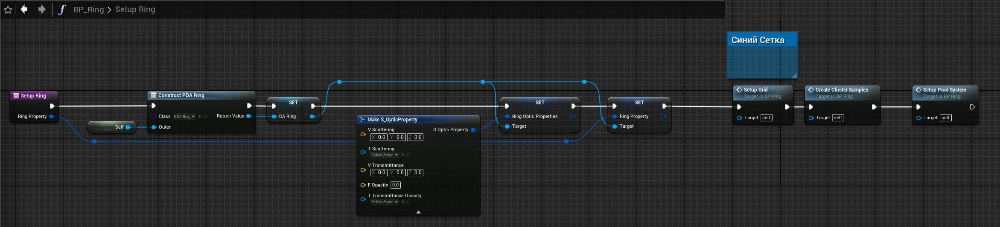
`BP_Ring > SetupRing`

# Создание шаблонов для пул объектов

Шаблоны хранятся в `BP_GameInstance`. Это словарь `Map of Name To S_Transforms Structures` 

```cpp
struct S_Transforms 
{   TArray<FTransform> Transforms;   }
```

Создается текстовый ключ и предается в генератор трансформов для HISM:

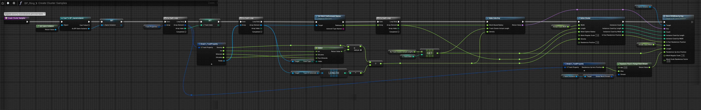
`BP_Ring > CreateClusterSamples`

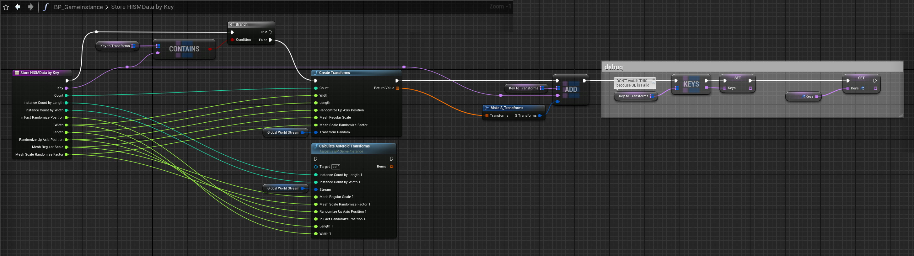
`BP_GameInstance > StoreHISMDataByKey`

Здесь используется функция `static TArray<FTransform> CreateTransforms`. Вот ее код: 

```cpp
static FTransform CreateTransform
(float Width, float Length, float RandomizeUpAxisPosition, float MeshRegularScale, float MeshScaleRandomizeFactor, const FRandomStream& TransformRandom)
{
	// Rotation
	FRotator Rotation = UKismetMathLibrary::RandomRotatorFromStream(true, TransformRandom);
	// Location
	float X = Width / 2.0f;
	X = UKismetMathLibrary::RandomFloatInRangeFromStream(-X, X, TransformRandom);
	float Y = Length / 2.0f;
	Y = UKismetMathLibrary::RandomFloatInRangeFromStream(-Y, Y, TransformRandom);
	float Z = (UKismetMathLibrary::RandomFloatFromStream(TransformRandom) - 0.5f);
	Z = Z * RandomizeUpAxisPosition; // Extra position random on up axis, as a multiplier on ring width
	FVector Location = FVector(X, Y, Z); // Position from actor's center at 0
	// Scale
	float B = UKismetMathLibrary::RandomFloatFromStream(TransformRandom) * MeshRegularScale;
	float ScaleFactor = UKismetMathLibrary::Lerp(MeshRegularScale, B, MeshScaleRandomizeFactor);
	FVector Scale = FVector(ScaleFactor);

	return FTransform(Rotation, Location, Scale);
}

static TArray<FTransform> CreateTransforms
(int32 Count, float Width, float Length, float RandomizeUpAxisPosition, float MeshRegularScale, float MeshScaleRandomizeFactor, const FRandomStream& TransformRandom)
{
	TArray<FTransform> Transforms; // need creating fixed size like 
	// IntArray.Init(10, 5);
	// IntArray == [10,10,10,10,10]

	for (int32 i = 0; i < Count; i++) // need for creating some per Tick
	{
		FTransform T = CreateTransform(Width, Length, RandomizeUpAxisPosition, MeshRegularScale, MeshScaleRandomizeFactor, TransformRandom);
		Transforms.Add(T); // need working with fixed array
	}
	return Transforms;
}
```

# Отдельный пул для каждого кольца. Установки пулинга

После создания шаблонов происходит настройка пула кольца. Объект кольца это кластер - `BP_Cluster`. У каждого кольца свой пулл. `SetupPoolSystem`:

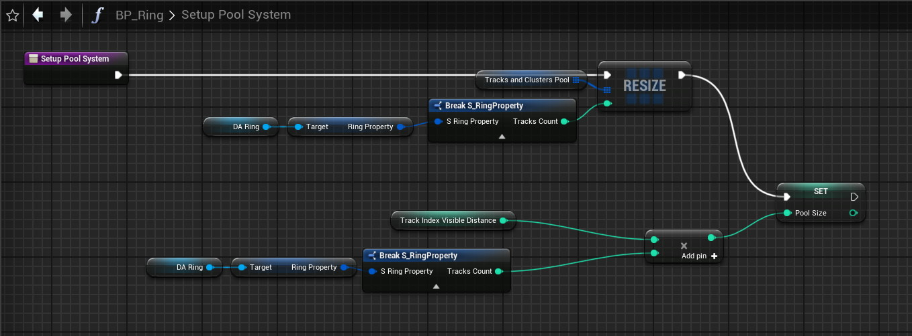
`BP_Ring > SetupPoolSystem`

Кольца создаются и сетапятся по-порядку. На этом пока работа колец останавливается.

Возвращаемся к `BP_GameInstance`. После создания всех экторов сцены `BP_ActorManager`  запускает в экторах эвенты `Start`. Так запускается их работа по общей схеме. 

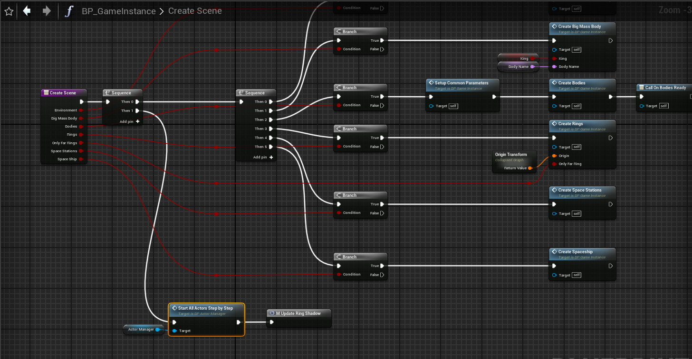
`BP_GameInstance > CreateScene`


`BP_ActorManager > Start All Actors Step by Step`

В кольцах эвент `Start` запускается последовательно. Вот так:

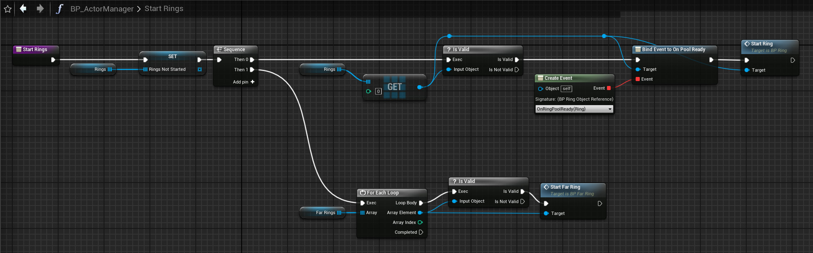
`BP_ActorManager > StartRings`


`BP_ActorManager > OnRingPoolReady`

Вызов эвента `StartRing` запустит пул кольца.

# Пулинг необходимого количества объектов

И вот сам `StartRing` эвент кольца:

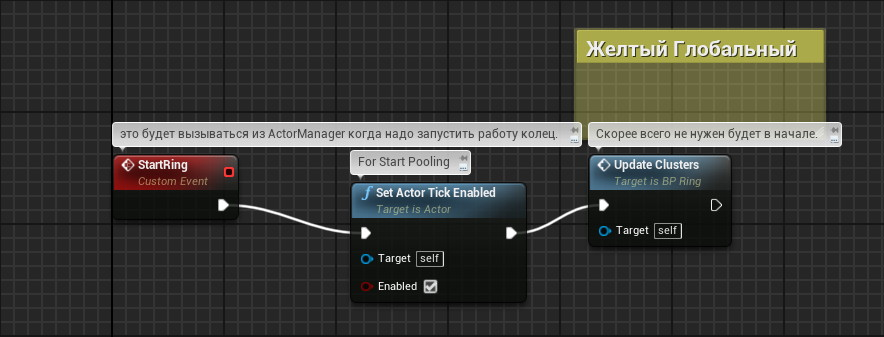
`BP_Ring > StartRing`

Oн запускает `EventTick`:

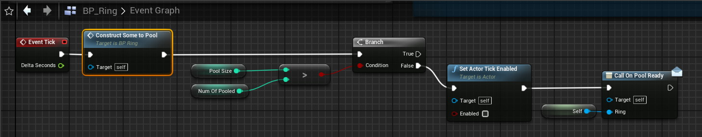
`BP_Ring > EventTick`

Каждый `Tick` создается один пул объект. `ConstructSomeToPool`. Так настроен параметр `PoolSpeedPerTick = 1`:

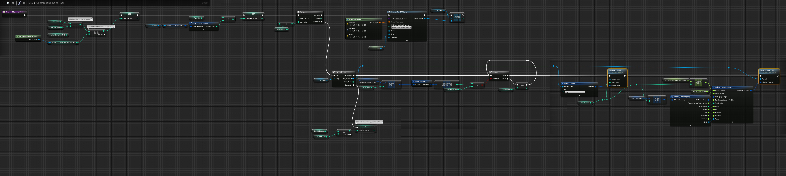
`BP_Ring > ConstructSomeToPool`

В пуле необходимо хранить по-разному настроенные кластеры для каждого трека. И у каждого трека необходимо запулить несколько одинаковых кластеров. 

Треки(`Track`) это наподобие треков жесткого диска. У одного диска несколько треков. А треки содержат кластеры(`Cluster`). Кластеры - объекты пула(`BP_Cluster`). У каждого трека одинаковые кластеры. Но кластеры разных треков - разные.

Поэтому сначала создаются пустые Экторы `BP_Cluster`, столько, сколько позволено `PoolSpeedPerTick`. Далее проверяется нужно ли первому треку еще кластеров. Если не нужно переводим счетчик к следующему треку. Если нужно - сделаем 2 вещи: запись о кластере в словарь согласно треку - `DropToPool`, сетап кластера согласно треку - `SetupRingField`.  

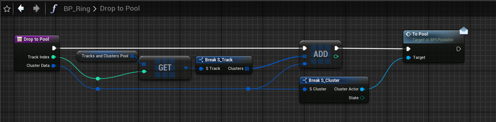
`BP_Ring > DropToPool`

Словарь пула - это структура. Массив треков. Внутри массив кластеров. Кластер это ссылка на эктор и State, нужный для др. системы. `ToPool` это вызов через интерфейс. Методы  сокрытия в пул и вытаскивания из пула очень просты. О них позже.

 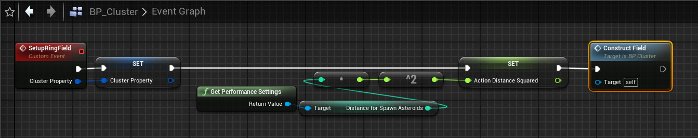
`BP_Cluster > SetupRingField`

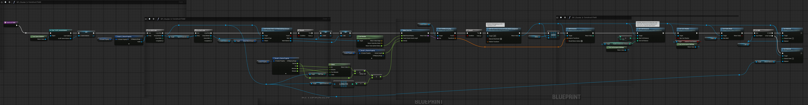
`BP_Cluster > ConstructField`

Здесь создание ключа и по нему получение из словаря трансформов. 

Добавление компонент HISM, добавление трансформов, мешей, материалов идет сразу после создания экторов `BP_Cluster`. Один раз. 

По-моему было недопонимание в п. 2. *"У тебя на лету создаются и добавляются HISM компоненты, вот их как раз можно пулить. Создать сразу пачку заранее и потом просто доставать по надобности."*

Насколько я понимаю они все-таки пулятся. 

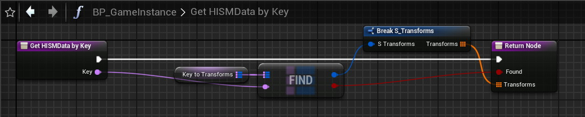
`BP_GameInstance > GetHISMDataByKey`

И на этом пул объектов завершается. 

# Достать из пула и спрятать в пул

Есть система, которая строит сетку кластеров в кольце. Ее задача сказать какой кластер должен быть показан, а какой скрыт. В результате она вызывает либо `GetFromPool`, либо `DropToPool`

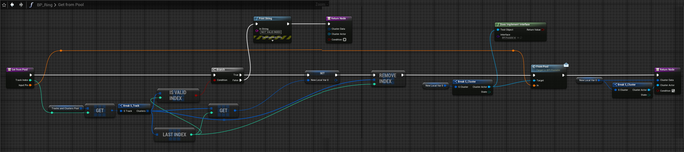
`BP_Ring > GetFromPool`


`BP_Ring > DropToPool`

По интерфейсу `BPI_Poolable` в `BP_Cluster` вызываются `EventToPool`, `EventFromPool`:

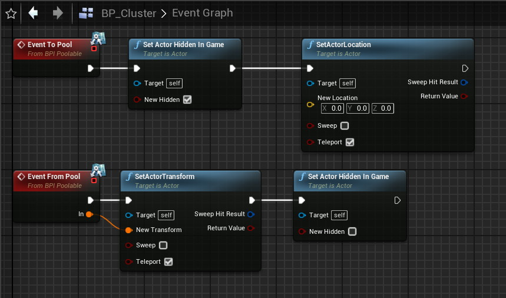
`BP_Cluster > EventToPool, EventFromPool` `(from Interface)`

Кластеры не имеют коллизий, поэтому управления ими нет.
