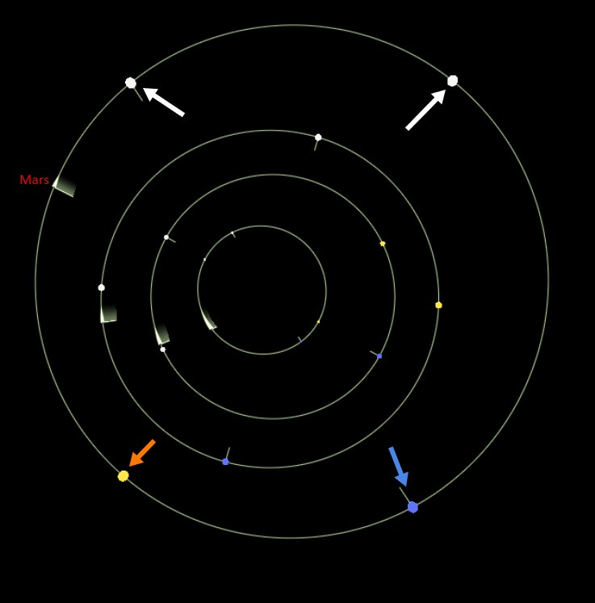
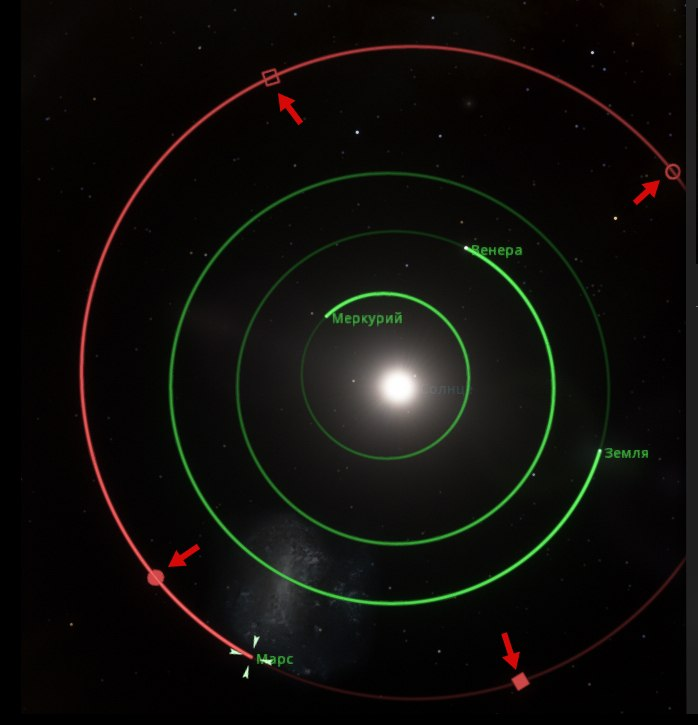

17 июля 2026 г.

# Успешное тестирование

<table> <tbody>
  <tr>
    <td>
        
 My system

    </td>
    <td>
        
SpaceEngine

    </td>
  </tr>
</tbody> </table>

Сегодня проверил работу параметров орбит на примере солнечной системы. Взял реальные данные. На примере движка [SpaceEngine.org](https://SpaceEngine.org) сравнил результаты. 

Все точки на нужных местах. Вот Марс. Слева картинка моей системы, справа - Space Engane. Ну и другие планеты совпадают тоже.
