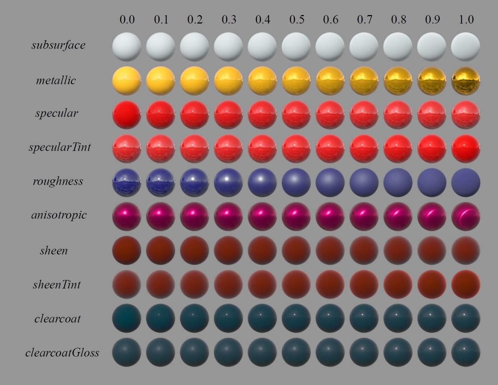
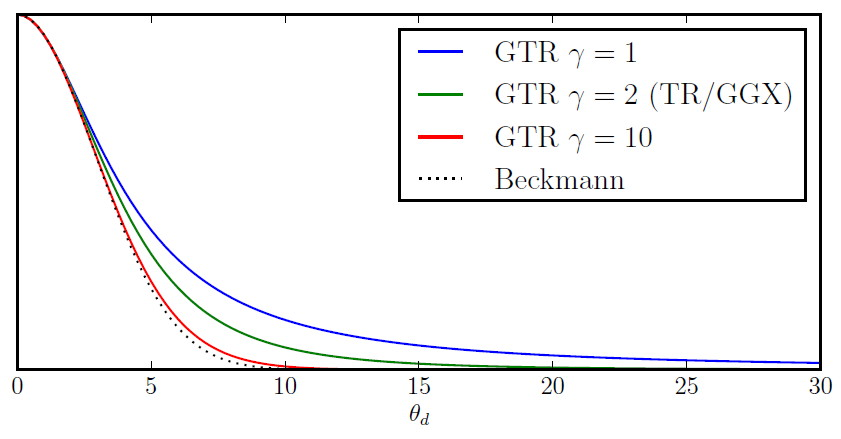
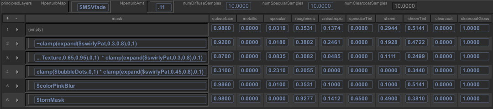

## 5 «Принципиальный» BRDF Диснея

### 5.1 Принципы

При разработке нашей новой физически обоснованной модели отражения художники предупредили нас, что нам нужна модель затенения, которая будет поддаваться художественной редактуре и не обязательно будет физически корректной. Из-за этого наша философия заключалась в разработке «принципиальной» модели, а не строго физической.

Вот принципы, которым мы решили следовать при реализации нашей модели:

 1. Следует использовать интуитивные, а не физические параметры.
 
 2. Должно быть как можно меньше параметров.
 
 3. Параметры должны быть от нуля до единицы в пределах их правдоподобного диапазона.
 
 4. Параметры должны иметь возможность выходить за пределы их правдоподобного диапазона, где это имеет смысл.
 
 5. Все комбинации параметров должны быть максимально надежными и правдоподобными.

Мы тщательно обсудили добавление каждого параметра. В итоге мы остановились на одном параметре цвета и десяти скалярных параметрах, описанных в следующем разделе.

### 5.2 Параметры

- _baseColor:_ цвет поверхности, обычно предоставляемый текстурными картами.
- _subsurface:_ управляет диффузной формой с использованием приближения подповерхности.
- _metallic:_ металличность (0 = диэлектрик, 1 = металлик). Это линейное смешение двух разных моделей. Металлическая модель не имеет диффузного компонента, а также имеет тонированный падающий зеркальный свет, равный базовому цвету.
- _specular:_ количество падающего зеркального света. Это вместо явного показателя преломления.
- _specularTint:_ уступка для художественного управления, которая тонирует падающий зеркальный свет в сторону базового цвета. Скользящий зеркальный свет по-прежнему ахроматичен.
- _roughness:_ шероховатость поверхности, управляет как диффузным, так и зеркальным откликом.
- _anisotropic:_ степень анизотропии. Управляет соотношением сторон зеркального блика. (0 = изотропный, 1 = максимально анизотропный.)
- _sheen:_ дополнительный компонент скольжения, в первую очередь предназначенный для ткани.
- _sheenTint:_ количество тонированного блеска в сторону базового цвета.
- _clearcoat:_ второй, специальный зеркальный лепесток.
- _clearcoatGloss:_ управляет глянцевитостью прозрачного покрытия (0 = «сатиновый» вид, 1 = «глянцевый» вид).

Визуализированные примеры влияния каждого из наших параметров показаны на рисунке 16.

Рисунок 16: Примеры влияния наших параметров BRDF. Каждый параметр изменяется по строке от нуля до единицы, при этом другие параметры остаются постоянными.

### 5.3 Подробности диффузной модели

Некоторые модели включают диффузный фактор Френеля, такой как:

$$(1 − F (θ_l))(1 − F (θ_d))$$

где $F (θ)$ — фактор Френеля для отражения.

[Примечание: из закона Френеля для преломления и для сохранения взаимности Гельмгольца необходимо учитывать преломление дважды, один раз на пути внутрь и один раз на пути наружу поверхности.]

Как видно из наблюдений измеренных данных и на основе нашего прошлого студийного опыта, диффузная модель Ламберта часто слишком темная по краям, а добавление фактора Френеля для того, чтобы сделать ее более физически правдоподобной, только делает ее темнее.

На основе наших наблюдений мы разработали новую эмпирическую модель для диффузного ретроотражения, которая переходит между диффузной тенью Френеля для гладких поверхностей и добавленным светом для шероховатых поверхностей. Возможным объяснением этого эффекта может быть то, что для шероховатых поверхностей свет входит и выходит из сторон микроповерхностных элементов, вызывая увеличение преломления под скользящими углами. В любом случае, нашим художникам это нравится, и это похоже на элементы, которые мы использовали в нашей специальной модели, за исключением того, что теперь это более правдоподобно и имеет физическую основу.

В нашей модели мы игнорируем показатель преломления для диффузного фактора Френеля и предполагаем отсутствие падающих диффузных потерь. Это позволяет нам напрямую указывать падающий диффузный цвет. Мы используем приближение Шлика-Френеля и изменяем реакцию скользящего ретрорефлекса, чтобы перейти к определенному значению, определяемому шероховатостью, а не к нулю.

Наша базовая диффузная модель:

$$f_d = \frac{BaseColor}{\pi} \big(1 + (F_\text{D90} − 1)(1 − \cos θ_l)^5\big) \big(1 + (F_\text{D90} − 1)(1 − \cos θ_v)^5\big)$$

где $F_\text{D90}=0.5+2\textit{roughness}\times{\cos^2θ_d}$

Это создает диффузную тень Френеля, которая уменьшает падающее диффузное отражение на $0.5$ при углах скольжения для гладких поверхностей и увеличивает отклик до $2.5$ для шероховатых поверхностей. Это, по-видимому, обеспечивает разумное соответствие данным MERL и также было признано художественным. Срезы изображения BRDF нашей модели для различных значений шероховатости показаны на рисунке 17.

Рисунок 17: Срезы изображения BRDF нашей модели для различных значений шероховатости.

Наш параметр подповерхности смешивает базовую диффузную форму и форму, вдохновленную подповерхностным BRDF Ханрахана-Крюгера [^11]. Это полезно для придания подповерхностного эффекта удаленным объектам и объектам, где средняя длина пути рассеяния мала; однако это не заменяет выполнение полного подповерхностного переноса, поскольку он не пропускает свет в тени или сквозь поверхность.

### 5.4 Детали Specular D

Из популярных моделей GGX имеет самый длинный хвост. Эта модель фактически эквивалентна распределению Троубриджа-Рейтца (1975) [^31], которое Блинн (1977) [^6] предпочел за его способность соответствовать экспериментальным данным. Однако это распределение все еще не имеет достаточно длинного хвоста для многих материалов.

Троубридж и Рейтц сравнили свою функцию распределения вместе с несколькими другими распределениями с измерениями матового стекла. Одно из других распределений, от Берри (1923), имеет очень похожую форму, но с показателем степени 1 вместо 2, что приводит к еще более длинному хвосту. Это предполагает более общее распределение с переменной экспонентой, введенное здесь и названное Обобщенным-Троубриджем-Рейтцем, или GTR:

$$ 
\begin{array} {l c l}
D_\text{Berry}&=& c/(α^2 \cos^2 θ_h + \sin^2 θ_h) \\
D_\text{TR}&=& c/(α^2 \cos^2 θ_h + \sin^2 θ_h)^2 \\
D_\text{GTR}&=& c/(α^2 \cos^2 θ_h + \sin^2 θ_h)^γ
\end{array} 
$$
  
В каждом из этих распределений $c$ — это масштабная константа, а $α$ — параметр шероховатости со значениями от 0 до 1; $α = 0$ дает идеально гладкое распределение (т. е. дельта-функцию при $θ_h = 0$), а $α = 1$ дает идеально грубое или равномерное распределение.

Рисунок 18: Кривые распределения GTR в зависимости от $θ_h$ для различных значений $γ$:

Предварительные результаты подгонки предполагают типичные значения $γ$ между 1 и 2. Интересно, что GTR с $γ = \frac{3}{2}$ эквивалентна фазовой функции Хеньи-Гринштейна для $θ = 2θ_h$; удвоение $θ_h$ можно рассматривать как расширение распределения от полусферы до сферы.

Правдоподобное распределение микрограней должно быть нормализовано, и для эффективного рендеринга оно также должно поддерживать выборку важности. Оба требуют, чтобы распределение было интегрируемым по полусфере. К счастью, эта функция имеет простой замкнутый интеграл. Функции нормализации и выборки важности, а также эффективная анизотропная форма выведены в Приложении Б.

Для нашего BRDF мы решили иметь два фиксированных зеркальных лепестка, оба с использованием модели GTR. Первичный лепесток использует $γ = 2$, а вторичный лепесток использует $γ = 1$. Первичный лепесток представляет собой базовый материал и может быть анизотропным и/или металлическим. Вторичный лепесток представляет собой слой прозрачного покрытия поверх базового материала и, таким образом, всегда изотропен и неметалличен.

Для шероховатости мы обнаружили, что сопоставление $α = roughness^2$ приводит к более линейному изменению шероховатости с точки зрения восприятия. Без этого сопоставления для сопоставления блестящих материалов требовались очень маленькие и неинтуитивные значения. Кроме того, интерполяция между шероховатым и гладким материалом всегда давала бы грубый результат. Полученная интерполяция показана на рисунках 16 и 19.

Вместо явного показателя преломления, или IOR, наш параметр $specular$ определяет величину падающего зеркального отражения. Нормализованный диапазон этого параметра линейно сопоставлен в диапазон падающего зеркального отражения [0.0, 0.08]. Это соответствует значениям IOR в диапазоне [1.0, 1.8], охватывающем наиболее распространенные материалы. Примечательно, что середина диапазона параметров соответствует IOR 1.5, очень типичному значению, и также является нашим значением по умолчанию. Параметр $specular$ может быть выведен за пределы единицы для достижения более высоких значений IOR, но следует делать это с осторожностью. Это сопоставление параметра очень помогло художникам создавать правдоподобные материалы, учитывая, что реальные значения отражательной способности падающего света настолько неинтуитивно низкие.

Для нашего слоя прозрачного покрытия мы используем фиксированное значение IOR 1.5, представляющее полиуретан, и вместо этого позволяем художникам масштабировать общую прочность слоя с помощью параметра прозрачного покрытия $clearcoat$. Нормализованный диапазон параметров соответствует общей шкале [0.0, 0.25]. Этот слой, хотя и имеет большое визуальное воздействие, представляет относительно небольшое количество энергии, поэтому мы не вычитаем никакой энергии из базового слоя. При установке на ноль слой прозрачного покрытия фактически отключается и не требует затрат.

### 5.5 Детали Specular F

Для наших целей приближение Шлика-Френеля [^28] достаточно и существенно проще, чем полные уравнения Френеля; ошибка, вносимая приближением, значительно меньше ошибки, вызванной другими факторами.

$$F_{\text{Schlick}} = F_0 + (1 − F_0)(1 − \cos θ_d)^5$$

Константа $F_0$ представляет зеркальное отражение при нормальном падении и является ахроматической для диэлектриков и хроматической (т. е. окрашенной) для металлов. Фактическое значение зависит от показателя преломления. Обратите внимание, что зеркальное отражение происходит от микрограней, и, таким образом, $F$ зависит от $θ_d$, угла между вектором света и микронормалью (т. е. половинным вектором), а не угла падения с нормалью к поверхности.

Функция Френеля может рассматриваться как интерполирующая (нелинейно) между падающим зеркальным отражением и единицей при скользящих углах. Обратите внимание, что отклик становится ахроматическим при скользящем падении, поскольку весь свет отражается.

### 5.6 Детали Specular G

Для нашей модели мы использовали гибридный подход. Учитывая, что коэффициент затенения Смита доступен для первичного зеркального отражения, мы используем $G$, выведенный для GGX Уолтером, но переопределяем шероховатость, чтобы уменьшить экстремальное усиление для блестящих поверхностей. В частности, мы линейно масштабируем исходную шероховатость из диапазона [0.0, 1.0] в уменьшенный диапазон, [0.5, 1.0], для целей вычисления $G$. Примечание: мы делаем это до возведения в квадрат шероховатости, как описано ранее, поэтому окончательное значение $α_g$ равно $(0.5 + roughness/2)^2$.

Это перераспределение было основано на сравнении с измеренными данными, а также на отзывах художников о том, что зеркальное отражение было просто «слишком горячим» для малых значений шероховатости. Это дает нам функцию $G$, которая меняется в зависимости от шероховатости, по крайней мере частично физически обоснована и кажется правдоподобной. Для нашего зеркального отражения с прозрачным покрытием у нас нет вывода Смита $G$, и мы просто используем GGX $G$ с фиксированной шероховатостью $0.25$, что было признано правдоподобным и художественно приятным.

### 5.7 Слои против смешивания параметров

Как только мы определились с нашей новой моделью, нам нужно было решить, как интегрировать ее в наши шейдеры. Первый вопрос заключался в том, какие параметры должны быть пространственно изменяемыми, и ответ был: все они; если художник просто хочет поместить два разных материала на поверхность и маску между ними, то ему нужно будет интерполировать между всеми параметрами. Кроме того, маска будет отфильтрована, и на размытом краю маски реакция материала должна оставаться правдоподобной.

Одним из преимуществ наших принципов проектирования, заключающихся в том, что все параметры нормализованы и, по крайней мере, воспринимаемо линейны, является то, что материалы, как правило, интерполируются очень интуитивно понятным образом. Пример этого показан на рисунке 19.

Как только мы поняли, что можем надежно интерполировать, мы задались вопросом, можем ли мы достичь всех пространственных изменений с помощью масок. Идея заключается в том, что художник выберет список предустановок материалов, а затем просто смешает их с помощью текстурных масок. Это оказалось феноменально успешным, значительно упростив рабочий процесс, улучшив согласованность материалов и сделав оценку шейдера чрезвычайно эффективной. Наш пользовательский интерфейс шейдера показан на рисунке 20.

Рисунок 19: Интерполяция между двумя очень разными материалами, блестящим металлическим золотом и синей резиной, с использованием нашей модели.

Рисунок 20: Скриншот нашего редактора шейдеров, показывающий слои материалов. Переменные в выражениях маски относятся к пространственно изменяющимся модулям шейдера, обычно к текстурным картам.