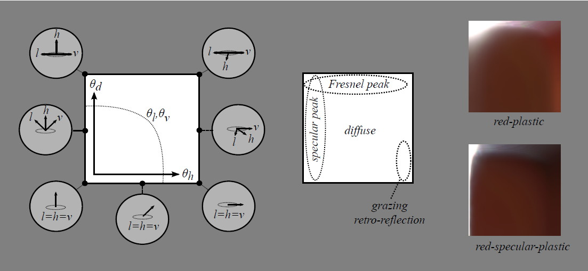
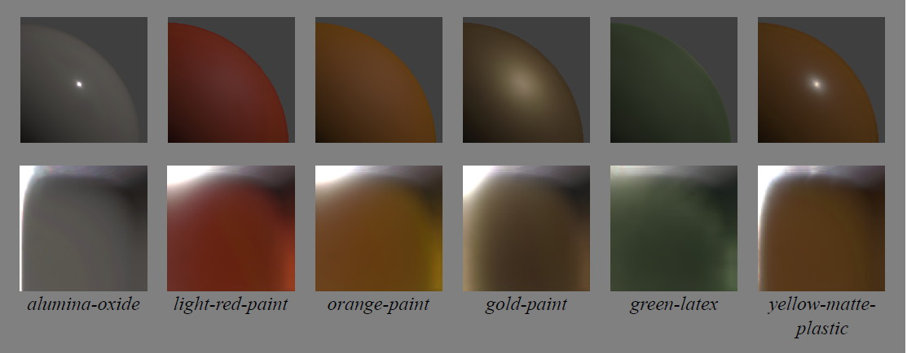
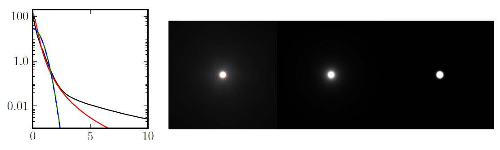
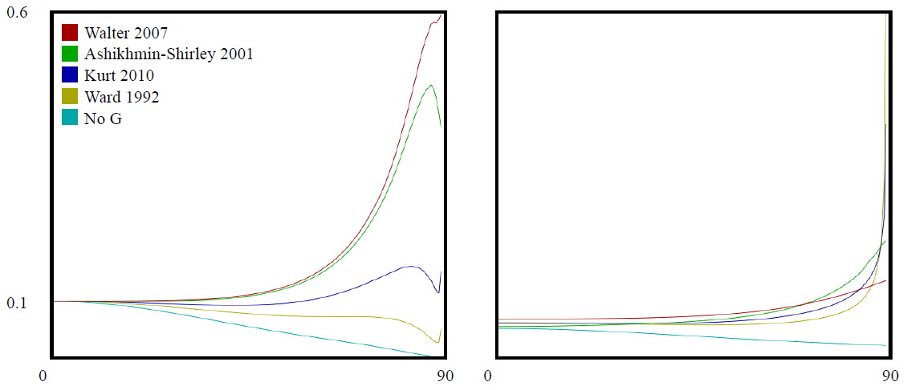
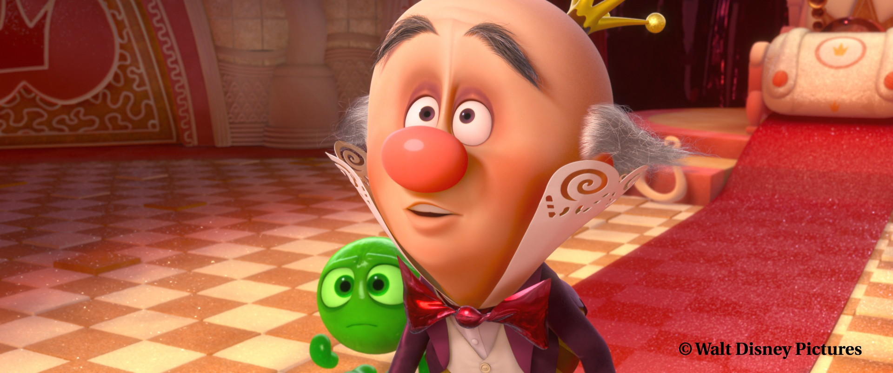

# Физически корректный шейдинг Диснея

Брент Берли, Студия анимации Уолта Диснея

_Перевод на русский — Борисов Дмитрий_

## 1 Введение

После нашего успеха с физически обоснованным затенением волос в Рапунцель [^27], мы начали рассматривать физически обоснованные модели затенения для более широкого диапазона материалов. С физически обоснованной моделью волос мы смогли достичь большой степени визуального богатства, сохраняя при этом художественный контроль. Однако оказалось сложным интегрировать освещение волос с остальной частью сцены, которая все еще использовала традиционные «специальные» модели затенения и точечные источники света. Для последующих фильмов мы хотели увеличить богатство всех наших материалов, одновременно делая световые реакции более согласованными между материалами и средами, а также хотели повысить производительность художника за счет использования упрощенных элементов управления.

Когда мы начали наше исследование, было неочевидно, какие модели использовать или даже насколько физически обоснованными мы хотим быть. Стоит ли быть идеально энергосберегающими? Должны ли мы отдавать предпочтение физическим параметрам, таким как показатель преломления?

Для диффузного, Ламберт, казалось, был общепринятой нормой, в то время как зеркальнность, казалось, получил больше всего внимания в литературе. Некоторые модели, такие как Ашихмин-Ширли (2000) [^3], стремились быть интуитивными и практичными, при этом физически правдоподобными, в то время как другие, такие как Хе и др. (1991) [^12], предоставили более полную физическую модель. Еще одни были нацелены на улучшение подгонки данных ([^15], [^14], [^22], [^17], [^4]), но немногие из них подходят для прямой манипуляции. Мы могли бы реализовать несколько моделей и позволить художникам выбирать и комбинировать их, но тогда мы бы вернулись к взрыву параметров, от которого мы пытались уйти.

Одним из исследований большого разнообразия измеренных материалов было исследование Нгана и др. (2005) [^21], в котором сравнивались пять популярных моделей. Некоторые модели в целом справились лучше других, но интересно, что была сильная корреляция между характеристиками моделей — некоторые материалы были хорошо представлены всеми моделями, а для других ни одна модель не оказалась подходящей. Добавление дополнительной зеркальной доли помогло лишь в нескольких случаях. Возникает вопрос: что не представлено в сложных материалах?

Чтобы ответить на этот вопрос и оценить модели BRDF более интуитивно, мы разработали новый просмотрщик BRDF, который мог отображать и сравнивать как измеренные, так и аналитические BRDF. Мы открыли новые, интуитивно понятные способы просмотра измеренных данных BRDF и обнаружили интересные особенности в измеренных материалах, которые не были хорошо представлены известными моделями.

В этих заметках к курсу мы поделимся наблюдениями, полученными при изучении измеренных материалов, а также выводами, которые мы почерпнули о том, какие модели соответствуют измеренным данным, а где они не дотягивают. Затем мы представим нашу новую модель, которая теперь используется во всех текущих постановках. Мы также опишем наш опыт внедрения этой новой модели в постановку и обсудим, как нам удалось добавить нужный уровень художественного контроля, сохранив при этом простоту и надежность.

## 2 Модель микрограней

Мы определим нашу BRDF и сравним с измеренными материалами в терминах модели микрограней [^30], [^7], [^33]. Модель микрограней постулирует, что если поверхностное отражение может происходить между заданным вектором света $\mathbf{l}$ и вектором взгляда $\mathbf{v}$, ​​то должна существовать некоторая часть поверхности, или микрогрань, с нормалью, выровненной посередине между векторами $\mathbf{l}$ и $\mathbf{v}$. Этот «половинный вектор», иногда называемый нормалью микроповерхности. Таким образом, определяется как $\mathbf{h} = \frac{\mathbf{l}+\mathbf{v}}{|\mathbf{l}+\mathbf{v}|}$. Общая форма модели микрограней для изотропных материалов:

$$f (\mathbf{l}, \mathbf{v}) = \text{diffuse} + \frac{ D(θ_h)F(θ_d)G(θ_l, θ_v) }{ 4\cosθ_l \cosθ_v}$$

Диффузный член — это функция неизвестной формы. Диффузный Ламберт часто предполагается и представляется постоянным значением. Для зеркального члена $D$ — это функция распределения микрограней, которая отвечает за форму зеркального пика, $F$ — коэффициент отражения Френеля, а $G$ — геометрический коэффициент затухания или затенения.

$θ_l$ и $θ_v$ — углы падения векторов $\mathbf{l}$ и $\mathbf{v}$ относительно нормали, $θ_h$ — угол между нормалью и половинным вектором, а $θ_d$ — угол «разницы» между $\mathbf{l}$ и половинным вектором (или, симметрично, $\mathbf{v}$ и $\mathbf{h}$).

Большинство физически правдоподобных моделей, не описанных специально в форме микрограней, все равно могут быть интерпретированы как модели микрограней, поскольку у них есть функция распределения, фактор Френеля и некоторый дополнительный фактор, который можно считать геометрическим фактором затенения. Единственное реальное различие между моделями микрограней и другими моделями заключается в том, включают ли они явный фактор $\frac{1}{4\cosθ_l\cosθ_v}$, который исходит из вывода микрограней. Для моделей, которые не включают этот фактор, подразумеваемый фактор затенения может быть определен путем умножения модели на ${4\cosθ_l\cosθ_v}$ после вынесения факторов $D$ и $F$.

## 3 Визуализация измеренных BRDF-ов

### 3.1 «MERL 100»

Рисунок 1: Срезы изображений MERL 100 BRDFs.  

Набор из 100 изотропных образцов материалов BRDF был получен Матусиком и др. в 2003 году [^18], охватывающий широкий спектр материалов, включая краски, древесину, металлы, ткани, камень, резину, пластик и другие синтетические материалы. Этот набор данных находится в свободном доступе в Mitsubishi Electric Research Laboratories по адресу [www.merl.com/brdf](www.merl.com/brdf) и обычно используется для оценки новых моделей BRDF. Срезы этих BRDF показаны на рисунке 1.

Каждый BRDF в MERL 100 плотно отобран в куб 90 на 90 на 180 вдоль осей $θ_h$, $θ_d$ и $\phi_d$ соответственно. Они соответствуют приращениям в 1 градус, за исключением оси $θ_h$, которая была деформирована для концентрации образцов данных вблизи зеркального пика. Измерения были отфильтрованы и экстраполированы по мере необходимости, чтобы в данных не было пробелов. Это хорошо тем, что данные легко использовать, но неясно, насколько точны данные, особенно вблизи горизонта. Из-за этого некоторые исследователи отбрасывают данные вблизи горизонта при выполнении подгонки, но эти данные все равно полезно учитывать, поскольку они могут оказать сильное влияние на внешний вид материала.

### 3.2 BRDF проводник

Рисунок 2: Диснеевский BRDF проводник

Для изучения материалов, измеренных MERL, и сравнения с аналитическими моделями мы разработали новый инструмент, BRDF Explorer, показанный на рисунке 2. Он доступен как открытый исходный код на [www.github.com/wdas/brdf](www.github.com/wdas/brdf) и имеет следующие функции:

-   Возможность загрузки нескольких аналитических BRDF, написанных на GLSL
-   Возможность загрузки измеренных BRDF, включая образцы анизотропных материалов, полученные Нганом и др. [^21]
-   Множественные графики данных (3D-полусферический вид, полярный график и различные декартовы графики)
-   Вычисленный график альбедо (т. е. направленно-полусферическое отражение)
-   Просмотр среза изображения с элементами управления экспозицией
-   Просмотр освещенного объекта с выборкой важности IBL
-   Просмотр освещенной сферы
-   Динамические элементы управления пользовательского интерфейса для параметрических моделей

Этот инструмент оказался бесценным при сравнении измеренных материалов с существующими аналитическими моделями, а также при разработке нашей новой модели. Удивительно, но он также оказался очень полезным для художников как интерактивный редактор BRDF, предоставляя им более глубокое понимание параметров модели и пространства BRDF.

### 3.3 Срез изображения

Рисунок 3: Срезы изображений BRDF для *красного-пластика* и *зеркального-красного-пластика*, показанные вместе со схематическим видом «пространства среза».

Один из самых простых и интуитивно понятных способов визуализации измеренного материала — просто просмотреть его как стопку изображений, и мы обнаружили, что это очень мощный инструмент для получения интуитивного представления о данных. Как оказалось, все интересные особенности в материалах MERL 100 видны в срезе $\phi_d = 90$. Схематический вид этого пространства вместе с двумя образцами материалов показан на рисунке 3. Другие срезы — это просто деформированные версии этого среза, как показано на рисунке 4. Это наблюдение было использовано в недавних работах, таких как Ромейро (2008) [^26] и Пакановски (2012) [^24], в качестве основы для упрощенных изотропных моделей BRDF формы $f (θ_h, θ_d)$.

[^24]: Ромен Пакановски, Оливер Салазар Селис, Кристоф Шлик, Ксавье Гранье, Пьер Пулен и Энни Кюйт. Рациональная brdf. *Труды IEEE по визуализации и компьютерной графике*, 99 (PrePrints), 2012. / Romain Pacanowski, Oliver Salazar Celis, Christophe Schlick, Xavier Granier, Pierre Poulin, and Annie Cuyt. Rational brdf. *IEEE Transactions on Visualization and Computer Graphics*, 99(PrePrints), 2012.

[^26]: Фабиано Ромейро, Юрий Васильев и Тодд Циклер. Пассивная рефлектометрия. *В трудах 10-й Европейской конференции по компьютерному зрению: Часть IV, ECCV* ’08, страницы 859–872, Берлин, Гейдельберг, 2008. Springer-Verlag. / Fabiano Romeiro, Yuriy Vasilyev, and Todd Zickler. Passive reflectometry. In *Proceedings of the 10th European Conference on Computer Vision: Part IV, ECCV* ’08, pages 859–872, Berlin, Heidelberg, 2008. Springer-Verlag.

Рисунок 4: Срезы *зеркально-красного-пластика* для различных значений $\phi_d$, азимутального вращения $\mathbf{l}$ вокруг половинного вектора. Черная область в правом верхнем углу представляет собой часть области BRDF, где вектор $\mathbf{l}$ или $\mathbf{v}$ находится ниже горизонта.

В срезе изображения левый край представляет собой зеркальный пик, а верхний край представляет собой пик Френеля. Обратите внимание, что вдоль нижнего края векторы света и вида совпадают, поэтому нижний край представляет собой ретрорефлексию. Нижний правый угол, в частности, представляет собой скользящее ретрорефлекторное отражение. Диффузное отражение проявляется во всем пространстве BRDF, но середина изображения, как правило, изолирована от диффузного отклика.

Схематическое изображение на рисунке 3 также включает изолинию $θ_l$ или $θ_v$. Многие диффузные эффекты имеют тенденцию следовать этому контуру. Обратите внимание, что эти изолинии выпрямляются, когда $\phi_d$ приближается к нулю, и сравнение срезов $\phi_d$ может дать представление о том, какие части отклика материала обусловлены диффузным отражением, а какие — зеркальным. Еще одним намеком, конечно, является цвет; диффузное отражение обусловлено подповерхностным рассеянием и поглощением, что приводит к видимому оттенку, тогда как зеркальное отражение исходит от поверхности и не тонируется (если только поверхность не металлическая, в этом случае диффузный компонент отсутствует).

## 4 Наблюдения за материалами MERL

### 4.1 Наблюдения за диффузным отражением

Рисунок 5: Материалы, демонстрирующие диффузное изменение цвета. Верхний ряд: отклики точечного света на визуализированных сферах; нижний ряд: срезы изображений BRDF.

Диффузное отражение представляет собой свет, который преломляется на поверхности, рассеивается, частично поглощается и переизлучается. Учитывая, что часть света поглощается, отклик диффузного отражения будет окрашен цветом поверхности, и любая часть неметаллического материала, которая окрашена, может считаться диффузным.

Рисунок 6: Ретрорефлетивные отражения 100 MERL материалов. Слева: 50 гладких материалов $(f(0) > 0,5)$; справа: 50 шероховатых материалов $(f(0) < 0,5)$. Пик около $θ_h = 0$ является зеркальным пиком, а пик (или спад) около $θ_h = 90$ представляет собой скользящую ретрорефлексию.

Рисунок 7: Реакция точечного света на _красный-пластик_, _зеркальный-красный-пластик_ и диффузный Ламберт.

Модель диффузного Ламберта предполагает, что преломленный свет достаточно рассеялся, чтобы потерять всю направленность, и, таким образом, диффузное отражение постоянно. Однако на различных срезах изображения на рисунках 1 и 5 можно увидеть, что очень немногие материалы демонстрируют ламбертовский отклик. [Примечание: _шейдер_ Ламберта включает фактор $\mathbf{n}\cdot\mathbf{l}$, но это часть интеграла освещения, а не BRDF.]

Как показано на рисунке 6, многие материалы показывают падение скользящего ретроотражения, а многие другие показывают пик. Это, по-видимому, диффузное явление из-за кажущегося окрашивания в срезах изображения. В частности, это сильно коррелирует с шероховатостью — гладкие поверхности, т. е. те, у которых более высокий зеркальный пик, как правило, имеют затененный край, а шероховатые поверхности, как правило, имеют пик вместо тени. Эту корреляцию можно увидеть в кривых световозвращения, а также в визуализированных сферах на рисунке 7.

Скользящая тень для гладких поверхностей предсказывается уравнениями Френеля: при углах скольжения больше энергии отражается от поверхности и меньше преломляется в поверхность для диффузного переизлучения. Однако диффузные модели обычно не учитывают влияние шероховатости поверхности на френелевскую рефракцию и либо предполагают гладкую поверхность, либо игнорируют эффект Френеля.

Модель Орена-Наяра (1995) предсказывает увеличение световозвращения для шероховатых диффузных поверхностей, которое сглаживает диффузную форму. Однако этот пик световозвращения не такой сильный, как измеренные данные, и грубые измеренные материалы обычно не демонстрируют сглаживания диффузной формы. Модель Ханрахана-Крюгера (1993), полученная из теории подповерхностного рассеяния, также предсказывает сглаживание диффузной формы, но не имеет достаточно сильного пика на краю. В отличие от модели Орена-Наяра, эта модель предполагает идеально гладкую поверхность. Модели Орена-Наяра и Ханрахана-Крюгера сравниваются на рисунке 8.

Рисунок 8: Срезы BRDF и отклики на точечный свет диффузных моделей Ламберта(Lambert), Орена-Наяра(Oren-Nayar) и Ханрахара-Крюгера(Hanrahan-Krueger).

Помимо пика ретрорефлективности, в срезах изображения на рисунке 5 можно увидеть дополнительную диффузную вариацию. Можно увидеть как интенсивность, так и цветовую вариацию, которая следует за изолиниями $θ_l / θ_v$. В некоторых случаях это может быть связано со слоистым подповерхностным рассеянием. Однако даже модели слоистого подповерхностного рассеяния обычно считают поверхность гладкой и не создают сильного пика ретрорефлективности.

### 4.2 Наблюдения D зеркальности

Функцию распределения микрограней, $D(θ_h)$, можно наблюдать из ответов ретрорефлективного отражения измеренных материалов, как показано на рисунке 6. Материалы были разделены на две группы в зависимости от высоты пика, который можно рассматривать как показатель шероховатости поверхности. Самый высокий пик, от _стали_, был более 400. После того, как пик выровняется, оставшаяся часть кривой, вероятно, обусловлена ​​диффузным отражением.

Подавляющее большинство материалов MERL имеют зеркальные доли с хвостами, которые намного длиннее, чем традиционные зеркальные модели. Примером является образец _хрома_, показанный на рисунке 9. Зеркальный отклик этого материала типичен для гладких, хорошо отполированных поверхностей, с зеркальным пиком шириной всего в пару градусов и зеркальным хвостом, который во много раз шире. Любопытно, что традиционные распределения Бекманна, Блинн-Фонга и Гаусса почти идентичны при этой ширине и не могут хорошо представлять ни пик, ни хвост.

Рисунок 9: Несколько зеркальных распределений, соответствующих хрому MERL. Слева: логарифмические графики зеркального пика в зависимости от $θ_h$ (градусы); черный = хром, красный = GGX ($α$ = 0,006), зеленый = Бекманн ($m$ = 0,013), синий = Блинн-Фонг ($n$ = 12000). Справа: (обрезанные) точечные световые отклики от хрома, GGX и Бекманна.

Необходимость в более широком хвосте была мотивацией для распределения GGX, представленного Уолтер и др. (2007) [^33]; GGX имеет гораздо более длинный хвост, чем другие распределения, но все еще не может уловить светящийся блик образца хрома. Важность моделирования хвостового отклика для подгонки измеренных материалов также была основой двух недавних моделей, Лёв и др. (2012) [^17] и Багер и др. (2012) [^4]. Обе эти модели добавляют дополнительный параметр для управления хвостом отдельно от пика. Другим вариантом моделирования хвоста является использование второго более широкого зеркального пика, добавленного к первому, как предложил Нган [^21].

[^33]: Брюс Уолтер, Стивен Р. Маршнер, Хонгсонг Ли и Кеннет Э. Торранс. Модели микрограней для преломления через шероховатые поверхности. *В трудах симпозиума Eurographics по рендерингу*, 2007. / Bruce Walter, Stephen R. Marschner, Hongsong Li, and Kenneth E. Torrance. Microfacet models for refraction through rough surfaces. In *Proceedings of the Eurographics Symposium on Rendering*, 2007.

### 4.3 Наблюдения F зеркальности

Рисунок 10: Нормализованные отклики Френеля 100 MERL материалов, построенные в зависимости от $θ_d$. Отклики были усреднены по $θ_h$ от 1 до 4 градусов, отклик падения был вычтен, а кривые затем были нормализованы по $θ_d$ от 45 до 80 градусов для сравнения формы. Пунктирная линия представляет теоретический отклик Френеля.

Коэффициент отражения Френеля, $F (θ_d)$, представляет собой увеличение зеркального отражения по мере того, как векторы света и зрения расходятся, и предсказывает, что все гладкие поверхности будут приближаться к 100% зеркальному отражению при скользящем падении. Для шероховатых поверхностей 100% зеркальное отражение не будет достигнуто, но отражательная способность все равно будет становиться все более зеркальной.

Кривые отклика Френеля для материалов MERL показаны на рисунке 10. Кривые были смещены и масштабированы для сравнения общей формы их отклика. Каждый материал показывает некоторое увеличение отражательной способности вблизи $θ_d = 90$. Это также можно увидеть вдоль верхних краев срезов изображения на рисунке 1.

Примечательно, что крутизна многих кривых вблизи углов скольжения больше, чем предсказывает эффект Френеля. Это наблюдение фактически послужило мотивацией модели микрограней Torrance-Sparrow (1967) [^30] для объяснения «внезеркального пика», наблюдаемого при более высоких углах падения. Обратите внимание, что фактор $\frac1{4\cosθ_l \cos θ_v}$ в модели микрограней стремится к бесконечности при углах скольжения. Причина, по которой это не является проблемой (как в модели, так и в реальном мире), заключается в том, что отражательная способность скольжения уменьшается из-за эффектов затенения микроповерхности. Фактор $G$ представляет затенение вектора света и, симметрично, маскирование вектора вида, и контролирует отражательную способность скольжения. Но даже несмотря на то, что фактор $G$ представляет собой затенение, сочетание $G$ с $\frac1{4\cosθ_l \cos θ_v}$ эффективно усиливает эффект Френеля.

### 4.4 Наблюдения G зеркальности (и альбедо)

Рисунок 11: Графики альбедо материалов MERL 100. Слева: 50 гладких материалов; справа: 50 шероховатых материалов.

Трудно выделить $G$ в измеренных данных, поскольку это требует точной оценки факторов $D$ и $F$, а также изоляции зеркального от диффузного. Однако влияние $G$ можно увидеть косвенно в его влиянии на направленное альбедо.

Альбедо — это отношение полной отраженной энергии к полной падающей энергии. В общих чертах оно представляет цвет поверхности и должно быть меньше 1 для всех длин волн. Альбедо также можно рассматривать для света, идущего с одного направления, например, от солнца, в этом случае альбедо становится направленной функцией, зависящей от угла падения, и должно быть меньше 1 для всех углов и длин волн.

Направленное альбедо большинства материалов относительно плоское для первых 70 градусов, как показано на рисунке 11, а альбедо при скользящих углах сильно коррелирует с шероховатостью поверхности. Гладкие материалы показывают небольшое увеличение около 75 градусов, за которым следует падение к 90. Шероховатые поверхности увеличиваются, часто значительно, вплоть до скользящего падения. Примечательно, что значения альбедо в целом довольно низкие, и лишь немногие материалы имеют альбедо выше 0,3.

Скользящее ретроотражение, демонстрируемое многими грубыми материалами, также вносит значительный вклад в этот прирост, о чем свидетельствует хроматический оттенок в альбедо.

Отклик альбедо, соответствующий выбору смоделированных факторов $G$, показан на рисунке 12 как для очень гладкой, так и для очень шероховатой поверхности. Примечательно, что полное исключение $G$ и $\frac1{\cosθ_l \cos θ_v}$, называемое моделью «Без $G$», приводит к слишком темному отклику при углах скольжения. Важным моментом здесь является то, что выбор функции $G$ оказывает сильное влияние на альбедо, которое, в свою очередь, оказывает сильное влияние на внешний вид поверхности.

Рисунок 12: Графики альбедо, сравнивающие несколько зеркальных моделей $G$. Все графики используют одни и те же факторы $D$ (GGX/TR) и $F$. Слева: гладкая поверхность ($α = 0.02$); справа: шероховатая поверхность ($α = 0.5$). Модель «без $G$» исключает факторы $G$ и $\frac{1}{\cosθ_l \cos θ_v}.$

Несколько зеркальных моделей были разработаны специально с целью создания более правдоподобной кривой отклика альбедо [^30], [^29], [^19], [^20], [^8], [^9], [^33], [^10], [^14]. Для некоторых из них намерение состоит в том, чтобы сделать альбедо идеально плоским для поддержания энергетического баланса. Основываясь на графиках альбедо данных Мерла на рисунке 11, это не необоснованная цель, хотя большинство материалов действительно показывают некоторый прирост скольжения. Даже тогда часть прироста скольжения, вероятно, обусловлена ​​незеркальными эффектами.

С несколькими упрощающими предположениями можно вывести функцию затенения из распределения микрограней, $D$, следуя методу Смита [^29]. Этот подход использовали Уолтер (2007) и Шлик (1994). Как видно на рисунке 12, отражательная способность скольжения модели Смита из Уолтера значительно увеличивается для гладких поверхностей, эффект, который не наблюдается в измеренных данных. Для более грубых значений отклик кажется более правдоподобным. Обратите внимание, что $G$ Смита имеет аналитическую форму только для небольшого числа функций, и часто используется табличное интегрирование или некоторое другое приближение.

Недавняя эмпирическая модель Курта и др. (2010) [^14] использует другой подход и предлагает модель подгонки данных со свободным параметром. Рисунок 12 показывает модель Курта с использованием $α = 0.25$; другие значения $α$ могут давать широкий диапазон откликов альбедо. Однако вызывает беспокойство то, что альбедо Курта расходится вблизи углов скольжения, что значительно для грубых распределений. Другой вариант — просто использовать один из выводов Смита $G$ из Вальтера или даже более простой вывод Шлика и выделить шероховатость $G$ как свободный параметр.

### 4.5 Ткань

Многие образцы тканей в базе данных MERL демонстрируют зеркальный оттенок при углах скольжения, а также имеют пик Френеля, который сильнее, чем у материалов с сопоставимой шероховатостью. Примеры этого показаны на рисунке 13.

Рисунок 13: Срезы изображений BRDF различных образцов тканей.

Окрашенный отклик скольжения можно объяснить тем, что ткань часто имеет пропускающие волокна, которые улавливают цвет материала вблизи силуэтов объектов. Это также может объяснить дополнительный выигрыш для ткани при углах скольжения сверх того, что предсказывает модель микрограней.

В то время как многие ткани могут иметь очень сложную реакцию материала, ткани MERL, по-видимому, относительно легко моделировать.

### 4.6 Радужность 

Рисунок 14: Срезы изображений BRDF _рисунок-цветового-изменения-1, 2_ и _3_. Верхний ряд: исходные данные; нижний ряд: соответствующие изображения цветности, созданные путем масштабирования на $1 / \max(r, g, b)$ на пиксель.

Три краски, меняющие цвет, показанные на рисунке 14, демонстрируют когерентные пятна цвета в пространстве ($θ_h, θ_d$) с минимальной зависимостью от $\phi_d$. Это, по-видимому, полностью зеркальное явление, учитывая, что вдали от зеркального пика очень мало отражения. Это можно смоделировать просто путем модуляции зеркального оттенка как функции $θ_h$ и $θ_d$, возможно, с помощью небольшой текстурной карты.

### 4.7 Аномалии данных

Некоторые аномалии в данных MERL показаны на рисунке 15.

- Некоторые из очень блестящих материалов, особенно металлы, демонстрируют асимметричные блики, указывающие на блики линз или, возможно, анизотропные царапины на поверхности.

- Данные за пределами примерно 75 градусов, по-видимому, экстраполируются.

- Реакция тканей на скольжение часто имеет странные разрывы, возможно, из-за того, что ткани растягиваются по сферам во время захвата и сморщиваются вблизи краев.

- Некоторые виды древесины демонстрируют зеркальные модели модуляции вдоль $θ_d$, которые могут быть вызваны древесными волокнами.

- Эффекты подповерхностного рассеяния запечены.

Рисунок 15: Аномалии в данных MERL. Слева направо: реакция _стали_ на точечный свет демонстрирует асимметричный блик, график _рисунка-цветового-измененеия-1_, показывает экстраполированные данные о скольжении (видимые во всех материалах), _белая-ткань_ демонстрирует затенение вблизи скольжения, указывающее на морщину, а _древесина-фруктов-241_ (показанная как сохраненная, в искривленном пространстве $θ_h$) демонстрирует зеркальные вариации, указывающие на древесные волокна.

Это не критика данных или процесса захвата, а скорее просто предостережение не переобучать или не переинтерпретировать данные. Это также потенциально часть ответа на вопрос, заданный ранее, о том, почему некоторые материалы трудно подгонять.

## 5 «Принципиальный» BRDF Диснея

### 5.1 Принципы

При разработке нашей новой физически обоснованной модели отражения художники предупредили нас, что нам нужна модель затенения, которая будет поддаваться художественной редактуре и не обязательно будет физически корректной. Из-за этого наша философия заключалась в разработке «принципиальной» модели, а не строго физической.

Вот принципы, которым мы решили следовать при реализации нашей модели:

 1. Следует использовать интуитивные, а не физические параметры.
 
 2. Должно быть как можно меньше параметров.
 
 3. Параметры должны быть от нуля до единицы в пределах их правдоподобного диапазона.
 
 4. Параметры должны иметь возможность выходить за пределы их правдоподобного диапазона, где это имеет смысл.
 
 5. Все комбинации параметров должны быть максимально надежными и правдоподобными.

Мы тщательно обсудили добавление каждого параметра. В итоге мы остановились на одном параметре цвета и десяти скалярных параметрах, описанных в следующем разделе.

### 5.2 Параметры

- _baseColor:_ цвет поверхности, обычно предоставляемый текстурными картами.
- _subsurface:_ управляет диффузной формой с использованием приближения подповерхности.
- _metallic:_ металличность (0 = диэлектрик, 1 = металлик). Это линейное смешение двух разных моделей. Металлическая модель не имеет диффузного компонента, а также имеет тонированный падающий зеркальный свет, равный базовому цвету.
- _specular:_ количество падающего зеркального света. Это вместо явного показателя преломления.
- _specularTint:_ уступка для художественного управления, которая тонирует падающий зеркальный свет в сторону базового цвета. Скользящий зеркальный свет по-прежнему ахроматичен.
- _roughness:_ шероховатость поверхности, управляет как диффузным, так и зеркальным откликом.
- _anisotropic:_ степень анизотропии. Управляет соотношением сторон зеркального блика. (0 = изотропный, 1 = максимально анизотропный.)
- _sheen:_ дополнительный компонент скольжения, в первую очередь предназначенный для ткани.
- _sheenTint:_ количество тонированного блеска в сторону базового цвета.
- _clearcoat:_ второй, специальный зеркальный лепесток.
- _clearcoatGloss:_ управляет глянцевитостью прозрачного покрытия (0 = «сатиновый» вид, 1 = «глянцевый» вид).

Визуализированные примеры влияния каждого из наших параметров показаны на рисунке 16.

Рисунок 16: Примеры влияния наших параметров BRDF. Каждый параметр изменяется по строке от нуля до единицы, при этом другие параметры остаются постоянными.

### 5.3 Подробности диффузной модели

Некоторые модели включают диффузный фактор Френеля, такой как:

$$(1 − F (θ_l))(1 − F (θ_d))$$

где $F (θ)$ — фактор Френеля для отражения.

[Примечание: из закона Френеля для преломления и для сохранения взаимности Гельмгольца необходимо учитывать преломление дважды, один раз на пути внутрь и один раз на пути наружу поверхности.]

Как видно из наблюдений измеренных данных и на основе нашего прошлого студийного опыта, диффузная модель Ламберта часто слишком темная по краям, а добавление фактора Френеля для того, чтобы сделать ее более физически правдоподобной, только делает ее темнее.

На основе наших наблюдений мы разработали новую эмпирическую модель для диффузного ретроотражения, которая переходит между диффузной тенью Френеля для гладких поверхностей и добавленным светом для шероховатых поверхностей. Возможным объяснением этого эффекта может быть то, что для шероховатых поверхностей свет входит и выходит из сторон микроповерхностных элементов, вызывая увеличение преломления под скользящими углами. В любом случае, нашим художникам это нравится, и это похоже на элементы, которые мы использовали в нашей специальной модели, за исключением того, что теперь это более правдоподобно и имеет физическую основу.

В нашей модели мы игнорируем показатель преломления для диффузного фактора Френеля и предполагаем отсутствие падающих диффузных потерь. Это позволяет нам напрямую указывать падающий диффузный цвет. Мы используем приближение Шлика-Френеля и изменяем реакцию скользящего ретрорефлекса, чтобы перейти к определенному значению, определяемому шероховатостью, а не к нулю.

Наша базовая диффузная модель:

$$f_d = \frac{BaseColor}{\pi} \big(1 + (F_\text{D90} − 1)(1 − \cos θ_l)^5\big) \big(1 + (F_\text{D90} − 1)(1 − \cos θ_v)^5\big)$$

где $F_\text{D90}=0.5+2\textit{roughness}\times{\cos^2θ_d}$

Это создает диффузную тень Френеля, которая уменьшает падающее диффузное отражение на $0.5$ при углах скольжения для гладких поверхностей и увеличивает отклик до $2.5$ для шероховатых поверхностей. Это, по-видимому, обеспечивает разумное соответствие данным MERL и также было признано художественным. Срезы изображения BRDF нашей модели для различных значений шероховатости показаны на рисунке 17.

Рисунок 17: Срезы изображения BRDF нашей модели для различных значений шероховатости.

Наш параметр подповерхности смешивает базовую диффузную форму и форму, вдохновленную подповерхностным BRDF Ханрахана-Крюгера [^11]. Это полезно для придания подповерхностного эффекта удаленным объектам и объектам, где средняя длина пути рассеяния мала; однако это не заменяет выполнение полного подповерхностного переноса, поскольку он не пропускает свет в тени или сквозь поверхность.

### 5.4 Детали Specular D

Из популярных моделей GGX имеет самый длинный хвост. Эта модель фактически эквивалентна распределению Троубриджа-Рейтца (1975) [^31], которое Блинн (1977) [^6] предпочел за его способность соответствовать экспериментальным данным. Однако это распределение все еще не имеет достаточно длинного хвоста для многих материалов.

Троубридж и Рейтц сравнили свою функцию распределения вместе с несколькими другими распределениями с измерениями матового стекла. Одно из других распределений, от Берри (1923), имеет очень похожую форму, но с показателем степени 1 вместо 2, что приводит к еще более длинному хвосту. Это предполагает более общее распределение с переменной экспонентой, введенное здесь и названное Обобщенным-Троубриджем-Рейтцем, или GTR:

$$ 
\begin{array} {l c l}
D_\text{Berry}&=& c/(α^2 \cos^2 θ_h + \sin^2 θ_h) \\
D_\text{TR}&=& c/(α^2 \cos^2 θ_h + \sin^2 θ_h)^2 \\
D_\text{GTR}&=& c/(α^2 \cos^2 θ_h + \sin^2 θ_h)^γ
\end{array} 
$$
  
В каждом из этих распределений $c$ — это масштабная константа, а $α$ — параметр шероховатости со значениями от 0 до 1; $α = 0$ дает идеально гладкое распределение (т. е. дельта-функцию при $θ_h = 0$), а $α = 1$ дает идеально грубое или равномерное распределение.

Рисунок 18: Кривые распределения GTR в зависимости от $θ_h$ для различных значений $γ$:

Предварительные результаты подгонки предполагают типичные значения $γ$ между 1 и 2. Интересно, что GTR с $γ = \frac{3}{2}$ эквивалентна фазовой функции Хеньи-Гринштейна для $θ = 2θ_h$; удвоение $θ_h$ можно рассматривать как расширение распределения от полусферы до сферы.

Правдоподобное распределение микрограней должно быть нормализовано, и для эффективного рендеринга оно также должно поддерживать выборку важности. Оба требуют, чтобы распределение было интегрируемым по полусфере. К счастью, эта функция имеет простой замкнутый интеграл. Функции нормализации и выборки важности, а также эффективная анизотропная форма выведены в Приложении Б.

Для нашего BRDF мы решили иметь два фиксированных зеркальных лепестка, оба с использованием модели GTR. Первичный лепесток использует $γ = 2$, а вторичный лепесток использует $γ = 1$. Первичный лепесток представляет собой базовый материал и может быть анизотропным и/или металлическим. Вторичный лепесток представляет собой слой прозрачного покрытия поверх базового материала и, таким образом, всегда изотропен и неметалличен.

Для шероховатости мы обнаружили, что сопоставление $α = roughness^2$ приводит к более линейному изменению шероховатости с точки зрения восприятия. Без этого сопоставления для сопоставления блестящих материалов требовались очень маленькие и неинтуитивные значения. Кроме того, интерполяция между шероховатым и гладким материалом всегда давала бы грубый результат. Полученная интерполяция показана на рисунках 16 и 19.

Вместо явного показателя преломления, или IOR, наш параметр $specular$ определяет величину падающего зеркального отражения. Нормализованный диапазон этого параметра линейно сопоставлен в диапазон падающего зеркального отражения [0.0, 0.08]. Это соответствует значениям IOR в диапазоне [1.0, 1.8], охватывающем наиболее распространенные материалы. Примечательно, что середина диапазона параметров соответствует IOR 1.5, очень типичному значению, и также является нашим значением по умолчанию. Параметр $specular$ может быть выведен за пределы единицы для достижения более высоких значений IOR, но следует делать это с осторожностью. Это сопоставление параметра очень помогло художникам создавать правдоподобные материалы, учитывая, что реальные значения отражательной способности падающего света настолько неинтуитивно низкие.

Для нашего слоя прозрачного покрытия мы используем фиксированное значение IOR 1.5, представляющее полиуретан, и вместо этого позволяем художникам масштабировать общую прочность слоя с помощью параметра прозрачного покрытия $clearcoat$. Нормализованный диапазон параметров соответствует общей шкале [0.0, 0.25]. Этот слой, хотя и имеет большое визуальное воздействие, представляет относительно небольшое количество энергии, поэтому мы не вычитаем никакой энергии из базового слоя. При установке на ноль слой прозрачного покрытия фактически отключается и не требует затрат.

### 5.5 Детали Specular F

Для наших целей приближение Шлика-Френеля [^28] достаточно и существенно проще, чем полные уравнения Френеля; ошибка, вносимая приближением, значительно меньше ошибки, вызванной другими факторами.

$$F_{\text{Schlick}} = F_0 + (1 − F_0)(1 − \cos θ_d)^5$$

Константа $F_0$ представляет зеркальное отражение при нормальном падении и является ахроматической для диэлектриков и хроматической (т. е. окрашенной) для металлов. Фактическое значение зависит от показателя преломления. Обратите внимание, что зеркальное отражение происходит от микрограней, и, таким образом, $F$ зависит от $θ_d$, угла между вектором света и микронормалью (т. е. половинным вектором), а не угла падения с нормалью к поверхности.

Функция Френеля может рассматриваться как интерполирующая (нелинейно) между падающим зеркальным отражением и единицей при скользящих углах. Обратите внимание, что отклик становится ахроматическим при скользящем падении, поскольку весь свет отражается.

### 5.6 Детали Specular G

Для нашей модели мы использовали гибридный подход. Учитывая, что коэффициент затенения Смита доступен для первичного зеркального отражения, мы используем $G$, выведенный для GGX Уолтером, но переопределяем шероховатость, чтобы уменьшить экстремальное усиление для блестящих поверхностей. В частности, мы линейно масштабируем исходную шероховатость из диапазона [0.0, 1.0] в уменьшенный диапазон, [0.5, 1.0], для целей вычисления $G$. Примечание: мы делаем это до возведения в квадрат шероховатости, как описано ранее, поэтому окончательное значение $α_g$ равно $(0.5 + roughness/2)^2$.

Это перераспределение было основано на сравнении с измеренными данными, а также на отзывах художников о том, что зеркальное отражение было просто «слишком горячим» для малых значений шероховатости. Это дает нам функцию $G$, которая меняется в зависимости от шероховатости, по крайней мере частично физически обоснована и кажется правдоподобной. Для нашего зеркального отражения с прозрачным покрытием у нас нет вывода Смита $G$, и мы просто используем GGX $G$ с фиксированной шероховатостью $0.25$, что было признано правдоподобным и художественно приятным.

### 5.7 Слои против смешивания параметров

Как только мы определились с нашей новой моделью, нам нужно было решить, как интегрировать ее в наши шейдеры. Первый вопрос заключался в том, какие параметры должны быть пространственно изменяемыми, и ответ был: все они; если художник просто хочет поместить два разных материала на поверхность и маску между ними, то ему нужно будет интерполировать между всеми параметрами. Кроме того, маска будет отфильтрована, и на размытом краю маски реакция материала должна оставаться правдоподобной.

Одним из преимуществ наших принципов проектирования, заключающихся в том, что все параметры нормализованы и, по крайней мере, воспринимаемо линейны, является то, что материалы, как правило, интерполируются очень интуитивно понятным образом. Пример этого показан на рисунке 19.

Как только мы поняли, что можем надежно интерполировать, мы задались вопросом, можем ли мы достичь всех пространственных изменений с помощью масок. Идея заключается в том, что художник выберет список предустановок материалов, а затем просто смешает их с помощью текстурных масок. Это оказалось феноменально успешным, значительно упростив рабочий процесс, улучшив согласованность материалов и сделав оценку шейдера чрезвычайно эффективной. Наш пользовательский интерфейс шейдера показан на рисунке 20.

Рисунок 19: Интерполяция между двумя очень разными материалами, блестящим металлическим золотом и синей резиной, с использованием нашей модели.

Рисунок 20: Скриншот нашего редактора шейдеров, показывающий слои материалов. Переменные в выражениях маски относятся к пространственно изменяющимся модулям шейдера, обычно к текстурным картам.

## 6 Опыт производства Wreck-It Ralph

Мы развернули наш шейдер «Principled Layers» в Wreck-It Ralph и использовали его практически для каждого материала, за исключением волос (которые по-прежнему используют модель, разработанную для Tangled). Разнообразие материалов можно увидеть на рисунке 21. Обратите внимание, что для зеркальных компонентов часто использовалась отдельная нормаль, чтобы создать эффект блеска, который здесь виден на земле, ковре и других гранулированных материалах.

Рисунок 21: Кадр производства Wreck-It Ralph.

В сочетании с нашей новой моделью материала мы также представили новые источники света на основе выборки области и изображения, которые имеют решающее значение для того, чтобы правдоподобные материалы выглядели хорошо; если вы создадите правдоподобный блестящий материал и осветите его точечным источником света, ваш блик будет маленькой точкой, но разрешение осветителям регулировать свойства материала, например, увеличивать шероховатость для имитации реакции на свет области, разрушает всю физически обоснованную парадигму затенения. Хорошей новостью является то, что осветителям действительно нравятся зональные светильники и IBL за их управляемость, а также они ценят наличие последовательного материального отклика. Также стоит отметить, что новая модель материала была как мотиватором, так и средством реализации перехода на сэмплированные светильники, поскольку с нашей предыдущей моделью затенения ad-hoc было бы слишком дорого для каждого модуля отражения выполнять собственную интеграцию сэмплированного света.

Основываясь на успехе в Wreck-It Ralph, наши следующие шоу уже используют или планируют использовать нашу новую модель затенения без изменений.

### 6.1 Разработка внешнего вида

Одним из преимуществ наличия единого BRDF для всего является то, что он упрощает разработку нашего интерактивного редактора материалов. Наш «Material Designer» визуализирует буфер геометрии (или «g-буфер»), содержащий нормали, идентификаторы объектов и маски слоев материалов. Используя эти каналы, он быстро выполняет повторное освещение на основе изображения, позволяя интерактивно редактировать все параметры BRDF. Художники могут вращать IBL в реальном времени и видеть полный эффект всех параметров и слоев в полном контексте на производственных моделях.

Еще одним преимуществом унифицированной модели является то, что она предоставляет очень простую библиотеку материалов, состоящую из набора предустановок, сохраненных из Material Designer. Материал можно выбрать из библиотеки и добавить в шейдер в качестве дополнительного слоя, а затем смешать с маской. Таким образом, слои можно быстро выстраивать, как стек слоев Photoshop.

Чтобы полностью оценить материал, важно осветить его со всех сторон. В рамках перехода на нашу новую модель материалов мы начали проверять все элементы с помощью различных IBL, и все поворотные столы включают как вращение элементов, так и освещение.

Конечным результатом нашей новой системы шейдеров стало значительное повышение производительности при разработке внешнего вида, гораздо более короткое время обучения для новых художников и более стабильно высокое качество результатов. Примечательно, что большинство наших художников по разработке внешнего вида смогли уйти с шоу раньше из-за отсутствия необходимости в «переделывании» материалов в освещении. Это было беспрецедентно.

### 6.2 Освещение

Как упоминалось ранее, для работы с новой моделью материалов требовался другой подход к освещению. Это потребовало большой кривой обучения. Также было сложно добавить обратно художественные элементы управления освещением без чрезмерного ущерба для физически обоснованной модели.

Одним из самых больших изменений в освещении стал переход к использованию IBL в качестве локального заполняющего света. Большинство IBL используются со светом, привязанным к определенным элементам в кадре, и многие имеют отсечки по расстоянию. Это было большим улучшением по сравнению с предыдущими картами окружения, которые в значительной степени игнорировали характеристики материалов. Освещение площадок также было хорошо принято как дополнение.

Одной из самых больших проблем для осветителей изначально была работа с реалистичными значениями интенсивности света и спадом. В конечном итоге мы разработали нефизический контроль спада, который работает, делая источник света виртуально более удаленным, автоматически регулируя интенсивность для достижения желаемой экспозиции на заданном расстоянии, однако управление интенсивностью света и спадом остается проблемой для осветителей.

Еще одной проблемой для освещения является тот факт, что зеркальные блики теперь требуют своего рода тональной компрессии. Блики на блестящих материалах могут достигать сотен, и простое обрезание значений выглядит резким, вводит полосы, поскольку каждый цветовой канал обрезается в другом месте, и заставляет ядро ​​всегда переходить к белому. Мы разработали новый глобальный оператор тональной компрессии, который сохраняет цветовые значения для большей части диапазона отображения и спадает с верхнего предела, сохраняя цвет и контрастность. У нас есть настройка по умолчанию, которая работает разумно в большинстве случаев, но корректирует окончательные значения для каждого снимка во время цветокоррекции.

Однако в конечном итоге материалы ведут себя предсказуемо, что является огромным преимуществом для осветителей и дает им отправную точку, которая является физически правдоподобной.

### 6.3 Будущая работа

Одной из самых больших проблем в настоящее время является отсутствие интуитивно управляемой модели подповерхности. Ключевым аспектом этого является интеграция BRDF. В идеале должно быть соответствие между BRDF и моделью подповерхности, чтобы модель BRDF можно было использовать для удаленных объектов, достигая эквивалентных результатов. Кроме того, художник должен иметь возможность увеличить средний свободный путь от нуля, чтобы добавить эффект подповерхности к объекту, не меняя общую экспозицию — должна измениться только форма диффузии (и свет должен просачиваться в тени, если включена диффузия).
Мы хотели бы пойти дальше с моделированием отражательной способности ткани. Мы знаем, что можем добавить специальный шейдер для рендеринга ткани с использованием полученных данных об отражательной способности для особенно сложных моделей ткани, но мы хотели бы исследовать прямое моделирование более широкого спектра материалов ткани. Однако в настоящее время у нас нет шоу, которое бы стимулировало эту потребность.
Мы также получили запросы на добавление иридизации к нашей модели. Это должно быть так же просто, как добавление зеркальной вариации цвета, как обсуждалось ранее.

## Благодарности

Прежде всего, я хотел бы поблагодарить Чака Таппана, который был соавтором нашей новой параметризации материалов и отстаивал наш новый конвейер разработки внешнего вида. Я также хотел бы поблагодарить Кристиана Эйзенахера за его работу над Material Designer, а также Грега Николса и Джареда Джонсона за их работу над Disney BRDF Viewer. И я хотел бы поблагодарить команду Ralph Look and Lighting за их терпение и поддержку. Наконец, я хотел бы поблагодарить Стивена Хилла, Нати Хоффмана и Пита Ширли за их ценный вклад, а Стивена в частности за предложение проецируемой половинной векторной формулировки в уравнении (14) в Приложении Б.

## Использованная литература

[^1]: Михаил Ашихмин. BRDF на основе распределения. Технический отчет, 2007. / Michael Ashikhmin. Distribution-based brdfs. Technical report, 2007.

[^2]: Майкл Ашихмин, Саймон Преможе и Питер Ширли. Генератор BRDF на основе микрограней. В Шейле Хоффмейер, редакторе, *Труды конференции по компьютерной графике 2000 (SIGGRAPH-00)*, страницы 65–74, Нью-Йорк, 23–28 июля 2000 г. ACMPress. / Michael Ashikhmin, Simon Premože, and Peter Shirley. A Microfacet-Based BRDF generator. In Sheila Hoffmeyer, editor, *Proceedings of the Computer Graphics Conference 2000 (SIGGRAPH-00)*, pages 65–74, New York, July 23–28 2000. ACMPress.

[^3]: Майкл Ашихмин и Питер Ширли. Анизотропная модель BRDF Фонга. Журнал графических инструментов: JGT, 5(2):25–32, 2000. / Michael Ashikhmin and Peter Shirley. An anisotropic Phong BRDF model. *Journal of Graphics Tools: JGT*, 5(2):25–32, 2000.

[^4]: М. М. Багер, К. Солер и Н. Хольцшух. Точная подгонка измеренных отражательных способностей с использованием смещенного гамма-микрогранного распределения. *Форум компьютерной графики*, 31(4):1509–1518, 2012. / M. M. Bagher, C. Soler, and N. Holzschuch. Accurate fitting of measured reflectances using a shifted gamma micro-facet distribution. *Computer Graphics Forum*, 31(4):1509–1518, 2012.

[^5]: П. Бекманн и А. Спиццикино. *Рассеяние электромагнитных волн от шероховатых поверхностей.* MacMillan, 1963. / P. Beckmann and A. Spizzichino. *The scattering of electromagnetic waves from rough surfaces.* MacMillan, 1963.

[^6]: Джеймс Ф. Блинн. Модели отражения света для компьютерно-синтезированных изображений. том 11, страницы 192–198, июль 1977 г. / James F. Blinn. Models of light reflection for computer synthesized pictures. volume 11, pages 192–198, July 1977.

[^7]: Р. Л. Кук и К. Э. Торранс. Модель отражения для компьютерной графики. *Компьютерная графика*, 15(3):307–316, 1981. / R. L. Cook and K. E. Torrance. A reflectance model for computer graphics. *Computer Graphics*, 15(3):307–316, 1981.

[^8]: Арне Дюр. Улучшенная нормализация для модели отражения Уорда. *Журнал графики, графических процессоров и игровых инструментов*, 11(1):51–59, 2006. / Arne Dür. An improved normalization for the Ward reflectance model. *Journal of graphics, gpu, and game tools*, 11(1):51–59, 2006.

[^9]: Дэйв Эдвардс, Соломон Булос, Джаред Джонсон, Питер Ширли, Майкл Ашихмин, Майкл Старк и Крис Уайман. Диск вектора полпути для моделирования brdf. *ACM Trans. Graph.*, 25(1):1–18, январь 2006 г. / Dave Edwards, Solomon Boulos, Jared Johnson, Peter Shirley, Michael Ashikhmin, Michael Stark, and Chris Wyman. The halfway vector disk for brdf modeling. *ACM Trans. Graph.*, 25(1):1–18, January 2006.

[^10]: Дэвид Гейслер-Мородер и Арне Дюр. Новая BRDF модель Уорда с ограниченным альбедо. *Форум Компьют. Граф.*, 29(4):1391–1398, 2010. / David Geisler-Moroder and Arne Dür. A new Ward BRDF model with bounded albedo. *Comput. Graph. Forum*, 29(4):1391–1398, 2010.

[^11]: Пэт Ханрахан и Вольфганг Крюгер. Отражение от слоистых поверхностей из-за подповерхностного рассеяния. В *Труды 20-й ежегодной конференции по компьютерной графике и интерактивным технологиям*, SIGGRAPH ’93, страницы 165–174, Нью-Йорк, США, 1993. ACM. / Pat Hanrahan and Wolfgang Krueger. Reflection from layered surfaces due to subsurface scattering. In *Proceedings of the 20th annual conference on Computer graphics and interactive techniques*, SIGGRAPH ’93, pages 165–174, New York, NY, USA, 1993. ACM.

[^12]: Сяо Д. Хэ, Кеннет Э. Торранс, Франсуа X. Силлион и Дональд П. Гринберг. Комплексная физическая модель отражения света. В компьютерной графике (ACM SIGGRAPH ’91 Proceedings), том 25, страницы 175–186, июль 1991 г. / Xiao D. He, Kenneth E. Torrance, Francois X. Sillion, and Donald P. Greenberg. A Comprehensive Physical Model for Light Reflection. In Computer Graphics (ACM SIGGRAPH ’91 Proceedings), volume 25, pages 175–186, July 1991.

[^13]: Чаба Келемен, Ласло Ширмай-Калос. Связанная зеркально-матовая модель BRDF на основе микрограней с выборкой по значимости. Короткие презентации Еврографикс, 2001. / Csaba Kelemen, László Szirmay-Kalos. A microfacet based coupled specular-matte brdf model with importance sampling. Eurographics Short Presentations, 2001.

[^14]: Мурат Курт, Ласло Ширмай-Калос и Ярослав Кршиванек. Анизотропная модель BRDF для подгонки и рендеринга Монте-Карло. *SIGGRAPH Компьют. График.*, 44(1):3:1–3:15, февраль 2010 г. / Murat Kurt, László Szirmay-Kalos, and Jaroslav Kŕivánek. An anisotropic brdf model for fitting and monte carlo rendering. *SIGGRAPH Comput. Graph.*, 44(1):3:1–3:15, February 2010.

[^15]: Эрик П. Лафортюн, Синг-Чунг Фу, Кеннет Э. Торранс и Дональд П. Гринберг. Нелинейная аппроксимация функций отражения. В *Computer Graphics (ACM SIGGRAPH ’97 Proceedings)*, том 31, страницы 117–126, 1997. / Eric P. Lafortune, Sing-Choong Foo, Kenneth E. Torrance, and Donald P. Greenberg. Non-linear approximation of reflectance functions. In *Computer Graphics (ACM SIGGRAPH ’97 Proceedings)*, volume 31, pages 117–126, 1997.

[^16]: Роберт Р. Льюис. Делаем шейдеры более физически правдоподобными. В *Четвертом семинаре Eurographics по рендерингу*, номер серии EG 93 RW, страницы 47–62, Париж, Франция, июнь 1993 г. / Robert R. Lewis. Making Shaders More Physically Plausible. In *Fourth Eurographics Workshop on Rendering*, number Series EG 93 RW, pages 47–62, Paris, France, June 1993.

[^17]: Йоаким Лёв, Йоэль Кронандер, Андерс Иннерман и Йонас Унгер. Модели Brdf для точного и эффективного рендеринга глянцевых поверхностей. *ACM Trans. Graph.*, 31(1):9:1–9:14, февраль 2012 г. / Joakim Löw, Joel Kronander, Anders Ynnerman, and Jonas Unger. Brdf models for accurate and efficient rendering of glossy surfaces. *ACM Trans. Graph.*, 31(1):9:1–9:14, February 2012.

[^18]: Войцех Матусик, Ханспетер Пфистер, Мэтт Брэнд и Леонард Макмиллан. Модель отражения, управляемая данными. *ACM Transactions on Graphics*, 22(3):759–769, июль 2003 г. / Wojciech Matusik, Hanspeter Pfister, Matt Brand, and Leonard McMillan. A data-driven reflectance model. *ACM Transactions on Graphics*, 22(3):759–769, July 2003.

[^19]: Ласло Нойманн, Аттила Нойманн и Ласло Ширмай-Калос. Компактные модели с металлическим отражением. *Форум компьютерной графики*, 18(3):161–172, сентябрь 1999 г. ISSN 1067-7055. / László Neumann, Attila Neumann, and László Szirmay-Kalos. Compact metallic reflectance models. *Computer Graphics Forum*, 18(3):161–172, September 1999. ISSN 1067-7055.

[^20]: Ласло Нойманн, Аттила Нойманн и Ласло Ширмай-Калос. Модели отражения с помощью накачки функции альбедо. В **Machine Graphics and Vision*, страницы 3–18, 1999. / László Neumann, Attila Neumann, and László Szirmay-Kalos. Reflectance models by pumping up the albedo function. In *Machine Graphics and Vision*, pages 3–18, 1999.

[^21]: Эдди Нган, Фредо Дюран и Войцех Матусик. Экспериментальный анализ моделей BRDF. В работе Кавиты Балы и Филиппа Дютре, редакторов, *Eurographics Symposium on Rendering*, страницы 117–126, Констанц, Германия, 2005. Ассоциация Eurographics. / Addy Ngan, Frédo Durand, and Wojciech Matusik. Experimental analysis of BRDF models. In Kavita Bala and Philip Dutré, editors, *Eurographics Symposium on Rendering*, pages 117–126, Konstanz, Germany, 2005. Eurographics Association.

[^22]: Ко Нишино и Стивен Ломбарди. Модель отражения на основе направленной статистики для изотропных двунаправленных функций распределения отражения. *J. Opt. Soc. Am. A*, 28(1):8–18, январь 2011 г. / Ko Nishino and Stephen Lombardi. Directional statistics-based reflectance model for isotropic bidirectional reflectance distribution functions. *J. Opt. Soc. Am. A*, 28(1):8–18, Jan 2011.

[^23]: Майкл Орен и Шри К. Наяр. Обобщение модели отражения Ламберта. В *SIGGRAPH*, страницы 239–246. ACM, 1994. / Michael Oren and Shree K. Nayar. Generalization of lambert’s reflectance model. In *SIGGRAPH*, pages 239–246. ACM, 1994.

[^24]: Ромен Пакановски, Оливер Салазар Селис, Кристоф Шлик, Ксавье Гранье, Пьер Пулен и Энни Кюйт. Рациональная brdf. *Труды IEEE по визуализации и компьютерной графике*, 99 (PrePrints), 2012. / Romain Pacanowski, Oliver Salazar Celis, Christophe Schlick, Xavier Granier, Pierre Poulin, and Annie Cuyt. Rational brdf. *IEEE Transactions on Visualization and Computer Graphics*, 99(PrePrints), 2012.

[^25]: Буи-Т <!-- Туонг-->Фонг. Освещенность для сгенерированных компьютером картинок. *Сообщения ACM*, 18(6):311–317, июнь 1975 г. / Bui-T. Phong. Illumination for computer generated pictures. *Communications of the ACM*, 18(6):311–317, June 1975.

[^26]: Фабиано Ромейро, Юрий Васильев и Тодд Циклер. Пассивная рефлектометрия. *В трудах 10-й Европейской конференции по компьютерному зрению: Часть IV, ECCV* ’08, страницы 859–872, Берлин, Гейдельберг, 2008. Springer-Verlag. / Fabiano Romeiro, Yuriy Vasilyev, and Todd Zickler. Passive reflectometry. In *Proceedings of the 10th European Conference on Computer Vision: Part IV, ECCV* ’08, pages 859–872, Berlin, Heidelberg, 2008. Springer-Verlag.

[^27]: Иман Садеги, Хизер Притчетт, Хенрик Ванн Йенсен и Расмус Тамсторф. Дружественная художнику система затенения волос. *В работах ACM SIGGRAPH 2010*, SIGGRAPH ’10, страницы 56:1–56:10, Нью-Йорк, штат Нью-Йорк, США, 2010. ACM. / Iman Sadeghi, Heather Pritchett, Henrik Wann Jensen, and Rasmus Tamstorf. An artist friendly hair shading system. In *ACM SIGGRAPH 2010 papers*, SIGGRAPH ’10, pages 56:1–56:10, New York, NY, USA, 2010. ACM.

[^28]: Кристоф Шлик. Недорогая модель BRDF для физически обоснованного рендеринга. *Форум компьютерной графики*, 13(3):233–246, 1994. / Christophe Schlick. An Inexpensive BRDF Model for Physically-Based Rendering. *Computer Graphics Forum*, 13(3):233–246, 1994.

[^29]: Б. Смит. Геометрическое затенение случайной шероховатой поверхности. *IEEE Trans. Ant. and Propagation*, AP-15(5):668–671, сентябрь 1967 г. / B. Smith. Geometrical shadowing of a random rough surface. *IEEE Trans. Ant. and Propagation*, AP-15(5):668–671, September 1967.

[^30]: К. Торранс и Э. Спарроу. Теория незеркального отражения от шероховатых поверхностей. *Журн. Оптического общ. Америки*, 57:1105–1114, 1967 г. / K. Torrance and E. Sparrow. Theory for off-specular reflection from roughened surfaces. *J. Optical Soc. America*, 57:1105–1114, 1967.

[^31]: С. Троубридж и К. П. Рейц. Среднее представление нерегулярности отражения луча для шероховатости. *Журнал оптического общества Америки*, 65(5):531–536, май 1975 г. / S. Trowbridge and K. P. Reitz. Average irregularity representation of a rough ray reflection. *Journal of the Optical Society of America*, 65(5):531–536, May 1975.

[^32]: Брюс Уолтер. Заметки о BRDF Уорда. Технический отчет PCG-05-06, *Корнеллская программа компьютерной графики*, 2005. / Bruce Walter. Notes on the Ward BRDF. Technical Report PCG-05-06, *Cornell Program of Computer Graphics*, 2005.

[^33]: Брюс Уолтер, Стивен Р. Маршнер, Хонгсонг Ли и Кеннет Э. Торранс. Модели микрограней для преломления через шероховатые поверхности. *В трудах симпозиума Eurographics по рендерингу*, 2007. / Bruce Walter, Stephen R. Marschner, Hongsong Li, and Kenneth E. Torrance. Microfacet models for refraction through rough surfaces. In *Proceedings of the Eurographics Symposium on Rendering*, 2007.

[^34]: Грегори Дж. Уорд. Измерение и моделирование анизотропного отражения. В редакции Эдвина Э. Кэтмелла, *Компьютерная графика (Работы SIGGRAPH ’92)*, том 26, страницы 265–272, июль 1992 г. / Gregory J. Ward. Measuring and modeling anisotropic reflection. In Edwin E. Catmull, editor, *Computer Graphics (SIGGRAPH ’92 Proceedings)*, volume 26, pages 265–272, July 1992.

[^35]: Л. Б. Вольф, С. К. Наяр и М. Орен. Улучшенные модели диффузного отражения для компьютерного зрения. *Международный журнал компьютерного зрения*, 30(1):55–71, октябрь 1998 г. / L. B. Wolff, S. K. Nayar, and M. Oren. Improved diffuse reflection models for computer vision. *International Journal of Computer Vision*, 30(1):55–71, October 1998.

## А Избранная история моделей BRDF, используемых в графике

- **Бекманн 1963** [^5] предложил модель рассеяния от шероховатых поверхностей, основанную на гауссовом распределении уклонов поверхности. 
    
    > *Beckmann 1963 provided a model for scattering from rough surfaces based on a Gaussian distribution of surface slopes.*

- **Торранс и Спарроу 1967** [^30] представили модель микрограней. Было принято гауссовское распределение углов микрограней, а фактор затенения микрограней был выведен из упрощающих геометрических предположений.
    
    > *Torrance and Sparrow 1967 introduced the microfacet model. A Gaussian distribution of microfacet angles was assumed and a microfacet shadowing factor was derived from simplifying geometric assumptions.*

- **Смит 1967** [^29] вывел функцию затенения из распределения микрограней. Примечательно, что эта функция затенения менялась в зависимости от шероховатости поверхности.
  
    > *Smith 1967 derived a shadowing function from the microfacet distribution. Notably, this shadowing function varied with surface roughness.*

- **Фонг 1975** [^25] предложил вычислительно простую модель зеркального блика с использованием экспоненциированного косинуса.

    > *Phong 1975 proposed a computationally simple model of a specular highlight using an exponentiated cosine.*

- **Троубридж и Рейц 1975** [^31] вывели новое распределение микрограней на основе средней поверхностной неровности изогнутых микроповерхностей, полученных из эллипсоида вращения. Они подогнали свою модель к измеренным данным для грубого стекла и сравнили свои результаты с распределениями Гаусса, Бекмана, Сирохи и Берри.

    > *Trowbridge and Reitz 1975 derived a new microfacet distribution based on average surface irregularity of curved microsurfaces derived from an ellipsoid of revolution. They fit their model to measured data for rough glass and compared their results with Gaussian, Beckmann, Sirohi, and Berry distributions.*

- **Блинн 1977** [^6] реализовал модель Торранса-Спарроу с распределением Троубриджа-Рейтца (выбранным из-за его вычислительной эффективности, а также его физической основы). Блинн также предложил микрогранное распределение на основе модели Фонга, обычно называемое «Блинн-Фонг», адаптировав его к более физически корректной формулировке полувектора.

    > *Blinn 1977 implemented the Torrance-Sparrow model with the Trowbridge-Reitz distribution (chosen for its computational efficiency as well as its physical basis). Blinn also proposed a microfacet distribution based on the Phong model, commonly referred to as “Blinn Phong,” by adapting it to the more physically correct half-vector formulation.*

- **Кук и Торранс 1981** [^7] реализовали модель Торранса-Спарроу с распределением Бекмана и изучили спектральные сдвиги, обусловленные фактором Френеля.

    > *Cook and Torrance 1981 implemented the Torrance-Sparrow model with the Beckmann distribution and studied spectral shifts due to the Fresnel factor.*

- **Хе, Торранс, Силлион и Гринберг 1991** [^12] представили модель, которая включала зеркальные, направленные диффузные и однородные диффузные компоненты. Модель выведена для поляризованного света и упрощена для неполяризованного света.

    > *He, Torrance, Sillion, and Greenberg 1991 presented a model that included specular, directional diffuse, and uniform diffuse components. The model is derived for polarized light and simplified for unpolarized light.*

- **Уорд 1992** [^34] представил анизотропную зеркальную модель, полученную из распределения Бекмана. **Уолтер 2005** [^32] предоставил более эффективную точную реализацию.

    > *Ward 1992 presented an anisotropic specular model derived from the Beckmann distribution. Walter 2005 provided a more efficient exact implementation.*

- **Льюис 1993** [^16] предложил «модифицированную модель Фонга», которая включала нормализующий член для сохранения энергии.

    > *Lewis 1993 proposed a “modified Phong” model that included a normalization term for energy conservation.*

- **Ханрахан и Крюгер 1993** [^11] разработали диффузную модель BRDF, которая аппроксимирует подповерхностный перенос.

    > *Hanrahan and Krueger 1993 developed a diffuse BRDF model that approximates subsurface transport.*

- **Орен и Наяр 1994** [^23] вывели диффузную модель для шероховатых поверхностей на основе ламбертовских микрограней.

    > *Oren and Nayar 1994 derived a diffuse model for rough surfaces based on Lambertian microfacets.*

- **Шлик 1994** [^28] разработал рациональные аппроксимации для различных компонентов модели микрограней. Широко используется приближение Шлика-Френеля. Кроме того, Шлик распознал разрыв в члене затенения Торранса-Спарроу и предложил приближение функции затенения Смита в качестве альтернативы. Шлик также представил приближение к распределению Бекмана.

    > *Schlick 1994 developed rational approximations to the various components of the microfacet model. The Schlick Fresnel approximation is widely used. Also, Schlick recognized the discontinuity in the Torrance-Sparrow shadowing term and suggested an approximation of the Smith shadowing function as an alternative. Schlick also presented an approximation to the Beckmann distribution.*

- **Лафортюн 1997** [^15] предложил использовать сумму произвольно ориентированных лепестков Фонга в качестве основы для общей модели.

    > *Lafortune 1997 proposed using a sum of arbitrarily oriented Phong lobes as the basis for a general model.*

- **Вольф, Наяр и Орен 1998** [^35] разработали улучшенную диффузную модель для очень гладких поверхностей, которые темнее под углами скольжения, чем диффузия Ламберта из-за эффекта Френеля. Эта модель также объединена в приближенной форме с моделью Орена Наяра для представления континуума гладких и шероховатых диффузных поверхностей.

    > *Wolff, Nayar and Oren 1998 developed an improved diffuse model for very smooth surfaces which are darker at grazing angles than Lambert diffuse due to the Fresnel effect. This model is also combined in an approximate form with the Oren Nayar model to represent a continuum of smooth to rough diffuse surfaces.*

- **Нейман и др. 1999** [^19] предложили модель «растянутого Фонга», предназначенную для металлических поверхностей, альбедо которых становится плоским по мере того, как поверхность становится блестящей.
    
    > *Neumann et al. 1999 proposed a “stretched Phong” model intended for metallic surfaces that has an albedo that becomes flat as the surface becomes shiny.*

- **Нейман и др. 1999b** [^20] предложили процесс «накачки» альбедо произвольных BRDF для улучшения энергетического баланса. Было показано, что предыдущие модели имеют альбедо, которое слишком быстро сходит с углом падения (за исключением модели Уорда, которая, как показано, отклоняется от нормы при скользящем падении). Каждое итеративное накачивание делит BRDF на измеренный поправочный коэффициент, делая альбедо постепенно более плоским.

    > *Neumann et al. 1999b proposed a process to “pump up” the albedo of arbitrary BRDFs to improve energy balance. Previous models were shown to have an albedo that falls off too quickly with incident angle (except for the Ward model which is shown to diverge at grazing incidence). Each iterative pump up divides the BRDF by a measured correction factor making the albedo progressively flatter.*

- **Ашихмин, Преможе и Ширли 2000** [^2] вывели функцию затенения путем численного интегрирования произвольных распределений микрограней.

    > *Ashikhmin, Premože, and Shirley 2000 derived a shadowing function from numeric integration of arbitrary microfacet distributions.*

- **Ашихмин и Ширли 2000** [^3] представили анизотропную модель Фонга, которая включала диффуз с весами Френеля и гарантии сохранения энергии.

    > *Ashikhmin and Shirley 2000 presented a anisotropic Phong model that included a Fresnel-weighted diffuse and energy conservation guarantees.*

- **Келемен и Ширмей-Калос 2001** [^13] предложили альтернативный термин затенения, который аппроксимирует функцию затенения Торранса-Спарроу с дифференцируемой формой. Также предлагается связанно-диффузная модель, так что общее альбедо всегда равно 1.

    > *Kelemen and Szirmay-Kalos 2001 proposed an alternative shadowing term that approximates the Torrance-Sparrow shadowing function with a differentiable form. A coupled-diffuse model is also proposed such that the total albedo is always 1.*

- **Дюр 2006** [^8] улучшил энергетический баланс модели Уорда.

    > *Dür 2006 improved the energy balance of the Ward model.*

- **Эдвардс и др. 2006** [^9] предложили «диск вектора половины пути» в качестве новой области для моделирования зеркальных распределений с целью идеального сохранения энергии (альбедо = 1). Также представлена ​​альтернативная неконсервативная форма для подгонки данных.

    > *Edwards et al. 2006 proposed the “halfway vector disk” as a new domain for modeling specular distributions with the goal of perfect energy conservation (albedo = 1). An alternate non-conservative form is also presented for data fitting.*

- **Ашихмин и Преможе 2007** [^1] представили «распределение BRDF», которое сглаживает разрыв в затеняющем члене Ашихмина Ширли. Также представлен простой метод оценки зеркальных распределений из изображений обратного рассеяния (например, из одной фотографии, освещенной вспышкой).

    > *Ashikhmin  and  Premože  2007  presented  the  “distribution  BRDF”  which  smooths  out  the discontinuity in the shadowing term of Ashikhmin Shirley. A simple method for estimating specular distributions from backscattering images (such as from a single flash-lit photograph) is also provided.*

- **Уолтер и др. 2007** [^33] вывели функции затенения Смита для распределений Фонга и GGX и предоставили приближение затенения Смита для распределения Бекмана. Примечание: GGX эквивалентно распределению Троубриджа-Рейтца.

    > *Walter et al. 2007 derived Smith shadowing functions for the Phong and GGX distributions and provided an approximation of Smith shadowing for the Beckmann distribution. Note: GGX is equivalent to the Trowbridge-Reitz distribution.*

- **Ромейро и др. 2008** [^26] показали, что материалы MERL хорошо представлены простой двумерной формой $ρ(θ_h, θ_d)$, и использовали этот факт, чтобы предложить упрощенный метод захвата BRDF.

    > *Romeiro et al. 2008 showed than the MERL materials are well-represented by a simple bivariate form, $ρ(θ_h, θ_d)$ and exploited this fact to proposed a simplified BRDF capture method.*

- **Гейслер-Мородер и Дюр 2010** [^10] дополнительно усовершенствовали эту модель, чтобы восстановить взаимность Гельмгольца и гарантировать сохранение энергии.

    > *Geisler-Moroder  and  Dür  2010 further  refined  this  model  to  restore  Helmholtz  reciprocity and guarantee energy conservation.*

- **Курт и др. 2010** [^14] расширили распределение Бекмана до анизотропной формы и предложили новую параметризованную функцию затенения, дающую контроль над альбедо и улучшающую подгонку для некоторых материалов. Для подгонки многих материалов MERL предлагается использовать два зеркальных лепестка.

    > *Kurt et al. 2010 extended the Beckmann distribution to anisotropic form and proposed a new parameterized shadowing function giving control over albedo and improving fitting for some materials. Two specular lobes are suggested for fitting many of the MERL materials.*

- **Нишино и Ломбарди 2011** [^22] предложили «полусферическое экспоненциальное распределение мощности» или «Hemi-EPD», которое имеет дополнительную степень свободы для улучшения мощности подгонки. Hemi-EPD используется в качестве основы для всего BRDF, а параметры подгоняются под отдельные $θ_d$ срезы и интерполируются. Кроме того, требуется несколько лепестков на срез $θ_d$ для многих материалов.
  
    > *Nishino and Lombardi 2011 proposed the “hemispherical exponential power distribution” or “Hemi-EPD” which has an additional degree of freedom to improve fitting power. The Hemi- EPD is used as a basis for the entire BRDF and parameters are fit to individual $θ_d$ slices and interpolated. Additionally, multiple lobes per $θ_d$ slice are required for many materials.*

- **Лёв и др. 2012** [^17] предложили новое распределение микрограней «ABC», вдохновленное теорией рассеяния гладких поверхностей Рэлея-Райса. Кроме того, «проецируемый вектор отклонения» представлен как альтернатива параметризации полувектора для подгонки данных.
  
    > *Löw  et  al.   2012   proposed  a  new  “ABC”  microfacet  distribution  inspired  by  Rayleigh-Rice smooth-surface scattering theory. Additionally, the “projected deviation vector” is presented as an alternative to the half-vector parameterization for data fitting.*

- **Пакановски и др. 2012** [^24] разработали структуру для подгонки рациональных функций к общим изотропным BRDF в области $(θ_h, θ_d)$. Анизотропная форма также предлагается как простое масштабирование изотропной формы относительно $φ_h$.

    > *Pacanowski et al. 2012 developed a framework for fitting rational functions to general isotropic BRDFs over the $(θ_h, θ_d)$ domain. An anisotropic form is also proposed as a simple scaling of the isotropic form with respect to $φ_h$.*

- **Багер и др. 2012** [^4] предложили новое распределение микрограней «смещенной гаммы» или «SGD», полученное для подгонки под диапазон наблюдаемых наклонов в базе данных MERL. Приведена аппроксимация функции затенения Смита для SGD. Кроме того, член Френеля модифицирован с помощью поправочного члена, обеспечивающего дополнительную степень свободы, что улучшает подгоночную способность.

    > *Bagher et al. 2012 proposed a new “shifted gamma” or “SGD” microfacet distribution derived to fit the range of observed slopes in the MERL database. An approximation of the Smith shadowing function for the SGD is provided. Additionally, the Fresnel term is modified with a correction term providing an additional degree of freedom, improving fitting ability.*

## Б Распределение микрограней GTR

**B GTR Microfacet Distribution**

### Б.1 Обзор распределения микрограней

**B.1 Microfacet distribution review**

Правдоподобное распределение микрограней должно быть нормализовано по полусфере таким образом, чтобы проецируемая площадь микрограней была равна 1 [^33]:

A plausible microfacet distribution must be normalized over the hemisphere such that the projected area of the microfacets is 1 [^33]:

$$
\int_{\Omega}D(\theta_h)\cos\theta_hd\omega=1
$$

или в сферических координатах:

or in spherical coordinates:

$$
\int^{2\pi}_0\int^{\pi/2}_0D(\theta_h)\cos\theta_h\sin\theta_hd\theta_hd\phi_h=1
$$

<!-- \mathrm{d} -->

Для выборки по важности удобно выбрать $pdf_h=D(\theta_h)\cosθ_h$, учитывая, что она уже нормализована. Обратите внимание, $pdf_h$ — это плотность относительно половины вектора; плотность относительно вектора света $\boldsymbol{l}$ равна:

For importance sampling, it is convenient to choose $pdf_h=D(\theta_h)\cosθ_h$ given that it is already normalized. Note, $pdf_h$ is the density with respect to the half vector; the density with respect to the light vector $\boldsymbol{l}$ is:

$$
pdf_l=\frac{pdf_h}{4(\boldsymbol{l}\cdot\boldsymbol{h})}
$$

Для генерации выборок по полусфере pdf разбивается на сферические компоненты, $pdf_h=pdf_{\theta_h}pdf_{\phi_h}$. Для изотропных распределений эта факторизация тривиальна, поскольку распределение не зависит от $\phi_h$ и $pdf_{\phi_h}=\frac{1}{2\pi}$. Для анизотропных распределений факторизация выполняется путем интегрирования из $\theta_h$ для получения:

To generate samples over the hemisphere, the pdf is split into spherical components, $pdf_h=pdf_{\theta_h}pdf_{\phi_h}$. For isotropic distributions this factorization is trivial as the distribution has no dependence on $\phi_h$ and $pdf_{\phi_h}=\frac{1}{2\pi}$. For anisotropic distributions, the factorization is accomplished by integrating out $\theta_h$ to get:

$$
pdf_{\phi_h}=\int^{\frac\pi2}_0pdf_hd\theta_h
$$

$$
pdf_{\theta_h}=\frac{pdf_h}{pdf_{\phi_h}}
$$

Затем каждый компонент pdf интегрируется для формирования cdf, а затем инвертируется для формирования соответствующей функции выборки:

Each component pdf is then integrated to form a cdf and then inverted to form a corresponding
sampling function:

$$
cdf(x)=\int^x_0pdf_xdx
$$

$$
x=cdf^{-1}(\xi)
$$

Учитывая две функции выборки и равномерные случайные величины $\xi_1$ и $\xi_2$, $\theta_h$ и $\phi_h$ можно вычислить и спроецировать в систему координат вокруг нормали $\mathbf{n}$, касательной $\mathbf{x}$ и бикасательной $\mathbf{y}$ для формирования половины вектора $\mathbf{h}$. Наконец, если задан вектор $\mathbf{v}$, $\mathbf{l}$ можно вычислить, отразив $\mathbf{h}$ относительно $\mathbf{v}$: 

Given the two sampling functions and uniform random variables $\xi_1$ and $\xi_2$, $\theta_h$ and $\phi_h$ can be computed and projected to the coordinate frame around the normal $\mathbf{n}$, tangent $\mathbf{x}$, and bitangent $\mathbf{y}$ to form the half vector $\mathbf{h}$. Finally, given a $\mathbf{v}$ vector, $\mathbf{l}$ can be computed by reflecting $\mathbf{h}$ across $\mathbf{v}$:

$$
\mathbf{h}=\sin\theta_h\cos\phi_h\mathbf{x}+\sin\theta_h\sin\phi_h\mathbf{y}+\cos\theta_h\mathbf{n}
$$

$$
\mathbf{l}=2(\mathbf{v}\cdot\mathbf{h})\mathbf{h}−\mathbf{v}
$$

### Б.2 GTR

**B.2 GTR**

После приведенных выше выводов нормализованные уравнения распределения GTR и выборки имеют вид:

Following the above derivations, the normalized GTR distribution and sampling equations are:

$$
D_\text{GTR}(\theta_h)=\frac{(\gamma-1)(\alpha^2-1)}{\pi(1-(\alpha^2)^{1-\gamma})}\frac{1}{(1+(\alpha^2-1)\cos^2\theta_h)^\gamma}\qquad(1)
$$

$$
\phi_h=2\pi\xi_1\qquad(2)
$$

$$ 
\cos\theta_h=\sqrt{\frac{1-[(\alpha^2)^{1-\gamma}(1-\xi_2)+\xi_2]^{\frac{1}{1-\gamma}}}{1-\alpha^2}}\qquad(3)
$$

Это распределение справедливо для любого $\gamma>0$, однако при $\gamma=1$ возникает сингулярность. Принимая предел как $\gamma\longrightarrow1$, получаем эту альтернативную форму:

This distribution is valid for any $\gamma>0$, however, at $\gamma=1$ there is a singularity. Taking the limit as $\gamma\longrightarrow1$ produces this alternate form:

$$
D_{\text{GTR}_1}(\theta_h)=\frac{\alpha^2-1}{\pi\log\alpha^2}\frac{1}{(1+(\alpha^2-1)\cos^2\theta_h)}\qquad(4)
$$

$$
\cos\theta_h=\sqrt{\frac{1-(\alpha^2)^{1-\xi_2}}{1-\alpha^2}}\qquad(5)
$$

Значения $\gamma=3/2$ и $\gamma=2$ имеют упрощенные формы, причем последнее эквивалентно GGX:

The values of $\gamma=3/2$ and $\gamma=2$ have simplified forms, the latter being equivalent to GGX:

$$
D_{\text{GTR}_{3/2}}(\theta_h)=\frac{\alpha^2+\alpha}{2\pi}\frac{1}{(1+(\alpha^2-1)\cos^2\theta_h)^{3/2}}\qquad(6)
$$

$$
\cos\theta_h=\sqrt{\frac{1}{1-\alpha^2}\bigg(1-\frac{\alpha^2}{(1+(\alpha-1)\xi_2)^2}\bigg)}\qquad(7)
$$

$$
D_{\text{GTR}_2}(\theta_h)=\frac{\alpha^2}{\pi}\frac{1}{(1+(\alpha^2-1)\cos^2\theta_h)^2}\qquad(8)
$$

$$
\cos\theta_h=\sqrt{\frac{1-\xi_2}{1+(\alpha^2-1)\xi_2}}\qquad(9)
$$

Для формирования анизотропного распределения шероховатость изменяется в зависимости от $\phi$ путем замены $\frac{1}{\alpha^2}$ на $\frac{\cos^2\phi}{\alpha^2_x}+\frac{\sin^2\phi}{\alpha^2_y}$. Для $\gamma=2$ это приводит к:

To form an anisotropic distribution, the roughness is varied with $\phi$ by replacing $\frac{1}{\alpha^2}$ with $\frac{\cos^2\phi}{\alpha^2_x}+\frac{\sin^2\phi}{\alpha^2_y}$. For $\gamma=2$ this results in:

$$
D_{\text{GTR}_2\text{aniso}}=\frac{1}{\pi}\frac{1}{\alpha_x\alpha_y}
\frac{1}{\big(\sin^2\theta_h({\cos^2\phi_h}/{\alpha^2_x}+{\sin^2\phi_h}/{\alpha^2_y})+\cos^2\theta_h\big)^2}\qquad(10)
$$

$$
\tan\phi_h=\frac{\alpha_y}{\alpha_x}\tan(2\pi\xi_1)\qquad(11)
$$

$$
\cos\theta_h=\sqrt{\frac{1-\xi_2}{1+[1/({\cos^2\phi_h}/{\alpha^2_x}+{\sin^2\phi_h}/{\alpha^2_y})-1]\xi_2}}\qquad(12)
$$

Подстановка этих векторных тождеств

Substituting these vector identities

$$
\begin{array}{lcl}
    \mathbf{h}\cdot\mathbf{x}&=&\sin\theta_h\cos\phi_h\\
    \mathbf{h}\cdot\mathbf{y}&=&\sin\theta_h\sin\phi_h\\
    \mathbf{h}\cdot\mathbf{n}&=&\cos\theta_h
\end{array}
$$

в уравнение (10) дает эффективную альтернативную форму:

into equation (10) produces an efficient alternate form:

$$
D_{\text{GTR}_2\text{aniso}}=\frac{1}{\pi}\frac{1}{\alpha_x\alpha_y}
\frac{1}{\big((\mathbf{h}\cdot\mathbf{x})^2/{\alpha^2_x}+(\mathbf{h}\cdot\mathbf{y})^2/{\alpha^2_y}+(\mathbf{h}\cdot\mathbf{n})^2\big)^2}\qquad(13)
$$

Кроме того, разложение $\tan\phi_h$ из уравнения (11) на $\sin\phi_h$ и $\cos\phi_h$ позволяет избежать специальной обработки для квадрантов $\phi_h$, а также позволяет вычислять $\mathbf{h}$ более непосредственно:

Further, factoring $\tan\phi_h$ from equation (11) into $\sin\phi_h$ and $\cos\phi_h$, avoids special handling for the quadrants of $\phi_h$ and also allows $\mathbf{h}$ to be calculated more directly:

$$
\sin\phi_h=\frac{\alpha_y\sin(2\pi\xi_1)}{r}
$$

$$
\cos\phi_h=\frac{\alpha_x\cos(2\pi\xi_1)}{r}
$$

$$
\tan\theta_h=r\sqrt{\frac{\xi_2}{1-\xi_2}}
$$

$$
\mathbf{h'}=\sqrt{\frac{\xi_2}{1-\xi_2}}[{\alpha_x\cos(2\pi\xi_1)}\mathbf{x}+{\alpha_y\sin(2\pi\xi_1)}\mathbf{y}]+\mathbf{n}\qquad(14)
$$

$$
\mathbf{h}=\frac{\mathbf{h'}}{|\mathbf{h'}|}
\qquad(15)
$$

Примечание: $\mathbf{h'}$ — это *спроецированная* половина вектора, $\tan\theta_h\cos\phi_h\mathbf{x}+\tan\theta_h\sin\phi_h\mathbf{y}+\mathbf{n}$, а $r$ — это нормировочный множитель (равный $\sqrt{1/(\cos^2\phi_h/\alpha^2_x+\sin^2\phi_h/\alpha^2_y)}$), который можно игнорировать из-за сокращения.

Для произвольных значений $\gamma$ нормализация анизотропного распределения, к сожалению, не имеет замкнутой формы.

Note: $\mathbf{h'}$ is the *projected* half vector, $\tan\theta_h\cos\phi_h\mathbf{x}+\tan\theta_h\sin\phi_h\mathbf{y}+\mathbf{n}$, and $r$ is a normalization factor (equal to $\sqrt{1/(\cos^2\phi_h/\alpha^2_x+\sin^2\phi_h/\alpha^2_y)}$) which can be ignored due to cancellation.

For arbitrary values of $\gamma$, the normalization of the anisotropic distribution unfortunately does not have a closed form.

## Дополнение

**Adenda**

### Подробнее об анизотропном блеске

**Anisotropic specular details**

В исходных заметках опущена параметризация, которая выглядит следующим образом:

The original notes omitted the parameterization which is as follows:

$$ aspect=\sqrt{1-0.9anisotropic} $$

$$ \alpha_x=roughness^2/aspect $$

$$ \alpha_y=roughness^2\times{aspect} $$

Коэффициент 0.9 ограничивает соотношение сторон до 10:1.

The 0.9 factor limits the aspect ratio to 10:1.

### Подробности о блеске

**Sheen details**

В исходных заметках отсутствует описание блеска. На основе наблюдений за образцами тканей, описанных в разделе 4.5, преобладающим эффектом, отсутствующим в базовой диффузной + зеркальной модели, является дополнительная отражательная способность скольжения, наблюдаемая вдоль верхней части срезов изображения BRDF. Этот компонент очень похож на фактор Френеля. Поскольку эта форма очень похожа на френелевскую, мы моделируем ее как дополнительный лепесток BRDF, который использует форму Шлика-Френеля, $sheen\times(1-\cos\theta_d)^5$, и опционально тонируется в сторону базового цвета в соответствии с параметром $sheenTint$.

The original notes omitted a description of sheen. Based on observations of the fabric samples described in section 4.5, the predominant effect missing from the base diffuse + specular model is the extra grazing reflectance seen along the top of the BRDF image slices. This component is very similar to the Fresnel factor. As this shape is very Fresnel-like, we model this as an additional BRDF lobe that uses the Schlick Fresnel shape, $sheen\times(1-\cos\theta_d)^5$, and is optionally tinted towards the base color according to the $sheenTint$ parameter.

### Specular G пересмотрен

**Specular G revisited**

Недавно Хайц опубликовал подробный анализ функции затенения микрограней, *Understanding the Masking-Shadowing Function in Microfacet-Based BRDFs*, JCGT 2014. Хайц предложил «слабый тест белой печи» для проверки правдоподобности физически обоснованных функций маскирования и показал, что из известных функций затенения правдоподобны только модель затенения Смита [^29], [^33] и модель V-полости [^7], хотя последняя может быть менее реалистичной.
Основываясь на анализе Хайца, мы исключили наше специальное переотображение Smith $G$ для нашего первичного зеркала. Для металлов результат, очевидно, лучше, а для общих материалов это, возможно, так, особенно при рендеринге в полной среде GI с правдоподобными источниками света. Кажется весьма вероятным, что отсутствие корреляции модели Уолтера с гладкими материалами было результатом ошибки измерения в данных MERL при скользящих углах. Хайц также вывел правильную анизотропную форму затенения Смита, деталь, которую мы проигнорировали.
Для прозрачного покрытия мы по-прежнему используем изотропный лепесток GTR 1.0 с более широким хвостом и, по общему признанию, случайным фактором $G$. Это не означает, что это физически правдоподобная поверхность микрограней с соответствующим затенением и маскированием, а скорее представляет собой тонкий полупрозрачный слой, который может охватывать множественные события отражения и пропускания, и наша текущая формулировка хорошо зарекомендовала себя для большого количества материалов. Тем не менее, физическая модель, охватывающая все эти эффекты, была бы кстати.

Heitz recently published a thorough analysis of the microfacet shadowing function, *Understanding the Masking-Shadowing Function in Microfacet-Based BRDFs*, JCGT 2014. Heitz proposed the “weak white furnace test” for verifying the plausibility of physically based masking functions and showed that, of known shadowing functions, only the Smith shadowing model [^29], [^33] and the V-cavity model [^7] are plausible, though the latter may be less realistic.
Based on Heitz’ analysis, we have eliminated our ad-hoc remapping of Smith $G$ for our primary specular. For metals, the result is obviously better, and for general materials it is arguably so, especially when rendering in a full GI environment with plausible light sources. It seems very likely that the lack of correlation of the Walter model to the smooth materials was a result of measurement error in the MERL data at grazing angles. Heitz also derived the correct anisotropic form of the Smith shadowing, a detail we had neglected.
For clearcoat, we still use the isotropic GTR 1.0 lobe with the wider tail and the admittedly ad-hoc $G$ factor. This is not meant to represent a physically plausible microfacet surface with corresponding shadowing and masking, but rather it is representing a thin, translucent layer that may encompass multiple reflection and transmission events, and our current formulation has worked well for a large variety of materials. That said, a physical model that encompassed all of these effects would be welcome.

### История изменений

Версия 2 (31 августа 2012 г.): исправлен коэффициент нормализации в уравнении 4.

Версия 3 (12 августа 2014 г.): исправлено форматирование для уравнений 10–13; добавлены дополнения.
