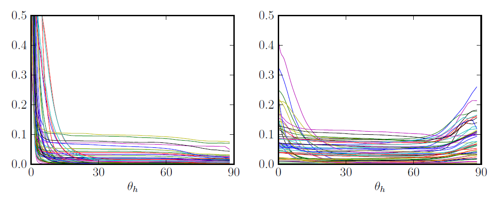
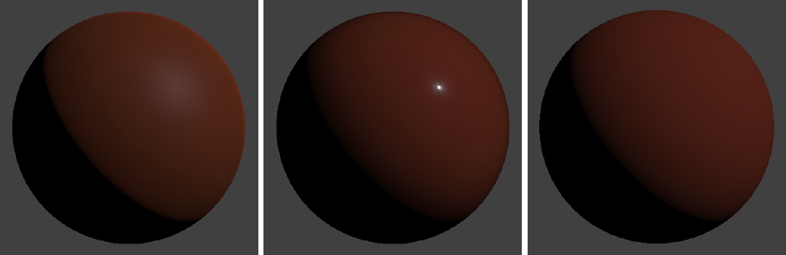
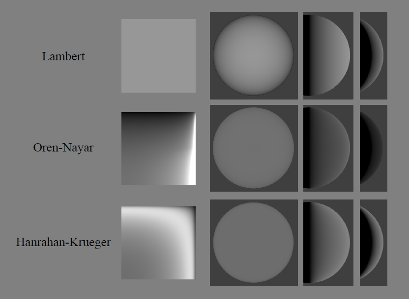
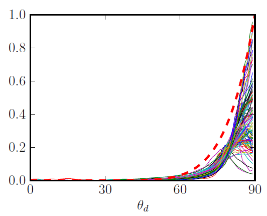
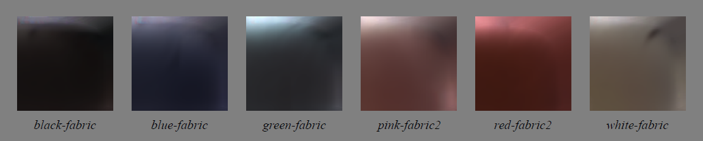
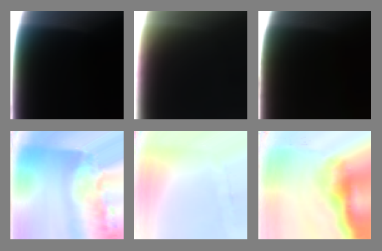
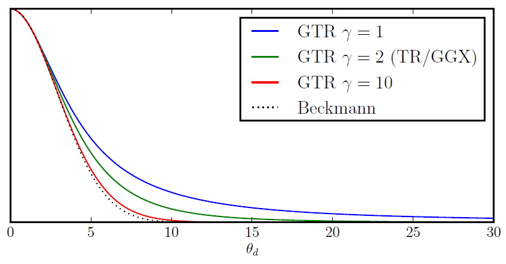

# Физически корректный шейдинг Диснея

Брент Берли, Студия анимации Уолта Диснея

_Перевод на русский — Борисов Дмитрий_

## 1 Введение

После нашего успеха с физически обоснованным затенением волос в Рапунцель [27], мы начали рассматривать физически обоснованные модели затенения для более широкого диапазона материалов. С физически обоснованной моделью волос мы смогли достичь большой степени визуального богатства, сохраняя при этом художественный контроль. Однако оказалось сложным интегрировать освещение волос с остальной частью сцены, которая все еще использовала традиционные «специальные» модели затенения и точечные источники света. Для последующих фильмов мы хотели увеличить богатство всех наших материалов, одновременно делая световые реакции более согласованными между материалами и средами, а также хотели повысить производительность художника за счет использования упрощенных элементов управления.

Когда мы начали наше исследование, было неочевидно, какие модели использовать или даже насколько физически обоснованными мы хотим быть. Стоит ли быть идеально энергосберегающими? Должны ли мы отдавать предпочтение физическим параметрам, таким как показатель преломления?

Для диффузного, Ламберт, казалось, был общепринятой нормой, в то время как зеркальный, казалось, получил больше всего внимания в литературе. Некоторые модели, такие как Ashikhmin-Shirley (2000) [3], стремились быть интуитивными и практичными, при этом физически правдоподобными, в то время как другие, такие как He et al. (1991) [12], предоставили более полную физическую модель. Еще одни были нацелены на улучшение подгонки данных [15, 14, 22, 17, 4], но немногие из них подходят для прямой манипуляции. Мы могли бы реализовать несколько моделей и позволить художникам выбирать и комбинировать их, но тогда мы бы вернулись к взрыву параметров, от которого мы пытались уйти.

Одним из исследований большого разнообразия измеренных материалов было исследование Ngan et al. (2005) [21], в котором сравнивались пять популярных моделей. Некоторые модели в целом справились лучше других, но интересно, что была сильная корреляция между характеристиками моделей — некоторые материалы были хорошо представлены всеми моделями, а для других ни одна модель не оказалась подходящей. Добавление дополнительной зеркальной доли помогло лишь в нескольких случаях. Возникает вопрос: что не представлено в сложных материалах?

Чтобы ответить на этот вопрос и оценить модели BRDF более интуитивно, мы разработали новый просмотрщик BRDF, который мог отображать и сравнивать как измеренные, так и аналитические BRDF. Мы открыли новые, интуитивно понятные способы просмотра измеренных данных BRDF и обнаружили интересные особенности в измеренных материалах, которые не были хорошо представлены известными моделями.

В этих заметках к курсу мы поделимся наблюдениями, полученными при изучении измеренных материалов, а также выводами, которые мы почерпнули о том, какие модели соответствуют измеренным данным, а где они не дотягивают. Затем мы представим нашу новую модель, которая теперь используется во всех текущих постановках. Мы также опишем наш опыт внедрения этой новой модели в постановку и обсудим, как нам удалось добавить нужный уровень художественного контроля, сохранив при этом простоту и надежность.

## 2 Модель микрограней

Мы определим нашу BRDF и сравним с измеренными материалами в терминах модели микрограней [30, 7, 33]. Модель микрограней постулирует, что если поверхностное отражение может происходить между заданным вектором света $\boldsymbol l$ и вектором взгляда $\boldsymbol v$, ​​то должна существовать некоторая часть поверхности, или микрогрань, с нормалью, выровненной посередине между векторами $\boldsymbol l$ и $\boldsymbol v$. Этот «половинный вектор», иногда называемый нормалью микроповерхности. Таким образом, определяется как $\boldsymbol h = \frac{l+v}{|l+v|}$. Общая форма модели микрограней для изотропных материалов:

$$f (\boldsymbol l , \boldsymbol v) = \text{diffuse} + \frac{ D(θ_h)F(θ_d)G(θ_l, θ_v) }{ 4cosθ_l cosθ_v}$$

Диффузный член — это функция неизвестной формы. Диффузный Ламберт часто предполагается и представляется постоянным значением. Для зеркального члена $D$ — это функция распределения микрограней, которая отвечает за форму зеркального пика, $F$ — коэффициент отражения Френеля, а $G$ — геометрический коэффициент затухания или затенения.

$θ_l$ и $θ_v$ — углы падения векторов $\boldsymbol l$ и $\boldsymbol v$ относительно нормали, $θ_h$ — угол между нормалью и половинным вектором, а $θ_d$ — угол «разницы» между $\boldsymbol l$ и половинным вектором (или, симметрично, $\boldsymbol v$ и $\boldsymbol h$).

Большинство физически правдоподобных моделей, не описанных специально в форме микрограней, все равно могут быть интерпретированы как модели микрограней, поскольку у них есть функция распределения, фактор Френеля и некоторый дополнительный фактор, который можно считать геометрическим фактором затенения. Единственное реальное различие между моделями микрограней и другими моделями заключается в том, включают ли они явный фактор $\frac{1}{4 cosθ_l cosθ_v}$, который исходит из вывода микрограней. Для моделей, которые не включают этот фактор, подразумеваемый фактор затенения может быть определен путем умножения модели на ${4 cosθ_l cosθ_v}$ после вынесения факторов $D$ и $F$.

## 3 Визуализация измеренных BRDF-ов

### 3.1 «MERL 100»

Рисунок 1: Срезы изображений MERL 100 BRDFs.  

Набор из 100 изотропных образцов материалов BRDF был получен Matusik и др. в 2003 году [^18], охватывающий широкий спектр материалов, включая краски, древесину, металлы, ткани, камень, резину, пластик и другие синтетические материалы. Этот набор данных находится в свободном доступе в Mitsubishi Electric Research Laboratories по адресу www.merl.com/brdf и обычно используется для оценки новых моделей BRDF. Срезы этих BRDF показаны на рисунке 1.

Каждый BRDF в MERL 100 плотно отобран в куб 90 на 90 на 180 вдоль осей $θ_h$, $θ_d$ и $\phi_d$ соответственно. Они соответствуют приращениям в 1 градус, за исключением оси $θ_h$, которая была деформирована для концентрации образцов данных вблизи зеркального пика. Измерения были отфильтрованы и экстраполированы по мере необходимости, чтобы в данных не было пробелов. Это хорошо тем, что данные легко использовать, но неясно, насколько точны данные, особенно вблизи горизонта. Из-за этого некоторые исследователи отбрасывают данные вблизи горизонта при выполнении подгонки, но эти данные все равно полезно учитывать, поскольку они могут оказать сильное влияние на внешний вид материала.

### 3.2 BRDF проводник

Рисунок 2: Диснеевский BRDF проводник

Для изучения материалов, измеренных MERL, и сравнения с аналитическими моделями мы разработали новый инструмент, BRDF Explorer, показанный на рисунке 2. Он доступен как открытый исходный код на github.com/wdas/brdf и имеет следующие функции:

-   Возможность загрузки нескольких аналитических BRDF, написанных на GLSL
-   Возможность загрузки измеренных BRDF, включая образцы анизотропных материалов, полученные Ngan и др. [21]
-   Множественные графики данных (3D-полусферический вид, полярный график и различные декартовы графики)
-   Вычисленный график альбедо (т. е. направленно-полусферическое отражение)
-   Просмотр среза изображения с элементами управления экспозицией
-   Просмотр освещенного объекта с выборкой важности IBL
-   Просмотр освещенной сферы
-   Динамические элементы управления пользовательского интерфейса для параметрических моделей

Этот инструмент оказался бесценным при сравнении измеренных материалов с существующими аналитическими моделями, а также при разработке нашей новой модели. Удивительно, но он также оказался очень полезным для художников как интерактивный редактор BRDF, предоставляя им более глубокое понимание параметров модели и пространства BRDF.

### 3.3 Срез изображения

Рисунок 3: Срезы изображений BRDF для *красного-пластика* и *зеркального-красного-пластика*, показанные вместе со схематическим видом «пространства среза».

Один из самых простых и интуитивно понятных способов визуализации измеренного материала — просто просмотреть его как стопку изображений, и мы обнаружили, что это очень мощный инструмент для получения интуитивного представления о данных. Как оказалось, все интересные особенности в материалах MERL 100 видны в срезе $\phi_d = 90$. Схематический вид этого пространства вместе с двумя образцами материалов показан на рисунке 3. Другие срезы — это просто деформированные версии этого среза, как показано на рисунке 4. Это наблюдение было использовано в недавних работах, таких как Romeiro (2008) [26] и Pacanowsi (2012) [24], в качестве основы для упрощенных изотропных моделей BRDF формы $f (θ_h, θ_d)$.

Рисунок 4: Срезы *зеркально-красного-пластика* для различных значений $\phi_d$, азимутального вращения $l$ вокруг половины вектора. Черная область в правом верхнем углу представляет собой часть области BRDF, где вектор $l$ или $v$ находится ниже горизонта.

В срезе изображения левый край представляет собой зеркальный пик, а верхний край представляет собой пик Френеля. Обратите внимание, что вдоль нижнего края векторы света и вида совпадают, поэтому нижний край представляет собой ретрорефлексию. Нижний правый угол, в частности, представляет собой скользящее ретрорефлекторное отражение. Диффузное отражение проявляется во всем пространстве BRDF, но середина изображения, как правило, изолирована от диффузного отклика.

Схематическое изображение на рисунке 3 также включает изолинию $θ_l$ или $θ_v$. Многие диффузные эффекты имеют тенденцию следовать этому контуру. Обратите внимание, что эти изолинии выпрямляются, когда $\phi_d$ приближается к нулю, и сравнение срезов $\phi_d$ может дать представление о том, какие части отклика материала обусловлены диффузным отражением, а какие — зеркальным. Еще одним намеком, конечно, является цвет; диффузное отражение обусловлено подповерхностным рассеянием и поглощением, что приводит к видимому оттенку, тогда как зеркальное отражение исходит от поверхности и не тонируется (если только поверхность не металлическая, в этом случае диффузный компонент отсутствует).

## 4 Наблюдения за материалами MERL

### 4.1 Наблюдения за диффузным отражением

Рисунок 5: Материалы, демонстрирующие диффузное изменение цвета. Верхний ряд: отклики точечного света на визуализированных сферах; нижний ряд: срезы изображений BRDF.

Диффузное отражение представляет собой свет, который преломляется на поверхности, рассеивается, частично поглощается и переизлучается. Учитывая, что часть света поглощается, отклик диффузного отражения будет окрашен цветом поверхности, и любая часть неметаллического материала, которая окрашена, может считаться диффузным.

Рисунок 6: Ретрорефлетивные отражения 100 MERL материалов. Слева: 50 гладких материалов $(f(0) > 0,5)$; справа: 50 шероховатых материалов $(f(0) < 0,5)$. Пик около $θ_h = 0$ является зеркальным пиком, а пик (или спад) около $θ_h = 90$ представляет собой скользящую ретрорефлексию.

Рисунок 7: Реакция точечного света на _красный-пластик_, _зеркальный-красный-пластик_ и диффузный Ламберт.

Модель диффузного Ламберта предполагает, что преломленный свет достаточно рассеялся, чтобы потерять всю направленность, и, таким образом, диффузное отражение постоянно. Однако на различных срезах изображения на рисунках 1 и 5 можно увидеть, что очень немногие материалы демонстрируют ламбертовский отклик. [Примечание: _шейдер_ Ламберта включает фактор $n \cdot l$, но это часть интеграла освещения, а не BRDF.]

Как показано на рисунке 6, многие материалы показывают падение скользящего ретроотражения, а многие другие показывают пик. Это, по-видимому, диффузное явление из-за кажущегося окрашивания в срезах изображения. В частности, это сильно коррелирует с шероховатостью — гладкие поверхности, т. е. те, у которых более высокий зеркальный пик, как правило, имеют затененный край, а шероховатые поверхности, как правило, имеют пик вместо тени. Эту корреляцию можно увидеть в кривых световозвращения, а также в визуализированных сферах на рисунке 7.

Скользящая тень для гладких поверхностей предсказывается уравнениями Френеля: при углах скольжения больше энергии отражается от поверхности и меньше преломляется в поверхность для диффузного переизлучения. Однако диффузные модели обычно не учитывают влияние шероховатости поверхности на френелевскую рефракцию и либо предполагают гладкую поверхность, либо игнорируют эффект Френеля.

Модель Oren-Nayar (1995) предсказывает увеличение световозвращения для шероховатых диффузных поверхностей, которое сглаживает диффузную форму. Однако этот пик световозвращения не такой сильный, как измеренные данные, и грубые измеренные материалы обычно не демонстрируют сглаживания диффузной формы. Модель Hanrahan-Krueger (1993), полученная из теории подповерхностного рассеяния, также предсказывает сглаживание диффузной формы, но не имеет достаточно сильного пика на краю. В отличие от модели Oren-Nayar, эта модель предполагает идеально гладкую поверхность. Модели Oren-Nayar и Hanrahan-Krueger сравниваются на рисунке 8.

Рисунок 8: Срезы BRDF и отклики на точечный свет диффузных моделей Lambert, Oren-Nayar и Hanrahan-Krueger.

Помимо пика ретрорефлективности, в срезах изображения на рисунке 5 можно увидеть дополнительную диффузную вариацию. Можно увидеть как интенсивность, так и цветовую вариацию, которая следует за изолиниями $θ_l / θ_v$. В некоторых случаях это может быть связано со слоистым подповерхностным рассеянием. Однако даже модели слоистого подповерхностного рассеяния обычно считают поверхность гладкой и не создают сильного пика ретрорефлективности.

### 4.2 Наблюдения D зеркальности

Функцию распределения микрограней, $D(θ_h)$, можно наблюдать из ответов ретрорефлективного отражения измеренных материалов, как показано на рисунке 6. Материалы были разделены на две группы в зависимости от высоты пика, который можно рассматривать как показатель шероховатости поверхности. Самый высокий пик, от _стали_, был более 400. После того, как пик выровняется, оставшаяся часть кривой, вероятно, обусловлена ​​диффузным отражением.

Подавляющее большинство материалов MERL имеют зеркальные доли с хвостами, которые намного длиннее, чем традиционные зеркальные модели. Примером является образец _хрома_, показанный на рисунке 9. Зеркальный отклик этого материала типичен для гладких, хорошо отполированных поверхностей, с зеркальным пиком шириной всего в пару градусов и зеркальным хвостом, который во много раз шире. Любопытно, что традиционные распределения Beckmann, Blinn-Phong и Gaussian почти идентичны при этой ширине и не могут хорошо представлять ни пик, ни хвост.

Рисунок 9: Несколько зеркальных распределений, соответствующих хрому MERL. Слева: логарифмические графики зеркального пика в зависимости от $θ_h$ (градусы); черный = хром, красный = GGX ($α$ = 0,006), зеленый = Beckmann ($m$ = 0,013), синий = Blinn-Phong ($n$ = 12000). Справа: (обрезанные) точечные световые отклики от хрома, GGX и Beckmann.

Необходимость в более широком хвосте была мотивацией для распределения GGX, представленного Walter и др. (2007) [33]; GGX имеет гораздо более длинный хвост, чем другие распределения, но все еще не может уловить светящийся блик образца хрома. Важность моделирования хвостового отклика для подгонки измеренных материалов также была основой двух недавних моделей, Low и др. (2012) [17] и Bagher и др. (2012) [4]. Обе эти модели добавляют дополнительный параметр для управления хвостом отдельно от пика. Другим вариантом моделирования хвоста является использование второго более широкого зеркального пика, добавленного к первому, как предложил Ngan [21].

### 4.3 Наблюдения F зеркальности

Рисунок 10: Нормализованные отклики Френеля 100 MERL материалов, построенные в зависимости от $θ_d$. Отклики были усреднены по $θ_h$ от 1 до 4 градусов, отклик падения был вычтен, а кривые затем были нормализованы по $θ_d$ от 45 до 80 градусов для сравнения формы. Пунктирная линия представляет теоретический отклик Френеля.

Коэффициент отражения Френеля, $F (θ_d)$, представляет собой увеличение зеркального отражения по мере того, как векторы света и зрения расходятся, и предсказывает, что все гладкие поверхности будут приближаться к 100% зеркальному отражению при скользящем падении. Для шероховатых поверхностей 100% зеркальное отражение не будет достигнуто, но отражательная способность все равно будет становиться все более зеркальной.

Кривые отклика Френеля для материалов MERL показаны на рисунке 10. Кривые были смещены и масштабированы для сравнения общей формы их отклика. Каждый материал показывает некоторое увеличение отражательной способности вблизи $θ_d = 90$. Это также можно увидеть вдоль верхних краев срезов изображения на рисунке 1.

Примечательно, что крутизна многих кривых вблизи углов скольжения больше, чем предсказывает эффект Френеля. Это наблюдение фактически послужило мотивацией модели микрограней Torrance-Sparrow (1967) [30] для объяснения «внезеркального пика», наблюдаемого при более высоких углах падения. Обратите внимание, что фактор $\frac1{4cosθ_l cos θ_v}$ в модели микрограней стремится к бесконечности при углах скольжения. Причина, по которой это не является проблемой (как в модели, так и в реальном мире), заключается в том, что отражательная способность скольжения уменьшается из-за эффектов затенения микроповерхности. Фактор $G$ представляет затенение вектора света и, симметрично, маскирование вектора вида, и контролирует отражательную способность скольжения. Но даже несмотря на то, что фактор $G$ представляет собой затенение, сочетание $G$ с $\frac1{4cosθ_l cos θ_v}$ эффективно усиливает эффект Френеля.

### 4.4 Наблюдения G зеркальности (и альбедо)

Рисунок 11: Графики альбедо материалов MERL 100. Слева: 50 гладких материалов; справа: 50 шероховатых материалов.

Трудно выделить $G$ в измеренных данных, поскольку это требует точной оценки факторов $D$ и $F$, а также изоляции зеркального от диффузного. Однако влияние $G$ можно увидеть косвенно в его влиянии на направленное альбедо.

Альбедо — это отношение полной отраженной энергии к полной падающей энергии. В общих чертах оно представляет цвет поверхности и должно быть меньше 1 для всех длин волн. Альбедо также можно рассматривать для света, идущего с одного направления, например, от солнца, в этом случае альбедо становится направленной функцией, зависящей от угла падения, и должно быть меньше 1 для всех углов и длин волн.

Направленное альбедо большинства материалов относительно плоское для первых 70 градусов, как показано на рисунке 11, а альбедо при скользящих углах сильно коррелирует с шероховатостью поверхности. Гладкие материалы показывают небольшое увеличение около 75 градусов, за которым следует падение к 90. Шероховатые поверхности увеличиваются, часто значительно, вплоть до скользящего падения. Примечательно, что значения альбедо в целом довольно низкие, и лишь немногие материалы имеют альбедо выше 0,3.

Скользящее ретроотражение, демонстрируемое многими грубыми материалами, также вносит значительный вклад в этот прирост, о чем свидетельствует хроматический оттенок в альбедо.

Отклик альбедо, соответствующий выбору смоделированных факторов $G$, показан на рисунке 12 как для очень гладкой, так и для очень шероховатой поверхности. Примечательно, что полное исключение $G$ и $\frac1{cosθ_l cos θ_v}$, называемое моделью «Без $G$», приводит к слишком темному отклику при углах скольжения. Важным моментом здесь является то, что выбор функции $G$ оказывает сильное влияние на альбедо, которое, в свою очередь, оказывает сильное влияние на внешний вид поверхности.

Рисунок 12: Графики альбедо, сравнивающие несколько зеркальных моделей $G$. Все графики используют одни и те же факторы $D$ (GGX/TR) и $F$. Слева: гладкая поверхность ($α = 0.02$); справа: шероховатая поверхность ($α = 0.5$). Модель «без $G$» исключает факторы $G$ и $\frac1{cosθ_l cos θ_v}$.

Несколько зеркальных моделей были разработаны специально с целью создания более правдоподобной кривой отклика альбедо [30, 29, 19, 20, 8, 9, 33, 10, 14]. Для некоторых из них намерение состоит в том, чтобы сделать альбедо идеально плоским для поддержания энергетического баланса. Основываясь на графиках альбедо данных Мерла на рисунке 11, это не необоснованная цель, хотя большинство материалов действительно показывают некоторый прирост скольжения. Даже тогда часть прироста скольжения, вероятно, обусловлена ​​незеркальными эффектами.

С несколькими упрощающими предположениями можно вывести функцию затенения из распределения микрограней, $D$, следуя методу Smith [29]. Этот подход использовали Walter (2007) и Schlick (1994). Как видно на рисунке 12, отражательная способность скольжения модели Смита из Уолтера значительно увеличивается для гладких поверхностей, эффект, который не наблюдается в измеренных данных. Для более грубых значений отклик кажется более правдоподобным. Обратите внимание, что $G$ Смита имеет аналитическую форму только для небольшого числа функций, и часто используется табличное интегрирование или некоторое другое приближение.

Недавняя эмпирическая модель Kurt и др. (2010) [14] использует другой подход и предлагает модель подгонки данных со свободным параметром. Рисунок 12 показывает модель Курта с использованием $α = 0.25$; другие значения $α$ могут давать широкий диапазон откликов альбедо. Однако вызывает беспокойство то, что альбедо Курта расходится вблизи углов скольжения, что значительно для грубых распределений. Другой вариант — просто использовать один из выводов Смита $G$ из Вальтера или даже более простой вывод Шлика и выделить шероховатость $G$ как свободный параметр.

### 4.5 Ткань

Многие образцы тканей в базе данных MERL демонстрируют зеркальный оттенок при углах скольжения, а также имеют пик Френеля, который сильнее, чем у материалов с сопоставимой шероховатостью. Примеры этого показаны на рисунке 13.

Рисунок 13: Срезы изображений BRDF различных образцов тканей.

Окрашенный отклик скольжения можно объяснить тем, что ткань часто имеет пропускающие волокна, которые улавливают цвет материала вблизи силуэтов объектов. Это также может объяснить дополнительный выигрыш для ткани при углах скольжения сверх того, что предсказывает модель микрограней.

В то время как многие ткани могут иметь очень сложную реакцию материала, ткани MERL, по-видимому, относительно легко моделировать.

### 4.6 Радужность 

Рисунок 14: Срезы изображений BRDF _рисунок-цветового-изменения-1, 2_ и _3_. Верхний ряд: исходные данные; нижний ряд: соответствующие изображения цветности, созданные путем масштабирования на $1 / max(r, g, b)$ на пиксель.

Три краски, меняющие цвет, показанные на рисунке 14, демонстрируют когерентные пятна цвета в пространстве ($θ_h, θ_d$) с минимальной зависимостью от $\phi_d$. Это, по-видимому, полностью зеркальное явление, учитывая, что вдали от зеркального пика очень мало отражения. Это можно смоделировать просто путем модуляции зеркального оттенка как функции $θ_h$ и $θ_d$, возможно, с помощью небольшой текстурной карты.

### 4.7 Аномалии данных

Некоторые аномалии в данных MERL показаны на рисунке 15.

- Некоторые из очень блестящих материалов, особенно металлы, демонстрируют асимметричные блики, указывающие на блики линз или, возможно, анизотропные царапины на поверхности.

- Данные за пределами примерно 75 градусов, по-видимому, экстраполируются.

- Реакция тканей на скольжение часто имеет странные разрывы, возможно, из-за того, что ткани растягиваются по сферам во время захвата и сморщиваются вблизи краев.

- Некоторые виды древесины демонстрируют зеркальные модели модуляции вдоль $θ_d$, которые могут быть вызваны древесными волокнами.

- Эффекты подповерхностного рассеяния запечены.

Рисунок 15: Аномалии в данных MERL. Слева направо: реакция _стали_ на точечный свет демонстрирует асимметричный блик, график _рисунка-цветового-измененеия-1_, показывает экстраполированные данные о скольжении (видимые во всех материалах), _белая-ткань_ демонстрирует затенение вблизи скольжения, указывающее на морщину, а _древесина-фруктов-241_ (показанная как сохраненная, в искривленном пространстве $θ_h$) демонстрирует зеркальные вариации, указывающие на древесные волокна.

Это не критика данных или процесса захвата, а скорее просто предостережение не переобучать или не переинтерпретировать данные. Это также потенциально часть ответа на вопрос, заданный ранее, о том, почему некоторые материалы трудно подгонять.

## 5 «Принципиальный» BRDF Диснея

### 5.1 Принципы

При разработке нашей новой физически обоснованной модели отражения художники предупредили нас, что нам нужна модель затенения, которая будет поддаваться художественной редактуре и не обязательно будет физически корректной. Из-за этого наша философия заключалась в разработке «принципиальной» модели, а не строго физической.

Вот принципы, которым мы решили следовать при реализации нашей модели:

 1. Следует использовать интуитивные, а не физические параметры.
 
 2. Должно быть как можно меньше параметров.
 
 3. Параметры должны быть от нуля до единицы в пределах их правдоподобного диапазона.
 
 4. Параметры должны иметь возможность выходить за пределы их правдоподобного диапазона, где это имеет смысл.
 
 5. Все комбинации параметров должны быть максимально надежными и правдоподобными.

Мы тщательно обсудили добавление каждого параметра. В итоге мы остановились на одном параметре цвета и десяти скалярных параметрах, описанных в следующем разделе.

### 5.2 Параметры

- _baseColor:_ цвет поверхности, обычно предоставляемый текстурными картами.
- _subsurface:_ управляет диффузной формой с использованием приближения подповерхности.
- _metallic:_ металличность (0 = диэлектрик, 1 = металлик). Это линейное смешение двух разных моделей. Металлическая модель не имеет диффузного компонента, а также имеет тонированный падающий зеркальный свет, равный базовому цвету.
- _specular:_ количество падающего зеркального света. Это вместо явного показателя преломления.
- _specularTint:_ уступка для художественного управления, которая тонирует падающий зеркальный свет в сторону базового цвета. Скользящий зеркальный свет по-прежнему ахроматичен.
- _roughness:_ шероховатость поверхности, управляет как диффузным, так и зеркальным откликом.
- _anisotropic:_ степень анизотропии. Управляет соотношением сторон зеркального блика. (0 = изотропный, 1 = максимально анизотропный.)
- _sheen:_ дополнительный компонент скольжения, в первую очередь предназначенный для ткани.
- _sheenTint:_ количество тонированного блеска в сторону базового цвета.
- _clearcoat:_ второй, специальный зеркальный лепесток.
- _clearcoatGloss:_ управляет глянцевитостью прозрачного покрытия (0 = «сатиновый» вид, 1 = «глянцевый» вид).

Визуализированные примеры влияния каждого из наших параметров показаны на рисунке 16.

Рисунок 16: Примеры влияния наших параметров BRDF. Каждый параметр изменяется по строке от нуля до единицы, при этом другие параметры остаются постоянными.

### 5.3 Подробности диффузной модели

Некоторые модели включают диффузный фактор Френеля, такой как:

$$(1 − F (θ_l))(1 − F (θ_d))$$

где $F (θ)$ — фактор Френеля для отражения.

[Примечание: из закона Френеля для преломления и для сохранения взаимности Гельмгольца необходимо учитывать преломление дважды, один раз на пути внутрь и один раз на пути наружу поверхности.]

Как видно из наблюдений измеренных данных и на основе нашего прошлого студийного опыта, диффузная модель Ламберта часто слишком темная по краям, а добавление фактора Френеля для того, чтобы сделать ее более физически правдоподобной, только делает ее темнее.

На основе наших наблюдений мы разработали новую эмпирическую модель для диффузного ретроотражения, которая переходит между диффузной тенью Френеля для гладких поверхностей и добавленным светом для шероховатых поверхностей. Возможным объяснением этого эффекта может быть то, что для шероховатых поверхностей свет входит и выходит из сторон микроповерхностных элементов, вызывая увеличение преломления под скользящими углами. В любом случае, нашим художникам это нравится, и это похоже на элементы, которые мы использовали в нашей специальной модели, за исключением того, что теперь это более правдоподобно и имеет физическую основу.

В нашей модели мы игнорируем показатель преломления для диффузного фактора Френеля и предполагаем отсутствие падающих диффузных потерь. Это позволяет нам напрямую указывать падающий диффузный цвет. Мы используем приближение Шлика-Френеля и изменяем реакцию скользящего ретрорефлекса, чтобы перейти к определенному значению, определяемому шероховатостью, а не к нулю.

Наша базовая диффузная модель:

$$f_d = \frac{baseColor}{\pi} \big(1 + (F_{D90} − 1)(1 − cos θ_l)^5\big) \big(1 + (F_{D90} − 1)(1 − cos θ_v)^5\big)$$

где $F_{D90} = 0.5 + 2\textit{roughness}\,cos2 θd$

Это создает диффузную тень Френеля, которая уменьшает падающее диффузное отражение на 0.5 при углах скольжения для гладких поверхностей и увеличивает отклик до 2.5 для шероховатых поверхностей. Это, по-видимому, обеспечивает разумное соответствие данным MERL и также было признано художественным. Срезы изображения BRDF нашей модели для различных значений шероховатости показаны на рисунке 17.

Рисунок 17: Срезы изображения BRDF нашей модели для различных значений шероховатости.

Наш параметр подповерхности смешивает базовую диффузную форму и форму, вдохновленную подповерхностным BRDF Ханрахана-Крюгера [11]. Это полезно для придания подповерхностного эффекта удаленным объектам и объектам, где средняя длина пути рассеяния мала; однако это не заменяет выполнение полного подповерхностного переноса, поскольку он не пропускает свет в тени или сквозь поверхность.

### 5.4 Детали Specular D

Из популярных моделей GGX имеет самый длинный хвост. Эта модель фактически эквивалентна распределению Троубриджа-Рейтца (1975) [31], которое Блинн (1977) [6] предпочел за его способность соответствовать экспериментальным данным. Однако это распределение все еще не имеет достаточно длинного хвоста для многих материалов.

Троубридж и Рейтц сравнили свою функцию распределения вместе с несколькими другими распределениями с измерениями матового стекла. Одно из других распределений, от Берри (1923), имеет очень похожую форму, но с показателем степени 1 вместо 2, что приводит к еще более длинному хвосту. Это предполагает более общее распределение с переменной экспонентой, введенное здесь и названное Обобщенным-Троубриджем-Рейтцем, или GTR:

$$ 
\begin{array} {l c l}
D_{Berry}&=& c/(α^2 cos^2 θ_h + sin^2 θ_h) \\
D_{TR}&=& c/(α^2 cos^2 θ_h + sin^2 θ_h)^2 \\
D_{GTR}&=& c/(α^2 cos^2 θ_h + sin^2 θ_h)^γ
\end{array} 
$$
  
В каждом из этих распределений $c$ — это масштабная константа, а $α$ — параметр шероховатости со значениями от 0 до 1; $α = 0$ дает идеально гладкое распределение (т. е. дельта-функцию при $θ_h = 0$), а $α = 1$ дает идеально грубое или равномерное распределение.

Рисунок 18: Кривые распределения GTR в зависимости от $θ_h$ для различных значений $γ$:

Предварительные результаты подгонки предполагают типичные значения $γ$ между 1 и 2. Интересно, что GTR с $γ = \frac{3}{2}$ эквивалентна фазовой функции Хеньи-Гринштейна для $θ = 2θ_h$; удвоение $θ_h$ можно рассматривать как расширение распределения от полусферы до сферы.

Правдоподобное распределение микрограней должно быть нормализовано, и для эффективного рендеринга оно также должно поддерживать выборку важности. Оба требуют, чтобы распределение было интегрируемым по полусфере. К счастью, эта функция имеет простой замкнутый интеграл. Функции нормализации и выборки важности, а также эффективная анизотропная форма выведены в Приложении B.

Для нашего BRDF мы решили иметь два фиксированных зеркальных лепестка, оба с использованием модели GTR. Первичный лепесток использует $γ = 2$, а вторичный лепесток использует $γ = 1$. Первичный лепесток представляет собой базовый материал и может быть анизотропным и/или металлическим. Вторичный лепесток представляет собой слой прозрачного покрытия поверх базового материала и, таким образом, всегда изотропен и неметалличен.

Для шероховатости мы обнаружили, что сопоставление $α = roughness^2$ приводит к более линейному изменению шероховатости с точки зрения восприятия. Без этого сопоставления для сопоставления блестящих материалов требовались очень маленькие и неинтуитивные значения. Кроме того, интерполяция между шероховатым и гладким материалом всегда давала бы грубый результат. Полученная интерполяция показана на рисунках 16 и 19.

Вместо явного показателя преломления, или IOR, наш параметр $specular$ определяет величину падающего зеркального отражения. Нормализованный диапазон этого параметра линейно сопоставлен в диапазон падающего зеркального отражения $[0.0, 0.08]$. Это соответствует значениям IOR в диапазоне $[1.0, 1.8]$, охватывающем наиболее распространенные материалы. Примечательно, что середина диапазона параметров соответствует IOR 1.5, очень типичному значению, и также является нашим значением по умолчанию. Параметр $specular$ может быть выведен за пределы единицы для достижения более высоких значений IOR, но следует делать это с осторожностью. Это сопоставление параметра очень помогло художникам создавать правдоподобные материалы, учитывая, что реальные значения отражательной способности падающего света настолько неинтуитивно низкие.

Для нашего слоя прозрачного покрытия мы используем фиксированное значение IOR 1.5, представляющее полиуретан, и вместо этого позволяем художникам масштабировать общую прочность слоя с помощью параметра прозрачного покрытия $clearcoat$. Нормализованный диапазон параметров соответствует общей шкале $[0.0, 0.25]$. Этот слой, хотя и имеет большое визуальное воздействие, представляет относительно небольшое количество энергии, поэтому мы не вычитаем никакой энергии из базового слоя. При установке на ноль слой прозрачного покрытия фактически отключается и не требует затрат.

### 5.5 Детали Specular F

Для наших целей приближение Шлика-Френеля [28] достаточно и существенно проще, чем полные уравнения Френеля; ошибка, вносимая приближением, значительно меньше ошибки, вызванной другими факторами.

$$F_{\text{Schlick}} = F_0 + (1 − F_0)(1 − cos θ_d)^5$$

Константа $F_0$ представляет зеркальное отражение при нормальном падении и является ахроматической для диэлектриков и хроматической (т. е. окрашенной) для металлов. Фактическое значение зависит от показателя преломления. Обратите внимание, что зеркальное отражение происходит от микрограней, и, таким образом, $F$ зависит от $θ_d$, угла между вектором света и микронормалью (т. е. половинным вектором), а не угла падения с нормалью к поверхности.

Функция Френеля может рассматриваться как интерполирующая (нелинейно) между падающим зеркальным отражением и единицей при скользящих углах. Обратите внимание, что отклик становится ахроматическим при скользящем падении, поскольку весь свет отражается.

### 5.6 Детали Specular G

Для нашей модели мы использовали гибридный подход. Учитывая, что коэффициент затенения Смита доступен для первичного зеркального отражения, мы используем G, выведенный для GGX Уолтером, но переопределяем шероховатость, чтобы уменьшить экстремальное усиление для блестящих поверхностей. В частности, мы линейно масштабируем исходную шероховатость из диапазона [0, 1] в уменьшенный диапазон, [0.5, 1], для целей вычисления G. Примечание: мы делаем это до возведения в квадрат шероховатости, как описано ранее, поэтому окончательное значение $α_g$ равно $(0.5 + roughness/2)^2$.

Это перераспределение было основано на сравнении с измеренными данными, а также на отзывах художников о том, что зеркальное отражение было просто «слишком горячим» для малых значений шероховатости. Это дает нам функцию G, которая меняется в зависимости от шероховатости, по крайней мере частично физически обоснована и кажется правдоподобной. Для нашего зеркального отражения с прозрачным покрытием у нас нет вывода Смита G, и мы просто используем GGX G с фиксированной шероховатостью 0.25, что было признано правдоподобным и художественно приятным.

### 5.7 Слои против смешивания параметров

Как только мы определились с нашей новой моделью, нам нужно было решить, как интегрировать ее в наши шейдеры. Первый вопрос заключался в том, какие параметры должны быть пространственно изменяемыми, и ответ был: все они; если художник просто хочет поместить два разных материала на поверхность и маску между ними, то ему нужно будет интерполировать между всеми параметрами. Кроме того, маска будет отфильтрована, и на размытом краю маски реакция материала должна оставаться правдоподобной.

Одним из преимуществ наших принципов проектирования, заключающихся в том, что все параметры нормализованы и, по крайней мере, воспринимаемо линейны, является то, что материалы, как правило, интерполируются очень интуитивно понятным образом. Пример этого показан на рисунке 19.

Как только мы поняли, что можем надежно интерполировать, мы задались вопросом, можем ли мы достичь всех пространственных изменений с помощью масок. Идея заключается в том, что художник выберет список предустановок материалов, а затем просто смешает их с помощью текстурных масок. Это оказалось феноменально успешным, значительно упростив рабочий процесс, улучшив согласованность материалов и сделав оценку шейдера чрезвычайно эффективной. Наш пользовательский интерфейс шейдера показан на рисунке 20.

Рисунок 19: Интерполяция между двумя очень разными материалами, блестящим металлическим золотом и синей резиной, с использованием нашей модели.

Рисунок 20: Скриншот нашего редактора шейдеров, показывающий слои материалов. Переменные в выражениях маски относятся к пространственно изменяющимся модулям шейдера, обычно к текстурным картам.

## 6 Опыт производства Wreck-It Ralph

Мы развернули наш шейдер «Principled Layers» в Wreck-It Ralph и использовали его практически для каждого материала, за исключением волос (которые по-прежнему используют модель, разработанную для Tangled). Разнообразие материалов можно увидеть на рисунке 21. Обратите внимание, что для зеркальных компонентов часто использовалась отдельная нормаль, чтобы создать эффект блеска, который здесь виден на земле, ковре и других гранулированных материалах.

Рисунок 21: Кадр производства Wreck-It Ralph.

В сочетании с нашей новой моделью материала мы также представили новые источники света на основе выборки области и изображения, которые имеют решающее значение для того, чтобы правдоподобные материалы выглядели хорошо; если вы создадите правдоподобный блестящий материал и осветите его точечным источником света, ваш блик будет маленькой точкой, но разрешение осветителям регулировать свойства материала, например, увеличивать шероховатость для имитации реакции на свет области, разрушает всю физически обоснованную парадигму затенения. Хорошей новостью является то, что осветителям действительно нравятся зональные светильники и IBL за их управляемость, а также они ценят наличие последовательного материального отклика. Также стоит отметить, что новая модель материала была как мотиватором, так и средством реализации перехода на сэмплированные светильники, поскольку с нашей предыдущей моделью затенения ad-hoc было бы слишком дорого для каждого модуля отражения выполнять собственную интеграцию сэмплированного света.

Основываясь на успехе в Wreck-It Ralph, наши следующие шоу уже используют или планируют использовать нашу новую модель затенения без изменений.

### 6.1 Разработка внешнего вида

Одним из преимуществ наличия единого BRDF для всего является то, что он упрощает разработку нашего интерактивного редактора материалов. Наш «Material Designer» визуализирует буфер геометрии (или «g-буфер»), содержащий нормали, идентификаторы объектов и маски слоев материалов. Используя эти каналы, он быстро выполняет повторное освещение на основе изображения, позволяя интерактивно редактировать все параметры BRDF. Художники могут вращать IBL в реальном времени и видеть полный эффект всех параметров и слоев в полном контексте на производственных моделях.

Еще одним преимуществом унифицированной модели является то, что она предоставляет очень простую библиотеку материалов, состоящую из набора предустановок, сохраненных из Material Designer. Материал можно выбрать из библиотеки и добавить в шейдер в качестве дополнительного слоя, а затем смешать с маской. Таким образом, слои можно быстро выстраивать, как стек слоев Photoshop.

Чтобы полностью оценить материал, важно осветить его со всех сторон. В рамках перехода на нашу новую модель материалов мы начали проверять все элементы с помощью различных IBL, и все поворотные столы включают как вращение элементов, так и освещение.

Конечным результатом нашей новой системы шейдеров стало значительное повышение производительности при разработке внешнего вида, гораздо более короткое время обучения для новых художников и более стабильно высокое качество результатов. Примечательно, что большинство наших художников по разработке внешнего вида смогли уйти с шоу раньше из-за отсутствия необходимости в «переделывании» материалов в освещении. Это было беспрецедентно.

### 6.2 Освещение

Как упоминалось ранее, для работы с новой моделью материалов требовался другой подход к освещению. Это потребовало большой кривой обучения. Также было сложно добавить обратно художественные элементы управления освещением без чрезмерного ущерба для физически обоснованной модели.

Одним из самых больших изменений в освещении стал переход к использованию IBL в качестве локального заполняющего света. Большинство IBL используются со светом, привязанным к определенным элементам в кадре, и многие имеют отсечки по расстоянию. Это было большим улучшением по сравнению с предыдущими картами окружения, которые в значительной степени игнорировали характеристики материалов. Освещение площадок также было хорошо принято как дополнение.

Одной из самых больших проблем для осветителей изначально была работа с реалистичными значениями интенсивности света и спадом. В конечном итоге мы разработали нефизический контроль спада, который работает, делая источник света виртуально более удаленным, автоматически регулируя интенсивность для достижения желаемой экспозиции на заданном расстоянии, однако управление интенсивностью света и спадом остается проблемой для осветителей.

Еще одной проблемой для освещения является тот факт, что зеркальные блики теперь требуют своего рода тональной компрессии. Блики на блестящих материалах могут достигать сотен, и простое обрезание значений выглядит резким, вводит полосы, поскольку каждый цветовой канал обрезается в другом месте, и заставляет ядро ​​всегда переходить к белому. Мы разработали новый глобальный оператор тональной компрессии, который сохраняет цветовые значения для большей части диапазона отображения и спадает с верхнего предела, сохраняя цвет и контрастность. У нас есть настройка по умолчанию, которая работает разумно в большинстве случаев, но корректирует окончательные значения для каждого снимка во время цветокоррекции.

Однако в конечном итоге материалы ведут себя предсказуемо, что является огромным преимуществом для осветителей и дает им отправную точку, которая является физически правдоподобной.

### 6.3 Будущая работа

Одной из самых больших проблем в настоящее время является отсутствие интуитивно управляемой модели подповерхности. Ключевым аспектом этого является интеграция BRDF. В идеале должно быть соответствие между BRDF и моделью подповерхности, чтобы модель BRDF можно было использовать для удаленных объектов, достигая эквивалентных результатов. Кроме того, художник должен иметь возможность увеличить средний свободный путь от нуля, чтобы добавить эффект подповерхности к объекту, не меняя общую экспозицию — должна измениться только форма диффузии (и свет должен просачиваться в тени, если включена диффузия).
Мы хотели бы пойти дальше с моделированием отражательной способности ткани. Мы знаем, что можем добавить специальный шейдер для рендеринга ткани с использованием полученных данных об отражательной способности для особенно сложных моделей ткани, но мы хотели бы исследовать прямое моделирование более широкого спектра материалов ткани. Однако в настоящее время у нас нет шоу, которое бы стимулировало эту потребность.
Мы также получили запросы на добавление иридизации к нашей модели. Это должно быть так же просто, как добавление зеркальной вариации цвета, как обсуждалось ранее.

## Благодарности

Прежде всего, я хотел бы поблагодарить Чака Таппана, который был соавтором нашей новой параметризации материалов и отстаивал наш новый конвейер разработки внешнего вида. Я также хотел бы поблагодарить Кристиана Эйзенахера за его работу над Material Designer, а также Грега Николса и Джареда Джонсона за их работу над Disney BRDF Viewer. И я хотел бы поблагодарить команду Ralph Look and Lighting за их терпение и поддержку. Наконец, я хотел бы поблагодарить Стивена Хилла, Нати Хоффмана и Пита Ширли за их ценный вклад, а Стивена в частности за предложение проецируемой половинной векторной формулировки в уравнении (14) в Приложении B.

## Дополнение A. [Избранная-история-моделей-BRDF](./PBS-Disney/A-Избранная-история-моделей-BRDF.md)

## Дополнение Б. [GTR-MicrofacetDistribution](./PBS-Disney/B-GTR-MicrofacetDistribution.md)

## [Использованная-литература](./PBS-Disney/Использованная-литература.md)

## История изменений

Версия 2 (31 августа 2012 г.): исправлен коэффициент нормализации в уравнении 4.

Версия 3 (12 августа 2014 г.): исправлено форматирование для уравнений 10–13; добавлены дополнения.
