# Efficient materials for large worlds / Эффективные материалы для больших миров


источник: https://dev.epicgames.com/community/learning/tutorials/DdzL/unreal-engine-fortnite-efficient-materials-for-large-worlds


> Improve the precision and performance of your materials with this one simple trick!

Улучшите точность и производительность ваших материалов с помощью этого простого трюка!

> от **wouterdek** Сотрудник сент. 18, 2024 • Последнее обновление: сент. 18, 2024 • Сообщества UEFN UE 5.4

# What and Why? / Что и почему?

> **TLDR: use Translated World Space (AKA Camera-Relative World Space) for optimal speed and precision.**

**TLDR: используйте транслируемое мировое пространство (AKA Camera-Relative World Space) для оптимальной скорости и точности.**

> Unreal Engine 5.0 and newer use
[Large World Coordinates (LWC)](https://dev.epicgames.com/documentation/en-us/unreal-engine/large-world-coordinates-in-unreal-engine-5)
to represent positions in absolute worldspace. Changing the representation has allowed the engine to massively expand its maximum worldsize to interplanetary scales. From a technical view, these LWC have improved precision over regular float vectors which is the limiting factor for maximum worldsize. A regular 32-bit float has only 24 bits to store the digits of a number.
**When calculations are performed with large numbers, the full results may not fit causing there to be rounding errors.This introduction of rounding errors, in turn, can show up as rendering artifacts.** 
LWC is intended to resolve this by increasing the amount of bits available, therefore increasing precision.

Unreal Engine 5.0 и более поздние версии используют
[Большие мировые координаты (LWC)](https://dev.epicgames.com/documentation/en-us/unreal-engine/large-world-coordinates-in-unreal-engine-5)
для представления позиций в абсолютном мировом пространстве. Изменение представления позволило движку значительно расширить максимальный размер мира до межпланетных масштабов. С технической точки зрения эти LWC имеют улучшенную точность по сравнению с обычными векторами с плавающей точкой, что является ограничивающим фактором для максимального размера мира. Обычное 32-битное число с плавающей точкой имеет всего 24 бита для хранения цифр числа.
**Когда вычисления выполняются с большими числами, полные результаты могут не помещаться, что приводит к ошибкам округления. Это появление ошибок округления, в свою очередь, может проявляться в виде артефактов рендеринга.**
LWC призван решить эту проблему путем увеличения количества доступных битов, тем самым повышая точность.

<table> <tbody>
  <tr>
    <td>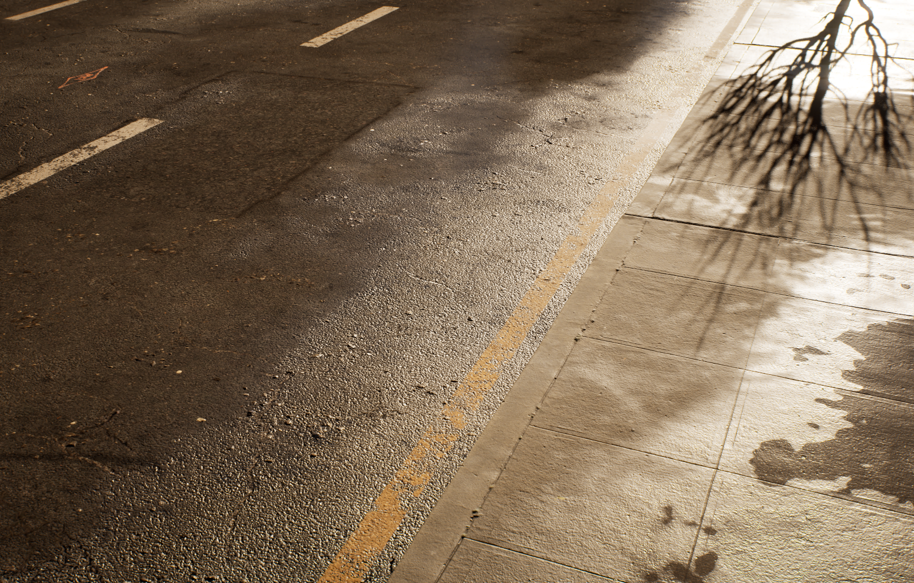<p>Unmodified road material at origin</p></td>
    <td>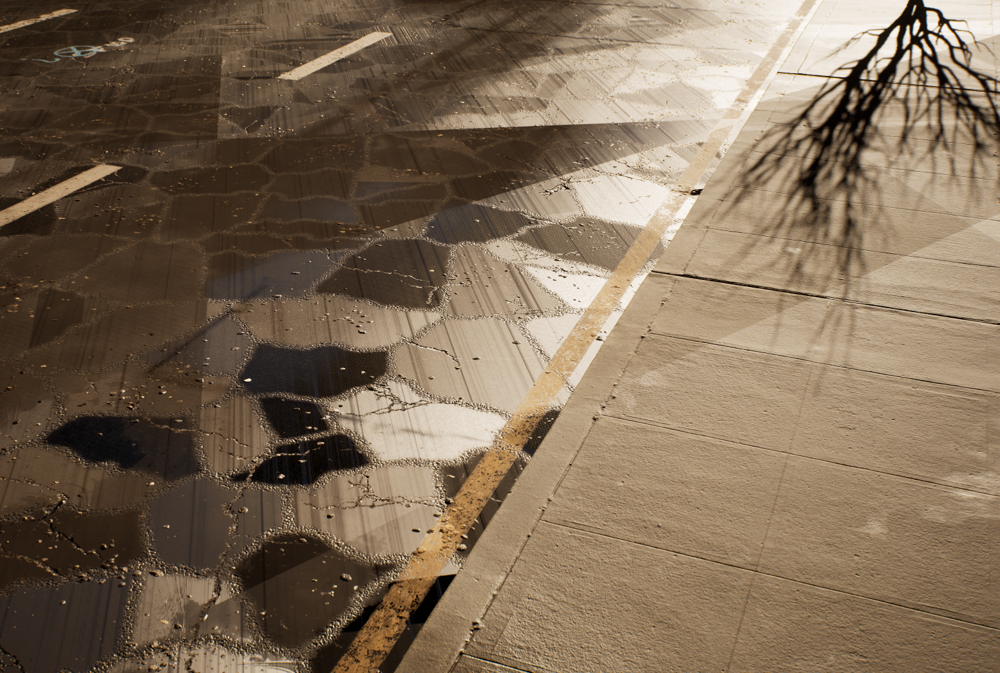<p>Same road material far away from the origin, showing precision errors</p></td>
  </tr>
</tbody> </table>

> While LWC have improved precision, they do have a performance cost. Aside from the doubled memory cost, many operations also require double the instructions. Furthermore, while less likely, it is still possible to encounter precision issues. For this reason UE 5.4 introduced the
[DoubleFloat format for GPU calculation](https://dev.epicgames.com/documentation/en-us/unreal-engine/large-world-coordinates-rendering-in-unreal-engine-5)
which offers even more robust precision, but is also heavier in terms of performance. In the engine, DoubleFloat was then carefully implemented to minimize cost while maximizing precision. However, materials and material functions still use the pre-5.4 format, as we do not control how calculations are structured in materials.

Хотя LWC и повысили точность, они имеют затраты на производительность. Помимо удвоенной стоимости памяти, многие операции также требуют удвоения инструкций. Кроме того, хотя это и менее вероятно, все еще возможно столкнуться с проблемами точности. По этой причине в UE 5.4 был представлен
[формат DoubleFloat для вычислений на GPU](https://dev.epicgames.com/documentation/en-us/unreal-engine/large-world-coordinates-rendering-in-unreal-engine-5)
который обеспечивает еще большую точность, но также более тяжелый с точки зрения производительности. В движке DoubleFloat затем был тщательно реализован для минимизации затрат при максимальной точности. Однако материалы и функции материалов по-прежнему используют формат до 5.4, поскольку мы не контролируем, как структурируются вычисления в материалах.

> Therefore, this tutorial demonstrates how you can restructure position calculations in materials for better precisionand speed.

Таким образом, в этом руководстве показано, как можно реструктурировать расчеты положения в материалах для повышения точности и скорости.

### [!NOTE]
> Materials that follow the guidelines in this document are generally cheaper, regardless of where in worldspace they are used. Moreover, content may be reused or change in unexpected ways, so building robust materials now reduces additional work later.

Материалы, которые следуют рекомендациям этого документа, как правило, дешевле, независимо от того, где в мировом пространстве они используются. Более того, контент может быть повторно использован или изменен неожиданным образом, поэтому создание надежных материалов сейчас сокращает дополнительную работу позже.

# Translated World Space

> The best precision is found near the origin, so the core idea is to move the origin from (0,0,0) to the camera position, or a location close to it. This is precisely what Translated World Space, or Camera-Relative World Space, is. Rotation and scale are identical to Absolute Worldspace, but positions are translated to have the origin on the camera position. This puts the highest precision closest to the camera.

Лучшая точность находится вблизи начала координат, поэтому основная идея заключается в перемещении начала координат из (0,0,0) в положение камеры или в место, близкое к нему. Это именно то, что представляет собой Translated World Space или Camera-Relative World Space. Вращение и масштаб идентичны Absolute Worldspace, но позиции транслируются так, чтобы начало координат находилось в положении камеры. Это обеспечивает наивысшую точность ближе к камере.

> When using Translated World Space, Unreal will therefore use regular floats rather than LWC, reducing the performance cost while maintaining high precision. Most calculations can be restructured to be performed relative to the camera, or a reference point close to the camera. Local space is also suitable, if this fits into your math.

Поэтому при использовании Translated World Space Unreal будет использовать обычные числа с плавающей точкой, а не LWC, что снижает затраты на производительность при сохранении высокой точности. Большинство вычислений можно реструктурировать для выполнения относительно камеры или опорной точки, близкой к камере. Локальное пространство также подходит, если это вписывается в ваши математические расчеты.

<table> <tbody>
  <tr>
    <td>
    <p>Absolute World Space</p>
    </td>
    <td>
    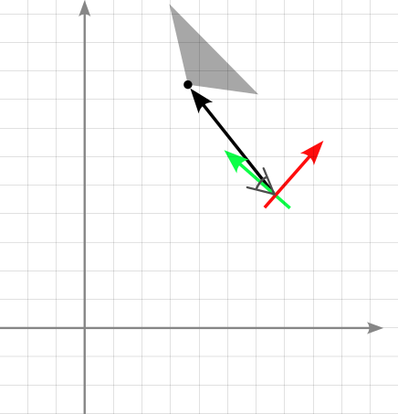<p>Camera Space</p>
    </td>
    <td>
    <p>Translated World Space (Camera-relativeWorld Space)</p>
    </td>
  </tr>
</tbody> </table>

# Where? / Где?

> There is a set of material nodes that produce absolute world positions, represented as LWC. Most of the mathnodes that involve a LWC, also produce a LWC. The cost of a single LWC source therefore increases with eachmath node that uses it as an input, directly or indirectly. Some of the math nodes, however, always return a regularfloat. Most notably, if you subtract two LWC values, the result is automatically converted to a float. This can beused to limit the amount of LWC operations.

Существует набор материальных узлов, которые производят абсолютные мировые позиции, представленные как LWC. Большинство математических узлов, которые включают LWC, также производят LWC. Стоимость одного источника LWC, таким образом, увеличивается с каждым математическим узлом, который использует его в качестве входных данных, напрямую или косвенно. Однако некоторые математические узлы всегда возвращают обычное число с плавающей точкой. В частности, если вычесть два значения LWC, результат автоматически преобразуется в число с плавающей точкой. Это можно использовать для ограничения количества операций LWC.

> The best option is to replace sources of Absolute World Position altogether. The most common material nodesthat produce these, and therefore LWC, are:

Лучшим вариантом является полная замена источников абсолютной мировой позиции. Наиболее распространенными материальными узлами, которые производят их, и, следовательно, LWC, являются:

- Absolute World Position
- Actor Position
- Object Position
- Particle Position
- Camera Position
- Transform Position (\* to Absolute World Space)

### [!NOTE]
> TransformVector is not on this list, because LWC types are not used for calculations involving directionsrather than positions.

TransformVector отсутствует в этом списке, поскольку типы LWC не используются для вычислений, включающих направления, а не позиции.

> Since UE 5.4, these nodes can now be configured to produce a Camera Relative World Position instead by setting the "World Position Origin Type" in the node parameters. Similarly, many nodes that previously only acceptedAbsolute World Positions as input, now also accept camera-relative ones. These include:

Начиная с UE 5.4, эти узлы теперь можно настроить для создания положения камеры относительно мира, установив «World Position Origin Type» в параметрах узла. Аналогично, многие узлы, которые ранее принимали только абсолютные положения мира в качестве входных данных, теперь также принимают относительные к камере. К ним относятся:

- Noise
- Vector Noise
- Runtime Virtual Texture Sample
- SamplePhysicsScalarField
- SamplePhysicsVectorField
- SamplePhysicsIntegerField
- DistanceToNearestSurface
- DistanceFieldGradient
- DistanceFieldApproxAO
- SkyAtmosphereAerialPerspective
- SkyAtmosphereLightIlluminance
- Atmosphere Fog Color.

> The material editor provides a rough estimation of the number of LWC usages in your material, available in theStats panel. Each LWC operation type that is used in your material type is listed separately, along with theapproximate usage count in Vertex (VS), Pixel (PS) and Compute Shaders (CS)

Редактор материалов предоставляет приблизительную оценку количества использований LWC в вашем материале, доступную на панели Stats. Каждый тип операции LWC, используемый в вашем типе материала, указан отдельно, вместе с приблизительным количеством использований в вершинных (VS), пиксельных (PS) и вычислительных шейдерах (CS)


> The "Material LWC Function Usage" optimization viewmode can also be used to inspect and compare theestimated number of LWC usages across materials.

Режим просмотра оптимизации «Использование функции LWC для материалов» также можно использовать для проверки и сравнения предполагаемого количества использований LWC для разных материалов.

<table> <tbody>
  <tr>
    <td>
    
    </td>
    <td>
    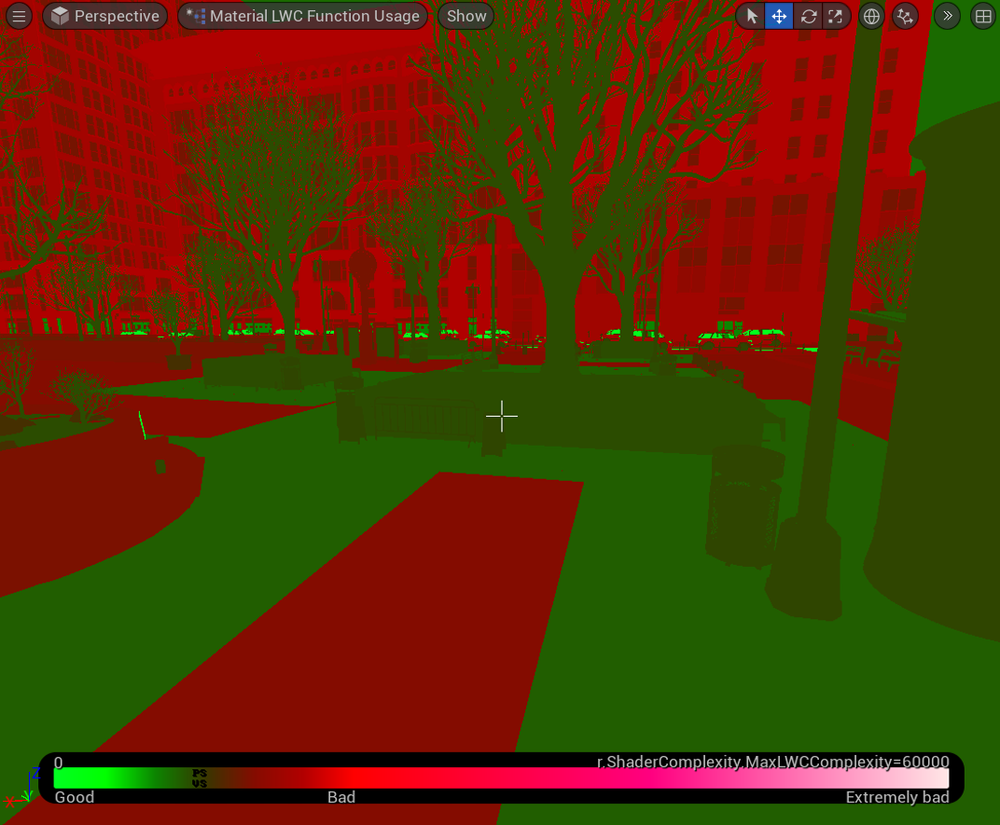
    </td>
  </tr>
</tbody> </table>

> To get a CSV table of all materials in your project with their LWC usage count and other metadata, you can use the DumpMaterialInfo commandlet. For example:

Чтобы получить таблицу CSV всех материалов в вашем проекте с их счетчиком использования LWC и другими метаданными, вы можете использовать командлет DumpMaterialInfo. Например:

```
UnrealEditor.exe <YourProject> -run=DumpMaterialInfo -targetplatform=Windows -unattended -sm6 -allowcommandletrendering -nomaterialshaderddc -csv=D:/output.csv
```

# How? / Как?

> Most calculations involving absolute world positions can be reformulated to use translated worldspace instead.

Большинство вычислений, включающих абсолютные мировые позиции, можно переформулировать, чтобы использовать вместо этого транслированное мировое пространство.

<table> <tbody>
  <tr>
    <td><p>before</p></td>
    <td><p>after</p></td>
  </tr>
</tbody> </table>

> Some math simplifies,

Некоторая математика упрощается,

<table> <tbody>
  <tr>
    <td><p>before</p></td>
    <td><p>after</p></td>
  </tr>
</tbody> </table>

> and some math stays the same.

а некоторая математика остается прежней.

<table> <tbody>
  <tr>
    <td><p>before</p></td>
    <td><p>after</p></td>
  </tr>
</tbody> </table>

> Here are some examples of common patterns:

Вот несколько примеров распространенных шаблонов:

## Vector

<table> <tbody>
  <tr>
    <td><p>before</p></td>
    <td>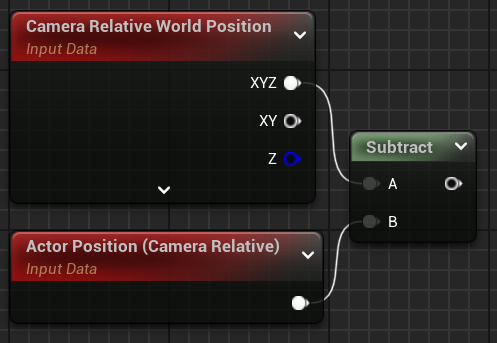<p>after</p></td>
  </tr>
</tbody> </table>

## TransformPosition

<table> <tbody>
  <tr>
    <td>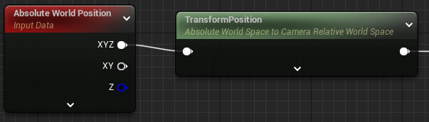<p>before</p></td>
    <td><p>after</p></td>
  </tr>
</tbody> </table>

<table> <tbody>
  <tr>
    <td><p>before</p></td>
    <td><p>After (* check if this can be converted to a relative space by looking at the bigger picture)</p></td>
  </tr>
</tbody> </table>

## SphereMask

<table> <tbody>
  <tr>
    <td><p>before</p></td>
    <td>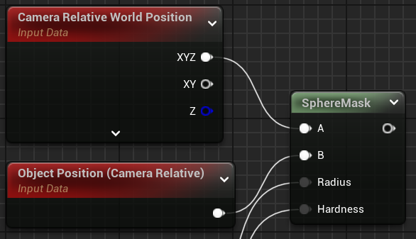<p>after</p></td>
  </tr>
</tbody> </table>

## Rotate

<table> <tbody>
  <tr>
    <td>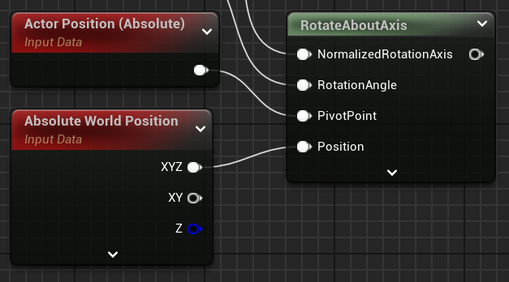<p>before</p></td>
    <td>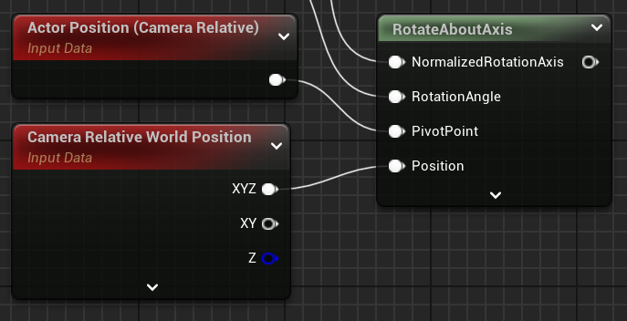<p>after</p></td>
  </tr>
</tbody> </table>

## Distance

<table> <tbody>
  <tr>
    <td><p>before</p></td>
    <td>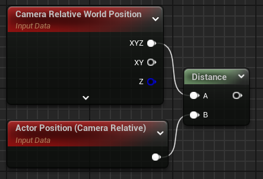<p>after</p></td>
  </tr>
</tbody> </table>

## UV Coordinates

> If you are using worldspace coordinates to calculate UV coordinates, you may not be able to use camera-relative worldspace. You may, however, still be able to choose a different origin that is closer to the camera.

Если вы используете мировые координаты для расчета UV-координат, вы не сможете использовать мировое пространство относительно камеры. Однако вы все равно сможете выбрать другое начало координат, которое находится ближе к камере.

> For example, let's say you are building a terrain material that is used across a very large area, perhaps multiple large islands. The terrain has a snowy mountain, so you have a mask texture that indicates which areas have snow.

Например, предположим, что вы создаете материал ландшафта, который используется на очень большой площади, возможно, на нескольких больших островах. На ландшафте есть заснеженная гора, поэтому у вас есть текстура маски, которая указывает, в каких областях есть снег.

> To avoid LWC, you could define an origin for this snowy mountain, and perform UV sampling relative to this region origin. The mask texture then only covers the relevant region instead of the whole level. Note that after subtracting two LWC, the compiler automatically converts the result to a float. The *ConstantDouble* or *DoubleVectorParameter* can therefore be helpful to define alternate origin points. (see the Material Parameters section)

Чтобы избежать LWC, вы можете определить начало координат для этой заснеженной горы и выполнить выборку UV относительно начала координат этой области. Тогда текстура маски покрывает только соответствующую область, а не весь уровень. Обратите внимание, что после вычитания двух LWC компилятор автоматически преобразует результат в число с плавающей точкой. Поэтому *ConstantDouble* или *DoubleVectorParameter* могут быть полезны для определения альтернативных точек начала координат. (см. раздел Параметры материала)

## Periodic position-based patterns / Периодические позиционные шаблоны

> You may be using absolute worldspace to produce repeating patterns, e.g. tiling, that do not move with the camera nor object. For this usecase, UE 5.5 introduces the "Periodic World Space" option in the TransformPosition node. It is similar to absolute world space, but the world is tiled and the origin is moved to the center of the tile the camera is in. This offers better precision and scalability than absolute world position, while keeping the pattern intact if the tilesize matches the pattern size. For example:

Вы можете использовать абсолютное мировое пространство для создания повторяющихся узоров, например, тайлинга, который не перемещается вместе с камерой или объектом. Для этого варианта использования UE 5.5 вводит опцию «Периодическое мировое пространство» в узле TransformPosition. Она похожа на абсолютное мировое пространство, но мир тайлинга, а начало координат перемещается в центр тайла, в котором находится камера. Это обеспечивает лучшую точность и масштабируемость, чем абсолютное мировое положение, при этом сохраняя узор нетронутым, если размер тайла соответствует размеру узора. Например:

<table> <tbody>
  <tr>
    <td>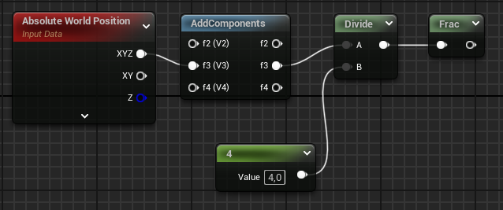<p>before</p></td>
    <td><p>after</p></td>
  </tr>
</tbody> </table>

> The above material is compared below at X=1000000 cm:

Материал выше сравнивается ниже при X=1000000 см:

<table> <tbody>
  <tr>
    <td><p>before</p></td>
    <td>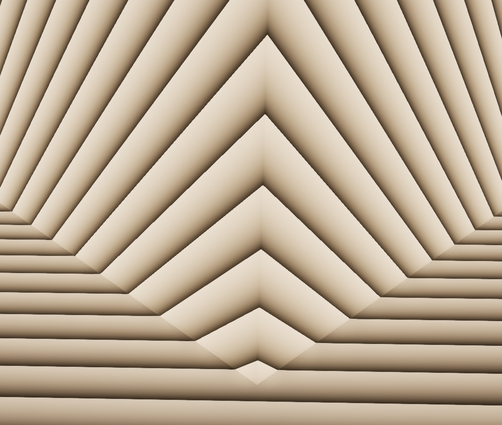<p>after</p></td>
  </tr>
</tbody> </table>

## Examples of tiling: / Примеры тайлинга:

<table> <tbody>
  <tr>
    <td>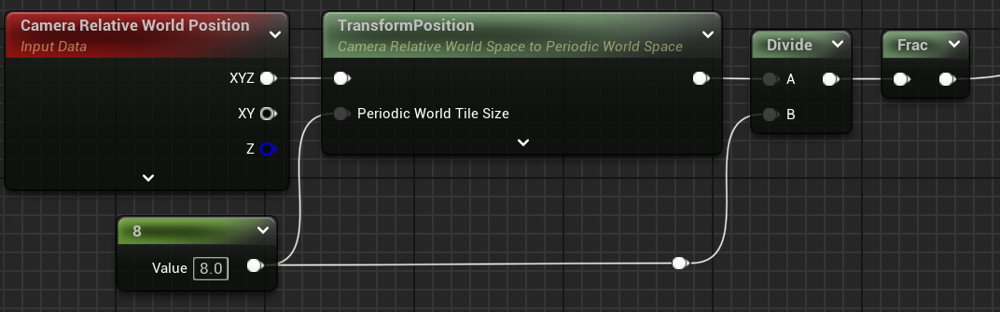<p>frac-based / на основе frac</p></td>
    <td><p>sin-based / на основе sin</p></td>
  </tr>
</tbody> </table>

<table> <tbody>
  <tr>
    <td><p>frac-based / на основе frac</p></td>
    <td>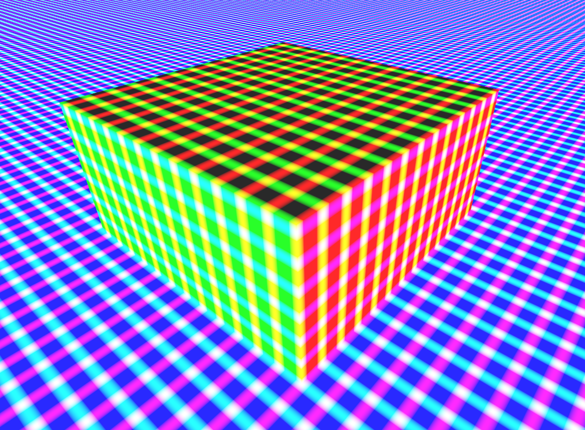<p>sin-based / на основе sin</p></td>
  </tr>
</tbody> </table>

# What if I must use absolute world space? / Что делать, если мне нужно использовать абсолютное мировое пространство?

> The overall goal should be to minimize the amount of LWC math by reducing the usage of absolute worldspace. Ifyou find that you cannot convert certain operations, you can still try to reduce the amount of error that isintroduced. A few guidelines:

Общая цель должна заключаться в минимизации количества математики LWC путем сокращения использования абсолютного мирового пространства. Если вы обнаружите, что не можете преобразовать определенные операции, вы все равно можете попытаться уменьшить количество вносимых ошибок. Несколько рекомендаций:

> - If you’re converting **to** translated space, do it as **early** as possible. This can be with the TransformPosition node, but you can also subtract from another worldspace position.
- Если вы преобразуете в транслируемое пространство, сделайте это как можно раньше. Это можно сделать с помощью узла TransformPosition, но вы также можете вычесть из другой позиции мирового пространства.

> - If you're converting **from** translated space, do it as **late** as possible.

- Если вы преобразуете из транслируемого пространства, сделайте это как можно позже.

> - Multiplying an LWC with a large value, or dividing it with a small fraction increases the absolute size of the error and should be avoided.

- Умножение LWC на ​​большое значение или его деление на небольшую дробь увеличивает абсолютный размер ошибки и его следует избегать.

> - Division or multiplication with a power of two does not introduce additional rounding error, and is therefore preferable over non-pow2 factors.

- Деление или умножение на степень двойки не вносит дополнительной ошибки округления и поэтому предпочтительнее, чем не-pow2 факторы.

> - When dealing with LWC, prefer simpler operations (add/subtract/multiply)

- При работе с LWC отдавайте предпочтение более простым операциям (сложение/вычитание/умножение)

> - Consider using vertex interpolators to re-use expensive calculations across pixels

- Рассмотрите возможность использования вершинных интерполяторов для повторного использования дорогостоящих вычислений по пикселям

> - Generally the compiler will optimize as much as it can, but it's good practice to mask vectors early and re-use calculations as much as possible.

- Обычно компилятор оптимизирует настолько, насколько это возможно, но хорошей практикой является раннее маскирование векторов и повторное использование вычислений настолько, насколько это возможно.

> - Test your material for precision issues (see below)

- Проверьте свой материал на наличие проблем с точностью (см. ниже)


# On Material Parameters / О параметрах материала

> If a parameter (or constant) represents a position in absolute world space, use *DoubleVectorParameter* (or *DoubleConstant*) instead of the regular vector parameter. Positions relative to the camera can still use the regularparameter nodes, and should be preferred.

Если параметр (или константа) представляет позицию в абсолютном мировом пространстве, используйте *DoubleVectorParameter* (или *DoubleConstant*) вместо обычного векторного параметра. Позиции относительно камеры по-прежнему могут использовать узлы regularparameter и должны быть предпочтительными.

# On Local Position / О локальной позиции

> In UE 5.5, the *LocalPosition* material function was deprecated and replaced with a new native node. *Pre-SkinnedLocal Position* was also moved into the new node. The old material function took the Absolute World Position andapplied a TransformPosition to get this to local space. The new native node directly provides local position invertex shaders, avoiding the extra transform for better precision. Pixel shaders still use the transform internally asin the old path, but you can avoid this with a VertexInterpolator if there is room for this in your material.

В UE 5.5 функция материала *LocalPosition* устарела и заменена новым собственным узлом. *Pre-SkinnedLocal Position* также была перемещена в новый узел. Старая функция материала брала Absolute World Position и применяла TransformPosition, чтобы перенести ее в локальное пространство. Новый собственный узел напрямую предоставляет локальное положение в вершинных шейдерах, избегая дополнительного преобразования для лучшей точности. Пиксельные шейдеры по-прежнему используют преобразование внутри, как и в старом пути, но вы можете избежать этого с помощью VertexInterpolator, если в вашем материале для этого есть место.

# Testing / Тестирование

> The easiest way to tell if your material suffers from precision issues is simply to test it. If there are issues, they willlikely be the easiest to spot at 2^20 cm (= 1048576) from the origin, or at a very large offset (e.g. 1 trillion units).Move the asset with your material to these locations and check if you see any pixelization, stepping or warpingartifacts. It's best to test in motion, by moving the camera and/or the actor, to reveal defects that are based onerror in the actor/primitive/instance position. This will also help spot problems with motion vectors, that may showup as problems in motion blur or TSR.

Самый простой способ узнать, страдает ли ваш материал от проблем с точностью, — просто протестировать его. Если есть проблемы, их, скорее всего, будет легче всего обнаружить на расстоянии 2^20 см (= 1048576) от начала координат или при очень большом смещении (например, 1 триллион единиц). Переместите актив с вашим материалом в эти места и проверьте, видите ли вы какие-либо артефакты пикселизации, шагания или деформации. Лучше всего проводить тестирование в движении, перемещая камеру и/или актера, чтобы выявить дефекты, основанные на ошибке в положении актера/примитива/экземпляра. Это также поможет обнаружить проблемы с векторами движения, которые могут проявиться как проблемы с размытием движения или TSR.

