# Глава 2. Системы координат и измерение времени

## 2.1. Введение

При измерении или вычислении положения и скорости любого небесного тела нужны система координат и система измерения времени. В астрономии проблема выбора подходящей системы отсчета возникла уже тысячи лет тому назад. Вплоть до недавнего времени все измерения производились с поверхности Земли. Однако еще до создания искусственных спутников Марса и посадки человека на Луну часто было удобно вводить систему координат, не связанную с Землей. Например, при исследовании орбитального движения планет за начало координат принимали центр Солнца; в спутниковых задачах за начало координат принимали центр планеты, а в звездной динамике — центр Галактики. В случае пилотируемого космического полета началом координат можно считать сам космический корабль.

Сама система координат также зависит от конкретной задачи. При ее определении может использоваться земной экватор или плоскость орбиты Земли, содержащая Солнце, или же экватор планеты, плоскость орбиты планеты, галактический экватор и т. д. Система измерения времени может быть основана на видимом движении Солнца, на вращении Земли, или на эфемеридном времени, связанном с движением планет вокруг Солнца и Луны вокруг Земли.

В этой главе будут рассмотрены понятия, относящиеся к системам измерения времени и системам координат.

## 2.2. Положение на поверхности Земли

Положение точки на поверхности Земли определяется двумя координатами, широтой и долготой, отсчитываемыми от экватора и меридиана, проходящего через северный и южный полюсы и Гринвич (Великобритания). Долгота измеряется вдоль экватора в восточном или западном направлении от пересечения гринвичского меридиана с экватором до пересечения с экватором меридиана, проходящего через данную точку.

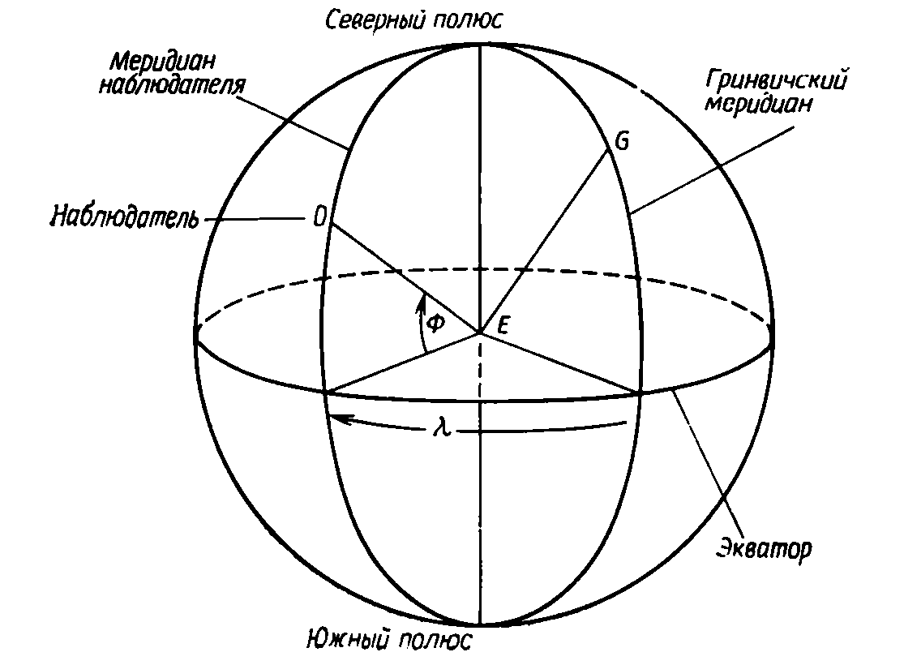

*(Рис. 2.1)*

Долгота обычно выражается в единицах времени, связь которых с угловыми единицами задается следующей таблицей:

$$
 360^\circ=24^h
$$

$$
\begin{array}{llll}
1^\circ&=4^m    &1^h&=15^\circ\\
1'     &=4^s    &1^m&=15'\\
1''    &=1/15^s &1^s&=15''.
\end{array}
$$

Например, долгота Вашингтона (США) $5^h 08^m 15,78^s$ к западу от Гринвича ($77^\circ 03' 56,7''$ западной долготы). Долгота может изменяться от $12^h$ к западу от Гринвича до $12^h$ к востоку от Гринвича, обозначенного на рис. 2.1 буквой $G$. Широта точки равна ее угловому расстоянию от экватора (в северном или южном направлении). Этот угол измеряется вдоль местного меридиана. Например, Вашингтон имеет северную широту $38^\circ 55' 14,0''$.

Поскольку Земля отличается от сферы, истинная картина сложнее представленной выше. Однако описанная здесь простая модель обладает достаточной точностью.

Если через точку на поверхности Земли, в которой расположен наблюдатель, провести отвесную линию, то она составит с плоскостью земного экватора угол $\phi$, называемый *астрономической широтой*. Точка пересечения отвесной линии с экваториальной плоскостью, вообще говоря, не совпадает с центром Земли. Угол между линией, соединяющей наблюдателя с центром Земли, и плоскостью экватора называется *геоцентрической широтой* $\phi'$.

Имеется еще и третье определение широты. Геодезические измерения на поверхности Земли обнаружили локальные нерегулярности направления силы тяжести, обусловленные вариациями плотности и формы земной коры. Эти аномалии влияют на направление линии отвеса и являются причиной так называемых *уклонений отвесной линии*. *Геодезическая* или *географическая широта φ″* точки наблюдения — это астрономическая широта, в которую внесена поправка за уклонение отвеса.

Таким образом, геодезическая широта связана с референц-эллипсоидом (сплюснутым эллипсоидом, поверхность которого определяется средним уровнем океана). Если *a* и *b* — большая и малая полуоси эллипса, при вращении которого образуется референц-эллипсоид, то сжатие γ определяется по формуле

$$
 \gamma = \frac{a - b}{a} = 1 - (1 - e^2)^{1/2}, 
$$

где *e* — эксцентриситет эллипса.

Существуют различные референц-эллипсоиды. Например, параметры эллипсоида Хейфорда таковы:

$$
\begin{aligned} 
a &= 6\ 378,388\ \text{км}, \\ 
b &= 6\ 356,912\ \text{км}, \\ 
\gamma &= 1/297, 
\end{aligned} 
$$

и, следовательно, *e* = 0,08199.

Заметим, что эллипсоид, полученный по наблюдениям орбит спутников Земли, заметно отличается от этого референц-эллипсоида (см. гл. 10).

*Геоцентрическая долгота λ* совпадает с *геодезической долготой*. Она равна угловому расстоянию от гринвичского меридиана до меридиана наблюдателя, измеряемому вдоль экватора в восточном или западном направлении.

## 2.3. Горизонтальная система

Простейшей системой координат является горизонтальная система. Она определяется плоскостью горизонта и одной из точек пересечения этой плоскости с большим кругом (см. разд. 2.9.1), проходящим через северный полюс мира и зенит. Начало горизонтальной системы координат совпадает с наблюдателем, так что эта система является сугубо локальной.

Как показано на рис. 2.2, точка *зенита* лежит на продолженной вверх линии отвеса. *Надир* находится в противоположном направлении. Удобной абстракцией является предположение, что Земля окружена огромной сферой произвольного радиуса, на внутреннюю поверхность которой проектируются звезды и другие небесные тела. Эта сфера называется *небесной сферой*. Поскольку в астрономии расстояния до тел нас часто не интересуют, то радиус сферы можно выбирать произвольным и его часто берут равным единице.

*Северный и южный полюсы мира* — это точки пересечения оси вращения Земли с небесной сферой. Наблюдателю в северном полушарии кажется, что северный полюс мира — это точка, вокруг которой вращается небесный свод, делая один оборот за 24 ч. В настоящее время яркая Полярная звезда находится на

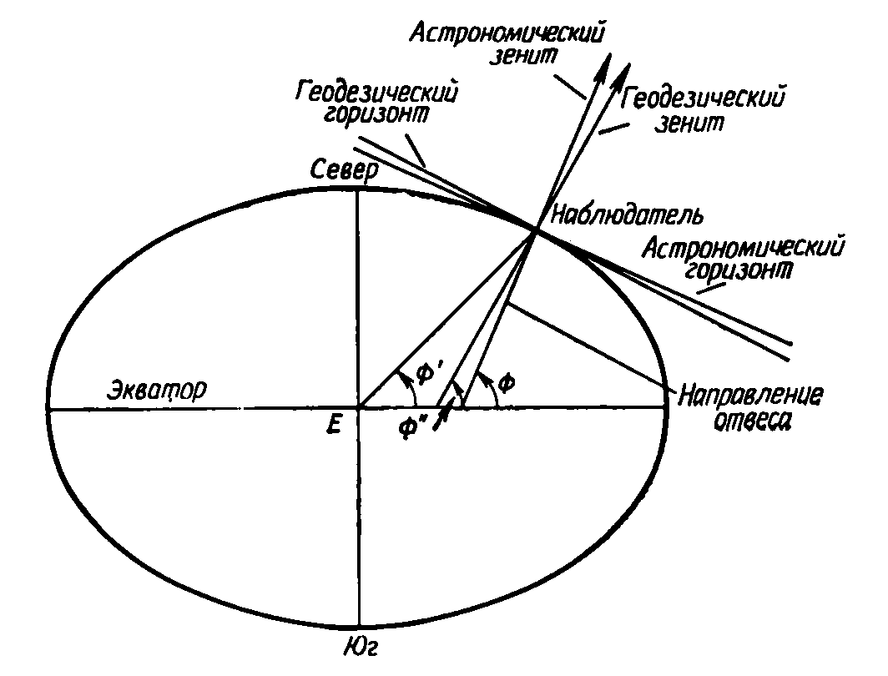

*(Рис. 2.2)*

расстоянии менее одного градуса от северного полюса мира. Однако вследствие прецессии (см. разд. 3.4) она постепенно уходит от полюса, возвращаясь в его окрестность примерно через каждые 26 000 лет.

На рис. 2.3 показана небесная сфера, в центре которой находится наблюдатель. Здесь $Z$ — зенит, $O$ — наблюдатель, $P$ — северный полюс мира, $OX$ — мгновенное направление на небесное тело. Большой круг, проведенный через $Z$ и $P$, пересекает горизонт $NESA W$ в точках севера $N$ и юга $S$. Другой большой круг $WZE$, составляющий прямой угол с большим кругом $NPZS$, пересекает горизонт в точках запада $W$ и востока $E$. Дуги $ZN$, $ZW$, $ZA$ и т. д. называются *вертикалами*; точки $N$, $E$, $S$ и $W$ называются *главными точками*.

Положение объекта $X$ в такой системе координат задается двумя углами — азимутом $A$ и высотой $a$. Азимут может определяться разными способами. Поэтому каждый раз, имея дело с такой системой, надо решать, каким определением следует воспользоваться.

----
2 А. Рой

Например, азимут может определяться как угол между вертикалами, проходящими через точку юга и объект $X$. Этот угол измеряется вдоль горизонта в западном направлении от $0$ до $360^\circ$. Азимут может определяться и как угол между вертикалами, проходящими через точку севера и объект $X$, и измеряться вдоль горизонта в западном или восточном направлении от $0$ до $180^\circ$. Обычно используется третье определение: *азимут отсчитывается*

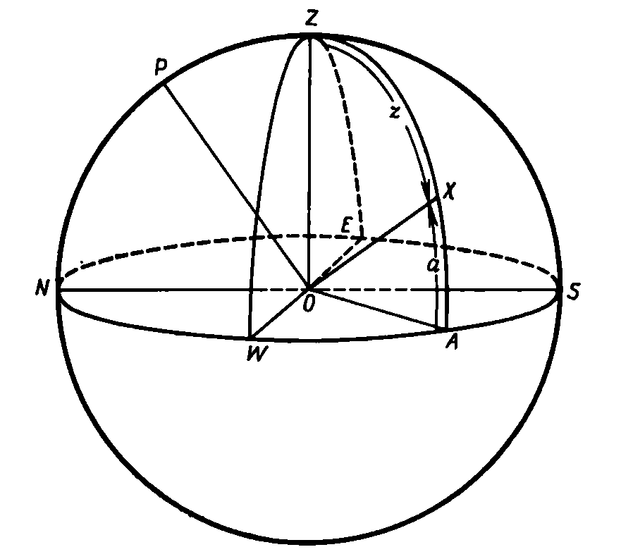

*(Рис. 2.3)*

*от точки севера в сторону востока от 0 до 360° \*. В данной книге принято именно такое определение, которое фактически аналогично определению направления по часовой стрелке.

Если наблюдатель находится в южном полушарии, то азимут измеряется от точки юга в восточном направлении от $0$ до $360^\circ$.

*Высота $a$* точки $X$ — это угол, измеряемый вдоль вертикального круга, проходящего через $X$, от точки $A$ горизонта до $X$. Он измеряется в градусах. Вместо высоты можно использовать и другую координату — *зенитное расстояние $z$* ($ZX$ на рис. 2.3), которое также измеряется в градусах. Очевидно, имеет место соотношение

$$
 a = 90^\circ - z. 
$$

---
\* Такие азимуты называются геодезическими в отличие от астрономических азимутов, отсчитываемых от точки юга. — *Прим. ред.*

Основной недостаток горизонтальной системы координат связан с тем, что она локальная. Два наблюдателя, расположенные в различных точках на поверхности Земли, будут в один и тот же момент времени получать различные значения высоты и азимута для одной и той же звезды. Кроме того, поскольку, с точки зрения наблюдателя, небесная сфера вращается, то координаты звезды со временем будут изменяться. Однако и в настоящее время многие наблюдения проводятся в такой, как ее часто называют, альтазимутальной системе. Например, 250-футовый радиотелескоп в Джодрелл-Бэнк (Великобритания) имеет альтазимутальную монтировку. При этом для преобразования горизонтальных координат в экваториальные и наоборот используется специальная ЭВМ.

## 2.4. Экваториальная система

Плоскость экватора Земли пересекает небесную сферу по большому кругу, называемому *небесным экватором*. Небесный экватор пересекается с горизонтом наблюдателя в точках востока и запада. Поскольку угол между небесным экватором и зенитом есть широта наблюдателя, то очевидно, что высота северного полюса мира $P$ равна широте $\phi$ наблюдателя.

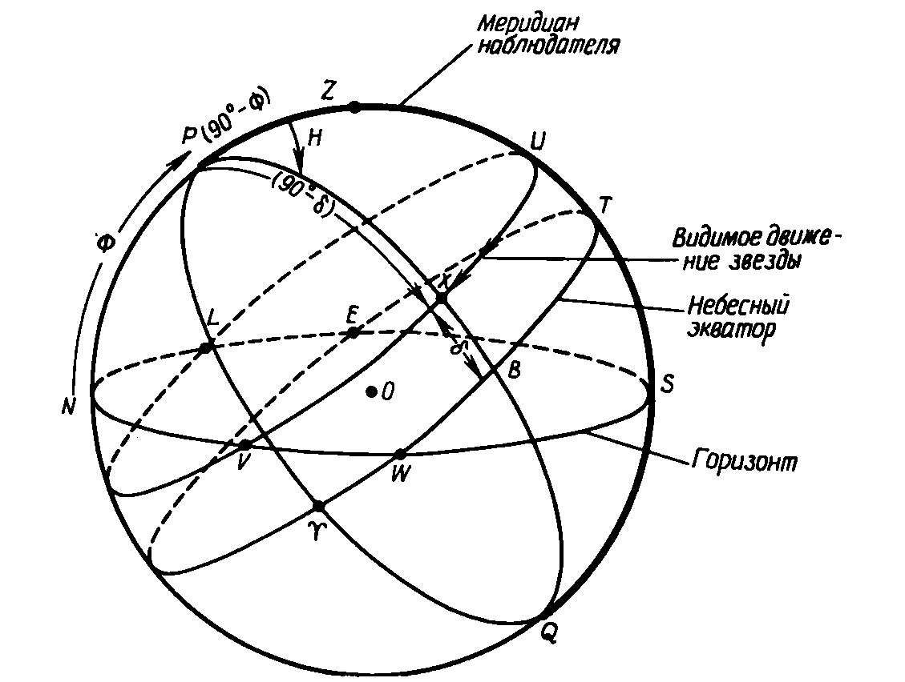

*(Рис. 2.4)*

Большой полукруг, проходящий через северный $P$ и южный $Q$ полюсы мира, называется *меридианом*. Меридиан, проходящий через небесное тело $X$ (большой полукруг $PXBQ$), пересекает небесный экватор в точке $B$ (рис. 2.4). Жирной линией на рис. 2.4 выделен меридиан наблюдателя $PZT\dot{S}Q$.

----
2\*

Наблюдая небо, можно заметить, что все естественные небесные тела восходят на востоке, после чего их высота увеличивается до момента прохождения через меридиан наблюдателя, а затем уменьшается вплоть до захода тела на западе. Напротив, большинство искусственных спутников в настоящее время восходят на западе и заходят на востоке, но мы не будем на этом останавливаться. На самом деле звезда описывает малый круг (образующийся при пересечении с небесной сферой плоскости, не проходящей через центр сферы), параллельный небесному экватору, причем ее движение по кругу происходит в направлении, указанном стрелкой. Такой круг называется *суточной параллелью*. *Склонение* $\delta$ равно его угловому расстоянию от экватора, измеряемому вдоль меридиана звезды и выраженному в градусах. Оно отсчитывается в северном или южном направлении от экватора и изменяется от $0$ до $\pm 90^\circ$, причем склонение считается положительным, если отсчитывается в северном направлении.

Таким образом, звезда пересекает меридиан в точке $U$, заходит в точке $V$, восходит в $L$ и снова пересекает меридиан спустя 24 часа. Угол $ZPX$ называется *часовым углом* $H$ звезды и измеряется в западном направлении (независимо от того, в северном или южном полушарии находится наблюдатель) от меридиана наблюдателя до меридиана звезды. Этот угол может изменяться от $0^h$ до $24^h$ или от $0$ до $360^\circ$. Следовательно, каждые звездные (сидерические) сутки часовой угол звезды увеличивается на $24^h$ (см. разд. 2.10.1).

Если на экваторе выбрать неподвижную относительно звезд точку $\Upsilon$, то ее угловое расстояние от точки пересечения меридиана, проходящего через $X$, с экватором в противоположность часовому углу объекта $X$ меняться не будет. Тогда положение любого светила на небесной сфере можно характеризовать его склонением и углом между меридианом светила и меридианом, проходящим через точку $\Upsilon$, которая называется *точкой весеннего равноденствия*. Угол между $\Upsilon$ и точкой пересечения меридиана светила с экватором называется *прямым восхождением* $\alpha$ тела. Прямое восхождение измеряется вдоль экватора от $\Upsilon$ в восточном направлении и может изменяться от $0^h$ до $24^h$ или от $0$ до $360^\circ$, т. е. прямое восхождение измеряется в направлении, противоположном направлению измерения часового угла. Это определение справедливо для наблюдателей, находящихся как в северном, так и в южном полушарии. При изображении небесной сферы рекомендуется: 1) выделять жирной линией меридиан наблюдателя, 2) указывать стрелкой на экваторе западное направление, в котором отсчитывается часовой угол, 3) указывать стрелкой на экваторе восточное направление, в котором отсчитывается прямое восхождение.

За начало экваториальной системы можно взять точку на поверхности Земли, в которой находится наблюдатель, центр Земли или центр Солнца. Тогда соответствующая небесная сфера, построенная вокруг этого начала, будет называться топоцентрической, геоцентрической или гелиоцентрической. При наблюдении звезд используются геоцентрические экваториальные координаты, причем звездные каталоги содержат прямые восхождения и склонения звезд относительно точки весеннего равноденствия и экватора, например, на эпоху 1950,0. Имея дело с орбитами планет, часто используют гелиоцентрические экваториальные координаты, а в случае орбит искусственных спутников Земли обычно обращаются к геоцентрической экваториальной небесной сфере, поскольку основной вклад в возмущающее воздействие со стороны гравитационного поля Земли вносит экваториальное вздутие Земли.

Для удаленных тел, таких, как звезды, размеры Земли пренебрежимо малы по сравнению с расстоянием от Земли. Поэтому наблюдения этих тел не зависят от положения наблюдателя на поверхности Земли. В случае наблюдения планет, Солнца, Луны или космических аппаратов положение наблюдателя на поверхности Земли имеет большое значение. Направление, в котором наблюдатель видит такой объект, отличается от направления, в котором видел бы этот объект гипотетический наблюдатель, находящийся в центре Земли. В ежегоднике «Астрономические эфемериды» и других изданиях положения естественных небесных тел затабулированы по отношению к геоцентрической небесной сфере. Для перехода от геоцентрических координат к топоцентрическим необходимо вносить поправки в приводимые в справочниках значения широты и долготы объекта. Аналогичная процедура необходима и в случае вычисления положения искусственного спутника Земли. Более подробно процедура вычисления таких поправок будет обсуждаться в гл. 3.

## 2.5. Эклиптическая система

Если длительное время наблюдать за Солнцем, то можно обнаружить, что оно помимо видимого суточного движения вокруг Земли совершает также движение среди звезд в восточном направлении (в направлении увеличения прямого восхождения) со скоростью около 1° в сутки, возвращаясь в свое исходное положение через один год. Траектория этого движения представляет собой большой круг, называемый *эклиптикой*, который лежит в плоскости орбиты Земли вокруг Солнца. Этот большой круг является основой плоскостью эклиптической системы координат. Он пересекает небесный экватор в точках весеннего (♈) и осеннего (♎) равноденствий под углом 23° 27′, который обычно обозначается *ε* и называется наклонением эклиптики. Полюс эклиптики *K* отстоит на такой же угол *ε* от северного полюса мира.

Положение объекта в такой системе определяется двумя величинами: эклиптической долготой и эклиптической широтой. На рис. 2.5 дуга большого круга, проходящего через полюс эклиптики $K$ и небесное тело $X$, пересекает эклиптику в точке $D$. При этом *эклиптическая долгота* $\lambda$ равняется углу между точками $\Upsilon$ и $D$, измеряемому вдоль эклиптики в восточном направлении (т. е. в направлении увеличения прямого восхождения) от 0 до 360° или от $0^h$ до $24^h$. Эклиптическая широта $\beta$ измеряется 

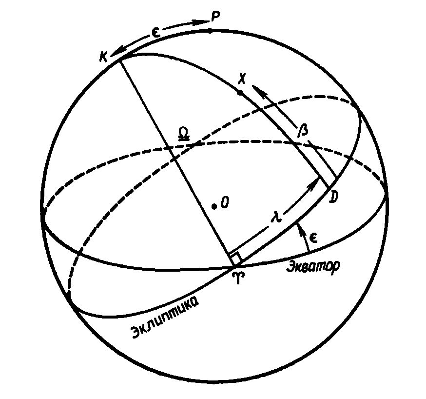

*(Рис. 2.5)*

в градусах от $D$ до $X$ вдоль дуги большого круга $DX$ в пределах от 0 до 90° на север или на юг от эклиптики. Следует отметить, что $K$ принадлежит той полусфере, в которой лежит северный небесный полюс. Надо также заметить, что эклиптическую долготу и широту часто называют *небесной долготой* и *широтой*.

За начало такой системы координат чаще всего принимают центр Земли или центр Солнца, поскольку большинство планет движется в плоскостях, наклоненных относительно эклиптики всего на несколько градусов. Особенно удобна эклиптическая система при рассмотрении межпланетных полетов.

## 2.6. Элементы орбиты в пространстве

В астрономии орбита и положение движущегося по ней тела обычно определяются шестью величинами, называемыми *элементами*. Три из них определяют ориентацию орбиты относительно координатных осей, два элемента определяют размер и форму орбиты, а шестой элемент (совместно с моментом времени) определяет положение тела на орбите в данный момент. В случае движения планеты по эллиптической орбите вокруг Солнца элементы могут быть определены относительно небесной сферы (с центром в Солнце), эклиптики и точки весеннего равноденствия.

На рис. 2.6 плоскость орбиты пересекается с плоскостью эклиптики по линии $NN_1$, называемой *линией узлов*. Если планета движется по орбите $A_1AP$ в направлении, указанном стрелкой, то $N$ называется восходящим узлом, а $N_1$ — нисходящим узлом. Тогда *долгота восходящего узла* $\Omega$, задаваемая дугой $\Upsilon N$, измеряется вдоль эклиптики от 0 до 360°.

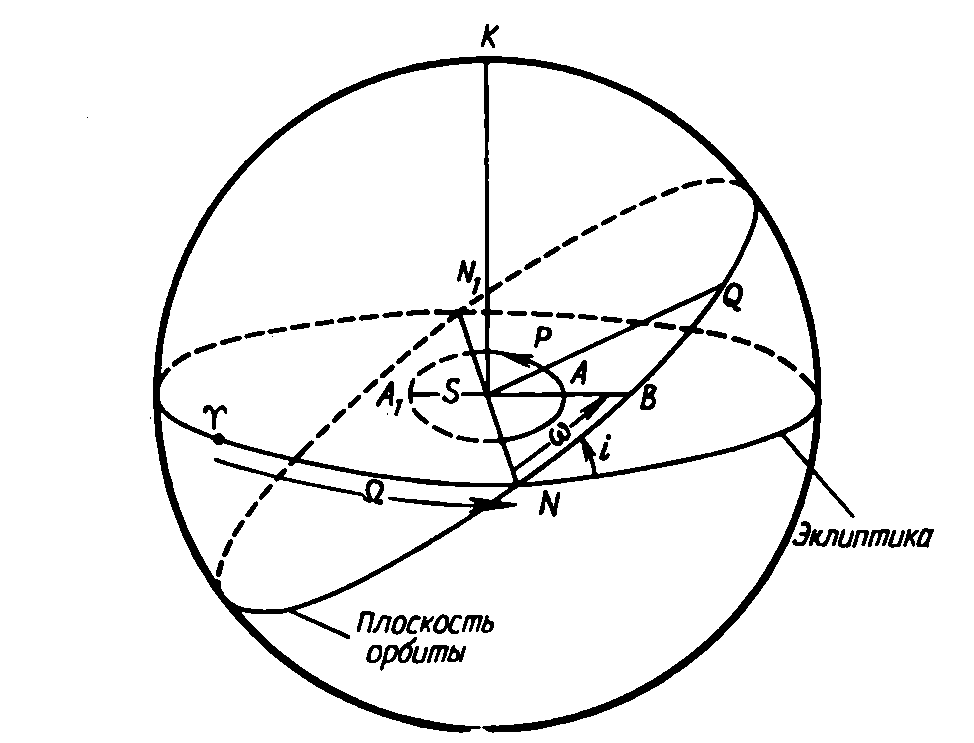

*(Рис. 2.6)*

Вторым элементом является *наклонение i* — угол между плоскостью орбиты и плоскостью эклиптики. Эти два элемента определяют ориентацию плоскости орбиты в пространстве.

Третий элемент задает ориентацию орбиты в ее плоскости. На орбите каждой планеты есть точка, расположенная ближе других к Солнцу. Она называется *перигелием*. В случае эллиптической орбиты имеется, кроме того, наиболее удаленная от Солнца точка, называемая *афелием*. Орбита симметрична относительно линии, проходящей через центр Солнца и перигелий, или, в случае эллиптических орбит, относительно *линии апсид*, соединяющей перигелий $A$ и афелий $A_1$. Эта линия проходит через центр Солнца $S$. Таким образом, направление линии апсид определяет ориентацию орбиты. Угловое расстояние от $\Upsilon$ до $N$ (т. е. $\Omega$) плюс угловое расстояние $\omega$ от $N$ до проекции $B$ перигелия $A$ на небесную сферу называется *долготой перигелия* $\tilde{\omega}$ ($= \Omega + \omega$). Заметим, что долгота перигелия измеряется вдоль эклиптики от $\Upsilon$ до $N$, а затем вдоль линии пересечения плоскости орбиты с небесной сферой до точки $B$.

Следующие два элемента зависят от типа орбиты. В дальнейшем будет показано (см. гл. 4), что орбита тела, движущегося относительно другого тела под действием силы взаимного притяжения, является коническим сечением (т. е. эллипсом, параболой или гиперболой), фокус которого совпадает со вторым телом. Будем считать, что орбита эллиптическая. Тогда двумя элементами орбиты, определяющими ее размер и форму, являются *большая полуось* и *эксцентриситет*. У эллипса, изображенного на рис. 2.7, большая ось равна расстоянию $AA'$. Большая полуось $a$ равна половине этого расстояния и определяет размер орбиты.

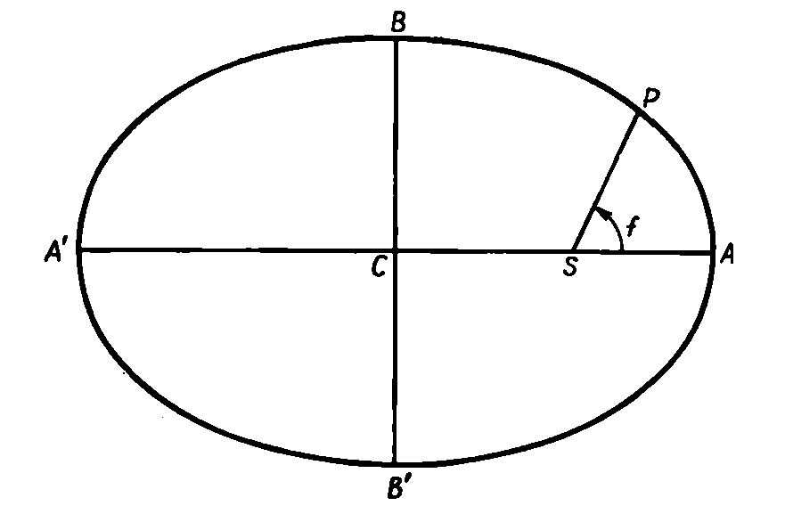

*(Рис. 2.7)*

Эксцентриситет $e$ представляет собой меру отклонения эллипса от окружности. Он связан с расстоянием между фокусом $S$ и центром $C$ эллипса соотношением

$$
 CS = ae. 
$$

Шестым элементом является *момент прохождения перигелия* $\tau$ — эпоха, в которую тело находилось в перигелии. Эта эпоха вместе с моментом времени определяет положение тела на орбите в данный момент.

Таким образом, шесть элементов $\Omega$, $\tilde{\omega}$, $i$, $a$, $e$, $\tau$ (вместе со временем) определяют орбиту и положение тела на ней.

В работах, посвященных орбитальному движению, часто используется *истинная аномалия* $f$ — угол с вершиной в фокусе $S$ между направлением на перигелий и радиусом-вектором тела $SP$.

Если в качестве основной плоскости системы координат взять экваториальную плоскость, то величины $\Omega$, $\tilde{\omega}$ и $i$ изменятся, а величины $a$, $e$ и $\tau$ останутся теми же, что и прежде.

Если тело является спутником Земли, то основной плоскостью будет экваториальная плоскость и долгота восходящего узла совпадает с прямым восхождением восходящего узла. При этом роль долготы перигелия будет играть аргумент перигея (перигей — ближайшая к центру Земли точка орбиты) — величина, равная углу между направлениями на перигей и на восходящий узел.

Если тело — спутник планеты, то в качестве координатной плоскости может быть выбрана эклиптика, экваториальная плоскость планеты, плоскость, в которой происходит орбитальное движение планеты вокруг Солнца, или плоскость, называемая «собственной плоскостью», в которой происходит регрессия узлов (см. гл. 5). Ближайшая к планете точка орбиты тела называется перицентром. Для ее обозначения иногда используют также название планеты с приставкой «пери».

## 2.7. Прямоугольные системы координат

Во многих задачах астрономии и астронавтики положения вычисляются в прямоугольных координатах. Существует целый ряд таких систем координат.

Если основная плоскость (плоскость эклиптики или экватора) выбрана, то ось x можно направить из центра тела, вокруг которого происходит вращение, в сторону точки весеннего равноденствия $\Upsilon$, ось y провести в основной плоскости под углом 90° к оси x, а ось z направить перпендикулярно основной плоскости так, чтобы три оси образовали правую тройку.

В некоторых задачах за начало координат принимается центр масс системы тел. Такая система координат называется барицентрической.

## 2.8. Системы координат, связанные с плоскостью орбиты

Часто бывает удобно брать такую прямоугольную систему координат, оси которой параллельны или перпендикулярны плоскости орбиты тела, а начало координат совпадает с центром Солнца или планеты, вокруг которой тело обращается. Приведем различные варианты таких систем, полагая, что тело движется вокруг Солнца.

Ось x направлена в сторону восходящего узла N, ось y лежит в плоскости орбиты под углом 90° к оси x, а ось z проводится перпендикулярно плоскости орбиты, причем так, чтобы три оси образовали правую тройку (см. рис. 2.8).

Другая полезная система координат строится так: ось $\xi$ проводится вдоль линии, соединяющей Солнце с перигелием, ось $\eta$ — в плоскости орбиты под прямым углом к оси $\xi$, ось $\zeta$ — перпендикулярно к первым двум осям.

Третья система такова: ось X проходит через тело, ось Y — в плоскости орбиты под прямым углом к оси X, ось Z — как обычно, перпендикулярно плоскости орбиты. Поскольку тело движется по орбите, система является вращающейся. Она используется при исследовании возмущающих сил, действующих на тело.

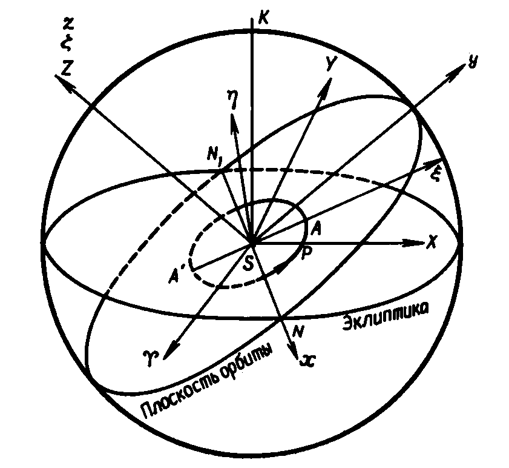

*(Рис. 2.8)*

## 2.9. Преобразование систем координат

Часто требуется осуществить переход от одной системы координат к другой. При этом иногда наряду с поворотом осей совершается также перенос начала отсчета, но чаще начало отсчета остается неизменным.

Одни преобразования легче проводить с использованием формул сферической тригонометрии. Другие оказываются проще, если воспользоваться векторными методами.

### 2.9.1. Основные формулы сферической тригонометрии

Геометрия на сфере оперирует с большими кругами, малыми кругами и их дугами. Расстояния вдоль этих кругов измеряются как углы, поскольку радиус сферы для удобства принимается равным единице.

*Большой круг* получается в результате пересечения с поверхностью сферы плоскости, проходящей через центр сферы.

Если плоскость не проходит через центр сферы, то в результате ее пересечения со сферой получается *малый круг*.

*Полюсами* большого круга называются две точки на сфере, расстояние которых от любой точки большого круга равно 90°.

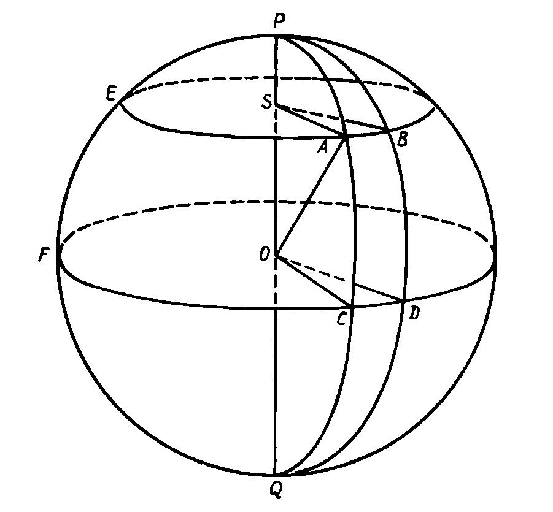

*(Рис. 2.9)*

На рис. 2.9 полюсы большого круга $FCD$ обозначены буквами $P$ и $Q$. Очевидно, линия, соединяющая полюсы, пересекается с плоскостью большого круга в центре сферы и образует с этой плоскостью прямой угол.

Два больших круга образуют в точке пересечения *сферический угол*, который определяется как угол между касательными к большим кругам в точке их пересечения. Сферический угол определяется только по отношению к двум пересекающимся большим кругам.

Замкнутая фигура, образованная дугами трех больших кругов, называется *сферическим треугольником*, если она обладает следующими свойствами:
1) Сумма любых двух сторон больше третьей стороны.
2) Сумма трех углов больше 180°.
3) Каждый сферический угол меньше 180°.

Длина дуги малого круга связана простым соотношением с длиной дуги такого большого круга, плоскость которого параллельна плоскости малого круга.

На рис. 2.9 полюс $P$ большого круга $FCD$ является также полюсом малого круга $EAB$, плоскость которого параллельна плоскости большого круга $FCD$. Если провести большие круги через $P$ и концы $A$ и $B$ дуги малого круга, то они пересекутся с большим кругом в точках $C$ и $D$. Легко показать, что

$$
 AB = CD \cos AC. 
$$

При этом надо помнить, что стороны измеряются как углы, а радиус сферы равен единице. В качестве примера использования этой формулы можно рассмотреть вопрос о том, насколько удалены друг от друга два пункта на поверхности Земли, если они расположены на одной широте, а расстояние измеряется вдоль параллели. Предположим в данном примере, что Земля сферическая. На рис. 2.9 точки $A$ и $B$ обозначают наши пункты. Угол $AOC$ — это широта $\phi$, так что

$$
 AC = BD = \phi. 
$$

Если долгота $A$ равна $\lambda_A W$, а долгота $B$ — $\lambda_B W$, то их разность равна $\lambda_A W - \lambda_B W$ и

$$
 CD = \angle COD = \lambda_A - \lambda_B. 
$$

Тогда

$$
 AB = CD \cos AC, 
$$

или, иначе, искомое расстояние равно разности долгот, умноженной на косинус широты. Расстояние по поверхности Земли в таких задачах обычно измеряют в морских милях. Морская миля равна длине дуги большого круга на поверхности Земли, соответствующей углу $1'$. На самом деле поверхность Земли не является абсолютно сферической. Поэтому длина морской мили непостоянна, и в качестве единицы практически используется ее среднее значение, равное 1,852 км.

Разность долгот можно выразить в дуговых минутах. Число дуговых минут равно числу морских миль. Таким образом, воспользовавшись приведенной выше формулой, можно вычислить расстояние между пунктами.

Заметим, что при вычислении разности долгот восточную долготу следует брать с противоположным знаком по отношению к западной долготе.

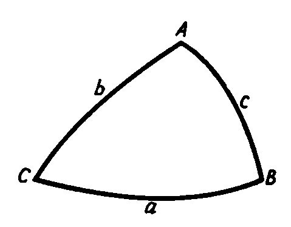

*(Рис. 2.10)*

На рис. 2.10 изображен сферический треугольник $ABC$, стороны которого $AB$, $BC$ и $CA$ имеют длины $c$, $a$ и $b$ соответственно.

В астрономии и астродинамике обычно используются четыре формулы, связывающие величины сторон $a, b, c$ с углами $A, B$ и $C$:

**1) Формула косинусов**

$$
\cos a = \cos b \cos c + \sin b \sin c \cos A. 
$$

Эта формула имеет еще две разновидности, а именно:

$$
\cos b = \cos c \cos a + \sin c \sin a \cos B, 
$$
$$
\cos c = \cos a \cos b + \sin a \sin b \cos C. 
$$

**2) Формула синусов**

$$
\frac{\sin A}{\sin a} = \frac{\sin B}{\sin b} = \frac{\sin C}{\sin c}. 
$$

Ею следует пользоваться с осторожностью, ибо если, например, заданы $a, b$ и $B$, то, не располагая дополнительной информацией, мы не можем решить, какое из двух значений, $A$ или $(180^\circ - A)$, является верным.

**3) Аналог формулы косинусов**

$$
 \sin a \cos B = \cos b \sin c - \sin b \cos c \cos A. 
$$

У этой формулы есть пять разновидностей.

**4) Формула, связывающая четыре последовательных элемента сферического треугольника:**

$$
 \cos a \cos C = \sin a \operatorname{ctg} b - \sin C \operatorname{ctg} B. 
$$

Эта формула также имеет пять разновидностей.

Доказательство приведенных здесь, а также ряда других формул можно найти в книге Смарта [4], включенной в список литературы в конце главы.

### 2.9.2. Примеры преобразований систем координат

*Пример 1.* Вычислим на геоцентрической небесной сфере часовой угол $H$ и склонение $\delta$ тела, имеющего азимут (измеряемый в восточном направлении от точки севера) $A$ и высоту $a$. При этом будем считать, что широта наблюдателя равна $\phi$.

На рис. 2.11 показана соответствующая небесная сфера, на которой $X$ обозначает положение тела, а остальные символы имеют обычные значения.

Теорема косинусов, примененная к сферическому треугольнику $PZX$, дает

$$
 \sin \delta = \sin \phi \sin a + \cos \phi \cos a \cos A. 
$$

Отсюда можно вычислить $\delta$. Воспользовавшись теоремой косинусов еще раз, получаем

$$
 \sin a = \sin \phi \sin \delta + \cos \phi \cos \delta \cos H 
$$

или

$$
 \cos H = \frac{\sin a - \sin \phi \sin \delta}{\cos \phi \cos \delta}, 
$$

откуда находим $H$, так как $\delta$ уже известно.

С другой стороны, используя формулу, связывающую четыре величины $(90^\circ - a)$, $(360^\circ - A)$, $(90^\circ - \phi)$ и $H$, получаем

$$
 \sin \phi \cos A = \cos \phi \operatorname{tg} a - \sin A \operatorname{ctg} H 
$$

или

$$
 \operatorname{tg} H = \frac{\sin A}{\sin \phi \cos A - \cos \phi \operatorname{tg} a}. 
$$

*Пример 2.* Считая, что наклонение эклиптики равно ε, преобразуем эклиптические координаты (небесную долготу λ и небесную широту β) космического аппарата в геоцентрические экваториальные координаты (прямое восхождение α и склонение δ).

Как показано на рис. 2.12, в сферическом треугольнике KPX (X — положение космического аппарата на небесной сфере) содержится вся необходимая информация. Воспользовавшись по

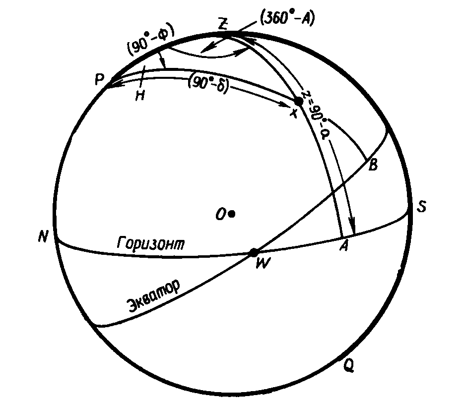

*(Рис. 2.11)*

очереди теоремой косинусов, теоремой синусов и аналогом теоремы косинусов, получаем

$$
 \sin \delta = \sin \beta \cos \epsilon + \cos \beta \sin \epsilon \sin \lambda, \tag{2.1} 
$$
$$
 \cos \delta \cos \alpha = \cos \beta \cos \lambda, \tag{2.2} 
$$
$$
 \cos \delta \sin \alpha = -\sin \beta \sin \epsilon + \cos \beta \cos \epsilon \sin \lambda, \tag{2.3} 
$$

откуда можно найти α и δ.

Читателю предлагается в качестве упражнения провести преобразования, обратные рассмотренным в примерах 1 и 2.

*Пример 3.* По известным гелиоцентрическим прямоугольным координатам космического аппарата, обращающегося вокруг Солнца, определим его геоцентрическое расстояние ρ, прямое восхождение α и склонение δ.

На этом примере будет проиллюстрирован ряд важных принципов. Для наблюдения аппарата с Земли или связи с ним в заданный момент времени нужно знать геоцентрические прямое восхождение, склонение и удаление аппарата. С другой стороны, межпланетный космический аппарат движется по орбите вокруг Солнца, а элементы такой орбиты определяются в гелиоцентрической системе. Зная элементы и время, можно определить прямоугольные координаты в системе с началом в центре Солнца. Ниже мы увидим, как это делается (см. гл. 4). В настоящем примере мы будем предполагать, что основой прямоугольной системы координат служат эклиптика и направление на $\Upsilon$, и покажем, как эти прямоугольные координаты можно преобразовать в геоцентрическое расстояние, прямое восхождение и склонение. В астрономии такое преобразование является стандартной процедурой. Обратная задача определения элементов орбиты по измерениям прямого восхождения и склонения тела также является стандартной процедурой. Однако она сложнее и будет рассмотрена позже.

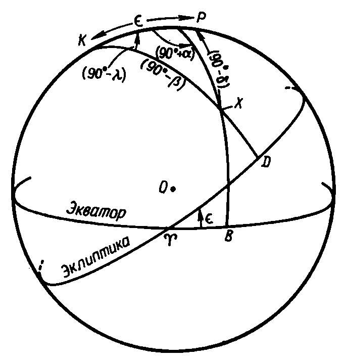

*(Рис. 2.12)*

Задача решается в несколько этапов:

1\) осуществляется переход от гелиоцентрической эклиптической прямоугольной системы координат к гелиоцентрической экваториальной прямоугольной системе;

2\) от гелиоцентрической экваториальной прямоугольной системы переходим к геоцентрической экваториальной прямоугольной системе;

3\) геоцентрические экваториальные прямоугольные координаты преобразуем в геоцентрическое расстояние, прямое восхождение и склонение.

Эти преобразования проводятся следующим образом:

1\) На рис. 2.13 $V$ обозначает положение аппарата относительно Солнца $S$. Относительно осей $S\Upsilon$, $SB$, $SK$ (образующих прямоугольную систему) аппарат имеет координаты $(x, y, z)$ так, что справедливо соотношение

$$
 SV = r = (x^2 + y^2 + z^2)^{1/2}.
$$

$SA$ ($A$ — перигелий) пересекается со сферой в точке $A_1$, а $SV$ — в точке $Q$. Тогда имеем

$$
 \Upsilon N = \Omega, \quad NA_1 = \omega, \quad A_1Q = f.
$$

В силу теоремы косинусов, примененной к сферическому треугольнику $Q\Upsilon N$, в котором угол $\Upsilon NQ$ равен $180^\circ - i$, получаем

$$
 \cos \Upsilon Q = \cos \Omega \cos (\omega + f) - \sin \Omega \sin (\omega + f) \cos i. 
$$

Однако

$$
 x/r = \cos \Upsilon Q, 
$$

следовательно,

$$
 x = r [\cos \Omega \cos (\omega + f) - \sin \Omega \sin (\omega + f) \cos i]. \tag{2.4} 
$$

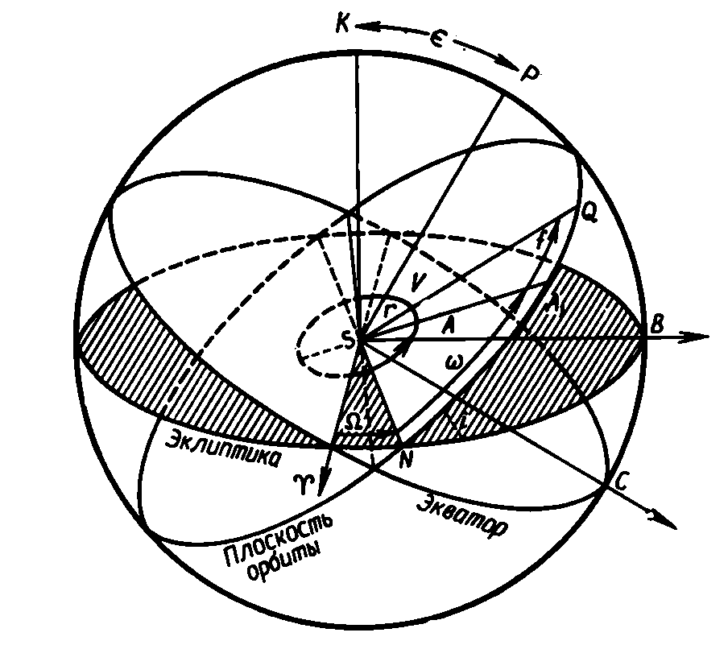

*(Рис. 2.13)*

Аналогично, применяя теорему косинусов к треугольнику $QNB$ и вспоминая, что

$$
 y/r = \cos BQ, 
$$

получаем

$$
 y = r [\sin \Omega \cos (\omega + f) + \cos \Omega \sin (\omega + f) \cos i]. \tag{2.5} 
$$

Наконец, применение теоремы косинусов к треугольнику $QKN$ дает

$$
 z = r \sin (\omega + f) \sin i. \tag{2.6} 
$$

Чтобы перейти к гелиоцентрическим экваториальным прямоугольным координатам, заметим, что новые оси $S\Upsilon$, $SC$ и $SP$ обладают следующими свойствами: ось $SC$ лежит в экваториальной плоскости под углом $90^\circ$ к $S\Upsilon$, а ось $SP$ перпендикулярна этой плоскости и направлена так, что три оси образуют правую тройку. Тогда новые оси $SC$ и $SP$ получаются из старых осей $SB$ и $SK$ поворотом последних вокруг $S$ на угол $\epsilon$. Если гелиоцентрические экваториальные прямоугольные координаты аппарата обозначить $(x', y', z')$, то

$$
 \begin{aligned} x' &= x, \\ y' &= y \cos \varepsilon - z \sin \varepsilon, \\ z' &= y \sin \varepsilon + z \cos \varepsilon. \end{aligned} 
$$

Используя уравнения (2.4), (2.5) и (2.6), получаем

$$
 x' = r [\cos (\omega + f) \cos \Omega - \sin (\omega + f) \sin \Omega \cos i], \tag{2.7} 
$$

$$
 \begin{aligned} y' &= r [\cos (\omega + f) \sin \Omega \cos \varepsilon + \\ &\quad + (\cos i \cos \Omega \cos \varepsilon - \sin i \sin \varepsilon) \sin (\omega + f)], \end{aligned} \tag{2.8} 
$$

$$
 \begin{aligned} z' &= r [\cos (\omega + f) \sin \Omega \sin \varepsilon + \\ &\quad + (\cos i \cos \Omega \sin \varepsilon + \sin i \cos \varepsilon) \sin (\omega + f)]. \end{aligned} \tag{2.9} 
$$

Введем ряд вспомогательных углов так, чтобы они удовлетворяли соотношениям

$$
 \begin{aligned} \sin a \sin A &= \cos \Omega, \\ \sin a \cos A &= -\cos i \sin \Omega, \\ \sin b \sin B &= \sin \Omega \cos \varepsilon, \\ \sin b \cos B &= \cos i \cos \Omega \cos \varepsilon - \sin i \sin \varepsilon, \\ \sin c \sin C &= \sin \Omega \sin \varepsilon, \\ \sin c \cos C &= \cos i \cos \Omega \sin \varepsilon + \sin i \cos \varepsilon. \end{aligned} 
$$

Тогда уравнения (2.7), (2.8) и (2.9) принимают вид

$$
 \begin{aligned} x' &= r \sin a \sin (A + \omega + f), \\ y' &= r \sin b \sin (B + \omega + f), \\ z' &= r \sin c \sin (C + \omega + f). \end{aligned} \tag{2.10} 
$$

Этими формулами удобно пользоваться, если нужно вычислять прямоугольные координаты аппарата в нескольких положениях. Вспомогательные величины $a, A, b, B, c, C$ являются функциями только элементов $\Omega, i$ и $\varepsilon$; поэтому их можно вычислить один раз для всех положений. Переменные же $r$ и $f$ должны вычисляться для каждого положения (способ их вычисления будет описан позднее — см. гл. 4). Следует, однако, заметить, что $\Omega, i$ и $\omega$ являются постоянными только в том случае, когда на аппарат не действуют никакие возмущения. Фактически такая ситуация наблюдается в большинстве межпланетных полетов на пассивных участках траектории.

2\) Теперь начало координат переносится из центра Солнца в центр Земли. На рис. 2.14 $E$ — Земля, $S$ — Солнце, $S\Upsilon, SC$ и $SP$ — оси гелиоцентрической экваториальной системы координат, нат, $E\Upsilon'$, $EC'$ и $EP'$ — оси геоцентрической экваториальной прямоугольной системы координат, плоскость $\Upsilon'EC'$ — плоскость земного экватора. Пусть $(\xi, \eta, \zeta)$ — координаты аппарата $V$ относительно геоцентрических осей, так что

$$
 \rho^2 = \xi^2 + \eta^2 + \zeta^2, \tag{2.11} 
$$

а $(x_1, y_1, z_1)$ — гелиоцентрические экваториальные координаты Земли. Тогда

$$
 \begin{aligned} \xi &= x' - x_1, \\ \eta &= y' - y_1, \\ \zeta &= z' - z_1. \end{aligned} 
$$

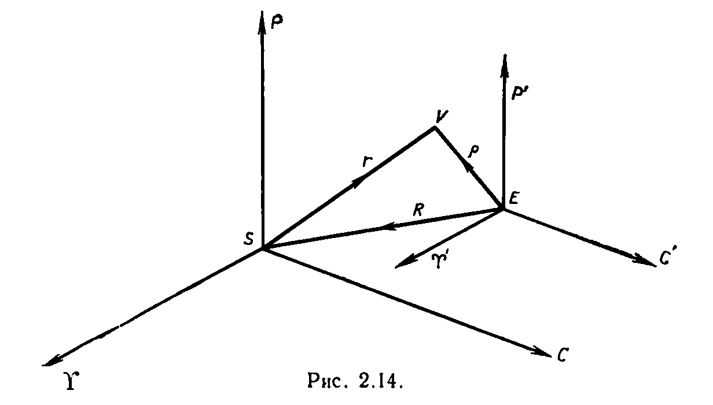

*(Рис. 2.14)*

Если через $(X, Y, Z)$ обозначить геоцентрические экваториальные координаты Солнца, то

$$
 \begin{aligned} \xi &= x' + X, \\ \eta &= y' + Y, \\ \zeta &= z' + Z, \end{aligned} \tag{2.12} 
$$

так как

$$
 \begin{aligned} X &= -x_1, \\ Y &= -y_1, \\ Z &= -z_1. \end{aligned} \tag{2.13} 
$$

Координаты Солнца $(X, Y, Z)$ затабулированы в «Астрономических эфемеридах» и других ежегодниках. С другой стороны, $x_1, y_1, z_1$ получаются по элементам орбиты Земли, причем, поскольку орбита лежит в плоскости эклиптики, ее наклонение равно нулю. Обозначим эти элементы $\Omega_1$ и $\tilde{\omega}_1$ ($\tilde{\omega}_1 = \Omega_1 + \omega_1$ — долгота перигелия орбиты Земли). Тогда из (2.10) получаем

$$
 \begin{aligned} x_1 &= r_1 \cos (\tilde{\omega}_1 + f_1), \\ y_1 &= r_1 \sin (\tilde{\omega}_1 + f_1) \cos \epsilon, \\ z_1 &= r_1 \sin (\tilde{\omega}_1 + f_1) \sin \epsilon. \end{aligned} 
$$

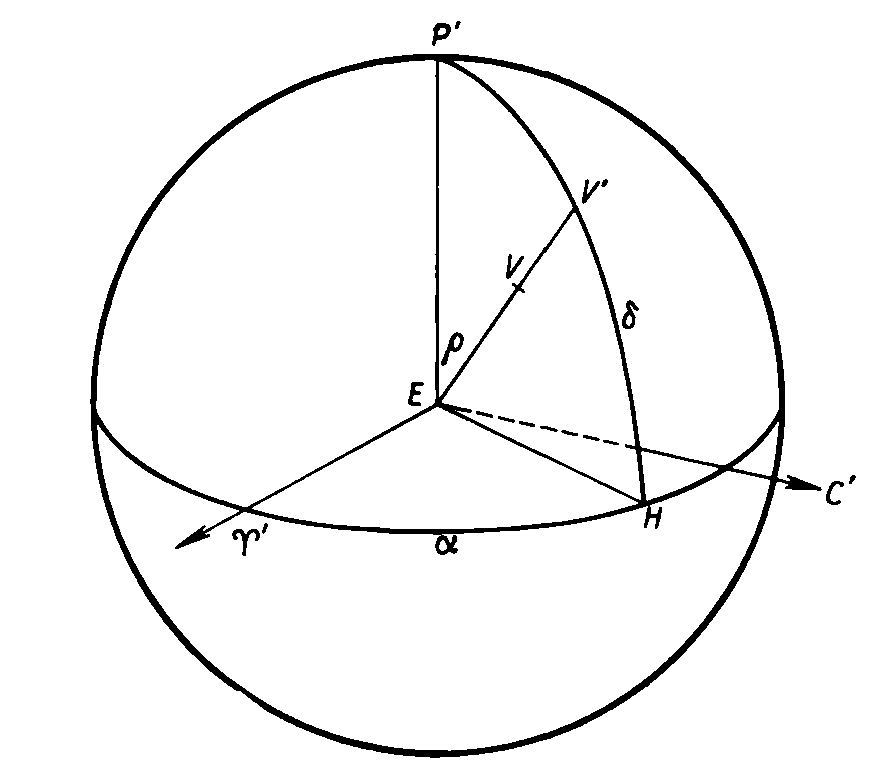

*(Рис. 2.15)*

Входящие сюда значения радиуса-вектора $r_1$ и истинной аномалии $f_1$ могут быть вычислены для любого момента времени $t$.

3\) На рис. 2.15 изображена геоцентрическая небесная сфера и меридиан $P'V'H$, проведенный через проекцию на небесной сфере $V'$ точки $V$ (геоцентрического положения аппарата).

Тогда
$$
 \xi = \rho \cos VE\Upsilon' = \rho \cos V'E\Upsilon', 
$$
т. е.
$$
 \xi = \rho \cos V'\Upsilon'. 
$$
Аналогично
$$
 \eta = \rho \cos V'C' 
$$
и
$$
 \zeta = \rho \cos V'P'. 
$$

Применяя к сферическому треугольнику $\Upsilon'V'H$ (имеющему при вершине $H$ прямой угол) теорему косинусов, получаем три соотношения:

$$
 \left. \begin{aligned} \xi &= \rho \cos \alpha \cos \delta, \\ \eta &= \rho \sin \alpha \cos \delta, \\ \zeta &= \rho \sin \delta, \end{aligned} \right\} \tag{2.14} 
$$

после чего, воспользовавшись уравнениями (2.10), (2.12) и (2.14), находим

$$
 \rho \cos \alpha \cos \delta = X + r \sin a \sin (A + \omega + f), \tag{2.15} 
$$
$$
 \rho \sin \alpha \cos \delta = Y + r \sin b \sin (B + \omega + f), \tag{2.16} 
$$
$$
 \rho \sin \delta = Z + r \sin c \sin (C + \omega + f). \tag{2.17} 
$$

Мы видим, что если элементы орбиты аппарата известны, то правые части уравнений (2.15), (2.16) и (2.17) могут быть вычислены для любого момента времени, поскольку значения $X$, $Y$ и $Z$ известны (они содержатся в «Астрономических эфемеридах»).

Таким образом, находим

$$
 \operatorname{tg} \alpha = \frac{Y + r \sin b \sin (B + \omega + f)}{X + r \sin a \sin (A + \omega + f)}, 
$$

откуда можно получить $\alpha$.

Точно так же из выражения

$$
 \operatorname{tg} \delta \operatorname{cosec} \alpha = \frac{Z + r \sin c \sin (C + \omega + f)}{Y + r \sin b \sin (B + \omega + f)} 
$$

определяется $\delta$, а $\rho$ равно квадратному корню из суммы квадратов правых частей уравнений (2.15), (2.16) и (2.17).

## 2.10. Галактическая система координат

При исследовании распределения и движения тел в Галактике было бы нелепо пользоваться системами координат, привязанными к экватору или эклиптике. Тот факт, что Галактика имеет форму линзы, вблизи плоскости симметрии которой находится Солнце, наводит на мысль, что эту плоскость удобно взять в качестве основы системы координат.

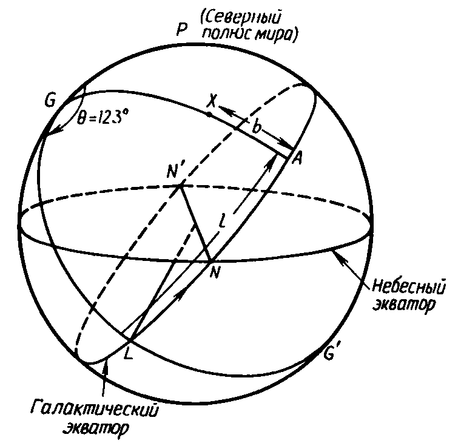

*(Рис. 2.16.)*

Вещество, из которого состоит Галактика (звезды, космическая пыль и газ) распределено симметрично по обе стороны от галактического экватора $LNA$ (рис. 2.16). Большой круг галактического экватора пересекается с небесным экватором в двух точках $N$ и $N'$. Первая точка называется *восходящим узлом*, вторая — *нисходящим узлом*, поскольку тело, движущееся вдоль галактического экватора в направлении увеличения прямого восхождения, при пересечении точки $N$ поднимается из южного полушария неба в северное, а в точке $N'$ переходит из северного полушария в южное. По определению северный и южный галактические полюсы $G$ и $G'$ лежат соответственно в северном и южном полушариях. Каждое тело $X$ ($\alpha$, $\delta$) имеет галактическую долготу и широту.

До 1959 г. нулевой точкой, от которой отсчитывалась галактическая долгота, считался восходящий узел $N$ (система Олсопа); затем в качестве такой точки стали брать $L$ — точку пересечения галактического экватора с большим полукругом $GLG'$, для которого позиционный угол $\theta = PGL = 123^\circ$. Направление на определенную таким образом точку $L$ совпадает с гелиоцентрическим направлением на центр Галактики. Тогда *галактическая долгота* объекта $X$, обозначаемая $l$, измеряется вдоль галактического экватора от точки $L$ до основания меридиана, проведенного из $G$ через $X$, в направлении увеличения прямого восхождения от 0 до 360°. Следовательно, $l = LNA$, а угол $PGX$ равен 360° — $\theta$ — $l$.

*Галактическая широта* объекта $X$ (обозначается $b$) равна угловому расстоянию тела от галактического экватора, отсчитываемому вдоль меридиана, проходящего через северный галактический полюс и объект, в северном или южном направлении от 0 до 90°. Следовательно, $b = AX$ (северная широта).

Чтобы различать величины в системе Олсопа и в системе Международного астрономического союза (МАС), обычно пользуются индексами I и II. Так, например, галактический полюс в системе МАС ($b^{II} = 90°$) имеет координаты

$$
 \alpha = 12^h 49,0^m, \quad \delta = +27° 24, 0' \quad (\text{эпоха } 1950), 
$$
$$
 \alpha = 12^h 46,6^m, \quad \delta = +27° 40,0' \quad (\text{эпоха } 1900), 
$$

а в системе Олсопа ($l^I$?**(потеряный текст)**? $= 90°$)

$$
 \alpha = 12^h 40^m, \quad \delta = +28,0° \quad (\text{эпоха } 1900). 
$$

## 2.11. Измерение времени

У первобытного человека понятие времени связывалось с ростом чувства голода или жажды или с такими явлениями природы, как изменение в течение суток высоты Солнца, последовательные фазы Луны и смена времен года. Примерно за 2000 лет до нашей эры наиболее цивилизованные народы стали вести наблюдения природных явлений и ввели систематизацию времени по суткам, месяцам и годам. В качестве основной единицы времени был выбран год, так как в результате наблюдений было обнаружено, что Солнце за этот промежуток времени совершает полный оборот по звездному небу.

Поскольку повседневная жизнь тесно связана с дневным светом, то Солнце и стало тем телом, к которому была привязана система измерения времени, использующая в качестве единицы сутки. Истинные солнечные сутки равняются промежутку времени между последовательными прохождениями Солнца через меридиан наблюдателя или времени, в течение которого часовой угол Солнца увеличивается на 24^h (360°). На практике было замечено, что Солнце проходит меридиан в тот момент, когда вертикальный столб отбрасывает самую короткую тень.

С другой стороны, видимое суточное вращение небесного свода позволяет ввести другую систему счета времени, называемую звездным временем. Эта система построена на вращении Земли вокруг своей оси. Интервал между двумя последовательными прохождениями звезды через меридиан наблюдателя называется звездными сутками. Уже в начале развития астрономии было выяснено, что различие между двумя системами счета времени —

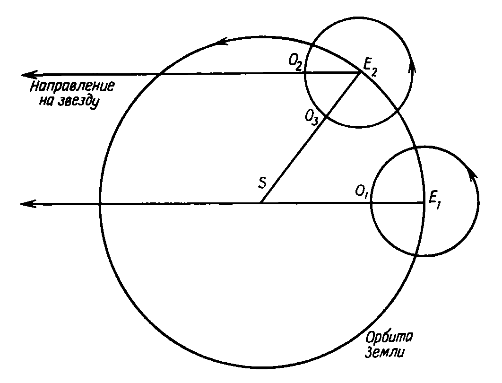

*(Рис. 2.17)*

солнечной и звездной — вызвано движением Солнца относительно Земли. За звездные сутки, которые определяются двумя последовательными прохождениями звезды через меридиан наблюдателя, наблюдатель $O$ вместе с Землей повернется на 360° и перейдет из точки $O_1$ в $O_2$ (см. рис. 2.17). При этом считается, что звезда находится на бесконечном расстоянии от Земли. Однако для того, чтобы промежуток времени равнялся одним истинным солнечным суткам, Земля ($E$) должна повернуться настолько, чтобы наблюдатель оказался в положении $O_3$, где Солнце ($S$) снова находится на меридиане наблюдателя. Поскольку радиус-вектор Земли $SE$ поворачивается за сутки приблизительно на 1°, а Земля вращается с угловой скоростью около 1° за 4 мин, то звездные сутки примерно на 4 мин короче, чем средние солнечные сутки.

### 2.11.1. Звездное время

За начало отсчета на вращающейся небесной сфере выбирается точка весеннего равноденствия $\Upsilon$. С ее помощью определяются *звездные сутки*, равные промежутку времени между двумя последовательными моментами прохождения точки весеннего равноденствия через меридиан наблюдателя. Часовой угол точки весеннего равноденствия увеличивается от $0^h$ до $24^h$, так что *местное звездное время* (LST) определяется как часовой угол точки весеннего равноденствия. Это время зависит от долготы $\lambda$ точки наблюдения на поверхности Земли.

Как показано на рис. 2.18, если $X$ обозначает небесный объект, то его прямое восхождение (RA) равно $\alpha$, а часовой угол (HA) равен $H$. Тогда местное звездное время равно сумме часового угла и прямого восхождения объекта:

$$
\text{LST} = \text{HA}(X) + \text{RA}(X). \tag{2.18}
$$

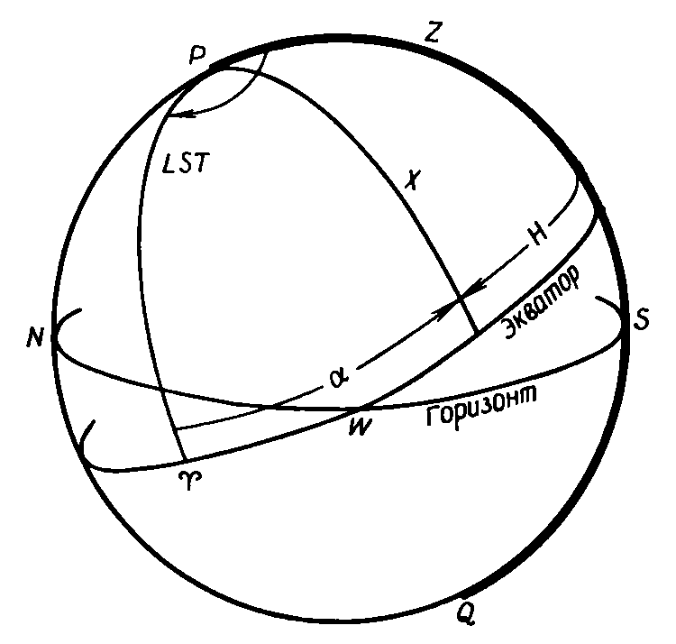

*(Рис. 2.18.)*

Это важное соотношение справедливо для любого небесного объекта — Солнца, Луны, планеты, звезды, космического аппарата и т. д.

Если звездное время известно, а прямое восхождение $\alpha$ и склонение $\delta$ тела для этого момента вычислены, то мы можем узнать часовой угол $H$ и склонение $\delta$, определяющие положение тела $X$ на небесной сфере, для любого последующего момента времени.

В обсерваториях обычно имеются часы, измеряющие звездное время для своего меридиана. Поскольку в момент прохождения звезды через меридиан наблюдателя часовой угол звезды равен нулю, ее прямое восхождение $\alpha$ в этот момент равно местному звездному времени. Отмечая значения звездного времени при прохождении хорошо известных звезд через меридиан и сравнивая их с прямыми восхождениями, можно проконтролировать поправку и ход часов. Такие звезды называют «часовыми звездами», а их наблюдения являются частью текущей работы любой обсерватории.

Кроме того, в «Астрономических эфемеридах» для часто встречающихся эпох всемирного времени (см. разд. 2.11.2) затабулировано *гринвичское звездное время* (GST). Как показано на рис. 2.19,

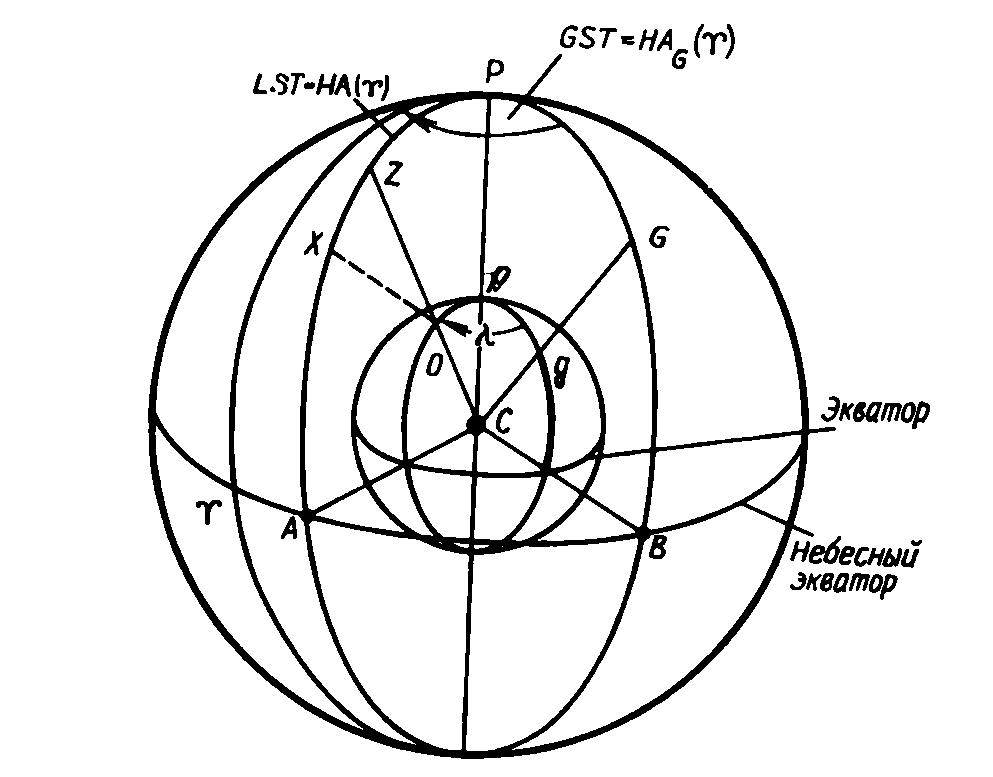

*(Рис. 2.19)*

промежуток времени между прохождениями небесного тела через гринвичский меридиан и через меридиан места наблюдения равен долготе места наблюдения. На этом рисунке изображена геоцентрическая небесная сфера (северный полюс мира обозначен $P$) и Земля (северный полюс — $p$), Гринвич ($g$) и его зенит ($G$). Меридиан, проходящий через $G$ (т. е. $PGB$) является гринвичским меридианом. Наблюдатель расположен в точке $O$, имеющей долготу $\lambda$; зенит $Z$ этой точки определяет меридиан наблюдателя $PZA$. Точка весеннего равноденствия обозначена $\Upsilon$, а небесное тело в данный момент находится в точке $X$.

Гринвичский часовой угол $GPX$ точки $X$ равен долготе наблюдателя $\lambda$.

Гринвичский часовой угол точки весеннего равноденствия $\Upsilon$, т. е. угол $GP\Upsilon$, обозначается $H_G(\Upsilon)$ и равен часовому углу $XP\Upsilon$ плюс долгота наблюдателя $\lambda$. Другими словами,

$$
 \text{HA}_G(\Upsilon) = \text{HA}(\Upsilon) + \lambda. 
$$

Часовой угол точки $\Upsilon$ равен местному звездному времени. Поэтому можно записать

$$
 \text{GST} = \text{LST} + \lambda. \tag{2.19} 
$$

Если вместо $\Upsilon$ имеется некоторый небесный объект \*, то

$$
 \text{HA}_G(*) = \text{HA}(*) + \lambda. \tag{2.20} 
$$

Этот результат так же важён, как уравнения (2.18) и (2.19). Легко увидеть, что восточная долгота входит в формулы со знаком минус.

### 2.11.2. Среднее солнечное время

Если при помощи точных звездных часов измерять продолжительность истинных солнечных суток (промежуток времени между двумя последовательными прохождениями Солнца через меридиан наблюдателя), то окажется, что в течение года она изменяется. Это происходит по двум основным причинам:

1) Видимая орбита Солнца вокруг Земли является эллипсом, на котором равные углы заметаются радиус-вектором, соединяющим Солнце и Землю, за разные времена.
2) Траектория видимого движения Солнца лежит в плоскости эклиптики, которая наклонена к экватору (вдоль которого измеряется часовой угол Солнца) под углом приблизительно 23¹/₂°.

Чтобы получить среднее солнечное время, астрономам приходится учитывать указанные нерегулярности. При этом они поступают следующим образом:

1) Вводится фиктивное тело, называемое *средним эклиптическим солнцем*, которое одновременно с Солнцем выходит из перигея, движется в плоскости эклиптики со средней угловой скоростью Солнца (среднее движение) и одновременно с Солнцем возвращается в перигей.
2) В момент, когда среднее эклиптическое солнце, двигаясь в плоскости эклиптики, достигает точки весеннего равноденствия $\Upsilon$, начинает движение второе фиктивное тело, называемое *средним экваториальным солнцем*. Оно движется вдоль экватора со скоростью, равной среднему движению Солнца, и возвращается в точку $\Upsilon$ одновременно со средним эклиптическим солнцем.

Поскольку прямое восхождение среднего экваториального солнца увеличивается с постоянной скоростью примерно на 1° в сутки, а его часовой угол за одни сидерические сутки увеличивается на 24ʰ, то время между последовательными прохождениями среднего экваториального солнца через меридиан наблюдателя является величиной постоянной. Этот интервал называется *средними солнечными сутками*.

Между звездным временем и средним солнечным временем существует следующая связь:

1 средние солнечные сутки = 24ʰ03ᵐ56,5554ˢ звездного времени,
1 звездные сутки = 23ʰ56ᵐ04,0905ˢ среднего солнечного времени.

В «Астрономических эфемеридах» и других ежегодниках печатаются таблицы перевода среднего солнечного времени в звездное время и наоборот.

Для связи положения среднего солнца с положением истинного солнца служит величина, называемая *уравнением времени*, равная разности часового угла Солнца (☉) и часового угла среднего солнца (MS), т. е.

$$
 E = \text{HA}(\odot) - \text{HA}(\text{MS}). \tag{2.21} 
$$

Из уравнения (2.18) следует, что

$$
 E = \text{RA(MS)} - \text{RA}(\odot). \tag{2.22} 
$$

Уравнение времени $E$ связано с моментами кульминации $T$, затабулированными в «Астрономических эфемеридах» на каждый день года, соотношением

$$
 E = 12^h - T. 
$$

Гринвичское среднее время GMT или всемирное время UT связано со средним солнечным временем следующим образом:

$$
 \text{GMT} = \text{HA}_G(\text{MS}) \pm 12^h. \tag{2.23} 
$$

В уравнении (2.23) подразумевается, что начало гражданских суток соответствует средней полночи. Всемирное время UT представляет собой удобную систему отсчета времени и применяется в большинстве обсерваторий во всем мире. Однако в повседневной жизни используется поясная система счета времени, при которой поверхность Земли делится на часовые пояса.

Время, которое показывают часы, установленные в соответствии с этой системой, связано с положением Солнца на небе только приблизительно. В то же время такая система избавляет движущегося наблюдателя от необходимости непрерывно подводить свои часы.

В пределах каждого пояса используется одно и то же гражданское время, называемое *поясным временем* (ZT). Границы поясов проходят по меридианам, причем ширина каждого пояса равна 15° ($1^h$). Гринвичский пояс (пояс 0) ограничен меридианами $0^h30^m$ W и $0^h30^m$ E, а время в нем соответствует времени гринвичского меридиана, т. е. GMT (UT). Границами пояса +1 являются меридианы $1^h30^m$ W и $0^h30^m$ W; время в нем соответствует времени меридиана $1^h$ W. Аналогично время в поясе —1, ограниченном меридианами $1^h30^m$ E и $0^h30^m$ E, соответствует меридиану $1^h$ E. Двигаясь таким образом в восточном и западном направлении, мы разделим всю поверхность Земли на пояса вплоть до поясов +12 и —12. Очевидно, в обоих этих поясах время будет соответствовать меридиану $12^h$ W или, что то же самое, меридиану $12^h$ E. По соглашению пояс между $11^h30^m$ W и $12^h$ W является поясом +12, а пояс между $11^h30^m$ E и $12^h$ E — поясом —12. Разделяющий их меридиан называется международной линией перемены даты. Здесь раньше всего начинаются текущие сутки.

Следует заметить, что по географическим причинам действительная линия перемены даты не везде точно идет вдоль меридиана $12^h$, а местами отклоняется от него, чтобы расположенные в этой области страны попали в одно полушарие. Добавим также, что на судах, пересекающих эту линию с востока на запад, одни сутки вычитаются, а на судах, пересекающих ее с запада на восток, прибавляются.

На территориях больших стран, таких, как США и СССР, имеется более одного часового пояса. В США, например, используется четыре часовых пояса; средние времена, соответствующие меридианам 5ʰ, 6ʰ, 7ʰ и 8ʰ к западу от Гринвича называются Восточным, Центральным, Горным и Тихоокеанским.

Связь между поясным (ZT) и гринвичским средним временами имеет вид

$$
 \text{GMT} = \text{ZT} + \text{долгота}, \tag{2.24} 
$$

причем западная долгота прибавляется, а восточная вычитается (что соответствует сформулированному выше правилу).

Продолжительность года, используемого в повседневной жизни, соответствует величине *тропического года*, который определяется как промежуток времени между последовательными прохождениями Солнца через точку весеннего равноденствия. Он равен 365,2422 средних солнечных суток. Для удобства календарный год содержит целое число суток, либо 365, либо 366. Каждый четвертый год (называемый високосным) состоит из 366 суток. Исключениями являются такие годы столетий (как, например, 1900), у которых число сотен (в данном случае 19) не делится нацело на четыре. Таким образом, средний гражданский год равняется 365,2425 средних солнечных суток, т. е. почти равен тропическому году.

### 2.11.3. Юлианские дни

Нерегулярности нашего календаря и переход от юлианского к григорианскому календарю (происходивший в разных странах неодновременно) затруднили сравнение времен между наблюдениями, проводимыми с интервалом во много лет. С другой стороны, при наблюдениях переменных звезд полезной информацией является число суток и долей суток, прошедших с определенной эпохи до момента наблюдения. Для того чтобы уменьшить объем вычислений и избежать неопределенностей, была введена система *юлианских дней*. За начало отсчета в ней выбран средний полдень 1 января 4713 г. до н. э., и время измеряется числом суток, прошедших от этой эпохи. В «Астрономических эфемеридах» приводятся юлианские дни на каждый день года.

Существуют также таблицы, по которым можно определить юлианский день для любого дня каждого года. Например, юлианский день для 24 июня 1962 г. равен 2 437 839,5 (на 0 часов 24 июня); если наблюдение 24 июня 1962 г. проводилось в 18ʰ GMT, то юлианский день будет равен 2 437 840,25.

Время можно измерять также в юлианских столетиях, каждое из которых равно в точности 36 525 суткам.

Орбитальные характеристики искусственных спутников Земли часто относятся к эпохам, выраженным в модифицированной юлианской календарной системе, в которой за начало отсчета принимается 17,0 ноября 1858 г. Следовательно,

$$
(\text{модифицированный юлианский день}) = (\text{юлианский день}) — 2\,400\,000,5\,\text{сут}.
$$

### 2.11.4. Эфемеридное время

Как среднее солнечное время, так и звездное время определяются вращением Земли вокруг своей оси. До сравнительно недавнего времени полагали, что если не учитывать медленное вековое увеличение периода вращения, вызванное приливным трением, то период вращения Земли можно считать постоянным. *Вековым* называется такое изменение, которое существенно необратимо и действует постоянно, так что его величина пропорциональна времени действия. *Приливное трение*, тормозящее вращение Земли, обусловлено влиянием притяжения Луны.

Создание и применение более точных часов позволило обнаружить и другие вариации в периоде вращения Земли. Эти малые изменения в общем случае имеют скачкообразный и непредсказуемый характер. Поскольку всемирное время связано с наблюдениями движения небесных тел, которые выполняются с неравномерно вращающейся Земли, то оно должно отличаться от равномерно текущего теоретического времени. Это время, представляющее собой ньютоновское время небесной механики, играет роль независимой переменной в теории движения Солнца, Луны и планет. Поэтому публикуемые эфемериды небесных тел (таблицы предсказанных положений), получаемые по этой теории, соответствуют именно такому *эфемеридному времени* (ЕТ).

Значение эфемеридного времени в данный момент получается путем очень точных наблюдений скачкообразных вариаций долготы Солнца, Луны и планет, обусловленных соответствующими вариациями скорости вращения Земли. Клеменс оценил, что для определения эфемеридного времени с точностью до 10⁻¹⁰ необходимо проводить наблюдения Луны в течение пяти лет. На практике для получения приблизительного значения эфемеридного времени можно пользоваться атомными часами, показания которых последовательно корректируются в результате проведения длинных серий астрономических наблюдений. При этом определяется величина ΔT, представляющая собой разность:

$$
\Delta T = (\text{эфемеридное время}) - (\text{всемирное время}). 
$$

Эта величина затабулирована в «Астрономических эфемеридах». В настоящее время она равна приблизительно 47ˢ.

В последние годы в методику измерения времени был внесен ряд дальнейших усовершенствований, например было введено международное атомное время (IAT). Между ним и эфемеридным временем (ET) имеет место приближенное соотношение ET = IAT + 32,18ˢ. Однако обсуждение этих усовершенствований лежит за пределами нашей книги. Читатель, интересующийся этим вопросом, может обратиться к работе Макнэлли [3], указанной в библиографии.

## Задачи

При решении задач Землю можно считать сферической, а наклонение эклиптики принимать равным 23° 27'.

**2.1.** Найти расстояние между двумя пунктами с одинаковой широтой 60° N, если их долгота равна 1) 48° 27' W и 27° 11' W; 2) 32° 19' W и 15° 49' E.

**2.2.** Самолет летит со скоростью 600 узлов (1 узел = 1 морская миля в час) по большому кругу, проходящему через аэропорты Прествик (04° 36' W, 55° 31' N) и Гандер (54° 34' W, 49° 00' N). Сколько времени будет длиться полет?

**2.3.** Какого максимального значения северной широты достигает во время полета самолет из задачи 2.2 и когда это произойдет?

**2.4.** Каковы приближенные значения прямого восхождения и склонения Солнца 21 марта, 21 июня, 21 сентября и 21 декабря?

**2.5.** Для наблюдателя на широте 60° N построить небесную сферу и нанести на чертеж горизонт, экватор, зенит, северный небесный полюс и меридиан наблюдателя. Считая, что местное звездное время равно 9 ч, нанести точку весны и эклиптику. В указанный момент времени искусственный спутник «Эхо-1» имеет высоту 45° и азимут 315° к востоку от точки севера. Нанести положение спутника на чертеж и оценить 1) его топоцентрическое прямое восхождение и склонение; 2) его топоцентрическую эклиптическую долготу и широту. Нанести на чертеж положение Солнца 21 марта.

**2.6.** Воспользовавшись данными задачи 2.5, проверить вычислениями полученные оценки топоцентрического прямого восхождения и склонения спутника.

**2.7.** Если сегодня вечером звезда восходит в 10 ч вечера, то приблизительно в котором часу она взойдет через 30 сут?

**2.8.** Считая широту наблюдателя равной 60° N, найти угол между эклиптикой и горизонтом в момент восхода точки весеннего равноденствия, когда она имеет азимут 90° к востоку от точки севера.

**2.9.** Показать, что точка горизонта, в которой восходит звезда, лежит на расстоянии arcsin (sec φ sin δ) к северу от точки востока, где φ — широта наблюдателя, а δ — склонение звезды.

**2.10.** Наблюдение Солнца проводилось приблизительно в 10 ч 50 мин поясного времени 12 декабря, при этом хронометр показывал всемирное время 04 ч 49 мин 16 с. Наблюдатель, находящийся в поясе — 6, имел координаты 45° N, 92° 30' E, а уравнение времени (взятое из «Астрономических эфемерид») равнялось + 6 мин 38 с. Вычислить часовой угол Солнца с точки зрения наблюдателя.

**2.11.** Нанести на чертеж положение эклиптики с точки зрения наблюдателя из задачи 2.10, если в момент наблюдения Солнце равнялось 23° S, а местное звездное время было 16 ч 35 мин.

**2.12.** Судно, идущее вдоль параллели со скоростью 15 узлов, покинуло пункт A (44° 30' S, 58° 20' W) 3 января в 2 ч по поясному времени. Найти 1) его положение (пункт B) через 5 сут 6 ч; 2) дату и поясное время прибытия в пункт B.

**2.13.** Каково прямое восхождение искусственного спутника Samos II, если он пересекает меридиан наблюдателя в 09 ч 23 мин 41,6 с местного звездного времени?

**2.14.** Последовательные кульминации звезды с прямым восхождением $8^h21^m47,4^s$ наблюдались в 8 ч 22 мин 00,8 с и 8 ч 21 мин 59,7 с (по звездным часам). Определить поправку и ход часов.

**2.15.** В третьем часовом поясе 12 декабря около 6 ч вечера (поясного времени) наблюдалась звезда с прямым восхождением $6^h11^m12^s$. При этом хронометр показал 21 ч 00 мин 04 с всемирного времени, а долгота наблюдателя равнялась 46° W. Найти часовой угол, с которым наблюдатель видит звезду, если 13 декабря гринвичское звездное время в 0 ч всемирного времени равнялось 5 ч 23 мин 07 с. Воспользоваться соотношением между звездным временем и средним солнечным временем, приведенным в разд. 2.11.2, или таблицами перехода в «Астрономических эфемеридах».

**2.16.** Вычислить часовой угол Солнца 8 июня 1962 г. в Сан-Франциско (долгота равна $8^h09^m43^s$ W) в 10 ч 30 мин утра по Тихоокеанскому времени. Уравнение времени равно +1 мин 14 с.

**2.17.** Вычислить продолжительность пребывания над горизонтом звезды Альтаир ($\alpha = 19^h48^m0,6^s, \delta = 8^\circ 43'$), если широта наблюдателя равна 55° 52' N. В чем будет выражен ответ — в звездном или в среднем солнечном времени? Когда по местному звездному времени Альтаир заходит на этой широте? Чему равен азимут звезды в момент захода?

**2.18.** Показать, что гелиоцентрические экваториальные прямоугольные координаты космического аппарата на межпланетной орбите можно представить в виде
$$
 x = r \sin a \sin (A + \omega + f), 
$$
$$
 y = r \sin b \sin (B + \omega + f), 
$$
$$
 z = r \sin c \sin (C + \omega + f) 
$$
и дать выражения для вспомогательных углов $a, A, b, B, c$ и $C$.

**2.19.** Доказать, что если $(\lambda_1, \beta_1)$, $(\lambda_2, \beta_2)$ и $(\lambda_3, \beta_3)$ — значения гелиоцентрической эклиптической долготы и широты планеты в трех точках ее орбиты, то
$$
 \operatorname{tg} \beta_1 \sin (\lambda_2 - \lambda_3) + \operatorname{tg} \beta_2 \sin (\lambda_3 - \lambda_1) + \operatorname{tg} \beta_3 \sin (\lambda_1 - \lambda_2) = 0. 
$$

## Литература

1. Astronomical Ephemeris. London, HMSO.
2. Explanatory Supplement to the Astronomical Ephemeris and the American Ephemeris and Nautical Almanac. London, HMSO.
3. *McNally D.* Positional Astronomy. London, Frederick Muller, 1974.
4. *Smart W. M.* Textbook on Spherical Astronomy. London, Cambridge University Press, 1956.

Ежегодник Astronomical Ephemeris [1] содержит предвычисленные координаты тел Солнечной системы, за исключением комет, метеоров и большинства астероидов (из них фигурируют только четыре самых крупных). Кроме того, в нем приводятся данные о ярких звездах, моментах восхода и захода Солнца и Луны, а также ряд важных табличных данных, в частности таблицы перевода звездного времени в среднее солнечное и обратно. Аналогичное американское издание, The American Ephemeris, US Government Printing Office, Washington, DC, также публикуется ежегодно.

The Explanatory Supplement to the Astronomical Ephemeris [2] представляет собой ценный справочник, который не только поясняет данные, содержащиеся в Astronomical Ephemeris, и методы, которыми они получены, но и служит введением в круг вопросов, обсуждаемых в этой и следующей главах.

В учебнике Textbook on Spherical Astronomy [4] используется сравнительно несложный математический аппарат. В этой книге рассматриваются основы сферической астрономии и содержится много примеров для студентов.