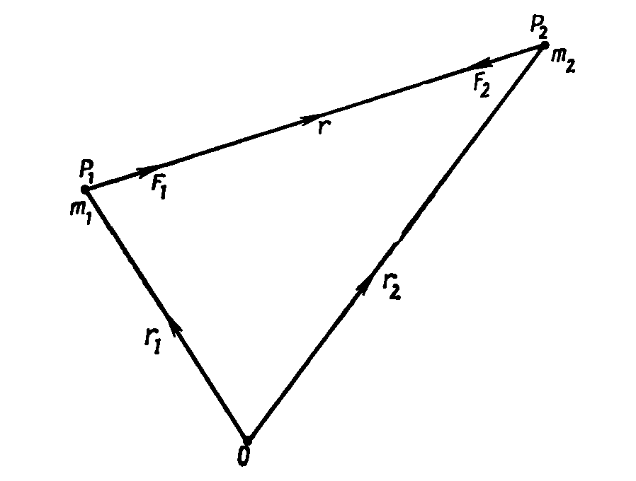
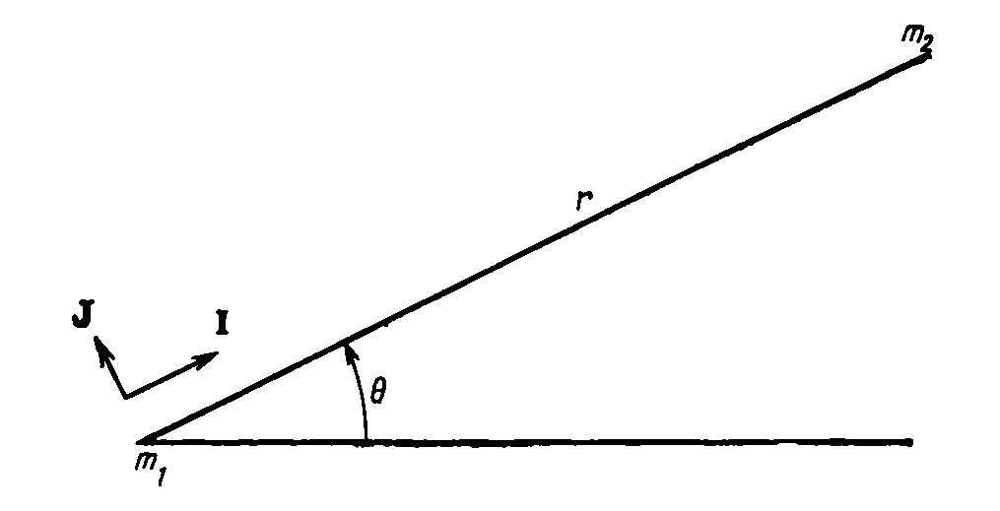
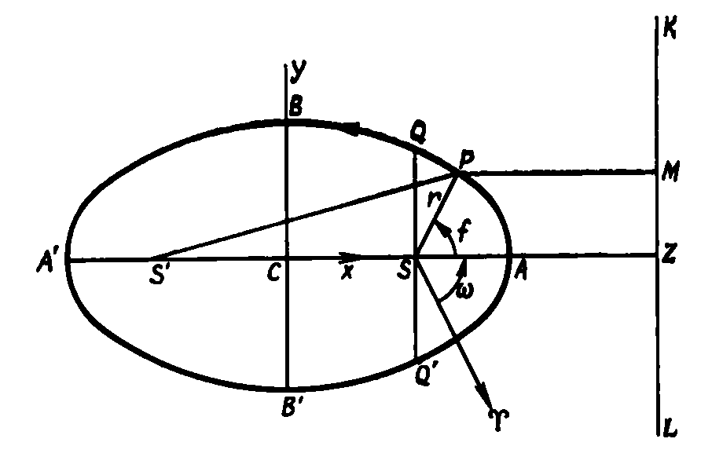
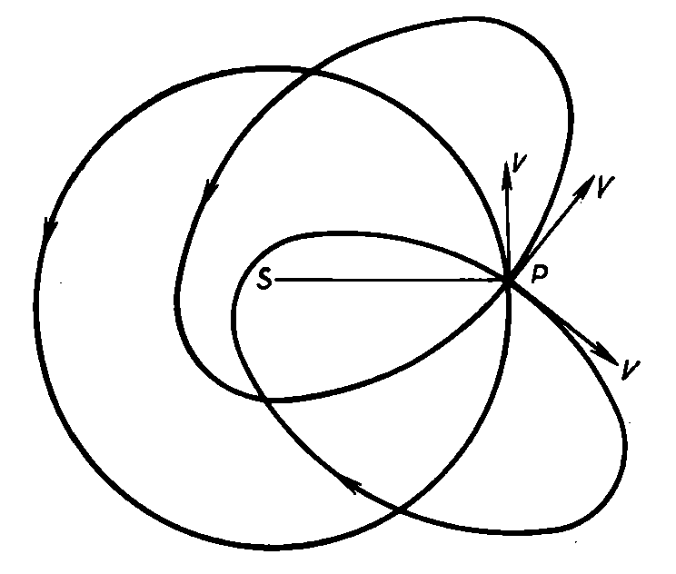
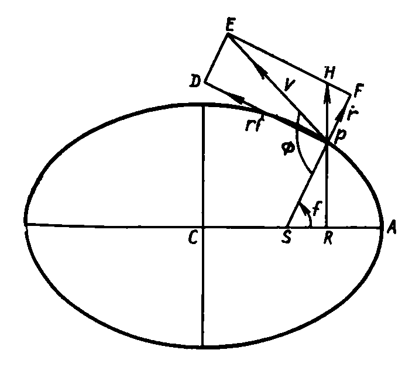
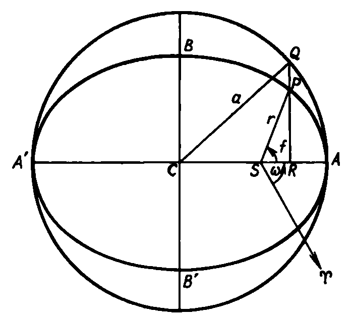
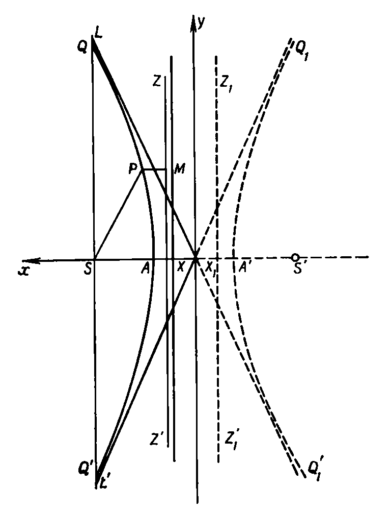
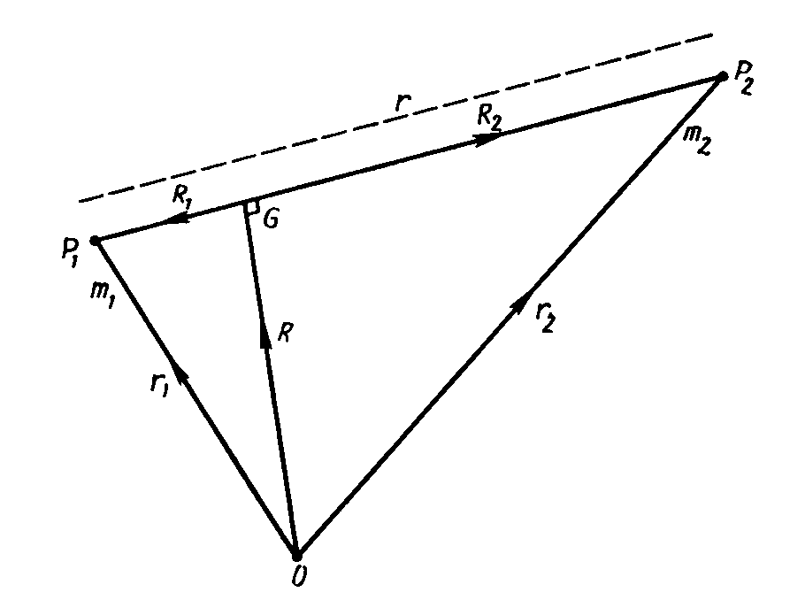
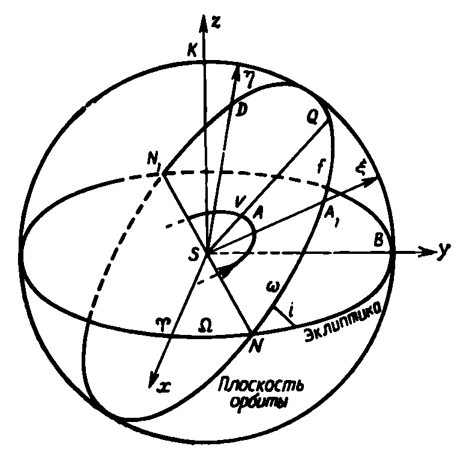

# Глава 4. Задача двух тел

## 4.1. Введение

Задача двух тел, впервые поставленная и решенная Ньютоном, формулируется следующим образом: «По заданным в некоторый момент времени положениям и скоростям двух частиц с известными массами, движущихся под действием сил взаимного притяжения, вычислить их положения и скорости в любой момент времени».

Задача двух тел важна по двум причинам. Во-первых, это единственная задача динамики гравитирующих тел, не считая некоторых специальных случаев задачи трех тел, для которой мы имеем полное и общее решение. Во-вторых, многие практические задачи орбитального движения могут быть отнесены в первом приближении к задаче двух тел. Решение задачи двух тел может быть использовано для получения приближенных параметров орбиты и при предварительных вычислениях. Оно может служить начальным приближением при получении аналитических решений, обладающих более высокой степенью точности. Такие решения, относящиеся к общей теории возмущений, будут обсуждаться в последующих разделах.

Например, задача определения орбиты Луны, движущейся вокруг Земли, так же как орбиты планеты, движущейся вокруг Солнца, является (в первом приближении) задачей двух тел. Однако в обоих случаях влияние притяжения других тел (в первом случае — Солнца, во втором случае — других планет) усложняет простую картину, получающуюся из решения задачи двух тел. Еще пример: полет межпланетного космического аппарата (КА) от Земли к Марсу представляет собой задачу четырех тел: Солнце—Земля—Марс—КА. Тем не менее, если разбить эту задачу на три задачи двух тел:
1) Земля—КА (вблизи Земли),
2) Солнце—КА (в межпланетном пространстве),
3) Марс—КА (вблизи Марса),

то можно получить информацию, полезную на этапе предварительного планирования полета.

Таким образом, общее решение задачи двух тел имеет большую практическую ценность. Поэтому такое решение будет подробно рассмотрено в данной главе.

Вот текст этой страницы, отформатированный в Markdown с математическими формулами в LaTeX:

## 4.2. Законы Ньютона

Законы движения Ньютона заложили фундамент динамики. Некоторые, а может быть и все, из этих законов неявно содержались в сумме научных знаний того времени. Однако данные Ньютоном точные формулировки законов движения и анализ полученных из них и из закона всемирного тяготения следствий внесли в науку большой вклад, чем работа любого из современников Ньютона. Законы Ньютона можно сформулировать следующим образом:

1) каждое тело остается в состоянии покоя или равномерного и прямолинейного движения, пока оно не будет выведено из этого состояния под действием силы, приложенной извне;
2) скорость изменения импульса тела пропорциональна приложенной силе и направлена вдоль линии действия силы;
3) каждому действию соответствует равное и противоположно направленное противодействие.

Система векторных обозначений является удобным способом лаконичного выражения динамических понятий. На любом этапе исследования можно перейти от векторных величин к скалярным, введя удобную систему координат и используя связи между векторами и их проекциями на координатные оси.

Пусть $\mathbf{r}$, $\mathbf{V}$ и $\mathbf{a}$ обозначают положение, скорость и ускорение тела массы $m$ в системе с началом в $O$, так что

$$
 \mathbf{V} = \frac{\mathrm{d}\mathbf{r}}{\mathrm{d}t} 
$$

и

$$
 \mathbf{a} = \frac{\mathrm{d}\mathbf{V}}{\mathrm{d}t} = \frac{\mathrm{d}^2\mathbf{r}}{\mathrm{d}t^2}. 
$$

Тогда импульс тела равен $m\mathbf{V}$, а его кинетический момент равен

$$
 m\mathbf{r} \times \mathbf{V} = m\mathbf{r} \times \dot{\mathbf{r}}. 
$$

В векторных обозначениях соотношение

$$
 \frac{\mathrm{d}(m\mathbf{V})}{\mathrm{d}t} = \mathbf{F} \tag{4.1} 
$$

объединяет законы 1) и 2). Здесь $\mathbf{V}$ — скорость тела, $m$ — его масса и $\mathbf{F}$ — внешняя сила, причем единица силы выбрана таким образом, чтобы коэффициент пропорциональности равнялся единице. Таким образом, имеем

$$
 m \frac{\mathrm{d}^2\mathbf{r}}{\mathrm{d}t^2} = \mathbf{F}. \tag{4.2} 
$$

Здесь предполагается, что масса тела постоянна. Следует заметить, что в случае движения ракеты такое предположение делать нельзя, если двигатель ракеты работает.
Если на тело действует более одной силы, то уравнение (4.2) может быть записано в более общем виде

$$
 m \frac{\mathrm{d}^2 \mathbf{r}}{\mathrm{d}t^2} = \sum_{i=1}^k \mathbf{F}_i, \tag{4.3} 
$$

где $k$ действующих сил складываются векторно.

## 4.3. Закон всемирного тяготения Ньютона

Ньютонов закон всемирного тяготения, один из самых фундаментальных научных законов, является основой небесной механики и астродинамики. Изучением следствий этого закона в течение двух с половиной столетий, прошедших с момента его открытия, занимались самые выдающиеся математики и астрономы. Много изящных математических методов было разработано, чтобы решить сложные системы уравнений, к которым приводят задачи движения систем гравитирующих тел.

Сам закон формулируется с обманчивой простотой: каждая частица вещества во Вселенной притягивает каждую другую частицу вещества с силой, прямо пропорциональной произведению масс и обратно пропорциональной квадрату расстояния между ними.

Следовательно, для двух частиц на расстоянии $r$ имеет место соотношение

$$
 F = G \frac{m_1 m_2}{r^2}, 
$$

где $F$ — сила притяжения, $m_1$ и $m_2$ — массы частиц, $r$ — расстояние между ними, а $G$ — гравитационная постоянная, часто называемая универсальной гравитационной постоянной.

## 4.4. Решение задачи двух тел

На рис. 4.1 сила тяготения $\mathbf{F}_1$, действующая на $m_1$, направлена вдоль вектора $\mathbf{r}$ в сторону тела $m_2$, в то время как сила $\mathbf{F}_2$, приложенная к $m_2$, действует в противоположном направлении.

Из третьего закона Ньютона

$$
 \mathbf{F}_1 = -\mathbf{F}_2. \tag{4.4} 
$$

Имеем
$$
 \mathbf{F}_1 = G \frac{m_1 m_2}{r^2} \frac{\mathbf{r}}{r}. \tag{4.5} 
$$

Введем векторы $\mathbf{r}_1$ и $\mathbf{r}_2$, направленные из некоторой фиксированной точки $O$ к частицам с массами $m_1$ и $m_2$ соответственно. После подстановки (4.2) в (4.4), (4.5) уравнения движения частиц под действием сил взаимного притяжения принимают вид

$$
m_1 \frac{\mathrm{d}^2\mathbf{r}_1}{\mathrm{d}t^2} = G \frac{m_1 m_2}{r^2} \frac{\mathbf{r}}{r}, \tag{4.6}
$$
$$
m_2 \frac{\mathrm{d}^2\mathbf{r}_2}{\mathrm{d}t^2} = -G \frac{m_1 m_2}{r^2} \frac{\mathbf{r}}{r}. \tag{4.7}
$$

*(Рис. 4.1)*

Складывая уравнения (4.6) и (4.7), получаем

$$
m_1 \frac{\mathrm{d}^2\mathbf{r}_1}{\mathrm{d}t^2} + m_2 \frac{\mathrm{d}^2\mathbf{r}_2}{\mathrm{d}t^2} = 0,
$$

откуда следуют два интеграла:

$$
m_1 \frac{\mathrm{d}\mathbf{r}_1}{\mathrm{d}t} + m_2 \frac{\mathrm{d}\mathbf{r}_2}{\mathrm{d}t} = \mathbf{a} \tag{4.8}
$$

и

$$
m_1\mathbf{r}_1 + m_2\mathbf{r}_2 = \mathbf{a}t + \mathbf{b}, \tag{4.9}
$$

где $\mathbf{a}$ и $\mathbf{b}$ — постоянные векторы.

Если ввести радиус-вектор $\mathbf{R}$ центра масс $G$ двух частиц $m_1$ и $m_2$, то

$$
M\mathbf{R} = m_1\mathbf{r}_1 + m_2\mathbf{r}_2,
$$

где $M = m_1 + m_2$.

Тогда уравнения (4.8) и (4.9) принимают вид

$$
M \frac{\mathrm{d}\mathbf{R}}{\mathrm{d}t} = \mathbf{a}, \qquad M\mathbf{R} = \mathbf{a}t + \mathbf{b}.
$$

Эти соотношения показывают, что центр масс системы движется с постоянной скоростью.

Уравнения (4.6) и (4.7) можно переписать так:

$$
\frac{\mathrm{d}^2\mathbf{r}_1}{\mathrm{d}t^2} = Gm_2 \frac{\mathbf{r}}{r^3} \tag{4.10}
$$

и

$$
\frac{\mathrm{d}^2\mathbf{r}_2}{\mathrm{d}t^2} = -Gm_1 \frac{\mathbf{r}}{r^3}. \tag{4.11}
$$

Вычитая (4.11) из (4.10), получаем

$$
\frac{\mathrm{d}^2}{\mathrm{d}t^2} (\mathbf{r}_1 - \mathbf{r}_2) = G(m_1 + m_2) \frac{\mathbf{r}}{r^3},
$$

*(Рис. 4.2)*

но $\mathbf{r}_1 - \mathbf{r}_2 = -\mathbf{r}$, следовательно,

$$
\frac{\mathrm{d}^2\mathbf{r}}{\mathrm{d}t^2} + \frac{\mu\mathbf{r}}{r^3} = 0, \tag{4.12}
$$

где $\mu = G(m_1 + m_2)$.

Умножая векторно (4.12) на $\mathbf{r}$, получаем

$$
\mathbf{r} \times \frac{\mathrm{d}^2\mathbf{r}}{\mathrm{d}t^2} = 0
$$

и после интегрирования

$$
\mathbf{r} \times \frac{\mathrm{d}\mathbf{r}}{\mathrm{d}t} = \mathbf{h}, \tag{4.13}
$$

где $\mathbf{h}$ — постоянный вектор.

Это есть интеграл кинетического момента. Поскольку $\mathbf{h}$ — постоянный вектор, имеющий неизменное направление при всех $t$, то движение одного тела относительно другого совершается в плоскости, определяемой направлением $\mathbf{h}$.

В этой плоскости вводятся полярные координаты $r$ и $\theta$ (рис. 4.2). Проекции скорости на направление радиуса-вектора, проведенного из $m_1$ в $m_2$, и на перпендикуляр к радиусу-вектору равны $\dot{r}$ и $r\dot{\theta}$, где точкой обозначается дифференцирование по времени $d/dt$.

Тогда

$$
\dot{\mathbf{r}} = \mathbf{I}\dot{r} + \mathbf{J}r\dot{\theta}. \tag{4.14}
$$

Здесь $\mathbf{I}$ и $\mathbf{J}$ — это единичные векторы, направленные вдоль радиуса-вектора и вдоль перпендикуляра к нему. Подставляя (4.14) в (4.13), получаем

$$
\mathbf{Ir} \times (\mathbf{I}\dot{r} + \mathbf{J}r\dot{\theta}) = r^2\dot{\theta}\mathbf{K} = \mathbf{h},
$$

где $\mathbf{K}$ — единичный вектор вдоль нормали к плоскости орбиты. Тогда можно написать

$$
r^2\dot{\theta} = h. \tag{4.15}
$$

Как видно, постоянная $h$ равна удвоенной скорости, с которой радиус-вектор заметает площадь. Это и есть математическая форма второго закона Кеплера.

Если теперь умножить уравнение (4.12) скалярно на $\dot{\mathbf{r}}$, то получим соотношение

$$
\dot{\mathbf{r}} \cdot \frac{\mathrm{d}^2\mathbf{r}}{\mathrm{d}t^2} + \mu \frac{\dot{\mathbf{r}} \cdot \mathbf{r}}{r^3} = 0,
$$

которое можно проинтегрировать. В результате находим

$$
\frac{1}{2}\dot{\mathbf{r}} \cdot \dot{\mathbf{r}} - \frac{\mu}{r} = C
$$

или

$$
\frac{1}{2}v^2 - \frac{\mu}{r} = C. \tag{4.16}
$$

Здесь $C$ — постоянная интегрирования. Это соотношение представляет собой закон сохранения энергии системы. Заметим, что величина $C$ не есть полная энергия системы; член $\frac{1}{2}v^2$ относится к кинетической энергии, а член $-\mu/r$ — к потенциальной энергии системы (см. разд. 4.10).

Обращаясь снова к рис. 4.2 и вспоминая, что проекции ускорения тела $m_2$ на радиус-вектор и на перпендикулярное направление равны соответственно $\ddot{r} - r\dot{\theta}^2$ и $\frac{1}{r} \frac{\mathrm{d}}{\mathrm{d}t} (r^2\dot{\theta})$, уравнение (4.12) можно записать в виде

$$
\mathbf{I}(\ddot{r} - r\dot{\theta}^2) + \mathbf{J} \left[ \frac{1}{r} \frac{\mathrm{d}}{\mathrm{d}t} (r^2\dot{\theta}) \right] + \frac{\mu}{r^3}\mathbf{I}r = 0.
$$

Откуда следуют два скалярных уравнения:

$$
\ddot{r} - r\dot{\theta}^2 = -\frac{\mu}{r^2}, \tag{4.17}
$$

$$
\frac{1}{r} \frac{\mathrm{d}}{\mathrm{d}t} (r^2\dot{\theta}) = 0. \tag{4.18}
$$

Из второго уравнения получаем интеграл кинетического момента

$$
 r^2\dot{\theta} = h. \tag{4.19} 
$$

Используя обычную подстановку $u = 1/r$ и исключая из (4.17), (4.19) время, получаем

$$
 \frac{\mathrm{d}^2u}{\mathrm{d}\theta^2} + u = \frac{\mu}{h^3}. 
$$

Общее решение этого уравнения имеет вид

$$
 u = \frac{\mu}{h^3} + A \cos(\theta - \omega), \tag{4.20} 
$$

где $A$ и $\omega$ — две постоянные интегрирования.

После обратного перехода к $r$ (4.20) принимает вид

$$
 r = \frac{h^2/\mu}{1 + (Ah^2/\mu) \cos(\theta - \omega)}. 
$$

Уравнение конического сечения в полярных координатах можно записать следующим образом:

$$
 r = \frac{p}{1 + e \cos(\theta - \omega)}, \tag{4.21} 
$$

где

$$
 p = h^2/\mu, \quad e = Ah^2/\mu. 
$$

Из решения задачи двух тел следует, в частности, и первый закон Кеплера. Орбиты одного тела относительно другого классифицируются в соответствии с величиной эксцентриситета: при $0 \le e < 1$ орбита является эллипсом, при $e = 1$ — параболой, при $e > 1$ — гиперболой.

Следует заметить, что случай $e = 1$ включает в себя также вырожденные в прямую линию эллипс, параболу и гиперболу (см. разд. 4.8). Случай $e = 0$ соответствует эллипсу с нулевым эксцентриситетом (т. е. окружности). Далее все эти случаи будут подробно исследованы.

## 4.5. Эллиптическая орбита

Эллипс — это геометрическое место точек, для которых отношение расстояния до фиксированной точки, называемой фокусом, к расстоянию до фиксированной линии, называемой директрисой, постоянно (и меньше единицы).

Пусть на рис. 4.3 точка $S$ будет фокусом, а линия $KL$ директрисой, причем $SZ \perp KL$. Возьмем такую точку $P$, чтобы длины $SP$ и $PM$ были связаны соотношением

$$
 SP/PM = e (<1). \tag{4.22} 
$$

Тогда геометрическое место таких точек (т. е. фигура $APBA'B'A$), для которых имеет место соотношение (4.22) при постоянном $e$, является эллипсом с эксцентриситетом $e$ и с центром в $C$. В этом эллипсе точка $S'$ является вторым фокусом, $AA' = 2a$ (большая ось), $BB' = 2b$ (малая ось), $b = a(1 - e^2)^{1/2}$, $CS/CA = e$ и $SP + PS' = 2a$.

Кроме того, хорда $QQ'$, проходящая через $S$ и параллельная малой оси, называется *фокальным параметром*; фокальный полупараметр $SQ (=SQ')$ имеет длину $p = a(1 - e^2)$.

*(Рис. 4.3)*

В декартовых координатах $Cx$ и $Cy$, введенных так, как показано на рис. 4.3, каноническое уравнение эллипса имеет вид

$$
 \frac{x^2}{a^2} + \frac{y^2}{b^2} = 1. 
$$

Если полярные координаты $r$ и $f$ введены таким образом, что $r = SP$, а $f = \angle ASP$, то уравнение эллипса в полярной форме примет вид

$$
 r = \frac{p}{1 + e \cos f} = \frac{a(1 - e^2)}{1 + e \cos f}. \tag{4.23} 
$$

Доказательство всех приведенных выше утверждений можно найти в любой книге, посвященной коническим сечениям.

В оставшейся части этой главы решение задачи двух тел применяется к задачам орбитального движения в Солнечной системе; однако, как будет видно в дальнейшем, многие понятия и результаты могут быть оставлены без изменений и в случаях, когда, например, рассматриваются двойные звезды.

Итак, пусть тело $P$ движется вокруг Солнца $S$. Фокус $S'$ часто называют пустым фокусом. Пусть в данный момент плоскость орбиты совпадает с плоскостью эклиптики. Возьмем в качестве опорного направление на точку весеннего равноденствия $\Upsilon$ (см. рис. 4.3). Тогда, если $\angle PS\Upsilon = \theta$ и $\angle AS\Upsilon = \omega$, истинная аномалия $f = \theta - \omega$ и уравнение орбиты имеет вид

$$
 r = \frac{a(1 - e^2)}{1 + e \cos(\theta - \omega)}. \tag{4.24} 
$$

Видно, что если $\theta = \omega$, то тело находится в перигелии и $r = a(1 - e)$. Если $\theta = 180^\circ + \omega$, то тело находится в афелии и $r = a(1 + e)$.

Из уравнения (4.15) получаем соотношение

$$
 r^2\dot{f} = h, \tag{4.25} 
$$

где $h$ — удвоенная секториальная скорость.

Поскольку площадь эллипса равна $\pi ab$ и эта площадь должна заметаться за время $T$, равное периоду обращения тела по орбите, то

$$
 \frac{2\pi ab}{T} = h 
$$

или

$$
 2\pi a^2(1 - e^2)^{1/2} = hT. 
$$

Далее, из уравнений (4.21) и (4.24) получаем

$$
 h^3 = \mu a(1 - e^2), 
$$

где $\mu = G(m_1 + m_2)$. Исключая $h$, окончательно находим

$$
 T = 2\pi(a^3/\mu)^{1/2}. \tag{4.26} 
$$

Это важное соотношение показывает, что период зависит только от величины большой полуоси и суммы масс.

Если $M_S$ и $m_1$ — массы Солнца и планеты соответственно, а $T_1$ и $a_1$ — период и большая полуось орбиты планеты, то уравнение (4.26) дает

$$
 G(M_S + m_1) = 4\pi^2 \frac{a_1^3}{T_1^2}. \tag{4.27} 
$$

Для другой планеты массы $m_2$, движущейся по орбите с периодом $T_2$ и большой полуосью $a_2$, имеем

$$
 G(M_S + m_2) = 4\pi^2 \frac{a_2^3}{T_2^2}. \tag{4.28} 
$$

Следовательно, из (4.27), (4.28) получаем

$$
 \frac{M_S + m_1}{M_S + m_2} = \left( \frac{a_1}{a_2} \right)^3 \left( \frac{T_2}{T_1} \right)^2. \tag{4.29} 
$$

Уравнение (4.29) представляет собой точную форму третьего закона Кеплера. Заметим, что фактически даже для Юпитера, самой массивной планеты, $m/M_S \sim 10^{-3}$, так что левая часть уравнения (4.29) близка к единице.

### 4.5.1. Измерение массы планеты

Если у планеты есть спутник, естественный или искусственный, то путем изучения орбиты этого спутника можно измерить массу планеты.

Пусть уравнение (4.27) относится к движению Земли по орбите вокруг Солнца ($m_1$ — масса Земли), причем искусственный спутник Земли массы $m'$ движется по орбите вокруг Земли с периодом $T'$ и большой полуосью $a'$. Тогда

$$
 G(m_1 + m') = 4\pi^2 \frac{a'^3}{T'^2}. 
$$

Следовательно,

$$
 \frac{m_1 + m'}{M_S + m_1} = \left( \frac{a'}{a_1} \right)^3 \left( \frac{T_1}{T'} \right)^2. \tag{4.30} 
$$

Массой спутника по сравнению с массой Земли, так же как массой Земли по сравнению с массой Солнца можно пренебречь. Тогда можно написать

$$
 \frac{m_1}{M_S} = \left( \frac{a'}{a_1} \right)^3 \left( \frac{T_1}{T'} \right)^2. \tag{4.31} 
$$

Величины в правой части уравнения (4.31) могут быть измерены, и, таким образом, может быть найдена масса Земли в единицах, равных массе Солнца.

Только три планеты в Солнечной системе не имеют спутников: Меркурий, Венера и Плутон*. Их массы были получены косвенным путем (значительно менее точно, чем массы других планет) по воздействиям на орбиты других планет. Эти возмущения слегка изменяют элементы орбит планет. Измерения таких отклонений позволяют получить значения масс планет, не имеющих спутников. В последние годы массы Венеры и Меркурия были измерены более точно, благодаря наблюдениям за искажениями орбит космических аппаратов, например «Маринера-10», вызванных влиянием гравитационных полей планет.

\* См. прим. ред. на с. 12. 
<!-- TODO need link -->

### 4.5.2. Скорость движения по эллиптической орбите

Пусть тело в точке $P$ ($SP = r$) имеет скорость $V$. Эта скорость, направленная по касательной к эллипсу в точке $P$, имеет радиальную компоненту $\dot{r}$ и поперечную компоненту $r\dot{f}$. Следовательно,

$$
 V^2 = \dot{r}^2 + r^2\dot{f}^2. \tag{4.32} 
$$

Из (4.23) и (4.25) получаем

$$
 \dot{r} = \frac{h}{p} e \sin f. \tag{4.33} 
$$

Кроме того, используя (4.25), находим

$$
 r\dot{f} = \frac{h}{r} = \frac{h}{p} (1 + e \cos f). \tag{4.34} 
$$

Возводя в квадрат и складывая (4.33) и (4.34), получаем

$$
 V^2 = \left(\frac{h}{p}\right)^2 (1 + 2e \cos f + e^2) 
$$

или

$$
 V^2 = \left(\frac{h}{p}\right)^2 [2 + 2e \cos f - (1 - e^2)]. \tag{4.35} 
$$

Воспользовавшись (4.23), уравнение (4.35) можно преобразовать к виду

$$
 V^2 = \frac{2h^2}{rp} - \left(\frac{h}{p}\right)^2 (1 - e^2). 
$$

Но $h^2/\mu = p = a(1 - e^2)$, следовательно,

$$
 V^2 = \mu \left( \frac{2}{r} - \frac{1}{a} \right). \tag{4.36} 
$$

Видно, что в перигелии, где $r = a(1 - e)$, скорость $V$ максимальна:

$$
 V_P^2 = \frac{\mu}{a} \left( \frac{1 + e}{1 - e} \right), 
$$

а в афелии, где $r = a(1 + e)$, минимальна:

$$
 V_A^2 = \frac{\mu}{a} \left( \frac{1 - e}{1 + e} \right). 
$$

Отсюда, в частности, следует, что $V_A V_P = \mu/a = \text{const}$.

Надо также отметить, что $V$ является функцией только расстояния $r$ [см. (4.36)]. Перепишем (4.36) по-другому:

$$
 a = \frac{\mu}{(2\mu/r) - V^2}. \tag{4.37} 
$$

Но

$$
 T = 2\pi \left( \frac{a^3}{\mu} \right)^{1/2}, \tag{4.38} 
$$

следовательно,

$$
 T = 2\pi \left( V^2 - \frac{2\mu}{r} \right)^{-3/2}. \tag{4.39} 
$$

Эти соотношения освещают некоторые интересные свойства эллиптического движения. Видно, что величина большой полуоси есть функция длины радиуса-вектора и квадрата скорости. Таким образом, если тело массы $m_1$ брошено на данном расстоянии $r$ от другого тела массы $m_2$ со скоростью $V$, то величина большой полуоси орбиты зависит только от величины скорости и не зависит от ее направления. 

*(Рис. 4.4)*

На рис. 4.4 все орбиты имеют один и тот же начальный радиус-вектор $SP$ и одинаковую по величине, но различную по направлению начальную скорость $V$. Все орбиты имеют одинаковую большую полуось $a$, определяемую выражением (4.37).

Из уравнения (4.38) или (4.39) следует, что периоды этих орбит также должны быть одинаковыми. Если бы из точки $P$ одновременно были брошены частицы с одинаковыми по величине, но различными по направлению скоростями, то после прохождения орбит, имеющих совершенно различную форму, эти частицы вернулись бы в точку $P$ в один и тот же момент времени.

Скорость на эллиптической орбите бывает удобно раскладывать на две компоненты, постоянные по величине. Одна компонента перпендикулярна радиус-вектору и, таким образом, изменяется по направлению; другая компонента перпендикулярна большой оси и, следовательно, постоянна как по величине, так и по направлению.

*(Рис. 4.5)*

На рис. 4.5 скорость $V$ разложена на компоненты $\dot{r}$ (направлена вдоль $SP$, равна $PE$) и $r\dot{f}$ (перпендикулярна $SP$, равна $PD$). Тогда нужные нам компоненты будут равны $HE$ и $PH$.

Имеем
$$
 HE = PD - FH = r\dot{f} - \dot{r} \operatorname{ctg} f. 
$$

----

4 А. Рой

Воспользовавшись уравнениями (4.33) и (4.34), получим

$$
 HE = h/p. \tag{4.40} 
$$

Далее можно написать

$$
 PH = PF \operatorname{cosec} f = \dot{r} \operatorname{cosec} f, 
$$

откуда, учитывая (4.33), находим

$$
 PH = eh/p. \tag{4.41} 
$$

Следует отметить, что в случае круговой орбиты $e = 0$ и постоянная компонента представляет собой круговую скорость $V_c$, определяемую формулой

$$
 V_c = h/p = (\mu/a)^{1/2}, \tag{4.42} 
$$

где $a$ — радиус круговой орбиты.

### 4.5.3. Угол между вектором скорости и радиусом-вектором

Пусть $\phi$ на рис. 4.5 обозначает угол между вектором скорости $PE$ и радиусом-вектором $SP$. Тогда

$$
 \angle SPE = 90^\circ + \angle DPE. 
$$

Имеем

$$
 \begin{aligned} \cos \angle DPE &= DP/PE = r\dot{f}/V, \\ \sin \angle DPE &= \dot{r}/V. \end{aligned} \tag{4.43} 
$$

Из первого уравнения (4.43), используя (4.25) и (4.36), получаем

$$
 \cos \angle DPE = \frac{h}{r\mu^{1/2} \left( \frac{2}{r} - \frac{1}{a} \right)^{1/2}}. 
$$

Учитывая, что $h^2 = \mu a (1 - e^2)$, после несложных преобразований находим

$$
 \cos \angle DPE = \left[ \frac{a^2 (1 - e^2)}{r(2a - r)} \right]^{1/2}, 
$$

откуда

$$
 \phi = 90^\circ + \arccos \left[ \frac{a^2 (1 - e^2)}{r(2a - r)} \right]^{1/2} 
$$

или

$$
 \sin \phi = \left[ \frac{a^2 (1 - e^2)}{r(2a - r)} \right]^{1/2}. \tag{4.44} 
$$

Разрешая (4.44) относительно $e$, получаем

$$
 e = \left[ 1 - \frac{r}{a^2} (2a - r) \sin^2 \phi \right]^{1/2}. \tag{4.45} 
$$

Если воспользоваться уравнениями (4.24), (4.25), (4.43) и (4.53), то можно получить следующие полезные соотношения:

$$
 \begin{aligned} \sin \phi &= \left( \frac{1 - e^2}{1 - e^2 \cos^2 E} \right)^{1/2} = \frac{1 + e \cos f}{(1 + e^2 + 2e \cos f)^{1/2}}, \\ \cos \phi &= - \frac{e \sin E}{(1 - e^2 \cos^2 E)^{1/2}} = - \frac{e \sin f}{(1 + e^2 + 2e \cos f)^{1/2}}. \end{aligned} \tag{4.46} 
$$

Величина $E$ называется эксцентрической аномалией и будет определена в следующем разделе.

### 4.5.4. Средняя, эксцентрическая и истинная аномалии

В этом разделе будут рассмотрены средняя, эксцентрическая и истинная аномалии и связи между ними для случая эллиптической орбиты.

Радиус-вектор за период $T$ поворачивается на $2\pi$ радиан, поэтому для средней угловой скорости $n$ (среднего движения) справедлива формула

$$
 n = 2\pi/T. \tag{4.47} 
$$

Соотношение

$$
 \frac{2\pi a^2 (1 - e^2)^{1/2}}{T} = h 
$$

можно переписать в виде

$$
 n a^2 (1 - e^2)^{1/2} = h. \tag{4.48} 
$$

Если $\tau$ — момент прохождения через перигелий, то радиус-вектор, вращающийся вокруг $S$ со средней угловой скоростью $n$, за время $(t - \tau)$ опишет угол

$$
 M = n(t - \tau). \tag{4.49} 
$$

Введенная таким образом величина $M$ называется *средней аномалией*.

*(Рис. 4.6)*

Построим на $AA'$ как на диаметре окружность (рис. 4.6) и проведем через точку $P$ на эллипсе линию, перпендикулярную большой оси $AA'$, до пересечения с окружностью в точке $Q$. Угол $QCA$, обычно обозначаемый $E$, называется *эксцентрической аномалией* и связан с истинной аномалией $f$.

4 \*

Имеем
$$
SR = CR - CS = a \cos E - ae,
$$
но
$$
SR = r \cos f,
$$
следовательно,
$$
r \cos f = a (\cos E - e). \tag{4.50}
$$
Кроме того, в силу свойств эллипса имеет место соотношение
$$
PR/QR = b/a. \tag{4.51}
$$
В результате получаем
$$
r \sin f = b \sin E
$$
или
$$
r \sin f = a (1 - e^2)^{1/2} \sin E. \tag{4.52}
$$
Возводя в квадрат (4.50) и (4.52) и складывая, находим
$$
r = a (1 - e \cos E). \tag{4.53}
$$
Имеем
$$
r \cos f = r \left( 1 - 2 \sin^2 \frac{f}{2} \right),
$$
откуда
$$
2r \sin^2 (f/2) = r (1 - \cos f). \tag{4.54}
$$
Используя (4.50) и (4.53), получаем
$$
2r \sin^2 (f/2) = a (1 + e) (1 - \cos E), \tag{4.55}
$$
и аналогично
$$
2r \cos^2 (f/2) = a (1 - e) (1 + \cos E). \tag{4.56}
$$
Разделив (4.55) на (4.56), окончательно находим
$$
\tg \left( \frac{f}{2} \right) = \left( \frac{1 + e}{1 - e} \right)^{1/2} \tg \left( \frac{E}{2} \right). \tag{4.57}
$$

Эксцентрическая аномалия $E$ и средняя аномалия $M$ связаны между собой важным уравнением, называемым уравнением Кеплера. Выведем его.

Из второго закона Кеплера имеем
$$
\frac{\text{площадь } SPA}{\text{площадь эллипса}} = \frac{t - \tau}{T},
$$
или
$$
\text{площадь } SPA = \frac{\pi a b (t - \tau)}{T},
$$
или, используя (4.47),
$$
\text{площадь } SPA = \frac{1}{2} ab M. \tag{4.58}
$$
С другой стороны, имеем
$$
\text{площадь } SPA = \text{площадь } SPR + \text{площадь } RPA.
$$

Если разделить площадь $RPA$ на узкие полосы, параллельные малой оси, и воспользоваться свойством (4.51), то можно показать, что

$$
 \text{площадь } RPA = \frac{b}{a} (\text{площадь } QRA). 
$$

Тогда, воспользовавшись (4.50) и (4.52), получаем

$$
 \text{площадь } SPA = \text{площадь } SPR + \frac{b}{a} (\text{площадь } QRA) = 
$$

$$
 = \text{площадь } SPR + \frac{b}{a} (\text{площадь } QCA - \text{площадь } QCR) = 
$$

$$
 = \frac{1}{2}r^2 \sin f \cos f + \frac{b}{a} \left(\frac{1}{2}a^2E - \frac{1}{2}a^2 \sin E \cos E\right) = \frac{1}{2}ab (E - e \sin E). \tag{4.59}
$$

Если сравнить (4.58) и (4.59), то видно, что имеет место связь

$$
 E - e \sin E = M = n(t - \tau). \tag{4.60} 
$$

Это и есть уравнение Кеплера. Следует отметить, что здесь и $E$ и $M$ измеряются в радианах.

### 4.5.5. Решение уравнения Кеплера

В некоторых астрономических и астродинамических приложениях по заданной эксцентрической аномалии $E$ и известному эксцентриситету орбиты требуется определить среднюю аномалию $M$. В этих случаях $M$ без всяких затруднений определяется из уравнения Кеплера (4.60). Однако значительно чаще бывают известны $M$ и $e$ и требуется найти соответствующее значение $E$. Для решения этой задачи используются различные методы последовательных приближений. Разработкой таких методов решения уравнения Кеплера занимались многие математики и астрономы, в том числе и сам Кеплер.

Обычный метод решения состоит в получении приближенного значения $E$, почти удовлетворяющего уравнению (4.60), с использованием таблиц или графиков [1, 2, 6]. Если эксцентриситет меньше 0,1, то в качестве хорошего начального приближения $E$ (обозначим его $E_0$) можно взять $E_0 = M$; в других случаях необходимо воспользоваться таблицами или графиками. Пусть мы имеем начальное значение $E_0$, тогда истинное значение $E$ может быть представлено в виде

$$
 E = E_0 + \Delta E_0, 
$$

где $\Delta E_0$ мало по сравнению с $E_0$.

Подставляя $E$ в (4.60), получаем

$$
 (E_0 + \Delta E_0) - e \sin(E_0 + \Delta E_0) = M. \tag{4.61} 
$$

Раскладывая в ряд и оставляя члены только нулевого и первого порядка по $\Delta E_0$, находим
$$
 E_0 - e \sin E_0 + \Delta E_0 (1 - e \cos E_0) = M 
$$
или
$$
 \Delta E_0 = \frac{M - (E_0 - e \sin E_0)}{1 - e \cos E_0}. 
$$

Таким образом, получаем $E_1 = E_0 + \Delta E_0$, представляющее собой более точное значение $E$, и вся процедура повторяется до тех пор, пока не будет достигнута требуемая точность.

Другой метод строится по следующей схеме: переписываем уравнение Кеплера в виде
$$
 E = M + e \sin E, 
$$
выбираем, как и раньше, начальное приближение $E_0$, а затем вычисляем
$$
 \begin{aligned} E_1 &= M + e \sin E_0, \\ E_2 &= M + e \sin E_1, \\ E_3 &= M + e \sin E_2 \end{aligned} \tag{4.62} 
$$
и т. д.

*Пример.* Известно, что для орбиты Юпитера $T = 11,8622$ лет, $e = 0,04844$. Вычислить с точностью $10''$ величину эксцентрической аномалии $E$ Юпитера через пять лет после прохождения им перигелия.

Поскольку мы хотим, чтобы средняя аномалия $M$ выражалась в градусах, а $(t - \tau)$ выражено в годах, то нужно, чтобы среднее движение выражалось в градусах в год.

Так как $M$ увеличивается на $360^{\circ}$ за $T$ лет, то среднее движение $n$ равно $360^{\circ}/T$, так что
$$
 M = 5n = \frac{5 \times 360^{\circ}}{11,8622} = 151^{\circ} 44' 33,0''. 
$$

По величине $E$ должно быть того же порядка, что и $M$ (т. е. $\sim 540\ 000''$). Поэтому, чтобы получить $E$ в градусах с точностью до $10''$, нужно знать пять значащих цифр. Если в нашем распоряжении нет электронного калькулятора, то необходимо воспользоваться шестизначными логарифмическими таблицами.

*Первое приближение.* Поскольку $e$ мало, можно положить
$$
 E_1 = M = 151^{\circ} 44' 30''. 
$$

*Второе приближение.* Прежде чем воспользоваться уравнением Кеплера в виде
$$
 E = M + e \sin E, 
$$

переведем $M$ из градусов в радианы при помощи соотношения
$$
 M^{\circ} = \left( \frac{\pi M^{\circ}}{180} \right) [\text{радиан}].
$$

Тогда получаем
$$
 E^{\circ} = M^{\circ} + \left( \frac{180e}{\pi} \right)^{\circ} \sin E^{\circ}.
$$

В нашем примере $(180e/\pi) = 2,77541^{\circ}$, следовательно,
$$
 E_{2}^{\circ} = M^{\circ} + 2,77541^{\circ} \sin M^{\circ} = 151^{\circ} 44' 30'' + 1^{\circ} 18' 50''
$$
или
$$
 E_{2}^{\circ} = 153^{\circ} 03' 20''.
$$

*Третье приближение.* Имеем
$$
 E_{3} = M + e \sin E_{2},
$$
откуда
$$
 \begin{aligned} E_3 &= 151^{\circ} 44' 30'' + 2,77541^{\circ} \sin 153^{\circ} 03' 20'' = \\ &= 151^{\circ} 44' 30'' + 1^{\circ} 15' 27,4'', \end{aligned}
$$
т. е.
$$
 E_3 = 152^{\circ} 59' 57,4''.
$$

*Четвертое приближение.* Находим значение
$$
 E_4 = 153^{\circ} 00' 06'',
$$
которое и является решением задачи.

### 4.5.6. Уравнение центра

Истинную аномалию $f$ можно представить в виде ряда, члены которого зависят от эксцентриситета $e$ и средней аномалии $M$.
Легко видно, что если в процедуре (4.62) положить $E_{0} = M$, то, проведя разложение по степеням $e$ и выполнив соответствующие аналитические выкладки, можно получить

$$
 \begin{aligned} E = M + (e - e^{3}/8) \sin M + {}^1\!/_2 e^{2} \sin 2M + \\ +{}^3\!/_8e^{3} \sin 3M + O(e^{4}), \end{aligned} \tag{4.63} 
$$

где $O(e^{4})$ обозначает члены порядка $e^{4}$ и выше.

Кроме того, используя уравнение (4.57), можно показать [9], что справедливо следующее представление $f$ в виде ряда по $e$ и $E$:

$$
 \begin{aligned} f = E + (e + {}^1\!/_4 e^{3}) \sin E + {}^1\!/_4 e^{2} \sin 2E + \\ + {}^1\!/_{12} e^{3} \sin 3E + O(e^{4}). \end{aligned} \tag{4.64} 
$$

Объединение уравнений (4.63) и (4.64) дает уравнение центра

$$
 \begin{aligned} f - M = (2e - {}^1\!/_4 e^{3}) \sin M + 5/4 e^{2} \sin 2M + \\ + {}^{13}\!/_{12} e^{3} \sin 3M + O(e^{4}). \end{aligned} \tag{4.65} 
$$

Таким образом, если даны $e$ и $M$, то истинную аномалию можно найти непосредственно из уравнения (4.65). Заметим, однако, что использование этих разложений ограничивается орбитами с малым эксцентриситетом.

В ряде таблиц [7, 12] приведены значения истинной аномалии $f$ или значения величин $(r/a) \cos f$ и $(r/a) \sin f$ для различных эксцентриситетов. В подробных таблицах Кейли [3] собраны разложения большого числа часто используемых функций эллиптического движения.

### 4.5.7. Положение тела на эллиптической орбите

Как в астрономии, так и в астродинамике часто встречаются следующие две задачи: 1) определить положение и скорость тела по заданным элементам и времени; 2) определить элементы орбиты по заданным положению, скорости и времени.

Пример второй задачи: с Земли на орбиту вокруг Солнца запускается космический аппарат, причем известны его положение и скорость в момент запуска; требуется определить элементы эллиптической орбиты $a$, $e$ и $\tau$. Пример первой задачи: требуется найти положение тела спустя некоторое время после того, как оно было запущено на орбиту вокруг Солнца (элементы орбиты известны).

Ниже приводятся полученные в предыдущих разделах формулы, которые используются при решении этих задач:

$$
r = \frac{a(1 - e^2)}{1 + e \cos f}, \tag{4.66}
$$

$$
r = a(1 - e \cos E), \tag{4.67}
$$

$$
\tg\left(\frac{f}{2}\right) = \left(\frac{1 + e}{1 - e}\right)^{1/2} \tg\left(\frac{E}{2}\right), \tag{4.68}
$$

$$
M = E - e \sin E, \tag{4.69}
$$

$$
M = n(t - \tau), \tag{4.70}
$$

$$
h^2 = \mu a(1 - e^2), \tag{4.71}
$$

$$
V^2 = \mu\left(\frac{2}{r} - \frac{1}{a}\right), \tag{4.72}
$$

$$
T = 2\pi/n, \tag{4.73}
$$

$$
n = \mu^{1/2}a^{-3/2}, \tag{4.74}
$$

$$
\sin \phi = \left[\frac{a^2(1 - e^2)}{r(2a - r)}\right]^{1/2}. \tag{4.75}
$$

Заметим, что в этих формулах $a$, $e$ и $\tau$ — три элемента эллиптической орбиты. Предполагается, что $\mu$ известно. Если заданы эти элементы и время, то положение и скорость тела на орбите могут быть найдены следующим образом:
1) из уравнения (4.74) находим $n$;
2) подставляя $n$ в (4.70), определяем $M$;
3) решая уравнение Кеплера (4.69), находим $E$;
4) из (4.67) получаем $r$;
5) значение $r$ можно проверить, вычислив его независимо при помощи (4.68) и (4.66);
6) из уравнения (4.72) вычисляем $V$;
7) из (4.75) вычисляем $\phi$.

В другой задаче, когда предполагается, что заданы величины $r$, $\phi$, $t$ и $\mu$, последовательность действий следующая:
1) из уравнения (4.72) вычисляем $a$;
2) из (4.75) вычисляем $e$;
3) из (4.67) получаем $E$;
4) для вычисления $f$ используем выражение (4.66);
5) проверяем $f$, вычислив его независимо при помощи уравнения (4.68);
6) находим $M$ из уравнения (4.69);
7) находим $\tau$ из (4.70).

## 4.6. Параболическая орбита

В этом случае задачи двух тел (при $e = 1$) орбита незамкнута. Второе тело, приходя из бесконечности, при наибольшем сближении достигает максимальной скорости, после чего снова уходит в бесконечность (рис. 4.7).

Уравнение параболической орбиты, получающееся из (4.21), если в нем положить $e = 1$, имеет вид

$$
 r = \frac{p}{1 + \cos f}, \tag{4.76} 
$$

где, как и раньше, $p$ и $f$ представляют соответственно фокальный полупараметр и истинную аномалию.

Интеграл площадей имеет вид

$$
 r^2\dot{f} = h, \tag{4.77} 
$$

где $p = h^2/\mu$. Видно, что при $f = 0$ $r = p/2$.

Если оси декартовой системы координат $Ax$ и $Ay$ направлены так, как показано на рис. 4.7, то каноническое уравнение параболы записывается следующим образом:

$$
 y^2 = 2px. 
$$

Скорость $V$ тела на параболической орбите, как и раньше, представляется в виде

$$
 V^2 = \dot{r}^2 + r^2\dot{f}^2. 
$$

Дифференцируя (4.76) и учитывая (4.77), можно показать, что для $V$ справедливо следующее простое соотношение:

$$
 V^2 = 2\mu/r. \tag{4.78} 
$$

Имеет место интересная связь между круговой и параболической скоростями. В разд. 4.5.2 было показано, что скорость $V_c$ на круговой орбите радиуса $a$ определяется формулой

$$
 V_c^2 = \mu/a. \tag{4.79} 
$$

Если тело получит такой импульс, что его скорость $V$ станет удовлетворять соотношению

$$
 V^2 = 2\mu/a, \tag{4.80} 
$$

то тело перейдет на параболическую орбиту и уйдет по ней в бесконечность. Тело достигнет бесконечности с нулевой скоростью (в уравнении (4.78) надо положить $r = \infty$), поэтому параболическую скорость называют еще скоростью освобождения. Из уравнений (4.79) и (4.80) видно, что
(скорость освобождения) = (круговая скорость) $\times \sqrt{2}$.
$$
 \tag{4.81} 
$$

Это соотношение полезно запомнить.

Теперь уравнение (4.76) можно записать в виде

$$
 r = \frac{p}{2} \sec^2 \frac{f}{2} = \frac{p}{2} \left( 1 + \text{tg}^2 \frac{f}{2} \right). 
$$

Тогда (4.77) даст

$$
 \left( \frac{p}{2} \right)^2 f \sec^4 \frac{f}{2} = (p\mu)^{1/2} 
$$

или

$$
 4 \left( \frac{\mu}{p^3} \right)^{1/2} dt = \left( \sec^2 \frac{f}{2} + \sec^2 \frac{f}{2} \text{tg}^2 \frac{f}{2} \right) df. 
$$

Интегрируя, получаем

$$
 2 \left( \frac{\mu}{p^3} \right)^{1/2} (t - \tau) = \text{tg} \frac{f}{2} + \frac{1}{3} \text{tg}^3 \frac{f}{2}, \tag{4.82} 
$$

где $\tau$ — момент прохождения перигелия.

Если ввести $\bar{n}$ таким образом, чтобы
$$
 \bar{n}^2 p^3 = \mu, 
$$
[ср. с (4.74)] и положить
$$
 D = \operatorname{tg} \frac{f}{2}, 
$$
то уравнение (4.82) запишется в виде
$$
 D + \frac{D^3}{3} = 2\bar{n}(t - \tau). \tag{4.83} 
$$

Уравнения (4.82) и (4.83) представляют собой модификации уравнения Баркера, которое широко применялось при изучении орбит комет, а теперь используется в астродинамике. При помощи этого уравнения были составлены таблицы, позволяющие путем интерполяции находить $f$ по $t - \tau$ и наоборот [13].

Чтобы решить уравнение Баркера, являющееся кубическим относительно $\operatorname{tg}(f/2)$, положим
$$
 \operatorname{tg} \frac{f}{2} = 2\operatorname{ctg} 2\theta = \operatorname{ctg}\theta - \operatorname{tg}\theta, 
$$
так что
$$
 \operatorname{tg}^3 \frac{f}{2} = -3 \operatorname{tg} \frac{f}{2} + \operatorname{ctg}^3\theta - \operatorname{tg}^3\theta. 
$$
Тогда (4.82) преобразуется к виду
$$
 \operatorname{ctg}^3\theta - \operatorname{tg}^3\theta = 6\bar{n}(t - \tau). 
$$
Введем $s$ следующим образом:
$$
 \operatorname{ctg}\theta = \left( \operatorname{ctg} \frac{s}{2} \right)^{1/3}. 
$$
Тогда
$$
 \operatorname{ctg} s = 3\bar{n}(t - \tau), 
$$
и путем последовательного решения уравнений
$$
 \begin{aligned} \operatorname{ctg} s &= 3\bar{n}(t - \tau), \\ \operatorname{ctg}\theta &= \left( \operatorname{ctg} \frac{s}{2} \right)^{1/3}, \\ \operatorname{tg} \frac{f}{2} &= 2\operatorname{ctg} 2\theta \end{aligned} \tag{4.84} 
$$
можно получить решение уравнения Баркера. После определения $\operatorname{tg} \frac{f}{2}$ значение $r$ находится из соотношения
$$
 r = \frac{p}{2} \left( 1 + \operatorname{tg}^2 \frac{f}{2} \right). \tag{4.85} 
$$
Скорость определяется из уравнения (4.78).

Для угла $\phi$ между вектором скорости и радиусом-вектором получаем формулу

$$
 \phi = 90^\circ + \arccos\left(\frac{r\dot{f}}{V}\right), 
$$

которая при помощи (4.77) и (4.78) приводится к виду

$$
 \phi = 90^\circ + \arccos\left(\frac{p}{2r}\right)^{1/2}. \tag{4.86} 
$$

Эту связь можно выразить следующим образом:

$$
 p = 2r \sin^2\phi. \tag{4.87} 
$$

Итак, если известны элементы параболической орбиты $p$ и $\tau$, то возможно прямое вычисление значений $r$, $V$ и $\phi$ для данного $t$ ($\mu$ считается известным).

Если, наоборот, заданы значения $\mu$, $r$, $V$, $\phi$ и $t$, то элементы параболической орбиты $p$ и $\tau$ могут быть найдены последовательным применением (4.87), (4.85) и (4.82).

## 4.7. Гиперболическая орбита

В астрономии гиперболические орбиты встречаются главным образом при исследовании движения комет и метеоров, в астродинамике же с такими орбитами сталкиваются очень часто. Например, для того чтобы вывести космический аппарат на межпланетную орбиту, требуется такая энергия, что орбиту космического аппарата относительно Земли, пока он не удалится приблизительно на один миллион километров, можно считать гиперболой.

Пусть точка $P$ движется так, что $SP/PM = e$ (см. рис. 4.8), где $e$ постоянно и больше единицы, а прямая $ZXZ$ перпендикулярна $SX$. Тогда $P$ описывает ветвь гиперболы $Q'AQ$, уравнение которой в полярных координатах имеет вид

$$
 r = \frac{p}{1 + e\cos f} = \frac{a(e^2 - 1)}{1 + e\cos f}. \tag{4.88} 
$$

При $f = 0$, $r = a(e - 1)$.

В декартовых координатах каноническое уравнение гиперболы записывается следующим образом:

$$
 \frac{x^2}{a^2} - \frac{y^2}{b^2} = 1. 
$$

Здесь $b^2 = a^2(e^2 - 1)$.

Очевидно, ветвь гиперболы $Q'_1A'Q_1$ может быть описана точкой $P_1$, движущейся аналогичным образом относительно $S'$, но эта ветвь нас не интересует, поскольку каждая конкретная точка описывает только одну ветвь.

Когда $r$ обращается в бесконечность, выполняется условие
$$
 1 + e \cos f = 0. \tag{4.89} 
$$
Обозначив соответствующее значение $f$ через $f_0$, получаем
$$
 f_0 = \arccos(-1/e), 
$$
а это означает, что истинная аномалия может изменяться только от $-\pi + \arccos(1/e)$ до $+\pi - \arccos(1/e)$. Прямые, соответствующие этим предельным значениям, касаются гиперболы и являются ее асимптотами. Они составляют с осью абсцисс угол $\pi - \arccos(1/e)$. Заметим, что асимптоты могут определяться также из соотношений
$$
 \operatorname{tg} \psi = \pm b/a, 
$$
где $\psi$ — угол с осью абсцисс. Фокальный полупараметр задается формулой
$$
 SQ = p = a(e^2 - 1). 
$$

Как и для случая эллиптического движения, доказательство всех этих свойств можно найти в любой книге, посвященной коническим сечениям.

*(Рис. 4.8)*

### 4.7.1. Скорость на гиперболической орбите

Интеграл площадей в случае гиперболической орбиты имеет вид
$$
 r^2\dot{f} = h = \mu^{1/2} p^{1/2}. \tag{4.90} 
$$
Действуя так же, как в разд. 4.5.2 и воспользовавшись уравнениями (4.88) и (4.90), найдем, что для скорости $V$ имеет место формула
$$
 V^2 = \mu \left( \frac{2}{r} + \frac{1}{a} \right). \tag{4.91} 
$$
В перигелии
$$
 V_P^2 = \frac{\mu}{a} \left( \frac{e+1}{e-1} \right). \tag{4.92} 
$$

Заметим, что при $r = \infty$
$$
 V^2 = \mu/a. \tag{4.93} 
$$

Другими словами, тело, достигнув бесконечности, имеет ненулевую скорость.

Скорость на гиперболической орбите можно разложить на две компоненты $h/p$ и $eh/p$, перпендикулярные радиусу-вектору и оси $SA$ соответственно. Это следует непосредственно из того, что уравнение и для эллипса, и для гиперболы имеет вид
$$
 r = \frac{p}{1 + e \cos f}, 
$$
так что соответствующий анализ, выполненный в разд. 4.6.3, справедлив и для гиперболического случая. Такой же вывод справедлив и для параболической орбиты, когда $e = 1$, причем тогда обе компоненты равны по величине.

Угол между вектором скорости и радиусом-вектором находится так же, как и в случае эллиптической орбиты. Имеем
$$
 \phi = 90^\circ + \arccos\left(\frac{r\dot{f}}{V}\right), 
$$
откуда, воспользовавшись (4.90) и (4.91), получаем
$$
 \phi = 90^\circ + \arccos\left[\frac{a^2(e^2 - 1)}{r(2a + r)}\right]^{1/2}. \tag{4.94} 
$$

Разрешив уравнение (4.94) относительно $e$, находим
$$
 e = \left[1 + \frac{r}{a^2}(2a + r)\sin^2\phi\right]^{1/2}. \tag{4.95} 
$$

Как и в случае эллиптической орбиты, легко получаются следующие соотношения между $\phi$, $f$ и $F$:
$$
 \begin{aligned} \sin\phi &= \left(\frac{e^2 - 1}{e^2 \operatorname{ch}^2 F - 1}\right)^{1/2} = \frac{1 + e\cos f}{(1 + e^2 + 2e\cos f)^{1/2}}, \\ \cos\phi &= -\frac{e\operatorname{sh}F}{(e^2\operatorname{ch}^2 F - 1)^{1/2}} = -\frac{e\sin f}{(1 + e^2 + 2e\cos f)^{1/2}}. \end{aligned} \tag{4.96} 
$$

Здесь $F$ — величина, аналогичная эксцентрической аномалии, которая будет введена в следующем разделе.

### 4.7.2. Положение на гиперболической орбите

В случае гиперболической орбиты справедливы все уравнения, аналогичные уравнениям (4.66)—(4.75) для эллиптической орбиты, за исключением (4.73).

Введем $\nu$ так, что
$$
 \nu^2 a^3 = \mu. \tag{4.97} 
$$

Из уравнения (4.88) получаем
$$
 \cos f = \frac{a(e^2 - 1)}{er} - \frac{1}{e}, 
$$
откуда находим
$$
 \frac{\mathrm{d}f}{\mathrm{d}r} = - \frac{a(e^2 - 1)^{1/2}}{r[(a + r)^2 - a^2e^2]^{1/2}}. \tag{4.98} 
$$

Из уравнений (4.90) и (4.97) получаем
$$
 \nu \frac{\mathrm{d}t}{\mathrm{d}r} = \frac{r}{a[(a + r)^2 - a^2e^2]^{1/2}}. \tag{4.99} 
$$

Введем теперь переменную $F$, аналогичную эксцентрической аномалии $E$ для эллиптической орбиты, следующим образом:
$$
 r = a(e \operatorname{ch} F - 1). \tag{4.100} 
$$

Тогда
$$
 \operatorname{ch} F = \frac{a + r}{ae} 
$$
и уравнение (4.99) принимает вид
$$
 \nu \frac{\mathrm{d}t}{\mathrm{d}F} = e \operatorname{ch} F - 1. 
$$

Интегрируя, получаем уравнение
$$
 e \operatorname{sh} F - F = M = \nu(t - \tau), \tag{4.101} 
$$
аналогичное уравнению Кеплера.

При решении уравнения (4.101) возникают те же проблемы, что и при решении уравнения Кеплера для эллиптического движения. Первая проблема состоит в нахождении приближенного значения $F$. Один из возможных методов решения этой задачи состоит в том, что строятся графики функций
$$
 y_1 = \frac{M + F}{e} \quad \text{и} \quad y_2 = \operatorname{sh} F. 
$$
Их пересечение ($y_1 = y_2$) дает необходимое приближение $F$ при данном $M$. Другой метод состоит в следующем: заметим, что при $F < 2,5$ можно написать
$$
 (e \operatorname{sh} F) - F \simeq \frac{eF^3}{6} + (e - 1)F = M. 
$$

Кубическое уравнение
$$
 F^3 + \frac{6(e - 1)}{e} F - \frac{6M}{e} = 0 \tag{4.102} 
$$
имеет решение
$$
 F = Y \operatorname{sh} w, 
$$
$$
\text{где}\quad\operatorname{sh} 3w = 3M/Y(e - 1), \quad Y = [8(e - 1)/e]^{1/2}. 
$$

Следует отметить, что если $e \sim 1$, то надо решать уравнение
$$
 F^3 = 6M/e. 
$$

Если $F > 2,5$, то в качестве начального приближения можно использовать значение
$$
 F \simeq \ln(2M/e), \tag{4.103} 
$$
где $\ln$ — натуральный логарифм.

Выбор уравнения (4.102) или (4.103) определяется величиной $M$, соответствующей значению $F = 2,5$; эта величина приблизительно равна
$$
 m = 5e - 5/2. 
$$
Если $M < (5e - 5/2)$, то $F < 2,5$; если $M > (5e - 5/2)$, то $F > 2,5$.

После того как $F$ найдено, из уравнения
$$
 \operatorname{tg}(45^\circ + q/2) = \exp F 
$$
получаем функцию Гудермана $q$ от $F$. Тогда $f$ определяется из соотношений
$$
 \sin f = \frac{(e^2 - 1)^{1/2} \sin q}{e - \cos q}, 
$$
$$
 \cos f = \frac{e \cos q - 1}{e - \cos q}. 
$$

Этот метод позволяет обойтись без гиперболических функций. С другой стороны, из уравнений (4.88) и (4.100) имеем
$$
 \frac{(e^2 - 1)}{1 + e \cos f} = e \operatorname{ch} F - 1. \tag{4.104} 
$$

Воспользовавшись формулами
$$
 \cos f = \frac{1 - \operatorname{tg}^2(f/2)}{1 + \operatorname{tg}^2(f/2)}, 
$$
$$
 \operatorname{ch} F = \frac{1 + \operatorname{th}^2(F/2)}{1 - \operatorname{th}^2(F/2)}, 
$$
уравнение (4.104) можно представить в виде
$$
 \operatorname{tg} \frac{f}{2} = \left( \frac{e + 1}{e - 1} \right)^{1/2} \operatorname{th} \frac{F}{2}. \tag{4.105} 
$$

Соотношения, полученные в этом разделе, а также в разд. 4.7 и 4.7.1, могут быть использованы для определения положения тела на орбите в любой момент времени (при условии, что элементы $a$, $e$ и $\tau$ заданы) или для определения элементов по заданным положению и скорости. Метод решения этих задач аналогичен методу, описанному в разд. 4.5.7.

## 4.8. Прямолинейная орбита

Предположим, что длина большой оси эллиптической орбиты остается постоянной, а эксцентриситет стремится к единице. Тогда эллипс становится все более и более сплюснутым, а расстояние перигелия от фокуса $a(1 - e)$ стремится к нулю. В пределе эллипс вырождается в отрезок прямой, соединяющий два фокуса. Такая орбита называется прямолинейным эллипсом. Аналогичными предельными переходами получаются прямолинейные парабола и гипербола, представляющие собой прямые, проведенные из фокуса вдоль оси симметрии в бесконечность. При движении по прямолинейному эллипсу скорость максимальна в одном из фокусов и равна нулю в другом фокусе. В случае прямолинейной параболы скорость максимальна в фокусе и равна нулю на бесконечности. При движении по прямолинейной гиперболе скорость максимальна в фокусе, а на бесконечности имеет некоторую конечную величину.

Такие орбиты могут показаться абстрактными и не имеющими практического значения, однако это отнюдь не так. Например, для многих эллиптических и гиперболических орбит комет величина $e$ настолько близка к единице, что характер движения кометы по орбите весьма близок к поведению тела на прямолинейном эллипсе или на прямолинейной гиперболе. Во многих задачах астродинамики тела могут вести себя так, как если бы они двигались по прямолинейным гиперболам.

Если движение происходит по прямой линии (т. е. если $V = = \mathrm{d}r/\mathrm{d}t$), то справедливы следующие соотношения задачи двух тел, связывающие время, положение и скорость тела:

1) прямолинейный эллипс

$$
\begin{aligned}
M &= n(t - \tau), \\
M &= E - \sin E, \\
r &= a(1 - \cos E), \tag{4.106} \\
r\dot{r} &= a^{1/2}\mu^{1/2} \sin E;
\end{aligned}
$$

2) прямолинейная парабола

$$
\begin{aligned}
M &= \mu^{1/2}(t - \tau), \\
M &= B^3/6, \\
r &= B^2/2, \\
r\dot{r} &= \mu^{1/2}B;
\end{aligned}
\tag{4.107}
$$

3) прямолинейная гипербола

$$
\begin{aligned}
M &= v(t - \tau), \\
M &= (\text{sh } F) - F, \\
r &= a[(\text{ch } F) - 1], \\
r\dot{r} &= a^{1/2}\mu^{1/2} \text{sh } F.
\end{aligned}
\tag{4.108}
$$

Уравнения (4.107) можно легко вывести из (4.78) при условии $V = \mathrm{d}r/\mathrm{d}t$.

Херрик [4] при помощи слегка модифицированных уравнений (4.106), (4.107) и (4.108) составил таблицы, из которых, зная время, можно находить путем прямой интерполяции положение и скорость тела, не прибегая к разложениям в ряды или методам последовательных приближений. Эти таблицы могут применяться также в случае почти прямолинейного движения, часто встречающегося в астродинамике. Способ применения таблиц в этом случае можно пояснить, если рассмотреть эллиптическую орбиту с $e$, близким к единице. Уравнение Кеплера представим в виде

$$
\begin{aligned}
M = E - e \sin E &= (E - \sin E) + (1 - e) \sin E = \\
&= (E - \sin E) + \epsilon \sin E.
\end{aligned}
\tag{4.109}
$$

При $e \sim 1$ величина $\epsilon$ мала и отличие (4.109) от «прямолинейного» уравнения ($M = E - \sin E$) по существу такое же, как отличие уравнения Кеплера от «кругового» уравнения ($M = E$), когда $e$ близко нулю. Таким образом, уравнение (4.109) может быть решено методом последовательных приближений (см. разд. 4.5.5). Исходное значение $E$ для решения уравнения $E - \sin E = M$ берется из таблиц Херрика. Если это значение обозначить $E_0$, а истинное значение обозначить $E$, так что $E = E_0 + \Delta E_0$, то уравнение (4.109) примет вид

$$
(E_0 + \Delta E_0) - \sin(E_0 + \Delta E_0) + \epsilon \sin E_0 = M.
$$

Раскладывая в ряд и отбрасывая члены более высокого порядка малости, получаем

$$
\Delta E_0 = - \frac{\epsilon \sin E_0}{1 - \cos E_0}.
$$

Если нужно получить более точное значение $E$, процесс можно продолжить. Аналогичными процедурами можно воспользоваться в случаях почти прямолинейной параболы или гиперболы. Подробное описание быстрых и эффективных методов решения можно найти в [4].

## 4.9. Барицентрические орбиты

На рис. 4.9 точки $P_1$ и $P_2$, как и раньше (см. разд. 4.4), обозначают положения двух частиц с массами $m_1$ и $m_2$, точка $O$ — фиксированное начало отсчета, а $G$ — центр масс системы $m_1$, $m_2$. Тогда

$$
 M\mathbf{R} = m_1\mathbf{r}_1 + m_2\mathbf{r}_2, 
$$

где $M$ — сумма $m_1$ и $m_2$.

*(Рис. 4.9)*

Пусть $\mathbf{R}_1$ и $\mathbf{R}_2$ — векторы, направленные из $G$ в $P_1$ и в $P_2$ соответственно. Тогда

$$
 m_1\mathbf{R}_1 = m_2\mathbf{R}_2, \qquad \mathbf{R}_1 + \mathbf{R}_2 = \mathbf{r}, 
$$

откуда

$$
 \mathbf{R}_1 = \left(\frac{m_2}{M}\right)\mathbf{r}, \qquad \mathbf{R}_2 = \left(\frac{m_1}{M}\right)\mathbf{r}. 
$$

В разд. 4.4 было показано, что центр масс системы движется с постоянной скоростью и в силу второго закона Кеплера радиус-вектор $\mathbf{r}$ заметает одинаковые площади за равные промежутки времени. Следовательно, для относительного движения (движения одного тела относительно другого) имеет место соотношение

$$
 r^2\dot{f} = h. 
$$

Линия $P_1GP_2$ должна быть всегда прямой, значит радиусы-векторы орбит $m_1$ и $m_2$ относительно $G$ (радиусы-векторы барицентрических орбит) также должны подчиняться второму закону Кеплера, т. е.

$$
 R_1^2\dot{f} = h_1, \qquad R_2^2\dot{f} = h_2. 
$$

Но

$$
 R_1^2 = \left(\frac{m_2}{M}\right)^2 r^2, 
$$

откуда

$$
 h_1 = \left(\frac{m_2}{M}\right)^2 r^2\dot{f} = \left(\frac{m_2}{M}\right)^2 h. 
$$

Аналогично

$$
 h_2 = \left(\frac{m_1}{M}\right)^2 h. 
$$

Таким образом, барицентрические орбиты $m_1$ и $m_2$ геометрически подобны друг другу и подобны орбите относительного движения. Например, в случае эллиптического движения, если $a$ — большая полуось относительной орбиты и $a_1$, $a_2$ — большие полуоси барицентрических орбит ($a_1 + a_2 = a$), то

$$
 a_1 = \left(\frac{m_2}{M}\right) a, \qquad a_2 = \left(\frac{m_1}{M}\right) a. 
$$

Вследствие своего геометрического подобия орбиты имеют одинаковые эксцентриситеты и одинаковые периоды.

Легко видно, что, когда масса одной частицы много меньше массы другой частицы, орбита меньшей частицы относительно большей имеет почти такой же размер, как барицентрическая орбита меньшей частицы. При этом размер барицентрической орбиты большей частицы очень мал.

## 4.10. Классификация орбит по величине константы энергии

При исследовании движения одной частицы относительно другой было получено уравнение сохранения энергии (4.16)

$$
 \frac{1}{2}V^2 - \frac{\mu}{r} = C, \tag{4.110} 
$$

где $\mu = G(m_1 + m_2)$.

Если $V_1$ и $V_2$ — скорости $m_1$ и $m_2$ относительно центра масс (центр масс покоится), то полная энергия $E$ системы задается формулой

$$
 E = \frac{1}{2}m_1V_1^2 + \frac{1}{2}m_2V_2^2 - \frac{Gm_1m_2}{r}, 
$$

где сумма первых двух членов — это кинетическая энергия, а $-Gm_1m_2/r$ — потенциальная энергия системы.

На основании результатов, полученных в предыдущих разделах, имеем

$$
 V_1^2 = \dot{R}_1^2 + R_1^2\dot{f}_1^2 = \left(\frac{m_2}{M}\right)^2 (\dot{r}^2 + r^2\dot{f}^2) = \left(\frac{m_2}{M}\right)^2 V^2. 
$$

Аналогично

$$
 V_2^2 = \left(\frac{m_1}{M}\right)^2 V^2. 
$$

Таким образом, воспользовавшись уравнением (4.110), получаем

$$
 E = \frac{m_1m_2}{m_1 + m_2} \left( \frac{1}{2}V^2 - \frac{\mu}{r} \right) = \frac{m_1m_2}{m_1 + m_2} C. 
$$

В астродинамике, когда $m_1$ — масса космического аппарата, а $m_2$ — масса планеты много больше чем $m_1$, можно написать

$$
 E = m_1 \left( \frac{1}{2}V^2 - \frac{\mu}{r} \right) = m_1C, 
$$

где $\mu = Gm_2$.

Таким образом, $C$ представляет собой полную энергию космического аппарата на единицу массы ($1/2 V^2$ — это кинетическая энергия, а $-\mu/r$ — потенциальная энергия на единицу массы). В результате орбиту можно классифицировать как эллипс, параболу или гиперболу в зависимости от значения $C$ для космического аппарата. В астродинамике, где часто возникает задача определения энергии, необходимой для того, чтобы покинуть круговую орбиту вокруг планеты и достигнуть скорости освобождения, т. е. превратить планетоцентрическую орбиту в параболу или гиперболу, такая классификация является очень удобной. Ясно, что величина скорости $V$ на данном расстоянии — это решающий фактор, от которого зависит форма орбиты. Имеем

1) для эллипса $V^2 = \mu [(2/r) - (1/a)]$, следовательно, $C = -\mu/2a$;
2) для параболы $V^2 = 2\mu/r$, следовательно, $C = 0$; (4.111)
3) для гиперболы $V^2 = \mu [(2/r) + (1/a)]$, следовательно, $C = \mu/2a$.

Итак, для замкнутой орбиты полная энергия (кинетическая плюс потенциальная) должна быть отрицательной; для освобождения тела его скорость должна увеличиться до значения, при котором полная энергия равна нулю; если энергия больше нуля, то освобождение происходит по гиперболе. В частности, чтобы тело, находящееся на круговой орбите, где $V^2 = \mu/r$, покинуло орбиту, его скорость должна возрасти в $\sqrt{2}$ раз.

## 4.11. Орбита в пространстве

До сих пор в этой главе ориентация орбиты в пространстве не рассматривалась. В разд. 2.6 были введены три величины, определяющие ориентацию. Это долгота восходящего узла $\Omega$, долгота перигелия $\omega$ (если речь идет об орбите вокруг Солнца) и наклонение $i$.

Поскольку в астродинамике вычисления производятся в основном в прямоугольных координатах $x, y, z$, необходимо знать их связь с элементами орбиты и начальными значениями положения и скорости на орбите.

*(Pис. 4.10.)*

Пусть космический аппарат $V$ движется по орбите вокруг Солнца $S$, и пусть его радиус-вектор $SV$ и истинная аномалия $\angle VSA$ в момент времени $t$ имеют значения $r$ и $f$ (рис. 4.10). Если в плоскости орбиты провести ось $S\xi$ вдоль большой оси в направлении перигелия и ось $S\eta$ перпендикулярно большой оси, то $V$ относительно введенных осей будет иметь следующие координаты:

$$
 \xi = r \cos f, \qquad \eta = r \sin f. 
$$

Пусть прямоугольные оси $Sx$, $Sy$ и $Sz$ выбраны так, что ось $Sx$ направлена в точку весеннего равноденствия $\Upsilon$, ось $Sy$ проведена в плоскости эклиптики под углом $90^\circ$ к оси $Sx$, а ось $Sz$ направлена в северный полюс эклиптики. Тогда на основании (2.4), (2.5) и (2.6) для координат $V(x, y, z)$ получаем

$$
 \begin{aligned} x &= r [\cos \Omega \cos(\omega + f) - \sin \Omega \sin(\omega + f) \cos i], \\ y &= r [\sin \Omega \cos(\omega + f) + \cos \Omega \sin(\omega + f) \cos i], \\ z &= r \sin(\omega + f) \sin i. \end{aligned} 
$$

Значение радиуса-вектора в данный момент времени можно получить из соотношения

$$
 r = \frac{p}{1 + e \cos f}, 
$$

где $p$ и $e$ — постоянные величины для данной орбиты, а истинная аномалия вычисляется по схеме, описанной в предыдущих разделах этой главы.

С другой стороны, если $(l_1, m_1, n_1)$ и $(l_2, m_2, n_2)$ — направляющие косинусы осей $S\xi$ и $S\eta$ относительно осей $Sx$, $Sy$ и $Sz$, то

$$
 \begin{aligned} x &= l_1\xi + l_2\eta, \\ y &= m_1\xi + m_2\eta, \\ z &= n_1\xi + n_2\eta, \end{aligned} \tag{4.112} 
$$

откуда

$$
 \begin{aligned} \dot{x} &= l_1\dot{\xi} + l_2\dot{\eta}, \\ \dot{y} &= m_1\dot{\xi} + m_2\dot{\eta}, \\ \dot{z} &= n_1\dot{\xi} + n_2\dot{\eta}. \end{aligned} \tag{4.113} 
$$

Из треугольников $A_1 \Upsilon N$, $A_1BN$ и $A_1KN$ имеем

$$
 \begin{aligned} l_1 &= \cos A_1\Upsilon = \cos \Omega \cos \omega - \sin \Omega \sin \omega \cos i, \\ m_1 &= \cos A_1B = \sin \Omega \cos \omega + \cos \Omega \sin \omega \cos i, \\ n_1 &= \cos A_1K = \sin \omega \sin i. \end{aligned} \tag{4.114} 
$$

Из треугольников $D \Upsilon N$, $DBN$ и $DKN$ следует

$$
 \begin{aligned} l_2 &= \cos D\Upsilon = -\cos \Omega \sin \omega - \sin \Omega \cos \omega \cos i, \\ m_2 &= \cos DB = -\sin \Omega \sin \omega + \cos \Omega \cos \omega \cos i, \\ n_2 &= \cos DK = \cos \omega \sin i. \end{aligned} \tag{4.115} 
$$

Следовательно, координаты $(x, y, z)$ и компоненты скорости $(\dot{x}, \dot{y}, \dot{z})$ можно вычислить по известным элементам и времени. Например, в случае эллиптического движения

$$
 \begin{aligned} \xi &= r \cos f = a (\cos E - e), \\ \eta &= r \sin f = a (1 - e^2)^{1/2} \sin E, \end{aligned} 
$$

откуда нетрудно получить

$$
 \begin{aligned} x &= a l_1 \cos E + b l_2 \sin E - a e l_1, \\ y &= a m_1 \cos E + b m_2 \sin E - a e m_1, \\ z &= a n_1 \cos E + b n_2 \sin E - a e n_1; \end{aligned} 
$$

$$
 \begin{aligned} \dot{x} &= \frac{na}{r} (b l_2 \cos E - a l_1 \sin E), \\ \dot{y} &= \frac{na}{r} (b m_2 \cos E - a m_1 \sin E), \\ \dot{z} &= \frac{na}{r} (b n_2 \cos E - a n_1 \sin E). \end{aligned} 
$$

Рассмотрим теперь обратную задачу, а именно задачу определения элементов орбиты по известным положению и скорости в данный момент времени.

Пусть в момент времени $t$ тело имеет координаты $(x, y, z)$ и компоненты скорости $(\dot{x}, \dot{y}, \dot{z})$. Тогда

$$
 r^2 = x^2 + y^2 + z^2, \tag{4.116} 
$$
$$
 V^2 = \dot{x}^2 + \dot{y}^2 + \dot{z}^2. \tag{4.117} 
$$

Если $\mathbf{i}, \mathbf{j}$ и $\mathbf{k}$ — единичные векторы вдоль осей $S\Upsilon$, $SB$ и $SK$, то

$$
 \mathbf{r} = \mathbf{i}x + \mathbf{j}y + \mathbf{k}z, 
$$
$$
 \mathbf{V} = \mathbf{i}\dot{x} + \mathbf{j}\dot{y} + \mathbf{k}\dot{z} 
$$

и

$$
 \mathbf{r} \times \mathbf{V} = \mathbf{h}. 
$$

Компоненты вектора $\mathbf{h}$ имеют вид

$$
 \begin{aligned} x\dot{y} - y\dot{x} &= h_z, \\ y\dot{z} - z\dot{y} &= h_x, \\ z\dot{x} - x\dot{z} &= h_y \end{aligned} 
$$

и являются постоянными компонентами кинетического момента (на единицу массы). Тогда из соотношения

$$
 h^2 = \mu p = h_x^2 + h_y^2 + h_z^2 \tag{4.118} 
$$

можно получить $p$, поскольку $\mu$ известно.

Тип орбиты, как конического сечения, можно определить на основании (4.111), если предварительно вычислить постоянную $C$ из уравнения энергии (4.110):

$$
 \frac{1}{2}V^2 - \frac{\mu}{r} = C. 
$$

После выяснения типа конического сечения можно воспользоваться соответствующим набором формул.

Если орбита эллиптическая, то из соотношения

$$
 V^2 = \mu \left( \frac{2}{r} - \frac{1}{a} \right) 
$$

получаем $a$. Кроме того,

$$
 p = a(1 - e^2), 
$$

откуда находим $e$. Проектируя $\mathbf{h}$ на оси $Sx$, $Sy$ и $Sz$, получаем

$$
 h \cos i = h_z, \tag{4.119} 
$$
$$
 h \sin i \sin \Omega = \pm h_x, \tag{4.120} 
$$
$$
 h \sin i \cos \Omega = \mp h_y, \tag{4.121} 
$$

откуда

$$
 \operatorname{tg} \Omega = (-h_x/h_y) 
$$

и

$$
 \cos i = \frac{h_z}{(h_x^2 + h_y^2 + h_z^2)^{1/2}} = \frac{h_z}{h}. 
$$

Таким образом, уравнения (4.119), (4.120) и (4.121) определяют $i$ и $\Omega$, причем верхний или нижний знак в уравнениях (4.120) и (4.121) выбирается в зависимости от того, меньше или больше $i$, чем $90^\circ$ (т. е. положительно или отрицательно $h_z$).

Из уравнений (2.4), (2.5) и (2.6) следуют соотношения

$$
 \sin (\omega + f) = \frac{z}{r} \operatorname{cosec} i, 
$$

$$
 \cos (\omega + f) = \frac{1}{r} (x \cos \Omega + y \sin \Omega), 
$$

однозначно определяющие величину $(\omega + f)$.

Если $i = 0$, то величина $(\omega + f)$ определяется из соотношений

$$
 \sin (\omega + f) = \frac{1}{r} (y \cos \Omega - x \sin \Omega), 
$$

$$
 \cos (\omega + f) = \frac{1}{r} (x \cos \Omega + y \sin \Omega). 
$$

Из уравнения

$$
 r = \frac{h^2/\mu}{1 + e \cos f} 
$$

можно выразить $f$ и, таким образом, определить $\omega$.

Остается еще найти момент прохождения перигелия $\tau$. В случае эллиптической орбиты, воспользовавшись соотношением

$$
 \operatorname{tg} \frac{E}{2} = \left( \frac{1 - e}{1 + e} \right)^{1/2} \operatorname{tg} \frac{f}{2} 
$$

или

$$
 r = a(1 - e \cos E), 
$$

находим эксцентрическую аномалию $E$, а затем из соотношения

$$
 M = n(t - \tau) = E - e \sin E 
$$

получаем $\tau$, так как величины $i$, $n$, $E$ и $e$ известны.

В случае гиперболического движения делается то же самое, но используются уравнения (4.100) и (4.101) или (4.105). Если орбита параболическая, то используется уравнение (4.82).

## 4.12. Ряды для $f$ и $g$

Решение уравнения

$$
 \frac{\mathrm{d}^2\mathbf{r}}{\mathrm{d}t^2} + \mu \frac{\mathbf{r}}{r^3} = 0, \tag{4.122} 
$$

где $\mu = G(m_1 + m_2)$, можно получить в виде временного ряда, у которого коэффициенты при разных степенях времени являются функциями постоянных $\mu$, $\mathbf{r}_0$ и $(\mathrm{d}\mathbf{r}/\mathrm{d}t)_0$, т. е. значений $\mathbf{r}$ и $\mathrm{d}\mathbf{r}/\mathrm{d}t$ при $t = 0$.

Прежде всего введем новую независимую переменную

$$
 \tau = \mu^{1/2}t. 
$$

Тогда уравнение (4.122) примет вид

$$
 \frac{\mathrm{d}^2\mathbf{r}}{\mathrm{d}\tau^2} + \frac{\mathbf{r}}{r^3} = 0. \tag{4.123} 
$$

Для того чтобы найти коэффициенты ряда, будем дифференцировать уравнение (4.123), получая более высокие производные и исключать при помощи (4.123) все производные $r$ выше первого порядка, появляющиеся в правой части. Затем подставим значения $\mathbf{r}$ и $\mathrm{d}\mathbf{r}/d\tau$ при $\tau = 0$. Таким образом получим

$$
 \mathbf{r}_0 = \mathbf{r}_0 \quad (\dot{\mathbf{r}}_0 = \dot{\mathbf{r}}_0), 
$$

$$
 \ddot{\mathbf{r}}_0 = -\frac{\mathbf{r}_0}{r_0^3}, 
$$

$$
 \dddot{\mathbf{r}}_0 = -\left( \frac{\dot{\mathbf{r}}_0}{r_0^3} - 
 \frac{3\mathbf{r}_0 }{r_0^4} 
 \frac{\dot{\mathbf{r}}_0 \cdot \mathbf{r}_0}{r_0} 
 \right), 
$$

$$
 \ddddot{\mathbf{r}}_0 = -\left\{ \left[ \frac{2\mu}{r_0^6} - \frac{3\dot{\mathbf{r}}_0 \cdot \dot{\mathbf{r}}_0}{r_0^5} + \frac{15(\dot{\mathbf{r}}_0 \cdot \mathbf{r}_0)^2}{r_0^7} \right] \mathbf{r}_0 - \frac{6 \dot{\mathbf{r}}_0 \cdot \mathbf{r}_0}{r_0^5} \dot{\mathbf{r}}_0 \right\} 
$$

и т. д. Здесь $\dot{\mathbf{r}}_0 \equiv (\mathrm{d}\mathbf{r}/\mathrm{d}t)_0$ и т. д.
Введем постоянные $s$, $u$ и $w$ следующим образом:

$$
 s = \frac{\dot{\mathbf{r}}_0 \cdot \mathbf{r}_0}{r_0^2}, \quad u = \frac{1}{r_0^3}, \quad w = \frac{\dot{\mathbf{r}}_0 \cdot \dot{\mathbf{r}}_0}{r_0^2}. 
$$

Тогда видно, что ряд Тейлора

$$
 \mathbf{r} = \mathbf{r}_0 + \dot{\mathbf{r}}_0\tau + \frac{1}{2!}\ddot{\mathbf{r}}_0\tau^2 + \frac{1}{3!}\dddot{\mathbf{r}}_0\tau^3 + \frac{1}{4!}\ddddot{\mathbf{r}}_0\tau^4 + \dots, 
$$

в котором коэффициенты при степенях $\tau$ имеют вид

$$
 \mathbf{r}_0 = \mathbf{r}_0, 
$$
$$
 \dot{\mathbf{r}}_0 = \dot{\mathbf{r}}_0, 
$$
$$
 \frac{1}{2}\ddot{\mathbf{r}}_0 = -\frac{1}{2}u\mathbf{r}_0, 
$$
$$
 \frac{1}{6}\dddot{\mathbf{r}}_0 = \frac{1}{2}us\mathbf{r}_0 - \frac{1}{6}u\dot{\mathbf{r}}_0, 
$$
$$
 \frac{1}{24}\ddddot{\mathbf{r}}_0 = \frac{1}{24}u(3w - 2u - 15s^2)\mathbf{r}_0 + \frac{1}{4}us\dot{\mathbf{r}}_0 
$$

и т. д., является решением уравнения.

Решение можно представить в виде

$$
 \mathbf{r} = f\mathbf{r}_0 + g\dot{\mathbf{r}}_0, 
$$

где

$$
 \begin{aligned} f &= 1 - \frac{1}{2}u\tau^2 + \frac{1}{2}us\tau^3 + \frac{u}{24}(3w - 2u - 15s^2)\tau^4 - \\ &\quad - \frac{1}{8}us(3w - 2u - 7s^2)\tau^5 + \dots, \end{aligned} 
$$

$$
 \begin{aligned} g &= \tau - \frac{1}{6}u\tau^3 + \frac{1}{4}us\tau^4 + \frac{1}{120}u(9w - \\ &\quad - 8u - 45s^2)\tau^5 + \dots \end{aligned} 
$$

Если $\tau$ мало, то ряды $f$ и $g$ быстро сходятся и могут быть полезны, например, при определении орбит (см. гл. 13). Однако, поскольку уравнение (4.12) нелинейное, коэффициенты при более высоких степенях $\tau$ становятся очень громоздкими. Поэтому применение рядов ограничивается малыми величинами $\tau$, при которых членами более высокого порядка можно пренебречь. Заметим, однако, что в [8] были даны точные выражения для коэффициентов $f$ и $g$ по $\tau^5$, полученные при выполнении аналитических выкладок на ЭВМ.

При использовании рядов надо помнить, что единица измерения $\tau$ такова, что $\mu = 1$.

В разд. 4.5.5 и 4.5.6 было показано, что уравнение Кеплера можно решить итерационным численным методом или при помощи аналитической процедуры, приводящей к так называемому уравнению центра. Точно так же существуют численные методы, позволяющие находить значения коэффициентов $\tau$ более высокого порядка, не зная их точного аналитического вида. Методы, основанные на рекуррентных формулах, предпочтительнее применять в тех случаях, когда мы можем воспользоваться ЭВМ.

## 4.13. Использование рекуррентных соотношений

Стеффенсон [10, 11] предложил и применил метод, который позволил провести рекуррентное вычисление производных, необходимых при разложении в ряд Тейлора. После него неоднократно применялись различные модификации этого метода. Сначала путем введения вспомогательных переменных преобразуется исходное уравнение движения, причем эти переменные вводятся таким образом, чтобы и само уравнение, и дифференциальные уравнения для вспомогательных переменных в правой части были квадратичными.

Итак, если ввести переменные $u = r^{-3}$, $w = r^{-2}$, $\sigma = ws$ и $s = \mathbf{r} \cdot \dot{\mathbf{r}}$ (это только один из возможных наборов переменных), то легко показать, что уравнение (4.123) сводится к следующей системе:

$$
\begin{aligned}
\ddot{\mathbf{r}} &= -\mathbf{r}u, \\
\dot{u} &= -3u\sigma, \\
\dot{w} &= -2u\sigma, \\
{s} &= \mathbf{r} \cdot \dot{\mathbf{r}}, \\
{\sigma} &= ws.
\end{aligned} \tag{4.124}
$$

Правые части всех этих уравнений имеют квадратичную форму. Подставляя в уравнения (4.124) бесконечные ряды

$$
\begin{aligned}
\mathbf{r} &= \sum_{i=0}^{\infty} \mathbf{r}_i \tau^i, \\
u &= \sum_{i=0}^{\infty} u_i \tau^i, \\
w &= \sum_{i=0}^{\infty} w_i \tau^i, \\
s &= \sum_{i=0}^{\infty} s_i \tau^i, \\
\sigma &= \sum_{i=0}^{\infty} \sigma_i \tau^i
\end{aligned} \tag{4.125}
$$

и приравнивая коэффициенты при одинаковых степенях $\tau$, получаем рекуррентные формулы

$$
\begin{aligned}
\mathbf{r}_{j+2} &= -\frac{1}{(j+1)(j+2)} \sum_{i=0}^{j} \mathbf{r}_i u_{j-i}, \\
u_j &= -\frac{3}{j} \sum_{i=0}^{j-1} u_i \sigma_{j-i-1}, \\
w_j &= -\frac{2}{j} \sum_{i=0}^{j-1} w_i \sigma_{j-i-1}, \\
s_j &= \sum_{i=0}^{j} (i+1) \mathbf{r}_{i+1} \cdot \mathbf{r}_{j-1}, \\
\sigma_j &= \sum_{i=0}^{j} w_i s_{j-1}.
\end{aligned} \tag{4.126}
$$

Начальные значения $u$, $w$, $s$ и $\sigma$ получаются из начальных условий для положения и скорости. Затем, используя соотношения (4.126), шаг за шагом вычисляют производные всех порядков величин $u$, $w$, $s$, $\sigma$ и $\mathbf{r}$. Хотя описанная процедура может показаться громоздкой и длительной, на практике при использовании ЭВМ она значительно более эффективна, чем получение точных выражений для членов высокого порядка рядов $f$ и $g$. Более подробную информацию можно найти в работе Херрика [5].

## 4.14. Универсальные переменные

Как показано в этой главе, для движения по эллиптическим, параболическим и гиперболическим орбитам, как и для трех соответствующих типов прямолинейного движения, имеются специальные наборы формул. Более того, даже в случае движения по эллипсу при приближении эксцентриситета к нулю (т. е. когда орбита стремится к окружности) нарушаются многие соотношения, справедливые для эллиптической орбиты. Например, в разд. 4.12 при определении элементов орбиты по заданным положению и скорости нельзя воспользоваться уравнением

$$
 r = \frac{h^2/\mu}{1 + e\cos f}
$$

для получения $f$ по известным $r$, $h$ и $\mu$, если орбита круговая. В этом случае $e = 0$ и перигелия (или момента прохождения перигелия) не существует. Даже если $e$ чуть больше нуля, применение обычных формул, выведенных для случая эллиптических орбит, приведет к значительным ошибкам при определении $e$, $\omega$ и $\tau$.

Аналогичная проблема возникает, когда наклонение стремится к нулю; в этом случае становится неопределенной долгота восходящего узла $\Omega$ (см. разд. 4.11) и, для того чтобы обойти эту трудность, приходится использовать другие формулы.

Предпринимались различные попытки получить набор универсальных либо унифицированных формул, которые могли бы применяться ко всем типам конических сечений — орбит задачи двух тел. Различие между универсальными и унифицированными формулами состоит в том, что первые могут применяться, даже если $e$ стремится к нулю, а последние в таком случае неприменимы. Описание этих попыток выходит за пределы данной книги. Подробное обсуждение универсальных и унифицированных переменных и параметров можно найти в работе [5].

## Задачи

Данные, необходимые для решения задач, следует взять из приложений.

**4.1.** Пользуясь соотношениями (4.17) и (4.19), вывести уравнение
$$
 \frac{\mathrm{d}^2u}{\mathrm{d}\theta^2} + u = \frac{\mu}{h^2}. 
$$

**4.2.** Комета Галлея движется по эллиптической орбите с эксцентриситетом 0,9673. Сравнить ее скорости (линейную и угловую) в перигелии и афелии.

**4.3.** Используя ряды (4.63) и (4.64), получить уравнение центра с точностью до $O(e^4)$.

**4.4.** Найти расстояние от Солнца перигелия той кометы, которая, двигаясь по параболической орбите в плоскости эклиптики, остается внутри орбиты Земли (по предположению круговой) наибольшее время.

**4.5.** Доказать, что средняя аномалия $M$ и истинная аномалия $f$ в случае движения по эллиптической орбите связаны соотношением
$$
 M = (1 - e^2)^{3/2} \int\limits_{0}^{f} \frac{df}{(1 + e \cos f)^2}. 
$$
Используя это соотношение, показать, что с точностью до $O(e^2)$
$$
 M = f - 2e \sin f + \frac{3}{4} e^2 \sin 2f, 
$$
$$
 f = M + 2e \sin M + \frac{5}{4} e^2 \sin 2M. 
$$

**4.6.** Космический аппарат движется по эллиптической орбите с периодом $T$ под действием притяжения Солнца (масса $M$). В результате мгновенного включения двигателя его орбитальная скорость $V$ увеличивается на $\Delta V$. Показать, что изменение периода $\Delta T$ выражается формулой
$$
 \Delta T = 3 (2\pi GM)^{-2/3} T^{5/3}V \Delta V. 
$$

**4.7.** Малая планета движется по орбите с эксцентриситетом 0,21654 и периодом 4,3856 года. Вычислить с точностью до $1'$ значение эксцентрической аномалии спустя 1,2841 года после прохождения перигелия.

**4.8.** Ракета выходит из атмосферы Земли непосредственно перед выключением двигателя на высоте 640 км. В этот момент ее геоцентрическая скорость равна 10,4 км/с. В каком направлении должна двигаться ракета, чтобы достигнуть максимального расстояния от центра Земли? Вычислить это расстояние. Вычислить период движения ракеты по орбите, если направление движения в момент выключения двигателя составляет угол 88° с геоцентрическим радиус-вектором.

**4.9.** Искусственный спутник Земли «Спутник-16» был выведен на орбиту, имеющую большую полуось 1,0478 земного радиуса и период 90,54 мин. Вычислить массу Земли в единицах, равных массе Солнца.

**4.10.** В 10 ч 1 января 1963 г. межпланетный зонд имел следующие гелиоцентрические эклиптические прямоугольные координаты и компоненты скорости: $x = 0,68$, $y = 0,52$, $z = 0,18$, $\dot{x} = -2,2$, $\dot{y} = 28,1$, $\dot{z} = 2,6$ (расстояние измеряется в единицах, равных большой полуоси орбиты Земли, а скорость — ?**(потерянный текст)**? в км/с). Найти элементы орбиты Земли.

## Литература

1. *Astrand J. J.* Hülfstafeln zur Leichten und Genauen Aufloesung des Keplerischen Problems. Leipzig, Engelmann, 1890.*
2. *Bauschinger J.* Tafeln zur theoretischen Astronomie. Leipzig, Engelmann, 1901.
3. *Cayley A.* Mem. Roy. Astron. Soc., 29, 191, 1861.*
4. *Herrick S.* Tables for Rocket and Comet Orbits AMC 20. Washington, National Bureau of Standards, 1953.
5. *Herrick S.* Astrodynamics, vols. 1 and 2. London, Van Nostrand, 1971, 1972.** [Имеется перевод: *Херрик С.* Астродинамика, тт. 1, 2, 3. — М.: Мир, 1976, 1977, 1978.]
6. *Moulton F. R.* An Introduction to Celestial Mechanics. New York, Macmillan, 1914.
7. *Schlesinger F., Udick S.* Tables for the True Anomaly in Elliptic Orbits, 2. No. 17 (Publications of the Allegheny Observatory), 1912.*
8. *Sconzo P., Le Shak A. R., Tobey R.* Astron. J., 70, 269, 1965.
9. *Smart W. M.* Textbook on Spherical Astronomy. London, Cambridge University Press, 1956.
10. *Steffensen J. F.* K. Danske Vidensk. Selsk. Mat.-Fys. Meddr., 30, No. 3, 18, 1956.
11. *Steffensen J. F.* K. Danske Vidensk. Selsk. Mat.-Fys. Meddr., 31, No. 3, 1957.
12. *Stracke G.* Tafeln der Elliptischen Koordinaten $C = (r/a) \cos v$ und $S = = (r/a) \sin v$ fuer Exzentrizitaetswinkel von 0° bis 25°. Veroeffentlichen des Astronomisches Recheninstitute, 1928.*
13. *Watson J. C.* Theoretical Astronomy. Philadelphia, Lippincott, 1892.

---

\* Приведены таблицы для решения задачи двух тел.

\*\* Приведены различные таблицы, в частности, для решения уравнения Баркера.