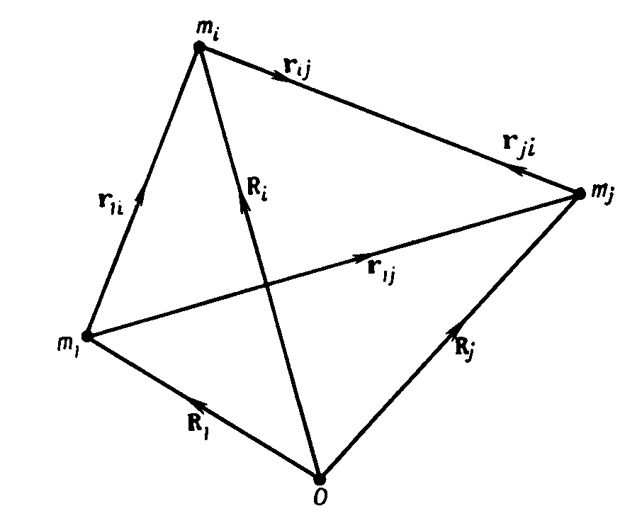

**Глава 6** (стр. 180)

элементы $a_0$, $e_0$, $i_0$, $\Omega_0$, $\omega_0$ и $\tau_0$, то эллипс с такими элементами называется *оскулирующим эллипсом*, а элементы называются *оскулирующими элементами* в момент времени $t_0$. Скорость возмущенного движения планеты на оскулирующем эллипсе в этот момент времени равна скорости на действительной орбите.

Из-за наличия $R$ элементы орбиты в некоторый последующий момент $t_1$ будут равны $a_1$, $e_1$, $i_1$, $\Omega_1$, $\omega_1$ и $\tau_1$. Величины $(a_1 - a_0)$ и т. д. являются *возмущениями элементов* на интервале $(t_1 - t_0)$. Очевидно, этим возмущениям элементов соответствуют возмущения координат и компонент скорости. Если для получения положения $(x, y, z)$ и скорости $(\dot{x}, \dot{y}, \dot{z})$ в момент $t_1$ использовать формулы задачи двух тел (гл. 4), а в качестве элементов взять оскулирующие элементы при $t_0$, то полученные величины будут отличаться от соответствующих величин $(x', y', z')$ и $(\dot{x}', \dot{y}', \dot{z}')$, вычисленных по оскулирующим элементам при $t_1$. Отклонения $(x - x')$ и т. д. являются возмущениями координат и т. д. Использование решения задачи двух тел (конического сечения) в качестве средней орбиты дает хорошее приближение действительной орбиты тела на значительном интервале времени. Делались попытки использовать в качестве средней орбиты более точные приближения действительной орбиты. Примером может служить приближение, использованное Хиллом в построенной им теории движения Луны. В дальнейшем будет показано, что при рассмотрении движения искусственного спутника можно в первом приближении выбрать такую орбиту, которая будет описывать движение значительно точнее, чем простой кеплеровский эллипс.

Общие возмущения полезны не только в задаче прогнозирования будущего положения тела, но также и потому, что позволяют обнаружить источник наблюдаемых возмущений. Это становится возможным благодаря тому, что различные части возмущающей функции входят в аналитические выражения явным образом. Например, грушевидность Земли была обнаружена О'Кифом, Эккелсом и Сквайресом на основании изучения долгопериодических возмущений орбиты спутника Земли 1958 $\beta2$, обусловленных третьей гармоникой гравитационного потенциала Земли.

В последующих разделах будет рассмотрен метод вариации параметров, поскольку в нем нашли отражение основные идеи и результаты общей теории возмущений. Будет также описано несколько полезных способов разложения возмущающей силы.

## 6.2. Уравнения относительного движения

В последующих разделах при обсуждении методов специальных и общих возмущений нам понадобятся дифференциальные уравнения относительного движения $n$ тел ($n > 2$) для случаев, когда начало системы координат совпадает с центром одного из тел.

В разд. 5.2 было получено соотношение

$$
m_i {\mathbf{\ddot{R}}}_i = G \sum_{\substack{j=1 \\ j \neq i}}^n \frac{m_i m_j}{r_{ij}^3} \mathbf{r}_{ij} \quad (j \neq i, \; i = 1, 2, \dots, n),
$$

где

$$
\mathbf{r}_{ij} = \mathbf{R}_j - \mathbf{R}_i = -\mathbf{r}_{ji}.
$$

*(Рис. 6.1. Схема расположения векторов)*

Будем считать основным тело массы $m_1$. Для него уравнение движения имеет вид

$$
\ddot{\mathbf{R}}_1 = G \sum_{j=2}^n \frac{m_j}{r_{ij}^3} \mathbf{r}_{1j}, \tag{6.1}
$$

а уравнения движения других тел (с массами $m_i$) имеют вид

$$
\ddot{\mathbf{R}}_i = G \sum_{\substack{j=1}}^n\frac{m_j}{r_{ij}^3} \mathbf{r}_{ij} \quad (i \neq 1, \; j \neq i). \tag{6.2}
$$

Вычитая (6.1) из (6.2), получаем

$$
\ddot{\mathbf{r}}_{1i} = \ddot{\mathbf{R}}_i - \ddot{\mathbf{R}}_1 = G \left[ -(m_i + m_1) \frac{\mathbf{r}_{1i}}{r_{1i}^3} + \sum_{j=2}^n m_j \frac{\mathbf{r}_{ij}}{r_{ij}^3} - \sum_{j=2}^n m_j \frac{\mathbf{r}_{1j}}{r_{1j}^3} \right],
$$

где снова при суммировании исключается случай $i = j$. Поскольку

$$
\mathbf{r}_{ij} = \mathbf{r}_{1j} - \mathbf{r}_{1i}, 
$$

то

$$
\mathbf{r}_{ij}^3 = [(\mathbf{r}_{1j} - \mathbf{r}_{1i}) \cdot (\mathbf{r}_{1j} - \mathbf{r}_{1i})]^{3/2}, 
$$

Следовательно,

$$
 \ddot{\mathbf{r}}_{\mathbf{1}i} + G(m_1 + m_i) \frac{\mathbf{r}_{1i}}{r_{1i}^3} = G \sum_{j=2}^n m_j \left( \frac{\mathbf{r}_{1j}-\mathbf{r}_{1i}}{r_{ij}^3} - \frac{\mathbf{r}_{1j}}{r_{1j}^3} \right) \quad (j \neq i). 
$$

Опуская индекс 1, получаем уравнение движения тела $m_i$ относительно тела $m$

$$
 \ddot{\mathbf{r}}_i = G(m + m_i) \frac{\mathbf{r}_i}{r_i^3} = G \sum_{j=2}^n m_j \left( \frac{\mathbf{r}_j - \mathbf{r}_i}{r_{ij}^3} - \frac{\mathbf{r}_j}{r_j^3} \right) \quad (j \neq i). \tag{6.3} 
$$

Совокупность таких уравнений при $i = 2, 3, \dots, n$ является искомой системой уравнений относительного движения $n$ тел. Ясно, что 1) если в системе нет других тел $m_j$ ($j \neq i$) или они пренебрежимо малы, то правая часть уравнения становится равной нулю и в результате получается уравнение задачи двух тел (уравнение движения $m_i$ относительно $m$), 2) первый член в скобках в правой части представляет собой ускорение тела $m_i$, вызванное влиянием тела $m_j$ ($j \neq i$), 3) второй член в скобках в правой части равен взятому со знаком минус ускорению тела $m$, обусловленному влиянием тела $m_j$ ($j \neq i$).

Таким образом, правая часть уравнения состоит из возмущений, вносимых телами $m_j$ ($j \neq i$) в орбиту $m_i$ относительно $m$. В планетной системе $m$ — масса Солнца, а отношение $m_j/m$ не превосходит $10^{-3}$ даже для Юпитера. Уже одного этого достаточно, чтобы влияние правых частей было мало.

Рассмотрим систему трех тел (Солнце — Земля — Луна), причем начало отсчета совместим с Землей, массу Луны обозначим $m_i$, а массу Солнца — $m_j$. Тогда

$$
 m_j \approx 330\ 000\ (m + m_i) 
$$

и, как известно, сила, действующая на Луну со стороны Солнца, значительно больше, чем сила со стороны Земли. Тем не менее Луна обращается вокруг Земли. Чтобы объяснить такое, кажущееся на первый взгляд парадоксальным, поведение земного спутника, надо провести более подробное рассмотрение. В правой части уравнения (6.3) стоит разность сил притяжения, действующих со стороны Солнца на Землю и на Луну. Поскольку Луна и Земля находятся от Солнца на почти одинаковых расстояниях, эта разность мала по сравнению с членом, обусловленным притяжением Земли. Поэтому влияние Солнца можно рассматривать как возмущающее воздействие на кеплеровскую орбиту Луны вокруг Земли.

Описанные выше примеры (планеты, движущиеся по гелиоцентрическим орбитам с взаимными возмущениями, и движение Луны по геоцентрической орбите, возмущаемой Солнцем) иллюстрируют два совершенно различных типа задач, решаемых в рамках общей теории возмущений. В первом случае в качестве малого параметра, по которому проводятся разложения в степенные ряды, используется отношение массы возмущающей планеты к массе Солнца. Во втором случае в разложениях используется малая величина, равная отношению расстояния от спутника до планеты к расстоянию от Солнца до планеты. Уже говорилось, что даже в случае, когда возмущающей планетой является Юпитер, $m_j/m \sim 10^{-3}$, тогда как в системе Земля — Луна — Солнце $r_🌙︎/r_\odot \sim \sim{\,}^{1}/_{400}$. Кроме того, применяются разложения по степеням и произведениям эксцентриситетов и наклонений.

В случае движения искусственного спутника Земли основные возмущения обусловлены несферичностью Земли и сопротивлением атмосферы.

## 6.3. Возмущающая функция

Введем скалярную функцию

$$
R_i = G \sum_{j=2}^n m_j \left( \frac{1}{r_{ij}} - \frac{\mathbf{r}_i \cdot \mathbf{r}_j}{r_j^3} \right) \quad (j \neq i), \tag{6.4}
$$

где

$$
r_{ij} = [(\mathbf{r}_j - \mathbf{r}_i) \cdot (\mathbf{r}_j - \mathbf{r}_i)]^{1/2} = [(x_j - x_i)^2 + (y_j - y_i)^2 + (z_j - z_i)^2]^{1/2}
$$

и

$$
r_j = (\mathbf{r}_j \cdot \mathbf{r}_j)^{1/2} = (x_j^2 + y_j^2 + z_j^2)^{1/2}.
$$

Тогда

$$
\nabla_i R_i = \left( \mathbf{i} \frac{\partial}{\partial x_i} + \mathbf{j} \frac{\partial}{\partial y_i} + \mathbf{k} \frac{\partial}{\partial z_i} \right) \left[ G \sum_{j=2}^n m_j \left( \frac{1}{r_{ij}} - \frac{\mathbf{r}_i \cdot \mathbf{r}_j}{r_j^3} \right) \right] =
$$

$$
= G \sum_{j=2}^n m_j \left( \frac{\mathbf{r}_j - \mathbf{r}_i}{r_{ij}^3} - \frac{\mathbf{r}_j}{r_j^3} \right) \quad (j \neq i),
$$

так как $\mathbf{r}_j$ не зависит от $x_i, y_i$ и $z_i$. Кроме того,

$$
\nabla_i \left( \frac{1}{r_i} \right) = -\left( \frac{\mathbf{r}_i}{r_i^3} \right)
$$

----

**Общие возмущения** (стр. 197)

Запишем уже решенные (невозмущенные) уравнения в виде

$$
\frac{\partial^2 r}{\partial t^2} = \nabla U_0, \qquad \frac{\partial^2 r_1}{\partial t^2} = \nabla_1 U_0. \tag{6.25}
$$

Здесь знак частного дифференцирования $\partial^2/\partial t^2$ указывает на то, что при решении этих уравнений элементы считаются постоянными. В результате решения уравнений получаются оскулирующие орбиты двух планет.

В любой момент времени можно считать, что

$$
\frac{dr}{dt} = \frac{\partial r}{\partial t}, \qquad \frac{dr_1}{dt} = \frac{\partial r_1}{\partial t}, \tag{6.26}
$$

т. е. действительные векторы скоростей в момент времени $t$ можно получить дифференцированием эллиптических формул, в которых мгновенные значения элементов полагаются постоянными (на это и указывают знаки частного дифференцирования).

Таким образом, из (6.24) получаем

$$
\sum_{i=1}^6 \frac{\partial x}{\partial \alpha_i} \frac{d\alpha_i}{dt} = 0. \tag{6.27}
$$

Два аналогичных уравнения имеют место для $y$ и $z$. Уравнения вида (6.27) дают нам для каждой планеты по три функциональных соотношения.

Продифференцировав уравнение для иксовой компоненты системы (6.26), получаем

$$
\frac{d^2 x}{dt^2} = \frac{\partial}{\partial t} \left( \frac{dx}{dt} \right) + \sum_{j=1}^6 \frac{\partial}{\partial \alpha_j} \left( \frac{dx}{dt} \right) \frac{d\alpha_j}{dt}.
$$

Но в силу (6.26)

$$
\frac{dx}{dt} = \frac{\partial x}{\partial t}
$$

и, следовательно,

$$
\frac{d^2 x}{dt^2} = \frac{\partial^2 x}{\partial t^2} + \sum_{j=1}^6 \frac{\partial^2 x}{\partial \alpha_j} \frac{d\alpha_j}{dt}.
$$

Из уравнений (6.21) и (6.25) имеем

$$
\frac{d^2 x}{dt^2} = \frac{\partial U_0}{\partial x} + \frac{\partial R}{\partial x}
$$

и

$$
\frac{\partial^2 x}{\partial t^2} = \frac{\partial U_0}{\partial x}.
$$