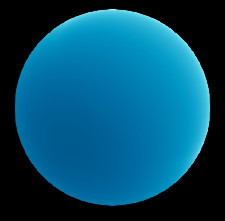
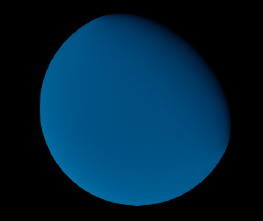
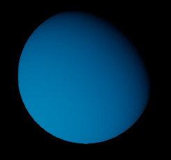
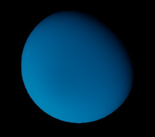
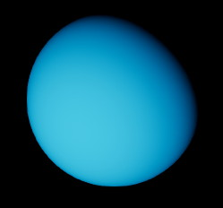
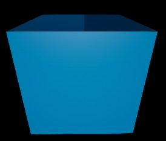
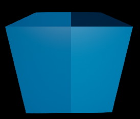
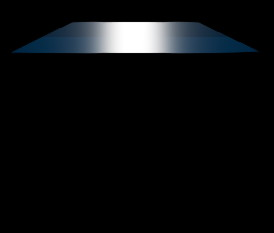
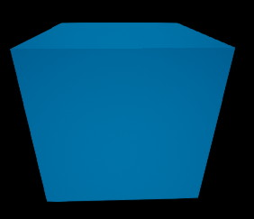

# Освещение и затенение планет. Часть 1

Пришло время шейдинга планет. Тема очень широкая. Много чего читал и понимал. До многого я так и не добрался. Первое с чего начал - изучал различные модели затенения и собрал свой вариант. Вернее скопировал как смог из исходников Unreal Engine. Теперь есть диффузное затенение с так называемыми retroreflective и selfshadowing эффектами. Ну, по крайней мере, я так думаю. Реализовал в прототипе скопированный код моделей Burley, Oren-Nayar, Gotanda. Все они, кстати, в Unreal Engine не используются, но в исходниках есть. 

В современной модели освещения Unreal Engine компоненты Diffuse и Specular выглядят так:

- $F_d=$ Lambertian diffuse $=1/\pi$
- $F_s=$ Microfacet specular BRDF $={DGF}/{(4\cos\theta_l\cos\theta_v)}=D\times{Vis}\times{F}$
    - $D=$ Microfacet NDF
    - $G=$ Shadowing and masking
    - $F=$ Fresnel
    - $Vis=G/{(4\cos\theta_l \cos\theta_v)}$

И коментарий в файле исходного кода BRDF.ush:

    // [ Karis 2013, "Real Shading in Unreal Engine 4" slide 11 ]

Самая простая диффузная модель Lambert меня не устраивает. И самая важная часть которую я хотел получить для Diffuse аналогична компоненте $G$ - Shadowing and masking для Specular. Это ретрорефлекторные и затеняющие способности. 

Приложу сразу кусочки кода для всех трех типов diffuse, что я использовал у себя.
([Diffuse_Burley](shading1/Diffuse_Burley.hlsl), [Diffuse_OrenNayar](shading1/Diffuse_OrenNayar.hlsl), [Diffuse_Gotanda](shading1/Diffuse_Gotanda.hlsl))

Так же добавлю код компоненты [SpecularGGX](shading1/SpecularGGX_CustomNode.hlsl). Она меня совершенно устраивает и я оставляю ее. Рассматривал еще модель [SimpleSpecular](shading1/SpecularSimple.hlsl). Она проще и быстрее.

## Прямое освещение

Для начала все это нужно Осветить. На это я взял две функции. Зачем не знаю, похоже они вышли одинаковыми. Ха-ха. Вот поглядите:

```hlsl
// Simple dynamic lighting
float Attenuation = DistanceAttenuation * AmbientOcclusion;
return (max(NoL, 0.0) * Attenuation) * (LightColor * SimpleShading);

// Dynamic lighting
float Attenuation = DistanceAttenuation * AmbientOcclusion;
return (max(NoL, 0.0) * Attenuation) * ((DiffuseShading + SpecularShading) * LightColor);    
```

Ну вот. Когда копируешь модели не видишь всего сразу. Тут и там последний шаг для всех сложных расчетов делается совершенно одинаково. У простого сразу подается и diffuse и specular сложенными вместе вот и вся разница. 

## Дифузные модели

<table> <tbody>
  <tr>
    <td><p>Картинка 1. OrenNayar</p></td>
    <td><p>Картинка 2. OrenNayar</p></td>
    <td><p>Картинка 3. Lambert</p></td>
  </tr>
  <tr>
    <td><p>Картинка 4. Gotanda</p></td>
    <td><p>Картинка 5. Burley</p></td>
    <td><p>Картинка 6. Minaert</p></td>
  </tr>
</tbody> </table>

Картинка 1. Сначала я увидел diffuse **OrenNayar**. Тогда вообще ничего не понял. Потом сообразил, что это только правило диффузного распределения модели. Здесь нет проекции направления света на нормаль. `dot(N,L)` . Хорошо, добавил, направление света появилось. Картинка 2. И вроде ничего особенного, но за счет параметра diffuse_roughness (=0.6) появилась подсветка с краев. Комментарий в коде был следующий: 

    // [Gotanda 2012, "Beyond a Simple Physically Based Blinn-Phong Model in Real-Time"]

В сравнении с **Lambert**. Он «лепит светом тупо в лоб». Картинка 3. И его формула: $DiffuseColor\times(1/\pi)$. У OrenNayar свет «растворяется в поверхности», подсвечивая шероховатость. 

**Gotanda** - Картинка 4. Она похожа на OrenNayar, но все же она более подчиняется форме поверхности. Комментарий в коде был следующий:  

    // [Gotanda 2014, "Designing Reflectance Models for New Consoles"]

**Burley** - Картинка 5. Эту модель сделали в Disney. Привлекает внимание. Они продумали ее и применяют. Есть статья «SIGGRAPH 2012. Brent Burley. Physically-Based Shading at Disney». Мне понравилось то, что они внимательно относятся к практике применения. Неплохая база анализа из 100 сканов материалов от Mitsubishi Electric Lab. В статье интересные подробности. Но мне показалось там не достаточно инфы, чтобы восстановить их модель в коде. Хорошо, что она есть у Эпиков. И ссылаются в комментарии они на ту же статью:

    // [Burley 2012, "Physically-Based Shading at Disney"]

Еще есть модель **Minaert**. Она древняя. Картинка 6. Интересна тем, что была разработана для рендеринга планет. У нее характерное шарообразно подсвеченное альбедо. Забавно. Но это нам не надо.

Итак. Выбираю себе модель Burley, так как ее разработали Disney, перебрав в свою очередь все что можно. Двигаюсь дальше. 

## Шейдинг должен быть полноценным. Спекуляр.

Нужен блик. Вот две модели: Specular Simple и Specular GGX. Я поменял угол камеры, чтобы были заметны различия. Ненадолго надо остановиться

<table> <tbody>
  <tr>
    <td><p>Картинка 7</p></td>
    <td><p>Картинка 8</p></td>
  </tr>
</tbody> </table>

Specular Simple - Картинка 7. И полноценный GGX - Картинка 8. Различия блика хорошо заметны на скользящих углах. Но это стандартно. Все очень хорошо. Блик меня устраивает. 

Напомню из чего состоит Specular: 

    Microfacet specular BRDF = D*G*F / (4*NoL*NoV) = D*Vis*F
    Vis = G / (4*NoL*NoV)

Модель Specular Simple имела такой комментарий в коде:

```c
// GGX / Trowbridge-Reitz
// [Walter et al. 2007, "Microfacet models for refraction through rough surfaces"]
```
Далее идет расчет компоненты $D$ согласно статье. А вот $Vis$ и $F$ упрощены сильно в угоду производительности.

В коде SpecularGGX были следующие комментарии:

```c
// GGX / Trowbridge-Reitz
// [Walter et al. 2007, "Microfacet models for refraction through rough surfaces"]
```
Для компоненты $D$.

```c
// Appoximation of joint Smith term for GGX
// [Heitz 2014, "Understanding the Masking-Shadowing Function in Microfacet-Based BRDFs"]
```

Для компоненты $Vis$

```c
// [Schlick 1994, "An Inexpensive BRDF Model for Physically-Based Rendering"]
```

Для компоненты $F$ 

Все компоненты этой модели реализованы, согласно статьям. Спекуляры сложные, интересные, я достаточно их изучил. Но поглядим на дифузную составляющую повнимательнее в общем виде материала. Больше всего нас интересует дифузная составляющая. 

## Рассмотрим diffuse

Хочу посмотреть на кубик. Мне нужно, чтобы я увидел скользящие направления взгляда к поверхности. Два случая. По направлению к свету и против. 

<table><tbody>
  <tr>
    <td><p>Картинка 9. Burley/Lambert</p></td>
    <td><p>Картинка 10. OrenNayar/Lambert</p></td>
  </tr>
</tbody></table>

Картинка 9. Левая часть Burley, правая Lambert. Картинка 10. Левая часть OrenNayar, правая Lambert. Это направление со светом из-за спины.

<table><tbody>
  <tr>
    <td><p>Картинка 11. Burley/Lambert</p></td>
    <td><p>Картинка 12. OrenNayar/Lambert</p></td>
  </tr>
</tbody></table>

Картинка 11. Верхняя часть Burley, нижняя Lambert. Картинка 12. Верхняя часть OrenNayar, нижняя Lambert. Теперь направление взгляда на свет.

Все эти различия зависят от diffuse roughness. Он сейчас установлен =0.6, значит при больших параметрах он будет проявляться сильнее. Например, при значении 1.0 освещенность пологой к свету поверхности сильнее, чем более перпендикулярной. Опять же, если свет светит из-за спины наблюдателя. Рисунок 13.
<table> <tbody> 
  <tr>
	<td><p>Картинка 13</p></td>
  </tr>
</tbody> </table>

Причем если diffuse roughness убрать в 0, то эффекты затенения и ретрорефлексии исчезнут. Эффект обратной рефлексии (ретрорефлексии) связан с тем, что перпендикулярно освещенных поверхностей больше с ракурса Картинок 9/10, но меньше с ракурсов картинок 11/12, потому как там больше теней от шероховатой поверхности. Эффект затенения. На перпендикулярно направленной к свету шероховатой поверхности больше мало освещенных поверхностей. Они расположены к свету под углом. Гладкий диффуз выглядит светлее, потому как его поверхности развернуты к свету больше.

Эффект ретрорефлексии и затенения считаю очень важным, потому как наблюдал его в жизни. И в своей работе в Unreal Engine мне часто его не доставало. Странность всего этого в том, что, хотев, получить эффект ретрорефлексии себе в шейдер, мало его изучил. Вышло так, что о его реализации знаю меньше, чем о реализации спекулярной составляющей. Потому как диффуз легко было найти и скопировать в отличие от более запутанного спекуляра. Новый диффуз будет полезен моим планетам. Предстоит еще разобраться поподробнее в нем. 

