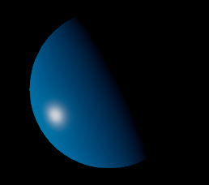

# Освещение и затенение планет. Часть 1

Пришло время шейдинга планет. Тема очень широкая. Много чего читал и понимал. До многого я так и не добрался. Первое с чего начал - изучал различные модели затенения и собрал свой вариант. Вернее скопировал как смог из исходников Unreal Engine. Теперь есть диффузное затенение с так называемыми retroreflective и selfshadowing эффектами. Ну, по крайней мере, я так думаю. Реализовал в прототипе скопированный код моделей Burley, Oren-Nayar, Gotanda. Все они, кстати, в Unreal Engine не используются, но в исходниках есть. 
Современная модель освещения состоит из двух компонентов Diffuse, Specular выглядит так:

- $F_d =$ Lambertian diffuse $= 1 / \pi$
- $F_s =$ Microfacet specular BRDF $= {DGF} / {(4cos\theta_L cos\theta_V)} = D \times {Vis} \times F$
- $D =$ Microfacet NDF
- $G =$ Shadowing and masking
- $F =$ Fresnel
- $Vis = G / {(4cos\theta_L cos\theta_V)}$

Cамая простая диффузная модель Lambert меня не устраивает. И самая важная часть которую я хотел получить для diffuse аналогична компоненте $G$ - Shadowing and masking для specular. Это те самые ретрорефлекторные способности и затеняющие. 

Приложу сразу кусочки кода для всех трех типов diffuse, что я использовал у себя. 

<!-- ### Burley

*// [Burley 2012, "Physically-Based Shading at Disney"]*

```hlsl
float3 main(float3 DiffuseColor,float Roughness,float3 N,float3 V,float3 L)
{
    float NoL = dot(N, L);
    float NoV = dot(N,V);
    float VoL = dot(V, L);
    float InvLenH = rsqrt( 2 + 2 *  VoL );
    float NoH = saturate( (  NoL +  NoV ) * InvLenH );
    float VoH = saturate( InvLenH + InvLenH *  VoL );
    NoL = saturate( NoL );
    NoV = saturate( abs( NoV ) + 1e-5 );
    float FD90 = 0.5 + 2 * VoH * VoH * Roughness;
    float FdV = 1 + (FD90 - 1) * Pow5( 1 - NoV );
    float FdL = 1 + (FD90 - 1) * Pow5( 1 - NoL );
    return DiffuseColor * ( (1 / PI) * FdV * FdL );
}
```

### Oren-Nayar

*// [Gotanda 2012, "Beyond a Simple Physically Based Blinn-Phong Model in Real-Time"]*

```hlsl
float3 main(float3 N, float3 L, float3 V, float3 DiffuseColor, float Roughness,)
{
	float NoL = dot(N, L);
	float NoV = dot(N,V);
	float VoL = dot(V, L);
	float InvLenH = rsqrt( 2 + 2 *  VoL );
	float NoH = saturate( (  NoL +  NoV ) * InvLenH );
	float VoH = saturate( InvLenH + InvLenH *  VoL );
    NoL = saturate( NoL );
    NoV = saturate( abs( NoV ) + 1e-5 );
    float a = Roughness * Roughness;
	float s = ( 1.29 + 0.5 * a );
	float s2 = s * s;
	VoL = 2.0 * VoH * VoH - 1.0;		// double angle identity
	float Cosri = VoL - NoV * NoL;
	float C1 = 1.0 - 0.5 * s2 / (s2 + 0.33);
	float C2 = 0.45 * s2 / (s2 + 0.09) * Cosri * ( Cosri >= 0.0 ? rcp( max( NoL, NoV ) ) : 1.0 );
	return DiffuseColor / PI * ( C1 + C2 ) * ( 1.0 + Roughness * 0.5 );
}
```

### Gotanda

*// [Gotanda 2014, "Designing Reflectance Models for New Consoles"]*

```hlsl
float3 main(float3 N, float3 L, float3 V, float3 DiffuseColor, float Roughness,)
{
	float NoL = dot(N, L);
	float NoV = dot(N,V);
	float VoL = dot(V, L);
	float InvLenH = rsqrt( 2 + 2 *  VoL );
	float NoH = saturate( (  NoL +  NoV ) * InvLenH );
	float VoH = saturate( InvLenH + InvLenH *  VoL );
    NoL = saturate( NoL );
    NoV = saturate( abs( NoV ) + 1e-5 );
	float a = Roughness * Roughness;
	float a2 = a * a;
	float F0 = 0.04;
	 VoL = 2 * VoH * VoH - 1;		// double angle identity
	float Cosri = VoL - NoV * NoL;
	float a2_13 = a2 + 1.36053;
	float Fr = ( 1 - ( 0.542026*a2 + 0.303573*a ) / a2_13 ) * ( 1 - pow( 1 - NoV, 5 - 4*a2 ) / a2_13 ) * ( ( -0.733996*a2*a + 1.50912*a2 - 1.16402*a ) * pow( 1 - NoV, 1 + rcp(39*a2*a2+1) ) + 1 );
	//float Fr = ( 1 - 0.36 * a ) * ( 1 - pow( 1 - NoV, 5 - 4*a2 ) / a2_13 ) * ( -2.5 * Roughness * ( 1 - NoV ) + 1 );
	float Lm = ( max( 1 - 2*a, 0 ) * ( 1 - Pow5( 1 - NoL ) ) + min( 2*a, 1 ) ) * ( 1 - 0.5*a * (NoL - 1) ) * NoL;
	float Vd = ( a2 / ( (a2 + 0.09) * (1.31072 + 0.995584 * NoV) ) ) * ( 1 - pow( 1 - NoL, ( 1 - 0.3726732 * NoV * NoV ) / ( 0.188566 + 0.38841 * NoV ) ) );
	float Bp = Cosri < 0 ? 1.4 * NoV * NoL * Cosri : Cosri;
	float Lr = (21.0 / 20.0) * (1 - F0) * ( Fr * Lm + Vd + Bp );
	return DiffuseColor / PI * Lr;
}
``` -->

Так же добавлю код компонент Specular. Она меня совершенно устраивает пока и я оставляю ту, что используется в Unreal. Использовал еще одну Simple shading. Она проще, быстрее.

<!-- ### Specular GGX

```hlsl
float3 main(float NoL, float NoV, float VoL, float Roughness, float3 SpecularColor)
{
	//Init
		float InvLenH = rsqrt( 2 + 2 * VoL );
		float NoH = saturate( ( NoL + NoV ) * InvLenH );
		float VoH = saturate( InvLenH + InvLenH * VoL );
		
		NoL = saturate( NoL );
		NoV = saturate( abs( NoV ) + 1e-5 );

	float a2 = Pow4( Roughness );

	float Energy = 1; // = EnergyNormalization( a2, Context.VoH);

	// =========================================
	// Generalized microfacet specular

	// GGX / Trowbridge-Reitz
	// [Walter et al. 2007, "Microfacet models for refraction through rough surfaces"]
		float d = ( NoH * a2 - NoH ) * NoH + 1;	// 2 mad
	float D_GGX = a2 / ( PI*d*d );					// 4 mul, 1 rcp
	float D = D_GGX * Energy;	// float D = D_GGX( a2, Context.NoH ) * Energy;

	// Appoximation of joint Smith term for GGX
	// [Heitz 2014, "Understanding the Masking-Shadowing Function in Microfacet-Based BRDFs"]
		float a = sqrt(a2);
		float Vis_SmithV = NoL * ( NoV * ( 1 - a ) + a );
		float Vis_SmithL = NoV * ( NoL * ( 1 - a ) + a );
	float Vis_SmithJointApprox = 0.5 * rcp( Vis_SmithV + Vis_SmithL );
	float Vis = Vis_SmithJointApprox;

	// [Schlick 1994, "An Inexpensive BRDF Model for Physically-Based Rendering"]
		float Fc = Pow5( 1 - VoH );					// 1 sub, 3 mul
		//return Fc + (1 - Fc) * SpecularColor;		// 1 add, 3 mad
		// Anything less than 2% is physically impossible and is instead considered to be shadowing
	float3 F_Schlick = saturate( 50.0 * SpecularColor.g ) * Fc + (1 - Fc) * SpecularColor;
	float3 F = F_Schlick;

	float3 SpecularGGX = (D * Vis) * F;

	return SpecularGGX;
}
```

### Specular Simple

```hlsl
float3 main(float N, float V, float L, float Roughness, float3 Diffuse_Lambert, float3 SpecularColor)
{
	float3 H = normalize(V + L);
	float NoH = saturate( dot(N, H) );
	float RR = Roughness*Roughness;
	float a2 = RR*RR;
	
	// GGX / Trowbridge-Reitz
	// [Walter et al. 2007, "Microfacet models for refraction through rough surfaces"]
	// Generalized microfacet specular
	float d = ( NoH * a2 - NoH ) * NoH + 1;	// 2 mad
	float D = a2 / ( PI*d*d ); // 4 mul, 1 rcp

	float Vis = 0.25;
	float3 F = SpecularColor;

	return Diffuse_Lambert + (D * Vis) * F;
}
``` -->

Теперь все это нужно Осветить. На это я взял две функции. Зачем не знаю, похоже они вышли одинаковыми. Ха-ха. Вот поглядите:

    float Attenuation = DistanceAttenuation * AmbientOcclusion;
    return (max(NoL, 0.0) * Attenuation) * (LightColor * SimpleShading);

    float Attenuation = DistanceAttenuation * AmbientOcclusion;
    return (max(NoL, 0.0) * Attenuation) * ((DiffuseShading + SpecularShading) * LightColor);    

Ну вот. Когда копируешь модели не видишь всего сразу. Тут и там последний шаг для всех сложных расчетов делается совершенно одинаково. 
У простого сразу подается и diffuse и specular сложенными вместе вот и вся разница. 

И картиночки:
<table> <tbody>
  <tr>
    <td><p>Картинка 1</p></td>
    <td><p>Картинка 2</p></td>
    <td><p>Картинка 3</p></td>
  </tr>
  <tr>
    <td><p>Картинка 4</p></td>
    <td><p>Картинка 5</p></td>
    <td><p>Картинка 6</p></td>
  </tr>
</tbody> </table>

Картинка 1. Сначала я увидел diffuse OrenNayar. Тогда вообще ничего не понял. Потом сообразил, что это только првило дифузного распределения модели. Здесь нет проекции направления света на нормаль. `dot(N,L)` . 
Картинка 2. Хорошо, добавил, направление света появилось. И вроде ничего особенного, но за счет параметра diffuse_roughness (=0.6) появилась подсветка с краев. Сравните с diffuse_Lambert. Картинка 3. Он лепит светом тупо в лоб. У OrenNayar свет растворяется в поверхности, подсвечивая шероховатость. 
А что там другие diffuse модели? Gotanda - Картинка 4. Burley - Картинка 5. 
Еще есть модель Minaert. Она древняя. Картинка 6. Интересна тем, что была разработана для рендеринга планет. У нее характерное шарообразно подсвеченное альбедо. Забавно. Но это нам не надо.
Итак. Выбрав себе модель Burley, так как ее разработали Disney, перебрав в свою очередь все что можно, я двинулся дальше. 

Нужен блик. Вот две модели: Specular Simple и Specular GGX. Я поменял угол камеры, чтобы были заметны различия. Первая имела такой комментарий в коде:

```c
// GGX / Trowbridge-Reitz
// [Walter et al. 2007, "Microfacet models for refraction through rough surfaces"]
// Generalized microfacet specular 
```

Далее идет расчет компоненты $D$. Напомню: 

    Microfacet specular BRDF = D*G*F / (4*NoL*NoV) = D*Vis*F
    Vis = G / (4*NoL*NoV)
    А вот G и F упрощены: Vis = 0.25; F = SpecularColor

<table> <tbody>
  <tr>
    <td><p>Картинка 7</p></td>
    <td><p>Картинка 8</p></td>
  </tr>
</tbody> </table>

Вот Картинка 7. И полноценный GGX - Картинка 8. Различия блика хорошо заметны на скользящих углах. Но это стандартно. Все очень хорошо. Блик меня устраивает. В коде SpecularGGX был такой коммент:

```c
// GGX / Trowbridge-Reitz
// [Walter et al. 2007, "Microfacet models for refraction through rough surfaces"]
```
Для компоненты $D$.

```c
// Appoximation of joint Smith term for GGX
// [Heitz 2014, "Understanding the Masking-Shadowing Function in Microfacet-Based BRDFs"]
```

Для компоненты $Vis$

```c
// [Schlick 1994, "An Inexpensive BRDF Model for Physically-Based Rendering"]
```

Для компоненты $F$ 

Спекуляры сложные, интересные, я достаточно их изучил. Но поглядим на дифузную составляющую повнимательнее в общем виде материала. 

Хочу посмотреть на кубик. Мне нужно, чтобы я увидел скользящие направления взгляда к поверхности. Два случая. По направлению к свету и против. 

<table><tbody>
  <tr>
    <td><p>Картинка 9</p></td>
    <td><p>Картинка 10</p></td>
  </tr>
</tbody></table>

Картинка 9. Левая часть Burley, правая Lambert. Картинка 10. Левая часть OrenNayar, правая Lambert. Это направление со светом из-за спины.

<table><tbody>
  <tr>
    <td><p>Картинка 11</p></td>
    <td><p>Картинка 12</p></td>
  </tr>
</tbody></table>

Картинка 11. Верхняя часть Burley, нижняя Lambert. Картинка 12. Верхняя часть OrenNayar, нижняя Lambert. Теперь направление взгляда на свет.

Все эти различия зависят от diffuse roughness. Напомню, что он равен 0.6, значит при больших параметрах он будет проявляться сильнее. Например, при значении 1.0 освещенность пологой к свету поверхности освещается сильнее ,чем более перпендикулярная. Опять же, если свет светит из-за спины наблюдателя. Рисунок 13.
<table> <tbody> 
  <tr>
	<td><p>Картинка 13</p></td>
  </tr>
</tbody> </table>
